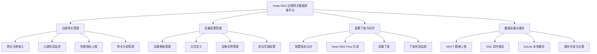
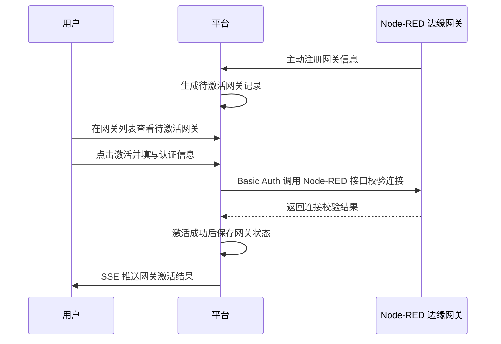
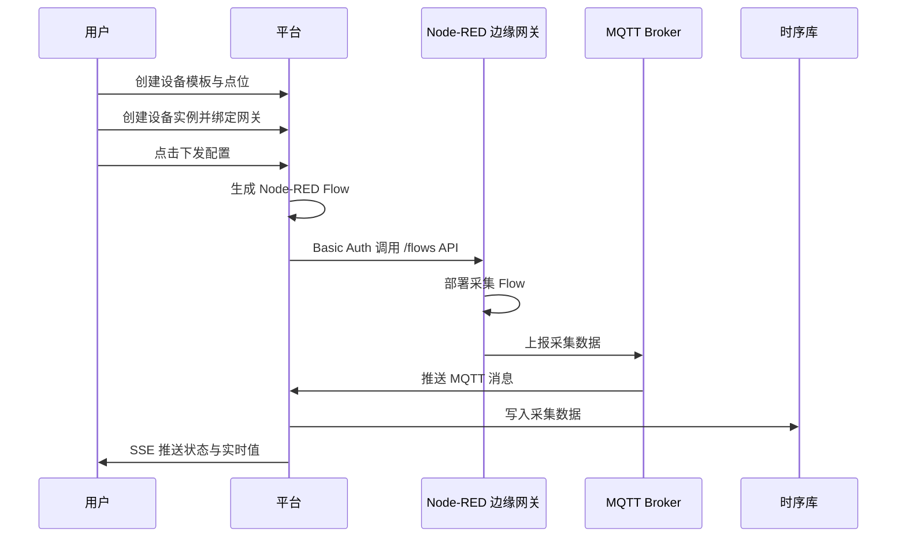
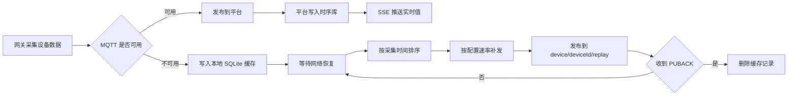

# Node-RED 边缘网关数据采集平台产品说明书

## 1. 产品介绍

Node-RED 边缘网关数据采集平台是一套面向工业自动化工程师、IoT 运维人员和数据采集系统管理员的分布式边缘网关管理与数据采集系统。产品通过平台侧集中管控与网关侧分布式执行的架构，统一管理多台 Node-RED 边缘网关、设备采集模板、设备实例配置、配置下发、实时状态推送和断网数据缓存，帮助用户在工业现场快速完成设备接入、采集配置部署、运行状态监控和数据连续性保障。

平台的核心价值在于降低多网关、多设备、多协议环境下的管理复杂度：用户无需逐台登录网关即可完成批量激活、模板化配置、一键下发和实时监控；在网络异常场景下，网关可将采集数据写入本地 SQLite 缓存，并在网络恢复后按配置速率自动补发，确保工业数据采集链路稳定可靠。

## 2. 用户画像

### 2.1 工业自动化工程师

工业自动化工程师熟悉 Modbus、S7、OPC UA、MQTT、TCP 等工业协议，负责设备采集方案设计、点位定义和采集参数配置。他们关注模板化复用、协议字段完整性、点位配置效率和设备实例批量创建能力，希望通过统一平台快速完成同类设备的标准化配置。

### 2.2 IoT 系统运维人员

IoT 系统运维人员负责网关部署、注册接入、状态巡检、配置下发和故障排查。他们关注网关在线状态、CPU / 内存 / 磁盘指标、配置下发结果和失败原因，希望在一个界面中完成批量管理、实时监控和异常定位。

### 2.3 数据采集系统管理员

数据采集系统管理员关注采集数据的完整性、连续性和可追溯性。他们重点关心断网缓存是否启用、缓存数据是否成功补发、补发速率是否可控、重复数据是否可避免，以及实时值和历史趋势是否可查询。

## 3. 场景故事

### 3.1 新工厂批量部署采集配置

工业自动化工程师在新工厂上线阶段，需要为多类工业设备配置采集点位并部署到数十台边缘网关。他先在平台中创建设备模板，按协议定义点位字段，再基于模板批量创建设备实例并分配到对应网关。配置完成后，他点击下发，平台将设备实例配置转换为 Node-RED Flow，并通过网关的 `/flows` API 部署到 Node-RED 环境，使多台网关在数分钟内完成采集配置。

### 3.2 日常巡检与故障排查

IoT 系统运维人员在日常巡检时打开网关列表，查看所有网关的在线状态、分组、CPU、内存和磁盘指标。当发现某台网关离线时，他进入相关设备实例或下发记录页面，查看最近一次配置下发状态和失败原因，并在问题修复后重新触发下发，快速恢复采集任务。

### 3.3 网络异常下的数据连续性保障

数据采集系统管理员在网络不稳定的工业现场开启断网缓存能力，并配置缓存补发速率。网络正常时，网关采集数据通过 MQTT 上报平台；网络断开时，MQTT publish 失败的数据写入网关本地 SQLite；网络恢复后，网关按采集时间排序，通过独立 Topic 补发缓存数据，并在收到确认后删除缓存记录，避免数据丢失和重复写入。

## 4. 整体结构和业务流程

### 4.1 功能结构图

### 4.2 网关激活流程

### 4.3 网关接入与配置下发流程

### 4.4 断网缓存与恢复流程

## 5. 功能描述和交互

### 5.1 边缘网关管理

页面类型：后台管理类（Admin / Table-First）。

- 页面综述：用于管理 Node-RED 边缘网关的注册、激活、在线状态、性能指标和操作入口。
- 筛选/搜索区：支持按网关名称、网关编码、在线状态、最近心跳时间筛选。
- 列表展示区：展示 `网关名称`、`网关编码`、`注册状态`、`在线状态`、`CPU`、`内存`、`磁盘`、`最近心跳时间`。
- 操作列：提供 `查看详情`、`下发配置`、`重新激活` 等操作。
- 状态反馈：心跳每 30 秒上报一次；超过 3 分钟未收到心跳判定离线，并通过 SSE 在 1 秒内推送前端。

### 5.2 设备模型管理

页面类型：后台管理类（Admin / Table-First）。

- 页面综述：用于维护设备采集模板，支持同类设备配置复用。
- 筛选/搜索区：支持按模板名称、协议类型、版本号、创建时间筛选。
- 列表展示区：展示 `模板名称`、`协议类型`、`点位数量`、`版本号`、`更新时间`。
- 操作列：提供 `新建模板`、`编辑模板`、`复制模板`、`导入`、`导出`、`查看点位`。
- 点位配置：每个点位包含公共字段和协议特殊字段；公共字段包括 `点位名称`、`点位ID`、`数据类型`、`采集周期`、`单位`；协议特殊字段根据 Modbus / S7 / OPC UA / MQTT / TCP 动态展示。

### 5.3 设备实例管理

页面类型：后台管理类（Admin / Table-First）。

- 页面综述：用于从设备模板创建设备实例，并将实例分配到具体网关执行采集。
- 筛选/搜索区：支持按实例名称、模板、协议、绑定网关、下发状态、在线状态筛选。
- 列表展示区：展示 `实例名称`、`所属模板`、`协议类型`、`绑定网关`、`配置版本`、`下发状态`、`最近采集时间`。
- 操作列：提供 `新建实例`、`编辑配置`、`分配网关`、`查看点位`、`下发配置`、`查看实时值`。
- 配置继承：实例默认继承模板点位配置，允许对实例级字段进行覆盖；模板版本更新后，实例可按业务需要重新同步。

### 5.4 配置下发与同步

页面类型：后台管理类（Admin / Table-First）+ 分步流程/向导类（Step Wizard）。

- 页面综述：用于将设备实例配置转换为 Node-RED Flow，并部署到绑定网关。
- 下发入口：用户可在设备实例列表、网关详情或下发管理页触发 `下发配置`。
- 下发流程：选择设备实例 → 按网关分组 → 校验配置版本 → 生成 Flow → 调用 `/flows` API → 记录下发结果。
- 批量策略：按网关分组并行执行，同一网关内串行下发，避免 Node-RED Flow 被并发覆盖。
- 状态追踪：展示 `待下发`、`下发中`、`成功`、`失败`、`跳过` 状态，并记录失败原因。
- 版本比对：当平台配置版本与网关已部署版本一致时跳过下发，减少无效部署。

### 5.5 实时状态推送

页面类型：复杂 Web / 工作台类（Dashboard / Workbench）。

- 页面综述：用于实时展示网关状态、性能指标、设备采集值、下发状态和缓存状态。
- 推送通道：前端通过 SSE 订阅平台推送事件，不需要轮询刷新。
- 事件类型：包含 `网关状态`、`性能指标`、`采集值`、`下发状态`、`缓存状态`。
- 展示方式：列表状态实时刷新；指标趋势按时间序列展示；采集值以最新值、更新时间和质量状态呈现。
- 异常反馈：网关离线、下发失败、缓存堆积等状态需要在列表、详情页和状态标签中明显提示。

### 5.6 断网数据缓存

页面类型：后台管理类（Admin / Table-First）+ 复杂 Web / 工作台类（Dashboard / Workbench）。

- 页面综述：用于配置断网缓存开关、补发速率，并查看缓存状态和补发进度。
- 配置层级：支持系统级、网关级两级开关，优先级为网关级 > 系统级，默认关闭。
- 缓存策略：MQTT publish 失败时，网关将 `数据ID`、`实例ID`、`点位ID`、`值`、`时间戳` 写入本地 SQLite。
- 补发策略：网络恢复后按采集时间先后补发，补发速率支持 1-500 条/秒，默认 100 条/秒。
- 去重策略：平台侧按 `点位ID + 时间戳` 去重，避免缓存补发造成重复写入。
- 状态展示：展示 `缓存条数`、`最早缓存时间`、`补发速率`、`补发进度`、`最近补发结果`。

## 6. 功能优先级

### 6.1 P0 必须完成

- 边缘网关注册、激活、心跳状态监控和分组管理。
- 设备模板创建、点位定义、模板复制、导入导出。
- 设备实例创建、模板继承、点位覆盖和网关分配。
- 配置版本比对、Node-RED Flow 生成、配置下发和下发状态记录。
- MQTT 采集数据上报、平台侧入库、SSE 实时推送。
- 断网缓存开关、SQLite 本地缓存、恢复后补发和平台侧去重。

### 6.2 P1 期望完成

- 网关 CPU / 内存 / 磁盘 7 天历史趋势。
- 设备采集值历史趋势查询。
- 下发失败原因结构化展示。
- 缓存状态监控与补发进度可视化。

### 6.3 P2 暂不纳入第一阶段

- 多租户、用户权限与角色管理。
- 告警规则配置与通知。
- 移动端 App。
- 多语言国际化。
- 网关侧采集插件动态热更新。
- 缓存数据异地备份与恢复。
- 设备模型点位历史变更审计与版本回滚。
- 历史数据自定义报表与导出。

## 7. 验收标准

- 用户可完成网关注册、模板创建、实例配置、网关绑定、配置下发、采集上报、实时查看和历史趋势查看的完整闭环。
- 网关心跳每 30 秒上报一次，超过 3 分钟未上报时判定离线。
- 网关状态变化通过 SSE 在 1 秒内推送到前端。
- 设备实例列表和网关列表页面加载时间小于 1 秒。
- 平台支持同时管理 50+ 网关和 500+ 设备实例。
- 断网缓存数据在网络恢复后按配置速率补发，默认速率为 100 条/秒。
- 系统不存在无法下发配置、采集数据丢失、SSE 无法推送等严重问题。

## 8. 技术与平台约束

- 网关侧必须运行 Node-RED，插件方案需兼容 Node-RED v3.x 及以上版本。
- 平台后端使用 Node.js + Express。
- 数据库使用 MySQL、Prisma ORM 和 Redis。
- MQTT Broker 使用 EMQX，支持 MQTT 3.1.1 / 5.0。
- 网关侧断网缓存使用 SQLite，平台不直接访问缓存数据库。
- 前端使用 React、Zustand 和 SSE 订阅机制。
- 前端运行环境为 Chrome、Edge、Firefox 最新两个版本。
- 所有平台与网关 / Node-RED 的交互使用 HTTP + Basic Auth 认证。

## 9. 产品设计风格

### 9.1 设计定位

产品应采用专业、稳定、信息密度适中的工业物联网后台风格，优先保证状态可读性、异常可发现性和批量操作效率。界面不追求强视觉装饰，应突出实时状态、配置关系、下发结果和数据趋势。

### 9.2 布局原则

- 列表页采用表格优先布局，筛选区置顶，批量操作靠近列表工具栏。
- 详情页采用概览卡片 + 分区信息布局，优先展示在线状态、最近心跳、绑定实例、下发状态和关键指标。
- 工作台和监控视图采用卡片化布局，分别承载网关状态、性能趋势、实时采集值和缓存状态。
- 高风险操作如重新下发、重新激活、覆盖配置需要明确二次确认和结果反馈。

### 9.3 视觉建议

- 主色建议使用工业科技感较强的蓝色系，用于主按钮、链接、选中状态和关键指标强调。
- 成功状态使用绿色，表示在线、下发成功、补发完成。
- 警告状态使用橙色，表示缓存堆积、性能偏高、配置待下发。
- 错误状态使用红色，表示网关离线、下发失败、数据上报异常。
- 背景采用浅灰或白色，表格与卡片保持清晰边界，避免暗色大屏风格影响后台操作效率。