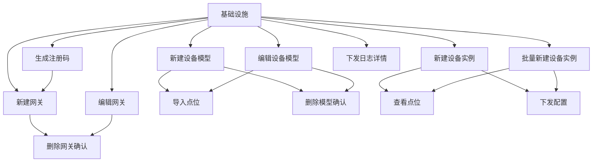
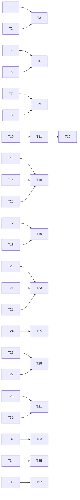

# 功能任务规划：前端弹窗组件开发

> 基于《边缘网关管理-FRD》、《设备模型管理-FRD》、《设备实例管理-FRD》、《配置下发与同步-FRD》，将剩余的前端弹窗组件开发任务拆解为可执行的任务清单。

---

## 1. 前置条件检查

| 检查项 | 状态 | 说明 |
|--------|------|------|
| 需求文档 | ✅ 就绪 | `docs/frd/` 下四个 FRD 文档完整 |
| 技术方案 | ✅ 就绪 | `specs/技术栈.md`、`specs/项目结构.md` |
| 后端 API | ✅ 就绪 | 所有模块 CRUD API 已实现 |
| 前端基础 | ✅ 就绪 | Axios、Zustand、Tailwind 已配置 |
| 项目认知 | ✅ 已建立 | 已阅读项目上下文协议 |

---

## 2. 切片划分

### 2.1 切片依赖关系图

### 2.2 切片定义

| 切片 | 用户行为 | 包含任务 | 依赖 |
|------|----------|----------|------|
| **切片 1**: 新建网关 | 用户点击"新建网关"按钮，填写表单，测试连接，保存网关 | T1-T3 | 无 |
| **切片 2**: 编辑网关 | 用户点击"编辑"按钮，修改网关信息，测试连接，保存修改 | T4-T6 | 切片 1 |
| **切片 3**: 生成注册码 | 用户点击"生成注册码"按钮，生成一次性注册码，复制使用 | T7-T9 | 切片 1 |
| **切片 4**: 删除网关确认 | 用户点击"删除"按钮，确认删除，网关下设备转为未绑定 | T10-T12 | 切片 1, 切片 2 |
| **切片 5**: 新建设备模型 | 用户点击"新建模型"按钮，填写基本信息，添加点位，保存 | T13-T16 | 无 |
| **切片 6**: 编辑设备模型 | 用户点击"编辑"按钮，修改模型信息和点位，保存并创建新版本 | T17-T19 | 切片 5 |
| **切片 7**: 导入点位 | 用户点击"导入点位"按钮，上传文件，预览结果，导入成功行 | T20-T23 | 切片 5, 切片 6 |
| **切片 8**: 删除模型确认 | 用户点击"删除"按钮，确认删除或提示无法删除 | T24-T25 | 切片 5, 切片 6 |
| **切片 9**: 新建设备实例 | 用户点击"新建实例"按钮，选择模型，填写信息，保存 | T26-T28 | 切片 5 |
| **切片 10**: 批量新建设备实例 | 用户点击"批量新建"按钮，导入设备列表，预览，批量创建 | T29-T31 | 切片 5, 切片 9 |
| **切片 11**: 查看点位 | 用户点击"查看点位"按钮，查看继承和自定义点位 | T32-T33 | 切片 9, 切片 10 |
| **切片 12**: 下发配置 | 用户点击"下发配置"按钮，下发到网关，状态更新 | T34-T35 | 切片 9, 切片 10 |
| **切片 13**: 下发日志详情 | 用户点击"查看详情"按钮，查看下发日志和重试记录 | T36-T37 | 无 |

---

## 3. 任务清单

### 切片 1: 新建网关

**完成标准**: 用户可以打开新建网关弹窗，填写表单，测试连接，保存成功后列表新增网关。

| 任务编号 | 任务描述 | 通俗解释 | 验证标准 | AC 编号 |
|----------|----------|----------|----------|----------|
| T1 | 创建新建网关弹窗组件 `GatewayCreateModal.tsx` | 用户点击"新建网关"按钮时，弹出表单填写窗口 | 点击按钮 → 弹窗打开，显示表单字段（名称、地址、端口、Token、描述） | AC-001 |
| T2 | 实现表单验证逻辑（Zod + React Hook Form） | 用户填写表单时，自动检查必填项、格式、范围 | 不填名称 → 红字提示"请输入网关名称" 端口填 65536 → 红字提示"端口号需在 1-65535 之间" 地址填"abc" → 红字提示"请输入合法的 IP 或域名" | AC-001 |
| T3 | 实现测试连接和保存功能 | 用户可以测试网关连接是否正常，保存网关 | 点击"测试连接" → 调用 `/gateways/test-connection` 连接成功 → 绿色提示"连接成功" 连接失败 → 红色提示失败原因 点击"确认" → 调用 `/gateways` POST，弹窗关闭，列表新增一行 | AC-001 |

### 切片 2: 编辑网关

**完成标准**: 用户可以打开编辑网关弹窗，修改信息，测试连接，保存后列表更新。

| 任务编号 | 任务描述 | 通俗解释 | 验证标准 | AC 编号 |
|----------|----------|----------|----------|----------|
| T4 | 创建编辑网关弹窗组件 `GatewayEditModal.tsx` | 用户点击"编辑"按钮时，弹出表单窗口，显示当前数据 | 点击编辑按钮 → 弹窗打开，表单回显当前网关数据 | AC-001 |
| T5 | 实现表单验证和测试连接 | 用户修改后可以测试新的连接信息 | 修改地址后测试连接 → 使用新地址验证 测试成功 → 绿色对勾显示 | AC-001 |
| T6 | 实现保存功能 | 用户保存修改后，列表更新显示新信息 | 点击"确认" → 调用 `/gateways/{id}` PUT 保存成功 → 弹窗关闭，列表对应行更新 | AC-001 |

### 切片 3: 生成注册码

**完成标准**: 用户可以打开生成注册码弹窗，生成注册码，复制使用。

| 任务编号 | 任务描述 | 通俗解释 | 验证标准 | AC 编号 |
|----------|----------|----------|----------|----------|
| T7 | 创建生成注册码弹窗组件 `RegistrationCodeModal.tsx` | 用户点击"生成注册码"按钮时，弹出注册码生成窗口 | 点击按钮 → 弹窗打开，显示网关名称输入框和过期时间选择 | AC-001 |
| T8 | 实现注册码生成功能 | 用户填写网关名称后，点击生成按钮获取注册码 | 填写名称，点击"生成" → 调用 `/registration/generate` 返回注册码和过期时间，显示在弹窗中 | AC-001 |
| T9 | 实现复制和状态管理 | 用户可以复制注册码，过期后显示"已过期" | 点击"复制" → 注册码复制到剪贴板，显示"已复制" 超过过期时间 → 显示"已过期"，禁用复制按钮 | AC-001 |

### 切片 4: 删除网关确认

**完成标准**: 用户点击删除按钮时，弹出确认气泡，确认后删除网关。

| 任务编号 | 任务描述 | 通俗解释 | 验证标准 | AC 编号 |
|----------|----------|----------|----------|----------|
| T10 | 创建删除确认气泡组件 `DeleteConfirmBubble.tsx` | 用户点击"删除"按钮时，弹出二次确认气泡 | 点击删除按钮 → 气泡弹出，显示"确定删除网关「XXX」吗？" 显示"该网关下 N 个设备将转为未绑定状态" | AC-001 |
| T11 | 实现删除逻辑 | 用户确认后，删除网关，解除设备绑定 | 点击"确定" → 调用 `/gateways/{id}` DELETE 删除成功 → 气泡关闭，网关从列表消失 | AC-001 |
| T12 | 实现设备状态联动 | 删除网关后，其下设备状态变为"未绑定" | 删除网关后 → 关联的设备实例状态自动更新为"未绑定" | AC-001 |

### 切片 5: 新建设备模型

**完成标准**: 用户可以打开新建设备模型弹窗，填写基本信息，添加点位，保存成功。

| 任务编号 | 任务描述 | 通俗解释 | 验证标准 | AC 编号 |
|----------|----------|----------|----------|----------|
| T13 | 创建新建设备模型弹窗组件 `DeviceModelCreateModal.tsx` | 用户点击"新建模型"按钮时，弹出表单窗口 | 点击按钮 → 弹窗打开，显示基本信息区和点位列表区 | AC-003 |
| T14 | 实现基本信息表单 | 用户填写模型名称、厂商、型号、协议等信息 | 必填项缺失 → 红字提示"请输入 XXX" 协议下拉选显示预定义列表 | AC-003 |
| T15 | 实现点位动态添加 | 用户点击"添加点位"按钮，动态新增点位行 | 点击"添加点位" → 列表新增一行，显示所有点位字段 | AC-004 |
| T16 | 实现表单验证和保存 | 用户填写完整后保存模型 | 点位编码重复 → 红框提示"该编码已存在" 采集频率填 50 → 红字提示"采集频率需在 100-3600000ms 之间" 点击"保存" → 调用 `/device-models` POST，弹窗关闭，列表新增 | AC-003, AC-004 |

### 切片 6: 编辑设备模型

**完成标准**: 用户可以打开编辑设备模型弹窗，修改信息和点位，保存后版本号递增。

| 任务编号 | 任务描述 | 通俗解释 | 验证标准 | AC 编号 |
|----------|----------|----------|----------|----------|
| T17 | 创建编辑设备模型弹窗组件 `DeviceModelEditModal.tsx` | 用户点击"编辑"按钮时，弹出表单窗口，显示当前数据 | 点击编辑按钮 → 弹窗打开，表单回显当前模型数据，顶部显示黄色版本提示 | AC-003 |
| T18 | 实现点位编辑功能 | 用户可以修改、新增、删除点位 | 点击点位字段 → 可编辑 点击"删除" → 点位行移除 | AC-003 |
| T19 | 实现保存功能（版本递增） | 用户保存修改后，版本号递增 | 点击"保存" → 调用 `/device-models/{id}` PUT 保存成功 → 弹窗关闭，列表版本号从 v1.0 变为 v1.1 | AC-003 |

### 切片 7: 导入点位

**完成标准**: 用户可以打开导入点位弹窗，上传文件，预览结果，导入成功行。

| 任务编号 | 任务描述 | 通俗解释 | 验证标准 | AC 编号 |
|----------|----------|----------|----------|----------|
| T20 | 创建导入点位弹窗组件 `ImportPointsModal.tsx` | 用户点击"导入点位"按钮时，弹出导入窗口 | 点击按钮 → 弹窗打开，显示文件上传区和预览区 | AC-004 |
| T21 | 实现文件上传和解析 | 用户选择 CSV/Excel 文件后，解析并显示预览 | 选择文件 → 解析成功后显示预览列表 显示成功行（绿色）和失败行（红色） | AC-004 |
| T22 | 实现导入模板下载 | 用户可以下载导入模板文件 | 点击"下载导入模板" → 下载 CSV 文件 | AC-004 |
| T23 | 实现导入功能 | 用户确认后，导入成功行的点位 | 点击"导入" → 调用 `/device-models/{id}/points/import` 导入成功 → 弹窗关闭，模型点位数量增加 | AC-004 |

### 切片 8: 删除模型确认

**完成标准**: 用户点击删除按钮时，弹出确认气泡，已使用的模型显示无法删除。

| 任务编号 | 任务描述 | 通俗解释 | 验证标准 | AC 编号 |
|----------|----------|----------|----------|----------|
| T24 | 创建删除模型确认气泡组件 | 用户点击"删除"按钮时，弹出确认气泡 | 点击删除按钮 → 气泡弹出，显示确认文案 | AC-003 |
| T25 | 实现删除限制逻辑 | 如果模型已被使用，显示无法删除提示 | 模型已被使用 → 气泡显示"该模型已被 X 个设备实例使用，无法删除"，`确定`按钮置灰 模型未被使用 → 点击"确定" → 删除成功 | AC-003 |

### 切片 9: 新建设备实例

**完成标准**: 用户可以打开新建设备实例弹窗，选择模型，填写信息，保存成功。

| 任务编号 | 任务描述 | 通俗解释 | 验证标准 | AC 编号 |
|----------|----------|----------|----------|----------|
| T26 | 创建新建设备实例弹窗组件 `DeviceInstanceCreateModal.tsx` | 用户点击"新建实例"按钮时，弹出表单窗口 | 点击按钮 → 弹窗打开，显示表单字段和点位预览区 | AC-005 |
| T27 | 实现模型选择和点位预览 | 用户选择模型后，自动显示模型点位预览 | 选择模型 → 下拉选仅显示启用状态的模型 选择后 → 点位预览区显示该模型的点位列表（只读） | AC-005 |
| T28 | 实现表单验证和保存 | 用户填写完整后保存实例 | 必填项缺失 → 红字提示 点击"保存" → 调用 `/device-instances` POST 保存成功 → 弹窗关闭，列表新增，状态为"待同步"或"未绑定" | AC-005 |

### 切片 10: 批量新建设备实例

**完成标准**: 用户可以打开批量新建弹窗，导入设备列表，批量创建实例。

| 任务编号 | 任务描述 | 通俗解释 | 验证标准 | AC 编号 |
|----------|----------|----------|----------|----------|
| T29 | 创建批量新建设备实例弹窗组件 `DeviceInstanceBatchModal.tsx` | 用户点击"批量新建"按钮时，弹出批量创建窗口 | 点击按钮 → 弹窗打开，显示设备列表输入区和预览区 | AC-006 |
| T30 | 实现设备列表解析和预览 | 用户输入设备列表后，解析并显示预览 | 输入"192.168.1.100,PLC_001" → 预览区显示一行 格式错误 → 显示"格式错误"状态 | AC-006 |
| T31 | 实现批量保存功能 | 用户确认后，批量创建所有可创建的实例 | 点击"保存" → 调用 `/device-instances/batch` POST 保存成功 → 弹窗关闭，列表新增对应实例 | AC-006 |

### 切片 11: 查看点位

**完成标准**: 用户可以打开查看点位弹窗，查看继承和自定义点位。

| 任务编号 | 任务描述 | 通俗解释 | 验证标准 | AC 编号 |
|----------|----------|----------|----------|----------|
| T32 | 创建查看点位弹窗组件 `ViewPointsModal.tsx` | 用户点击"查看点位"按钮时，弹出点位列表窗口 | 点击按钮 → 弹窗打开，显示点位列表 | AC-006 |
| T33 | 实现点位筛选功能 | 用户可以按来源筛选查看全部/仅继承/仅自定义点位 | 点击"仅继承" → 只显示继承点位 点击"仅自定义" → 只显示自定义点位 每行显示"继承"或"自定义"标签 | AC-006 |

### 切片 12: 下发配置

**完成标准**: 用户可以点击"下发配置"按钮，下发到网关，状态更新。

| 任务编号 | 任务描述 | 通俗解释 | 验证标准 | AC 编号 |
|----------|----------|----------|----------|----------|
| T34 | 实现下发配置确认气泡 | 用户点击"下发配置"按钮时，弹出确认气泡 | 点击按钮 → 气泡弹出，显示"确定下发配置到网关「XXX」吗？" | AC-007 |
| T35 | 实现下发逻辑和状态更新 | 用户确认后，下发配置到网关 | 点击"确定" → 调用 `/sync/dispatch` POST 下发成功 → 状态变为"运行中" 下发失败 → 状态保持"待同步"，显示失败原因 | AC-007 |

### 切片 13: 下发日志详情

**完成标准**: 用户可以打开下发日志详情弹窗，查看下发内容和重试记录。

| 任务编号 | 任务描述 | 通俗解释 | 验证标准 | AC 编号 |
|----------|----------|----------|----------|----------|
| T36 | 创建下发日志详情弹窗组件 `DispatchLogDetailModal.tsx` | 用户点击"查看详情"按钮时，弹出详情窗口 | 点击按钮 → 弹窗打开，显示下发时间、网关、实例、操作类型 | AC-008 |
| T37 | 实现下发内容和重试记录展示 | 用户可以查看下发内容的 JSON 和重试记录 | 下发内容显示 JSON 格式，可折叠/展开 重试记录显示时间、结果、原因 | AC-008 |

---

## 4. 任务依赖关系

---

## 5. 可并行执行的任务

| 并行组 | 任务 | 说明 |
|--------|------|------|
| Group A | T1-T3（新建网关）, T13-T16（新建设备模型） | 两个独立的弹窗，无依赖冲突 |
| Group B | T4-T6（编辑网关）, T17-T19（编辑设备模型） | 两个独立的弹窗，无依赖冲突 |
| Group C | T7-T9（生成注册码）, T20-T23（导入点位） | 两个独立的弹窗，无依赖冲突 |
| Group D | T26-T28（新建设备实例）, T32-T33（查看点位） | 设备实例创建后才能查看点位，可先开发弹窗框架 |
| Group E | T34-T35（下发配置）, T36-T37（下发日志详情） | 下发配置产生日志，可并行开发两个弹窗 |

---

## 6. 关键任务标注

| 任务编号 | 标注 | 说明 |
|----------|------|------|
| T3 | 🔒 | 新建网关保存功能，被切片 4 依赖 |
| T16 | 🔒 | 新建设备模型保存功能，被切片 6、7、9、10 依赖 |
| T28 | 🔒 | 新建设备实例保存功能，被切片 11、12 依赖 |
| T21 | ⚠️ | 文件上传解析逻辑复杂，需要处理 CSV/Excel 格式解析和错误处理 |

---

## 7. 任务统计

| 切片 | 任务数 | 预估工时（小时） | 总计工时（小时） |
|------|--------|------------------|------------------|
| 切片 1: 新建网关 | 3 | 4 | 4 |
| 切片 2: 编辑网关 | 3 | 3 | 7 |
| 切片 3: 生成注册码 | 3 | 2 | 9 |
| 切片 4: 删除网关确认 | 3 | 2 | 11 |
| 切片 5: 新建设备模型 | 4 | 6 | 17 |
| 切片 6: 编辑设备模型 | 3 | 4 | 21 |
| 切片 7: 导入点位 | 4 | 6 | 27 |
| 切片 8: 删除模型确认 | 2 | 1 | 28 |
| 切片 9: 新建设备实例 | 3 | 4 | 32 |
| 切片 10: 批量新建设备实例 | 3 | 4 | 36 |
| 切片 11: 查看点位 | 2 | 2 | 38 |
| 切片 12: 下发配置 | 2 | 2 | 40 |
| 切片 13: 下发日志详情 | 2 | 2 | 42 |
| **总计** | **37** | **42** | **42** |

---

## 8. 验证计划

| 验证项 | 关联任务 | 验证方法 |
|--------|----------|----------|
| 新建网关 | T1-T3 | 打开弹窗 → 填写表单 → 测试连接 → 保存 → 列表新增 |
| 编辑网关 | T4-T6 | 打开弹窗 → 修改地址 → 测试连接 → 保存 → 列表更新 |
| 生成注册码 | T7-T9 | 打开弹窗 → 填写名称 → 生成 → 复制 → 过期验证 |
| 删除网关 | T10-T12 | 点击删除 → 确认 → 网关消失 → 设备状态变为"未绑定" |
| 新建设备模型 | T13-T16 | 打开弹窗 → 填写信息 → 添加点位 → 保存 → 列表新增 |
| 编辑设备模型 | T17-T19 | 打开弹窗 → 修改点位 → 保存 → 版本号递增 |
| 导入点位 | T20-T23 | 打开弹窗 → 上传文件 → 预览 → 导入 → 点位数量增加 |
| 删除模型 | T24-T25 | 点击删除已使用模型 → 显示无法删除提示 点击删除未使用模型 → 删除成功 |
| 新建设备实例 | T26-T28 | 打开弹窗 → 选择模型 → 填写信息 → 保存 → 列表新增 |
| 批量新建设备实例 | T29-T31 | 打开弹窗 → 输入设备列表 → 预览 → 保存 → 批量新增 |
| 查看点位 | T32-T33 | 点击查看点位 → 弹窗打开 → 切换筛选 → 正确显示 |
| 下发配置 | T34-T35 | 点击下发 → 确认 → 状态变为"运行中"或显示失败原因 |
| 下发日志详情 | T36-T37 | 点击查看详情 → 弹窗打开 → 显示下发内容和重试记录 |

---

*文档版本：v1.0*
*创建日期：2026-06-17*