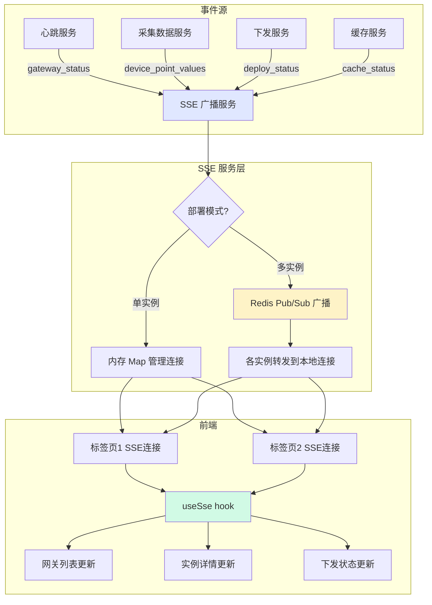
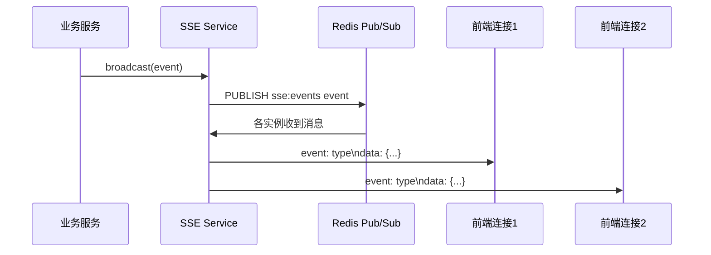
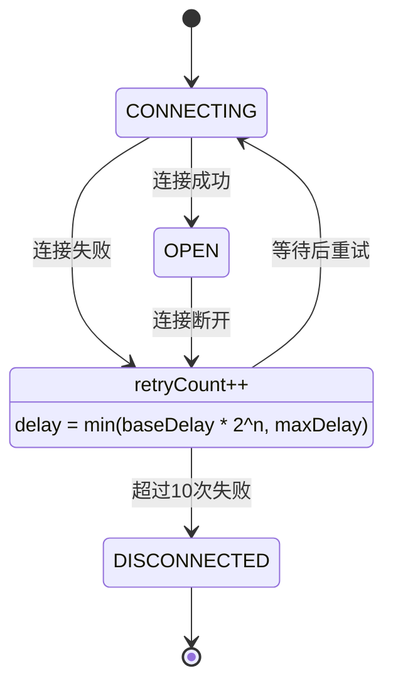

# 实时状态推送 — 技术设计文档

## 1. 设计概要

**功能描述**：使用 SSE（Server-Sent Events）技术将网关状态、性能指标、采集数据、下发结果、缓存状态等实时推送到前端，替代轮询刷新，实现零操作实时更新体验。前端自动连接、断开自动重试（指数退避）、页面关闭自动断开。

**影响范围**：
- 后端：`sse.service.ts`（已有，需扩展事件类型）、`sse.controller.ts`、采集数据处理服务
- 前端：`useSse.ts` hook、各业务页面的 SSE 订阅逻辑
- 基础设施：Redis（可选，多实例部署时事件广播）

**技术难点**：
- 多实例部署下的 SSE 事件广播（需要 Redis Pub/Sub）
- 采集数据批量聚合（1 秒一次，避免高频推送压垮前端）
- 连接管理和资源清理（页面关闭、网络断开）
- 事件类型扩展性（未来新增事件类型）

**外部依赖**：
- 边缘网关管理模块（网关状态/性能事件源）
- 设备实例管理模块（采集数据事件源）
- 配置下发与同步模块（下发状态事件源）
- 断网数据缓存模块（缓存状态事件源）
- Redis（多实例部署时 Pub/Sub 广播）

---

## 2. 架构概览

SSE 服务是一个横向的基础服务，各业务模块产生事件后通过 SSE 广播到所有前端连接。

**核心架构**：



**事件流**：



---

## 3. 数据库设计

本模块无新增数据库表。SSE 连接为内存管理，不持久化。

---

## 4. API 设计

### `GET /api/sse/connect`

**描述**：建立 SSE 长连接 → AC-001

**鉴权**：需要登录（Cookie / Token）

**响应头**：
```
Content-Type: text/event-stream
Cache-Control: no-cache
Connection: keep-alive
X-Accel-Buffering: no
```

**事件格式**（标准 SSE 格式）：
```
event: gateway_status
data: {"gatewayId":"cuid_xxx","status":"ONLINE","lastHeartbeat":"2024-03-15T10:00:00Z"}

event: device_point_values
data: {"deviceInstanceId":"cuid_xxx","points":[{"pointId":"temp_001","value":25.6,"timestamp":"..."}]}

: heartbeat\n\n
```

**说明**：
- 每 30 秒发送一次注释行 `: heartbeat` 作为心跳，防止连接超时
- 事件类型见第 5 节详细说明

---

## 5. 核心逻辑

### 5.1 事件类型定义 → AC-022

五类事件，独立推送，前端按类型处理：

| 事件类型 | Event Name | 触发时机 | 推送频率 | 对应 AC |
|---------|-----------|---------|---------|---------|
| 网关状态 | `gateway_status` | 网关状态变化、心跳上报 | 随心跳（~30秒） | AC-002、AC-003 |
| 网关性能 | `gateway_performance` | 心跳上报含性能数据 | 随心跳（~30秒） | AC-004、AC-005 |
| 采集值 | `device_point_values` | 采集数据上报（聚合后） | 1 秒/次（聚合） | AC-006、AC-007、AC-015 |
| 下发状态 | `deploy_status` | 下发完成（成功/失败） | 事件驱动，即时 | AC-008、AC-009、AC-018 |
| 缓存状态 | `cache_status` | 缓存数据变化、补发进度 | 事件驱动，即时 | AC-010、AC-019 |

#### gateway_status 事件数据结构
```json
{
  "gatewayId": "cuid_xxx",
  "status": "ONLINE",
  "lastHeartbeat": "2024-03-15T10:00:00Z",
  "ip": "192.168.1.100",
  "flowCount": 5,
  "nodeRedVersion": "3.1.2"
}
```

#### gateway_performance 事件数据结构
```json
{
  "gatewayId": "cuid_xxx",
  "timestamp": "2024-03-15T10:00:00Z",
  "cpuUsage": 45.2,
  "memoryUsage": 62.3,
  "diskUsage": 35.7,
  "diskFreeBytes": 10737418240
}
```

#### device_point_values 事件数据结构
```json
{
  "deviceInstanceId": "cuid_xxx",
  "gatewayId": "cuid_xxx",
  "points": [
    {
      "pointId": "temp_001",
      "value": 25.6,
      "dataType": "FLOAT32",
      "quality": 0,
      "timestamp": "2024-03-15T10:00:00Z"
    }
  ]
}
```

#### deploy_status 事件数据结构
```json
{
  "syncRecordId": "cuid_xxx",
  "deviceInstanceId": "cuid_xxx",
  "gatewayId": "cuid_xxx",
  "type": "DEPLOY",
  "status": "SUCCESS",
  "configVersion": 5,
  "deployedVersion": 5,
  "message": null,
  "errorCode": null,
  "completedAt": "2024-03-15T10:00:05Z"
}
```

#### cache_status 事件数据结构
```json
{
  "gatewayId": "cuid_xxx",
  "isCaching": false,
  "isReplaying": true,
  "pendingCount": 15600,
  "cacheSizeBytes": 2456789,
  "replayProgress": {
    "total": 20000,
    "completed": 4400,
    "percent": 22
  }
}
```

### 5.2 采集值聚合推送 → AC-006、AC-015、AC-017

**背景**：采集数据可能高频上报（如每 100ms 一次），逐条推送会造成前端性能问题和网络压力。

**聚合策略**：
- 聚合窗口：1 秒
- 按 `deviceInstanceId + pointId` 去重，保留窗口内最后一个值
- 窗口结束时批量推送
- 同实例的多个点位合并在一条事件中

**实现方案**：

```
使用内存 Map 暂存待推送数据：
Key: deviceInstanceId
Value: Map<pointId, { value, quality, timestamp }>

定时任务每秒执行：
1. 遍历暂存 Map
2. 将每个实例的点位数据打包为 device_point_values 事件
3. 通过 SSE 广播
4. 清空暂存 Map
```

**伪代码**：
```
const pendingData = new Map<string, Map<string, PointData>>()

function onDataReceived(instanceId, pointId, data):
    if not pendingData.has(instanceId):
        pendingData.set(instanceId, new Map())
    
    pendingData.get(instanceId).set(pointId, data)

// 每秒触发一次
function flushAggregatedData():
    for [instanceId, pointsMap] of pendingData:
        points = pointsMap.values()
        sseService.broadcast({
            type: 'device_point_values',
            data: { deviceInstanceId: instanceId, points }
        })
    
    pendingData.clear()

setInterval(flushAggregatedData, 1000)
```

### 5.3 前端连接管理 → AC-011、AC-012、AC-020

**useSse Hook 设计**：

```typescript
interface SseOptions {
  url: string
  onEvent?: (type: string, data: any) => void
  onOpen?: () => void
  onClose?: () => void
  onError?: (error: Event) => void
  maxRetries?: number    // 默认 10
  baseDelay?: number     // 默认 1000ms
  maxDelay?: number      // 默认 30000ms
}

function useSse(options: SseOptions): {
  isConnected: boolean
  reconnectCount: number
  isReconnecting: boolean
  reconnect: () => void
  close: () => void
}
```

**重试策略**：指数退避
- 第 1 次失败：等待 1 秒后重连
- 第 2 次失败：等待 2 秒后重连
- 第 3 次失败：等待 4 秒后重连
- ...
- 最多等待 30 秒
- 最多重试 10 次，超过后停止并显示"连接断开，请刷新页面"

**重连状态流转**：


### 5.4 多实例部署事件广播 → 扩展设计

**背景**：如果后端是多实例部署（PM2 集群 / K8s），SSE 连接分布在不同实例上，需要跨实例广播事件。

**方案**：Redis Pub/Sub

```
架构：
- 每个后端实例启动时订阅 Redis Channel: sse:events
- 业务模块调用 sseService.broadcast(event) 时：
  1. PUBLISH 到 Redis Channel
  2. 本实例也直接推送给本地连接（避免延迟）
- 每个实例收到订阅消息后：
  1. 检查是否是自己发布的（可选，用 instanceId 区分）
  2. 推送给本地所有 SSE 连接
```

**当前阶段**：单实例部署时可不用 Redis，直接内存广播。架构上预留扩展点。

### 5.5 连接管理与资源清理 → AC-014

**服务端连接管理**：
- 使用 `Map<clientId, { res: Response, handlers: Function[] }>` 管理连接
- 连接建立时分配 clientId，加入 Map
- 连接断开（close / error 事件）时从 Map 中移除
- 每 30 秒发送心跳注释 `: heartbeat\n\n`，防止代理超时
- 服务重启时所有连接断开，靠前端自动重连恢复

**前端连接管理**：
- `useEffect` 中建立连接，cleanup 函数中断开
- 页面 `beforeunload` 事件触发断开
- 组件卸载时自动断开
- Tab 切换到后台时不断开（保持实时性）

---

## 6. 现有代码改动

| 模块 / 文件 | 改动内容 | 原因 | 对应 AC |
|-------------|---------|------|---------|
| `sse.service.ts` | 增加事件类型定义、增加 broadcast 接口、支持多类型事件 | 扩展事件类型 | AC-022 |
| `sse.controller.ts` | 完善 SSE 连接端点、心跳机制、错误处理 | 生产级连接管理 | AC-001、AC-014 |
| `heartbeat.service.ts` | 心跳处理中调用 sseService 推送状态和性能事件 | 网关状态/性能推送 | AC-002、AC-004 |
| `data-collection.service.ts` | 采集数据接入聚合器，批量推送 | 采集值聚合推送 | AC-006、AC-015 |
| `sync.service.ts` | 下发完成时推送 deploy_status 事件 | 下发状态推送 | AC-008、AC-009 |
| `frontend/hooks/useSse.ts` | 新增 SSE 连接 Hook，支持自动重连、指数退避 | 前端连接管理 | AC-011、AC-012、AC-020 |
| `frontend/pages/gateway/List.tsx` | 接入 SSE，实时更新网关状态列表 | 状态实时更新 | AC-003 |
| `frontend/pages/gateway/Detail.tsx` | 接入 SSE，实时更新性能和缓存状态 | 数据实时更新 | AC-005、AC-010 |
| `frontend/pages/device-instance/Detail.tsx` | 接入 SSE，实时更新点位值和下发状态 | 数据实时更新 | AC-007、AC-008 |

---

## 7. 技术决策

### 推送协议选型

**背景**：实时推送技术选型，SSE vs WebSocket。

**选项**：
- A: SSE（Server-Sent Events）— 单向推送，HTTP 协议，简单可靠，自动重连
- B: WebSocket — 双向通信，功能强，但复杂度高，需要心跳保活
- C: 轮询（Polling）— 最简单，但延迟高，浪费资源

**结论**：选 A — SSE。需求是服务端向客户端推送状态，不需要双向通信（客户端发请求用 HTTP API 就行）。SSE 基于 HTTP，部署简单，浏览器原生支持 EventSource，自带重连机制。开发成本低，完全满足需求。

### 事件聚合策略

**背景**：采集数据高频上报，逐条推送前端性能压力大。

**选项**：
- A: 1 秒窗口聚合（推荐）— 延迟可控（最大 1 秒），前端压力小
- B: 实时逐条推送 — 延迟最低，但高频时前端卡顿
- C: 5 秒窗口聚合 — 前端压力更小，但延迟较高

**结论**：选 A — 1 秒聚合。工业场景 1 秒延迟完全可接受，用户感知不到。大幅减少前端 DOM 更新次数，保证页面流畅。采集频率再高也不会压垮前端。

### 多实例广播方案

**背景**：多实例部署时 SSE 事件跨实例传递。

**选项**：
- A: Redis Pub/Sub — 成熟可靠，实时性好，项目已有 Redis
- B: Kafka / MQ — 太重，杀鸡用牛刀
- C: 粘性会话（Sticky Session）— 用户始终连同一实例，不需要广播，但负载不均

**结论**：选 A — Redis Pub/Sub。项目已经用 Redis（心跳缓存等），直接复用。发布订阅延迟低，实现简单。单实例部署时可跳过 Redis，直接内存广播，架构上预留扩展点。

---

## 8. 安全与性能

**安全**：
- SSE 连接需要鉴权（登录态校验）
- 事件数据不包含敏感信息（都是状态和数值）
- 防止 CORS 滥用（仅允许本站点访问）

**性能考量**：
- 采集值 1 秒聚合，减少推送频率
- 每实例连接数上限（防止过多连接撑爆内存）
- 心跳 30 秒一次，防止代理超时
- 事件大小限制，单条事件不超过 64KB
- 广播时遍历连接用异步，避免阻塞事件循环

**可靠性**：
- 前端指数退避重连，最多 10 次
- 服务端心跳保活
- 连接关闭时清理资源，防止内存泄漏
- 多实例部署用 Redis 广播，保证事件不丢

---

## 9. AC 覆盖总表

| AC 编号 | 验收标准概述 | 实现位置 |
|---------|-------------|---------|
| AC-001 | 自动建立 SSE 连接 | 前端 useSse hook + GET /api/sse/connect |
| AC-002 | 网关状态事件推送 | heartbeat.service 调用 sseService.broadcast |
| AC-003 | 状态变化实时更新 | 前端网关列表订阅 gateway_status 事件 |
| AC-004 | 网关性能事件推送 | heartbeat.service 推送 gateway_performance |
| AC-005 | 性能数据实时更新 | 网关详情页订阅 gateway_performance 事件 |
| AC-006 | 采集值事件聚合推送 | 数据采集聚合器 + device_point_values 事件 |
| AC-007 | 采集值实时展示 | 实例详情页订阅 device_point_values 事件 |
| AC-008 | 下发成功推送 | sync.service 推送 deploy_status SUCCESS |
| AC-009 | 下发失败推送 | sync.service 推送 deploy_status FAILED |
| AC-010 | 缓存状态事件推送 | 缓存服务推送 cache_status 事件 |
| AC-011 | 临时断网自动重连 | useSse hook 指数退避重连 |
| AC-012 | 彻底断开提示刷新 | useSse hook 10 次失败后提示 |
| AC-013 | 多标签页独立接收 | 每个标签页独立 EventSource 连接 |
| AC-014 | 页面关闭断开连接 | useEffect cleanup + beforeunload |
| AC-015 | 高频采集聚合推送 | 1 秒窗口聚合器 |
| AC-016 | 网关状态推送频率 ← BR-001 | 随心跳 30 秒一次 |
| AC-017 | 采集值聚合推送 ← BR-003 | 1 秒/次 批量聚合 |
| AC-018 | 下发状态立即推送 ← BR-004 | 下发完成即时推送 |
| AC-019 | 缓存状态立即推送 ← BR-004 | 缓存变化即时推送 |
| AC-020 | 重试策略 ← BR-002 | 指数退避，最多 10 次，最长 30 秒 |
| AC-021 | 独立连接 ← BR-001 | 每标签页独立连接 |
| AC-022 | 事件类型区分 ← BR-004 | 五类事件独立 event type |

---

## 附录：变更记录

| 日期 | 变更内容 | 原因 |
|------|---------|------|
| 2026-06-30 | 初始版本 | 完成实时状态推送技术方案设计 |
