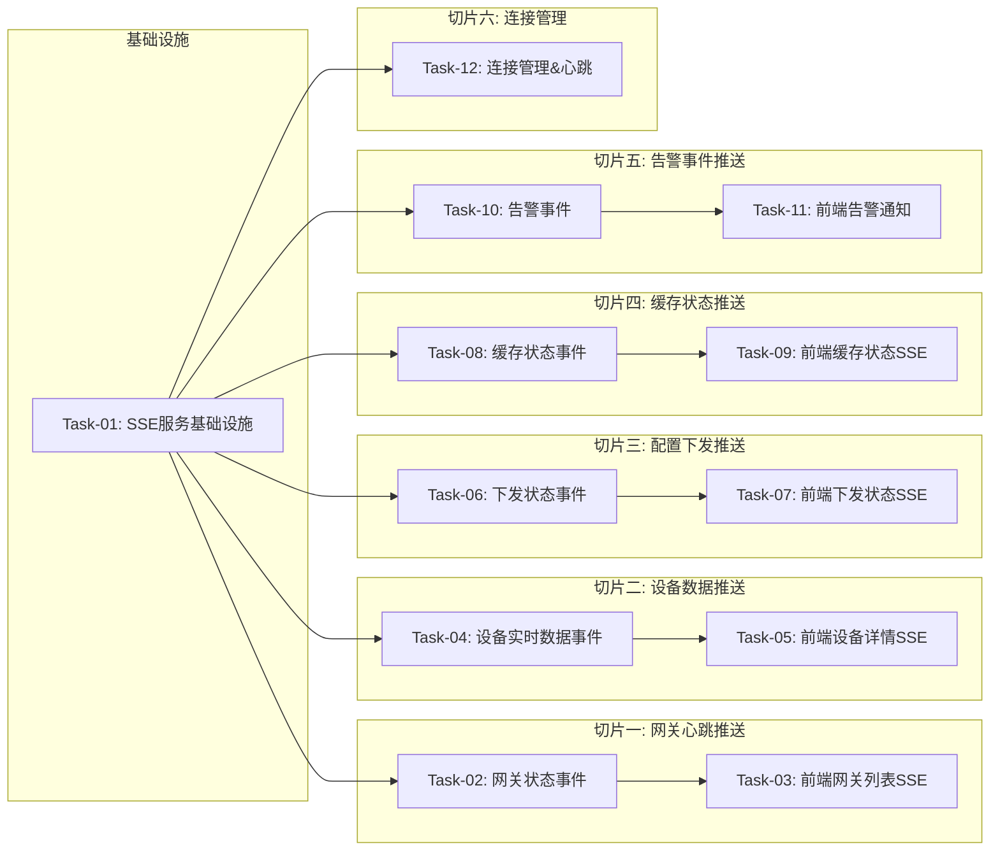

# 实时状态推送 — 开发任务计划

## 1. 任务概览

**总任务数**：12 个
**预计总工时**：约 660 分钟（约 11 小时）
**开发方法**：TDD — 每个任务按 RED → GREEN → REFACTOR 循环执行

**关键标注**：
- 🔒 阻塞任务：被多个任务依赖，建议优先完成
- ⚠️ 风险任务：技术难度高，可能需要额外时间

### 依赖关系图



### 可并行任务组

| 并行组 | 任务 | 说明 |
|--------|------|------|
| A | T03, T05, T07, T09, T11 | 5 个前端 SSE 接入可并行开发 |
| B | T02, T04, T06, T08, T10 | 5 种事件类型的后端逻辑可并行 |

---

## 2. 开发任务

### 基础设施

**阶段完成标准**：SSE 服务基础设施就绪，支持连接管理、事件发布、订阅模式。

---

#### Task-01: SSE 服务基础设施 🔒⚠️

**通俗解释**：建立 SSE 推送的基础框架，后端能管理客户端连接，前端能建立连接并接收消息。

**做什么**：
1. 后端 SSE 服务类（SseService）：
   - 连接管理：clients Map（clientId → response）
   - 连接建立、关闭处理
   - 事件发布：publish(eventType, data)
   - 按事件类型订阅/取消订阅
   - 连接心跳（每 30 秒发 comment 保持连接）
2. SSE 路由端点：GET /api/sse/stream
3. 支持客户端传 token 鉴权（简单版，先不传也能连）
4. 支持客户端指定订阅的事件类型（通过 query 参数 events）
5. 事件格式：`event: xxx\ndata: {...}\n\n`
6. 前端 useSse hook（基础版）
7. 单元测试：连接建立、事件发布、连接关闭

**涉及文件**：
- `backend/src/services/sse.service.ts`
- `backend/src/routes/sse.routes.ts` （或加在 gateway 模块的 controller）
- `frontend/src/hooks/useSse.ts`

**参考**：技术方案 第3章 → AC-001, AC-002

**依赖**：无

**预估工时**：90 分钟

**验证标准**：
- [ ] 浏览器访问 SSE 端点 → 建立连接，收到欢迎消息
- [ ] 服务端发布事件 → 所有连接的客户端都收到
- [ ] 客户端断开连接 → 服务端从 clients 中移除
- [ ] 30 秒无消息 → 收到心跳 comment
- [ ] 前端 useSse hook 能建立连接并接收消息
- [ ] 页面卸载时自动断开连接
- [ ] 支持指定订阅的事件类型（只收感兴趣的事件）

---

### 切片一：网关心跳 & 状态推送

**阶段完成标准**：网关上下线时，前端列表和详情页的状态实时变化。

---

#### Task-02: 网关状态事件发布

**通俗解释**：网关状态变化时（上线/离线），SSE 服务推送 gateway_status 事件。

**做什么**：
1. 在心跳服务中集成 SSE：
   - 网关首次上线（OFFLINE → ONLINE）→ 发布事件
   - 网关掉线（ONLINE → OFFLINE）→ 发布事件
2. 事件格式：
   ```
   event: gateway_status
   data: { "gatewayId": "xxx", "status": "ONLINE", "lastHeartbeat": "..." }
   ```
3. 事件类型定义在枚举里
4. 只在状态变化时发布，不是每次心跳都发
5. 单元测试：状态变化时事件发布，状态不变不发布

**涉及文件**：
- `backend/src/services/heartbeat.service.ts`
- `backend/src/services/sse.service.ts`
- `backend/src/types/events.ts` （事件类型定义）

**参考**：技术方案 4.1节 → AC-003

**依赖**：Task-01

**预估工时**：45 分钟

**验证标准**：
- [ ] 网关从 OFFLINE 变 ONLINE → SSE 收到 gateway_status 事件
- [ ] 网关从 ONLINE 变 OFFLINE → 收到事件
- [ ] 网关已 ONLINE，再次心跳 → 不发事件（状态没变）
- [ ] 事件包含 gatewayId 和 status 字段
- [ ] 多个客户端连接 → 都收到事件

---

#### Task-03: 前端网关列表 & 详情 SSE 接入

**通俗解释**：打开网关列表页，网关掉线了不用刷新，状态徽章自己变颜色。

**做什么**：
1. 网关列表页：
   - 页面加载时建立 SSE 连接
   - 订阅 gateway_status 事件
   - 收到事件时更新列表中对应网关的状态
   - 页面卸载时断开
2. 网关详情页：
   - 同样接入，更新详情页的状态显示
   - 最后心跳时间也更新
3. useSse hook 增加事件处理器
4. 状态徽章颜色变化带动画效果（可选）

**涉及文件**：
- `frontend/src/pages/gateway/List.tsx`
- `frontend/src/pages/gateway/Detail.tsx`
- `frontend/src/hooks/useSse.ts`

**参考**：技术方案 → AC-003

**依赖**：Task-02

**预估工时**：60 分钟

**验证标准**：
- [ ] 列表页打开后建立 SSE 连接
- [ ] 模拟网关上线 → 列表中状态从离线变在线，颜色变绿
- [ ] 模拟网关离线 → 状态变离线，颜色变灰
- [ ] 详情页同样实时更新
- [ ] 离开页面 → 连接断开
- [ ] 最后心跳时间也实时更新

---

### 切片二：设备实时数据推送

**阶段完成标准**：设备详情页实时数据 Tab 的数值实时变化。

---

#### Task-04: 设备实时数据事件发布

**通俗解释**：有新的采集数据上来时，推送给前端，不用刷新页面就能看到最新值。

**做什么**：
1. 在数据采集服务中集成 SSE
2. 收到设备上报数据后，发布 device_data 事件
3. 事件格式：
   ```
   event: device_data
   data: { "instanceId": "xxx", "points": [{ "tag": "temp", "value": 25.3, "timestamp": "..." }] }
   ```
4. 按设备维度发布（一个设备一条事件，包含所有点位）
5. 性能考虑：数据上报频繁时做节流（每 1 秒最多推一次给前端）
6. 单元测试

**涉及文件**：
- `backend/src/services/data-collection.service.ts`
- `backend/src/services/sse.service.ts`
- `backend/src/types/events.ts`

**参考**：技术方案 4.2节 → AC-004

**依赖**：Task-01

**预估工时**：60 分钟

**验证标准**：
- [ ] 设备上报数据 → SSE 收到 device_data 事件
- [ ] 事件包含 instanceId 和 points 数组
- [ ] 每个点位有 tag、value、timestamp
- [ ] 1 秒内多次上报 → 只推一次（节流）
- [ ] 不同设备的数据 → 各自独立推送
- [ ] 数据量大时不影响主流程

---

#### Task-05: 前端设备详情实时数据 SSE

**通俗解释**：看着设备详情页的实时数据，数值会自己跳，像实时监控一样。

**做什么**：
1. 设备详情页实时数据 Tab：
   - 页面加载时建立 SSE 连接（或复用全局连接）
   - 订阅当前设备的 device_data 事件
   - 收到数据时更新对应点位的 value 和 lastUpdate
   - 数值变化有轻微闪烁动画（提示数据更新了）
2. 按设备 ID 过滤（只处理当前设备的数据）
3. 离开页面或切换 Tab 时取消订阅
4. 性能优化：只在 Tab 可见时更新

**涉及文件**：
- `frontend/src/pages/device-instance/Detail.tsx`
- `frontend/src/pages/device-instance/components/RealtimeDataTab.tsx`
- `frontend/src/hooks/useSse.ts`

**参考**：技术方案 → AC-004

**依赖**：Task-04

**预估工时**：60 分钟

**验证标准**：
- [ ] 打开实时数据 Tab → 建立 SSE 订阅
- [ ] 收到新数据 → 对应点位的数值更新
- [ ] 数值变化时有视觉提示（闪烁或高亮一下）
- [ ] 切换到其他 Tab → 不更新数据（节省性能）
- [ ] 切回来 → 继续更新
- [ ] 离开详情页 → 取消订阅

---

### 切片三：配置下发状态推送

**阶段完成标准**：下发配置时，进度和结果实时推送到前端。

---

#### Task-06: 配置下发状态事件发布

**通俗解释**：配置下发过程中（开始/成功/失败），实时推送给前端，不用轮询。

**做什么**：
1. 在下发服务中集成 SSE
2. 关键节点发布 deployment_status 事件：
   - 下发开始（PENDING → RUNNING）
   - 下发成功（RUNNING → SUCCESS）
   - 下发失败（RUNNING → FAILED）
3. 批量下发也推送批量进度事件（batch_deployment_status）
4. 事件格式：
   ```
   event: deployment_status
   data: { "deploymentId": "xxx", "instanceId": "xxx", "status": "SUCCESS", ... }
   ```
5. 单元测试：状态变化时发布事件

**涉及文件**：
- `backend/src/modules/deployment/deployment.service.ts`
- `backend/src/services/sse.service.ts`
- `backend/src/types/events.ts`

**参考**：技术方案 4.3节 → AC-005

**依赖**：Task-01

**预估工时**：45 分钟

**验证标准**：
- [ ] 下发开始 → 收到 deployment_status 事件，status=RUNNING
- [ ] 下发成功 → 收到事件，status=SUCCESS
- [ ] 下发失败 → 收到事件，status=FAILED，含错误信息
- [ ] 批量下发 → 收到 batch_deployment_status 事件，含进度
- [ ] 状态不变不发事件

---

#### Task-07: 前端下发状态 SSE 接入

**通俗解释**：点了下发按钮，不用刷新页面，自动显示进度和结果。

**做什么**：
1. 设备详情页下发操作：
   - 点击下发后，订阅 deployment_status 事件
   - 收到事件时更新按钮状态和提示
   - 成功/失败自动 Toast 提示
2. 批量下发弹窗：
   - 订阅批量进度事件
   - 实时更新进度条和成功/失败计数
3. 配置记录页：
   - 有新的下发完成时，列表自动更新（可选）
4. 事件按 deploymentId 过滤

**涉及文件**：
- `frontend/src/pages/device-instance/Detail.tsx`
- `frontend/src/pages/device-instance/components/BatchDeployModal.tsx`
- `frontend/src/pages/deployment/List.tsx`
- `frontend/src/stores/deployment.store.ts`

**参考**：技术方案 → AC-005

**依赖**：Task-06

**预估工时**：75 分钟

**验证标准**：
- [ ] 单设备下发 → 按钮状态实时变化（下发中→成功/失败）
- [ ] 成功 → 绿色 Toast 提示
- [ ] 失败 → 红色 Toast 提示失败原因
- [ ] 批量下发 → 进度条实时前进，成功/失败计数实时更新
- [ ] 配置记录页 → 有新下发完成时列表自动刷新
- [ ] 关闭弹窗后取消订阅

---

### 切片四：缓存状态推送

**阶段完成标准**：网关断网缓存、补发等状态实时推送到前端。

---

#### Task-08: 缓存状态事件发布

**通俗解释**：网关开始缓存、缓存进度、补发进度等状态变化时，实时推送。

**做什么**：
1. 在缓存状态服务中集成 SSE
2. 发布 cache_status 事件，场景：
   - 开始缓存（isCaching 变 true）
   - 缓存进度（节流，每 5 秒推一次）
   - 开始补发
   - 补发进度（节流）
   - 补发完成
   - 补发暂停/恢复
3. 事件格式：
   ```
   event: cache_status
   data: { "gatewayId": "xxx", "isCaching": true, "cacheCount": 100, ... }
   ```
4. 进度类事件做节流，避免推送太频繁
5. 单元测试

**涉及文件**：
- `backend/src/services/cache-status.service.ts`
- `backend/src/services/sse.service.ts`
- `backend/src/types/events.ts`

**参考**：技术方案 4.4节 → AC-006

**依赖**：Task-01

**预估工时**：60 分钟

**验证标准**：
- [ ] 网关开始缓存 → 收到 cache_status 事件
- [ ] 缓存进度 → 每 5 秒推一次（不是每条都推）
- [ ] 开始补发 → 收到事件，replayStatus = REPLAYING
- [ ] 补发完成 → 收到事件，replayStatus = COMPLETED
- [ ] 补发暂停 → 收到事件，replayStatus = PAUSED
- [ ] 事件包含必要的状态字段

---

#### Task-09: 前端缓存状态 SSE 接入

**通俗解释**：看着网关详情页的缓存状态卡片，断网了自动变橙色，补发了进度条自己走。

**做什么**：
1. 网关详情页缓存状态卡片：
   - 订阅当前网关的 cache_status 事件
   - 收到事件时更新卡片显示
   - 状态切换时动画过渡
2. 缓存中：橙色 + 动效
3. 补发中：进度条实时前进
4. 补发完成：绿色 + 完成提示
5. 离开页面取消订阅

**涉及文件**：
- `frontend/src/pages/gateway/Detail.tsx`
- `frontend/src/pages/gateway/components/CacheStatusCard.tsx`

**参考**：技术方案 → AC-006

**依赖**：Task-08

**预估工时**：60 分钟

**验证标准**：
- [ ] 页面打开后订阅 cache_status
- [ ] 收到缓存开始事件 → 卡片变橙色，显示"断网缓存中"
- [ ] 收到补发进度事件 → 进度条前进
- [ ] 收到补发完成 → 卡片变绿色
- [ ] 状态变化有平滑过渡动画
- [ ] 离开页面取消订阅

---

### 切片五：告警事件推送

**阶段完成标准**：有告警事件时，前端右上角弹出通知。

---

#### Task-10: 告警事件定义 & 发布

**通俗解释**：系统产生告警时（网关离线、设备离线、采集异常等），推送到前端。

**做什么**：
1. 定义告警类型枚举：
   - GATEWAY_OFFLINE：网关离线
   - DEVICE_OFFLINE：设备离线
   - COLLECTION_ERROR：采集异常
   - DEPLOY_FAILED：下发失败
2. 告警级别：INFO/WARNING/ERROR/CRITICAL
3. 在各模块集成告警发布：
   - 心跳服务：网关离线 → WARNING
   - 数据采集：设备长时间无数据 → WARNING
   - 配置下发：下发失败 → ERROR
4. 告警事件格式：
   ```
   event: alert
   data: { "id": "xxx", "type": "GATEWAY_OFFLINE", "level": "WARNING", "message": "...", "timestamp": "..." }
   ```
5. 告警存数据库（可选，先不存，只推送）
6. 单元测试

**涉及文件**：
- `backend/src/services/alert.service.ts`
- `backend/src/services/sse.service.ts`
- `backend/src/types/events.ts`
- `backend/src/services/heartbeat.service.ts` （触发告警）
- `backend/src/modules/deployment/deployment.service.ts` （触发告警）

**参考**：技术方案 4.5节 → AC-007

**依赖**：Task-01

**预估工时**：60 分钟

**验证标准**：
- [ ] 网关离线 → 收到 alert 事件，type=GATEWAY_OFFLINE, level=WARNING
- [ ] 下发失败 → 收到 alert 事件，type=DEPLOY_FAILED, level=ERROR
- [ ] 事件有唯一 id、类型、级别、消息、时间
- [ ] 告警级别正确映射
- [ ] 多个客户端都能收到

---

#### Task-11: 前端告警通知中心

**通俗解释**：页面右上角有个小铃铛，有新告警时红点提示，点开能看告警列表。

**做什么**：
1. 全局告警通知组件（右上角铃铛图标）
2. 订阅 alert 事件
3. 新告警时：
   - 铃铛红点 + 数字
   - 桌面通知（如果浏览器授权的话）
   - Toast 提示（重要级别以上）
4. 点击铃铛 → 下拉面板显示最近告警列表
5. 告警列表：级别颜色、类型、消息、时间
6. 标记已读、全部已读
7. 告警存在 localStorage 里（刷新不丢）
8. 最多存 100 条

**涉及文件**：
- `frontend/src/components/AlertCenter.tsx`
- `frontend/src/stores/alert.store.ts`
- `frontend/src/App.tsx` （全局引入）

**参考**：技术方案 → AC-007

**依赖**：Task-10

**预估工时**：75 分钟

**验证标准**：
- [ ] 收到新告警 → 铃铛显示红点 + 数量
- [ ] 点铃铛 → 下拉面板显示告警列表
- [ ] 告警按级别显示不同颜色（ERROR=红, WARNING=黄, INFO=蓝）
- [ ] 最新的在上面
- [ ] 标记已读后红点减少
- [ ] 刷新页面 → 告警还在（localStorage）
- [ ] 超过 100 条自动删最老的
- [ ] 桌面通知授权后，新告警弹桌面通知

---

### 切片六：连接管理 & 可靠性

**阶段完成标准**：SSE 连接稳定，断线自动重连，不丢消息。

---

#### Task-12: 断线重连 & 消息可靠性 ⚠️

**通俗解释**：网络断了 SSE 能自动重连，重连后不丢重要消息。

**做什么**：
1. 前端断线重连：
   - useSse hook 增加断线重连逻辑
   - 指数退避：1s → 2s → 4s → 8s → 最大 30s
   - 重连成功提示（可选）
   - 手动重连按钮
2. 消息可靠性（简单方案）：
   - 每条消息带 eventId
   - 重连时带 Last-Event-ID
   - 服务端缓存最近 N 条消息（每类 100 条）
   - 重连后补发离线期间的消息
3. 连接状态指示：
   - 全局连接状态指示器（在线/离线/重连中）
   - 离线时显示小图标提示
4. 单元测试：断线重连、消息补发

**涉及文件**：
- `frontend/src/hooks/useSse.ts`
- `backend/src/services/sse.service.ts`
- `frontend/src/components/ConnectionStatus.tsx`

**参考**：技术方案 5章 → AC-008

**依赖**：Task-01

**预估工时**：75 分钟

**验证标准**：
- [ ] 手动断开网络 → SSE 开始自动重连
- [ ] 重连间隔递增（1s, 2s, 4s...）
- [ ] 网络恢复后 → 自动连接成功
- [ ] 重连后 → 收到离线期间的重要消息（补发）
- [ ] 连接状态指示器显示正确
- [ ] 最大重连间隔不超过 30 秒
- [ ] 页面卸载时停止重连

---

## 3. AC 覆盖总表

| AC 编号 | 验收标准概述 | 承接任务 | 验证方式 |
|---------|-------------|---------|---------|
| AC-001 | SSE 连接建立 | Task-01 | 浏览器能建立 SSE 连接 |
| AC-002 | 连接心跳保活 | Task-01 | 30 秒无消息收到心跳 |
| AC-003 | 网关状态推送 | Task-02, Task-03 | 网关上下线前端实时更新 |
| AC-004 | 设备数据推送 | Task-04, Task-05 | 新数据上来前端实时更新 |
| AC-005 | 下发状态推送 | Task-06, Task-07 | 下发进度和结果实时推送 |
| AC-006 | 缓存状态推送 | Task-08, Task-09 | 缓存/补发状态实时推送 |
| AC-007 | 告警事件推送 | Task-10, Task-11 | 告警实时通知，通知中心展示 |
| AC-008 | 断线重连 | Task-12 | 断线自动重连，消息补发 |

---

## 4. 完成定义

- [ ] 所有 12 个任务的验证标准（测试用例）全部通过
- [ ] AC 覆盖总表中所有 AC 的验证方式已执行并通过
- [ ] 5 类事件（网关状态、设备数据、下发状态、缓存状态、告警）全部支持
- [ ] 前端 4 个主要页面（网关列表/详情、设备详情、配置记录）都接入 SSE
- [ ] 告警通知中心功能完整
- [ ] 断线自动重连功能验证通过
- [ ] 消息补发机制验证通过
- [ ] 与其他 5 个模块的事件联调通过
