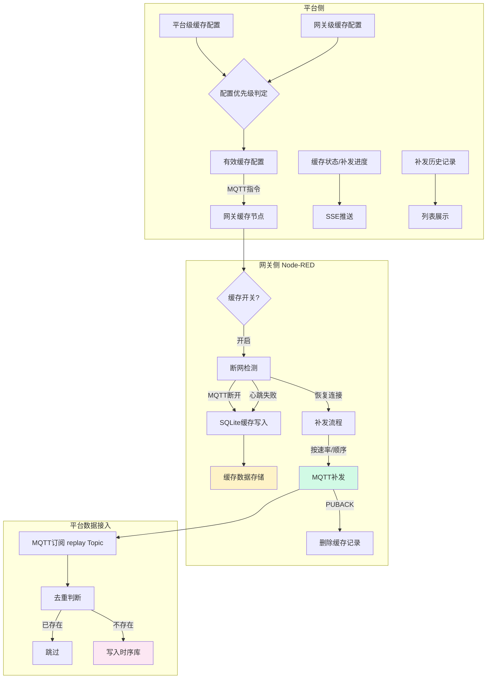

# 断网数据缓存 — 技术设计文档

## 1. 设计概要

**功能描述**：工业环境网络不稳定时，边缘网关在本地 SQLite 缓存采集数据，网络恢复后按时间顺序、按配置速率补发到平台，保证数据不丢失。平台侧负责配置管理（两级开关、保存期限、补发速率）和状态监控（缓存条数、大小、补发进度、历史记录）。

**影响范围**：
- 平台后端：`gateway` 模块（缓存配置）、`sync` 模块（下发缓存配置）、`device-data` 模块（补发数据去重写入）
- 平台前端：`gateway/` 详情页（缓存状态卡片）、`system-config/` 页面（平台级缓存配置）
- 网关侧：Node-RED 自定义缓存节点 + SQLite（不在本模块代码范围，在网关部署包中）
- 数据库：PlatformConfig 表（已存在）、Gateway 表扩展字段（已定义）、CacheReplayRecord 新增表

**技术难点**：
- 网关侧 SQLite 高并发写入（断网时持续采集写入）
- 补发数据去重（点位ID + 时间戳）
- 配置即时生效（无需重启网关、无需重新下发 flow）
- 补发进度实时推送（SSE）

**外部依赖**：
- 边缘网关管理模块（配置存储、网关状态）
- 实时数据采集模块（补发数据写入时序库）
- 网关侧 Node-RED 缓存节点（执行缓存和补发逻辑）
- MQTT Broker（补发数据传输 + 配置指令下发）

---

## 2. 架构概览

断网数据缓存是一个跨平台-网关的协作功能，平台侧管配置和监控，网关侧管实际存储和补发。

**核心架构**：



**配置下发机制**：配置变更后通过 MQTT 指令推送到网关，立即生效，无需重新下发 flow。

---

## 3. 数据库设计

### 新增表

#### `CacheReplayRecord`

**用途**：存储网关补发历史记录，用于平台展示补发历史。

| 字段名 | 类型 | 约束 | 说明 |
|--------|------|------|------|
| id | TEXT | PK, DEFAULT cuid() | 主键 |
| gateway_id | TEXT | NOT NULL, FK → Gateway.id | 网关ID |
| start_time | TIMESTAMPTZ | NOT NULL | 补发开始时间 |
| end_time | TIMESTAMPTZ | | 补发结束时间 |
| total_count | INT | DEFAULT 0 | 总待补发条数 |
| success_count | INT | DEFAULT 0 | 成功补发条数 |
| failed_count | INT | DEFAULT 0 | 失败条数目（预留） |
| status | TEXT | NOT NULL | 状态：IN_PROGRESS/COMPLETED/INTERRUPTED |
| size_bytes | BIGINT | DEFAULT 0 | 补发数据总大小（字节） |
| created_at | TIMESTAMPTZ | DEFAULT now() | 创建时间 |
| updated_at | TIMESTAMPTZ | DEFAULT now() | 更新时间 |

**索引**：
- `INDEX idx_cache_replay_gateway (gateway_id, created_at DESC)` — 按网关查历史

#### 网关侧 SQLite 表（不在平台数据库中）

**用途**：网关本地缓存采集数据（在网关上运行，参考设计）。

```sql
-- 网关本地 SQLite 表结构（参考）
CREATE TABLE IF NOT EXISTS cache_data (
    id INTEGER PRIMARY KEY AUTOINCREMENT,
    device_instance_id TEXT NOT NULL,
    point_id TEXT NOT NULL,
    value TEXT NOT NULL,
    data_type TEXT NOT NULL,
    quality INTEGER DEFAULT 0,
    timestamp INTEGER NOT NULL,  -- Unix 毫秒时间戳
    status TEXT DEFAULT 'pending',  -- pending/sending/failed
    created_at INTEGER NOT NULL
);

CREATE INDEX IF NOT EXISTS idx_cache_status ON cache_data (status, timestamp ASC);
CREATE INDEX IF NOT EXISTS idx_cache_point_ts ON cache_data (device_instance_id, point_id, timestamp);
```

### 修改现有表

#### `Gateway` 表

**变更内容**：已在边缘网关方案中定义，这里确认缓存相关字段。

| 字段 | 说明 |
|------|------|
| cacheEnabled | 网关级缓存开关（null 表示未设置，使用平台级） |
| cacheRetentionDays | 网关级保存期限（null 表示未设置） |
| cacheReplayRate | 网关级补发速率（null 表示未设置） |

#### `PlatformConfig` 表

**变更内容**：已在边缘网关方案中定义，这里确认。

| 字段 | 说明 |
|------|------|
| cacheEnabled | 平台级缓存开关（默认 false） |
| cacheRetentionDays | 平台级保存期限（默认 15） |
| cacheReplayRate | 平台级补发速率（默认 100） |

---

## 4. API 设计

### `GET /api/platform-config/cache`

**描述**：获取平台级缓存配置 → AC-001、AC-027

**鉴权**：需要登录

**Response（成功）**：
```json
{
  "success": true,
  "data": {
    "cacheEnabled": false,
    "cacheRetentionDays": 15,
    "cacheReplayRate": 100
  }
}
```

### `PUT /api/platform-config/cache`

**描述**：更新平台级缓存配置 → AC-001、AC-035

**鉴权**：需要登录

**Request**：
```json
{
  "cacheEnabled": true,
  "cacheRetentionDays": 30,
  "cacheReplayRate": 200
}
```

**Response（成功）**：
```json
{
  "success": true,
  "data": { "updated": true }
}
```

**说明**：保存后通过 MQTT 向所有在线网关推送配置变更通知，立即生效。

### `GET /api/gateways/:id/cache-config`

**描述**：获取网关级缓存配置（含生效值和来源） → AC-002、AC-003、AC-012

**鉴权**：需要登录

**Response（成功）**：
```json
{
  "success": true,
  "data": {
    "cacheEnabled": {
      "gatewayValue": null,
      "platformValue": false,
      "effectiveValue": false,
      "source": "platform"
    },
    "cacheRetentionDays": {
      "gatewayValue": null,
      "platformValue": 15,
      "effectiveValue": 15,
      "source": "platform"
    },
    "cacheReplayRate": {
      "gatewayValue": 200,
      "platformValue": 100,
      "effectiveValue": 200,
      "source": "gateway"
    }
  }
}
```

**字段说明**：
- `gatewayValue`：网关级配置值，null 表示未覆盖
- `platformValue`：平台级配置值
- `effectiveValue`：生效值（gatewayValue ?? platformValue）
- `source`：生效来源（platform / gateway）

### `PUT /api/gateways/:id/cache-config`

**描述**：更新网关级缓存配置 → AC-002、AC-003、AC-035

**鉴权**：需要登录

**Request**：
```json
{
  "cacheEnabled": true,
  "cacheRetentionDays": 30,
  "cacheReplayRate": 200
}
```

**说明**：
- 传 null 表示取消网关级覆盖，使用平台级配置
- 保存后通过 MQTT 向该网关推送配置变更，立即生效

### `GET /api/gateways/:id/cache-status`

**描述**：获取网关缓存实时状态 → AC-013、AC-014

**鉴权**：需要登录

**Response（成功）**：
```json
{
  "success": true,
  "data": {
    "cacheEnabled": true,
    "isCaching": false,
    "isReplaying": true,
    "pendingCount": 15600,
    "cacheSizeBytes": 2456789,
    "replayProgress": {
      "total": 20000,
      "completed": 4400,
      "percent": 22,
      "startTime": "2024-03-15T10:00:00Z",
      "estimatedEndTime": "2024-03-15T10:03:20Z"
    }
  }
}
```

**说明**：状态数据通过 MQTT 网关实时上报到 Redis，API 从 Redis 读取。

### `GET /api/gateways/:id/replay-history`

**描述**：获取补发历史记录 → AC-015

**鉴权**：需要登录

**Query 参数**：
- `page`：页码
- `pageSize`：每页数量

**Response（成功）**：
```json
{
  "success": true,
  "data": {
    "list": [
      {
        "id": "cuid_xxx",
        "startTime": "2024-03-15T10:00:00Z",
        "endTime": "2024-03-15T10:03:00Z",
        "totalCount": 20000,
        "successCount": 20000,
        "failedCount": 0,
        "status": "COMPLETED",
        "sizeBytes": 3145728
      }
    ],
    "total": 5
  }
}
```

### `POST /api/gateways/:id/cache/clear`

**描述**：清空网关缓存 → AC-016、AC-017、AC-025、AC-026

**鉴权**：需要登录

**Response（成功，网关在线）**：
```json
{
  "success": true,
  "data": { "commandSent": true }
}
```

**Response（网关离线）**：
```json
{
  "success": true,
  "data": {
    "commandSent": false,
    "cached": true,
    "message": "网关离线，指令已缓存，网关上线后自动执行"
  }
}
```

**说明**：
- 网关在线：直接通过 MQTT 发送清空指令
- 网关离线：将指令存入 Redis 队列，网关上线后拉取执行（通过上线通知触发）
- 需要二次确认在前端实现

---

## 5. 核心逻辑

### 5.1 配置优先级判定 → AC-027、AC-034

**触发条件**：任何需要判断缓存是否启用、保存期限、补发速率的场景

**判定规则**：

```
有效配置 = 网关级配置 ?? 平台级配置
```

| 配置项 | 平台级默认 | 网关级覆盖 | 生效规则 |
|--------|-----------|-----------|---------|
| cacheEnabled | false | 可设置为 true/false/null | gatewayValue ?? platformValue |
| cacheRetentionDays | 15 | 可设置为数字/null | gatewayValue ?? platformValue |
| cacheReplayRate | 100 | 可设置为数字/null | gatewayValue ?? platformValue |

**伪代码**：
```
function getEffectiveCacheConfig(gatewayId):
    gateway = db.getGateway(gatewayId)
    platform = db.getPlatformConfig()
    
    return {
        cacheEnabled: {
            gatewayValue: gateway.cacheEnabled,
            platformValue: platform.cacheEnabled,
            effectiveValue: gateway.cacheEnabled ?? platform.cacheEnabled,
            source: gateway.cacheEnabled !== null ? 'gateway' : 'platform'
        },
        // ... 其他配置同理
    }
```

### 5.2 配置即时生效 → AC-035

**触发条件**：平台级或网关级缓存配置变更时

**处理流程**：

```
1. 保存配置到数据库
2. 通过 MQTT 向网关发送配置变更指令：
   Topic: gateway/{gatewayId}/config/cache
   Payload: { cacheEnabled, retentionDays, replayRate }
3. 网关收到指令后立即更新本地缓存节点配置
4. 无需重启网关，无需重新下发 flow
```

**MQTT 指令格式**：
```json
{
  "type": "CACHE_CONFIG_UPDATE",
  "timestamp": 1710508800000,
  "data": {
    "cacheEnabled": true,
    "retentionDays": 30,
    "replayRate": 200
  }
}
```

### 5.3 断网检测与缓存触发 → AC-004、AC-005、AC-006

**触发条件**（网关侧）：
1. MQTT 客户端触发 `close` 事件 → 立即判定断网
2. 心跳发送连续失败 N 次 → 判定断网

**网关侧处理流程**：

```
1. 检测到断网
2. 读取有效缓存配置
3. 缓存开关关闭 → 丢弃数据
4. 缓存开关开启 →
   a. 检查存储上限
   b. 未达上限 → 写入 SQLite 缓存表
   c. 已达上限 → 根据配置（停止/覆盖）处理
5. 每条缓存记录字段：
   - deviceInstanceId, pointId, value, dataType
   - quality, timestamp（采集时间）
   - status: pending
```

### 5.4 补发流程 → AC-007、AC-008、AC-009、AC-010、AC-011

**触发条件**（网关侧）：MQTT 重连成功且有待补发数据

**网关侧处理流程**：

```
1. MQTT 重连成功
2. 检查缓存表中 status = pending 的记录数
3. 无数据 → 结束
4. 有数据 →
   a. 向平台发送补发开始通知（MQTT）
   b. 按 timestamp ASC 分批读取数据
   c. 按配置速率（replayRate）控制发送频率
   d. 每条发布到 device/{deviceId}/replay，消息含 replay: true
   e. 收到 PUBACK 后删除该条记录
   f. 更新补发进度（已发/总数）
5. 全部完成 → 发送补发完成通知
```

**补发消息格式**：
```json
{
  "deviceInstanceId": "cuid_xxx",
  "pointId": "temp_001",
  "value": 25.6,
  "dataType": "FLOAT32",
  "quality": 0,
  "timestamp": 1710508800000,
  "replay": true
}
```

### 5.5 补发数据去重 → AC-023、AC-024、AC-033

**触发条件**（平台侧）：收到补发 Topic 的数据

**处理流程**：

```
1. 订阅 Topic: devices/+/replay
2. 收到消息 → 解析出 (deviceInstanceId, pointId, timestamp)
3. 去重判断：
   a. 先查 Redis 布隆过滤器/缓存
   b. 再查时序库（点位ID + 时间戳精确匹配）
4. 已存在 → 跳过，返回 PUBACK
5. 不存在 → 写入时序库，返回 PUBACK
```

**去重策略**：
- 主键维度：`(device_instance_id, point_id, timestamp)` 三元组唯一
- 使用时序库的 upsert 或幂等写入机制
- PUBACK 在收到消息后立即返回（不等待写入完成），由网关侧确认收到

### 5.6 补发进度实时推送 → AC-014

**触发条件**：网关补发过程中，定期上报进度

**推送机制**：
1. 网关每补发 100 条或每隔 1 秒，向 `gateway/{id}/cache/progress` 发布进度
2. 平台订阅该 Topic，更新 Redis 中的进度缓存
3. 前端通过 SSE 订阅实时更新

**进度数据结构**：
```json
{
  "gatewayId": "cuid_xxx",
  "status": "REPLAYING",
  "total": 20000,
  "completed": 4400,
  "pending": 15600,
  "cacheSize": 2456789,
  "startTime": 1710508800000
}
```

### 5.7 网关离线指令缓存 → AC-026

**触发条件**：清空缓存等指令下发时网关离线

**处理流程**：

```
1. 用户点击清空缓存
2. 检查网关状态
3. 网关在线 → 直接 MQTT 发指令
4. 网关离线 →
   a. 将指令存入 Redis: cache:command:{gatewayId}
   b. 记录指令类型和创建时间
   c. 返回用户"指令已缓存，上线后执行"
5. 网关上线时 →
   a. 从 Redis 拉取待执行指令
   b. 执行指令
   c. 删除指令记录
```

---

## 6. 现有代码改动

| 模块 / 文件 | 改动内容 | 原因 | 对应 AC |
|-------------|---------|------|---------|
| `gateway.service.ts` | 增加缓存配置读写接口、缓存状态查询、清空指令 | 缓存管理功能 | AC-002、AC-013、AC-016 |
| `platform-config` 模块 | 增加缓存配置接口 | 平台级缓存配置 | AC-001 |
| `device-data.service.ts` | 增加补发数据去重写入逻辑 | 补发数据接入 | AC-023、AC-024 |
| `mqtt.service.ts` | 增加补发 Topic 订阅、缓存指令 Topic | 数据接入和指令下发 | AC-007、AC-026 |
| `prisma/schema.prisma` | 新增 CacheReplayRecord 表，Gateway 表缓存字段已在网关方案中 | 数据持久化 | AC-015 |
| `frontend/pages/gateway/Detail.tsx` | 增加缓存状态卡片、补发进度、补发历史、清空按钮 | 状态展示 | AC-012 ~ AC-017 |
| `frontend/pages/system-config/` | 增加缓存配置页面（已在原型中） | 平台配置 | AC-001 |

---

## 7. 技术决策

### 补发去重方案

**背景**：补发数据可能重复（网络重发、补发中断重试），需要保证时序库中同一点位同一时间戳只有一条记录。

**选项**：
- A: 写入前查询判断 — 简单但性能差，每次写入多一次查询
- B: 时序库 upsert / 幂等写入 — 性能好，但依赖数据库特性（TimescaleDB 支持 ON CONFLICT）
- C: 网关侧保证不重复 + 平台侧布隆过滤器过滤 — 多层防护，复杂度高

**结论**：选 B — 时序库 upsert。TimescaleDB 支持 `INSERT ... ON CONFLICT DO NOTHING`，以 `(device_instance_id, point_id, timestamp)` 为唯一键。性能好，代码简单，完全由数据库保证幂等性。

### 配置下发方式

**背景**：缓存配置变更需要即时生效，不能等用户重新下发 flow。

**选项**：
- A: MQTT 指令推送 — 实时性好，双向通信，网关可确认收到
- B: 修改配置后重新下发 flow — 简单但慢，中断采集
- C: Redis 缓存，网关定时轮询 — 延迟高，浪费资源

**结论**：选 A — MQTT 指令推送。实时性好（秒级生效），不影响正在运行的采集 flow，网关已经长连 MQTT，复用现有连接。配置变更通过独立 Topic 发送，互不干扰。

### 缓存数据存储

**背景**：网关侧本地缓存数据存储选型。

**选项**：
- A: SQLite（文件型数据库）— 嵌入式、事务支持、查询方便、Node-RED 生态有 node-red-node-sqlite
- B: 本地文件（JSON/CSV 追加）— 简单但查询和管理困难
- C: 内存 + 文件滚动 — 性能好但复杂度高

**结论**：选 A — SQLite。工业场景成熟稳定，支持事务和索引，断网恢复后按时间排序查询方便，Node-RED 有现成插件可用。数据量不大的情况下性能足够。

---

## 8. 安全与性能

**输入校验**：
- 补发速率范围校验（1-500）
- 保存期限范围校验（1-365）
- 配置变更权限校验（管理员）

**性能考量**：
- 网关侧 SQLite 批量写入（断网时每 N 条 commit 一次）
- 补发数据按速率控制（setTimeout / 令牌桶）
- 平台侧去重利用数据库 upsert，不额外查库
- 补发进度 SSE 推送做节流（每秒最多一次）

**可靠性**：
- 补发断点续传（按已删除记录为准）
- 网关离线指令缓存到 Redis，上线后执行
- MQTT QoS 1 保证补发消息至少到达一次

**数据完整性**：
- 三元组去重保证不重复
- 时序库事务写入保证原子性
- PUBACK 机制保证网关知道哪些已发送

---

## 9. AC 覆盖总表

| AC 编号 | 验收标准概述 | 实现位置 |
|---------|-------------|---------|
| AC-001 | 平台配置缓存默认值 | PUT /api/platform-config/cache + PlatformConfig 表 |
| AC-002 | 网关覆盖平台缓存开关 | PUT /api/gateways/:id/cache-config + Gateway.cacheEnabled |
| AC-003 | 网关覆盖平台补发速率 | PUT /api/gateways/:id/cache-config + Gateway.cacheReplayRate |
| AC-004 | 断网触发缓存（MQTT断开） | 网关侧 Node-RED 缓存节点 close 事件 |
| AC-005 | 断网触发缓存（心跳失败） | 网关侧心跳发送失败 N 次后触发 |
| AC-006 | 写入缓存记录 | 网关侧 SQLite cache_data 表 INSERT |
| AC-007 | 断网恢复启动补发 | 网关侧 MQTT reconnect 事件触发补发 |
| AC-008 | 按时间顺序补发 | SQL ORDER BY timestamp ASC 批量读取 |
| AC-009 | 按速率补发 | 网关侧令牌桶/setTimeout 控制速率 |
| AC-010 | 补发使用独立 Topic | devices/{deviceId}/replay |
| AC-011 | PUBACK 后删除记录 | 网关侧收到 PUBACK 后 DELETE |
| AC-012 | 查看缓存开关状态 | GET /api/gateways/:id/cache-config |
| AC-013 | 查看缓存数据统计 | GET /api/gateways/:id/cache-status (Redis 实时数据) |
| AC-014 | 查看补发进度 | SSE 实时推送 + cache-status 接口 |
| AC-015 | 查看历史补发记录 | GET /api/gateways/:id/replay-history + CacheReplayRecord |
| AC-016 | 清空缓存 | POST /api/gateways/:id/cache/clear + MQTT 指令 |
| AC-017 | 清空缓存取消 | 前端二次确认弹窗取消按钮 |
| AC-018 | 补发中断后继续 | 网关侧按已删除记录断点续传 |
| AC-019 | 速率上限校验 | 后端 DTO 校验 + 网关侧限流 |
| AC-020 | 缓存数据过期清理 | 网关侧定时任务 DELETE WHERE timestamp < now - retentionDays |
| AC-021 | 存储上限处理（停止写入） | 网关侧检查磁盘空间，停止写入 |
| AC-022 | 存储上限处理（覆盖模式） | 网关侧 DELETE 最旧记录后 INSERT |
| AC-023 | 补发数据去重（跳过） | 时序库 ON CONFLICT DO NOTHING |
| AC-024 | 补发数据写入 | 时序库 INSERT |
| AC-025 | 清空后继续缓存 | 清空不影响缓存开关状态，断网继续写入 |
| AC-026 | 网关离线时清空指令 | Redis 缓存指令，网关上线后执行 |
| AC-027 | 缓存开关优先级 ← BR-001 | gatewayValue ?? platformValue 判定逻辑 |
| AC-028 | 缓存生命周期 ← BR-002 | 保留期限 + 存储上限双重约束 |
| AC-029 | 补发 Topic 区分 ← BR-007 | devices/+/replay 独立 Topic |
| AC-030 | replay 标记 ← BR-007 | 消息体中 replay: true 字段 |
| AC-031 | 删除条件 ← BR-008 | 收到 PUBACK 后删除（QoS 1） |
| AC-032 | 补发速率范围 ← BR-006 | DTO 校验 1-500 条/秒 |
| AC-033 | 去重规则 ← BR-009 | (device_id, point_id, timestamp) 三元组唯一 |
| AC-034 | 配置覆盖规则 ← BR-010 | 网关级配置覆盖平台级 |
| AC-035 | 配置立即生效 ← BR-011 | MQTT 指令推送，秒级生效 |

---

## 附录：变更记录

| 日期 | 变更内容 | 原因 |
|------|---------|------|
| 2026-06-30 | 初始版本 | 完成断网数据缓存技术方案设计 |
