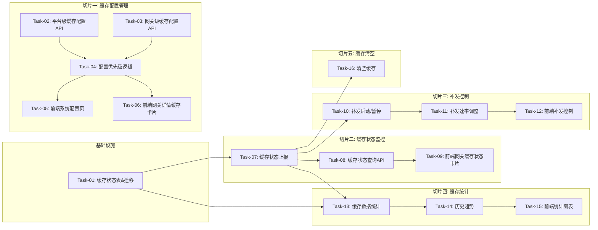

# 断网数据缓存 — 开发任务计划

## 1. 任务概览

**总任务数**：16 个
**预计总工时**：约 900 分钟（约 15 小时）
**开发方法**：TDD — 每个任务按 RED → GREEN → REFACTOR 循环执行

**关键标注**：
- 🔒 阻塞任务：被多个任务依赖，建议优先完成
- ⚠️ 风险任务：技术难度高，可能需要额外时间

### 依赖关系图

### 可并行任务组

| 并行组 | 任务 | 说明 |
|--------|------|------|
| A | Task-05, Task-06 | 系统配置页和网关详情卡片独立开发 |
| B | Task-09, Task-12 | 缓存状态卡片和补发控制独立 |

---

## 2. 开发任务

### 基础设施

**阶段完成标准**：GatewayCacheStatus 表结构就绪，记录每个网关的缓存状态。

---

#### Task-01: 缓存状态表 & 迁移 🔒

**通俗解释**：建一张表存每个网关的缓存状态：有没有在缓存、缓存了多少条、补发到哪里了等等。

**做什么**：
1. GatewayCacheStatus 表：
   - gatewayId（主键，关联 Gateway）
   - cachingEnabled（是否启用缓存，来自配置优先级计算）
   - isCaching（当前是否在缓存中：true=断网缓存中，false=正常或补发中）
   - cacheCount（当前缓存条数）
   - cacheSizeBytes（缓存大小，字节）
   - replayCount（已补发条数）
   - replayRate（补发速率条/秒）
   - replayStatus（IDLE/REPLAYING/PAUSED/COMPLETED）
   - firstCachedAt（最早缓存时间）
   - latestCachedAt（最新缓存时间）
   - replayStartedAt（补发开始时间）
   - replayFinishedAt（补发完成时间）
2. gatewayId 唯一索引
3. 和 Gateway 表一对一关系
4. 生成 migration 脚本

**涉及文件**：
- `backend/prisma/schema.prisma`
- `backend/prisma/migrations/`

**参考**：技术方案 第3章 → AC-002, AC-003

**依赖**：无

**预估工时**：60 分钟

**验证标准**：
- [ ] prisma migrate dev 执行成功
- [ ] GatewayCacheStatus 表存在
- [ ] gatewayId 是唯一的
- [ ] replayStatus 是枚举（IDLE/REPLAYING/PAUSED/COMPLETED）
- [ ] 可以插入一条缓存状态记录
- [ ] 和 Gateway 表关联正确

---

### 切片一：缓存配置管理

**阶段完成标准**：平台级和网关级缓存配置可以设置，优先级正确，下发到网关生效。

---

#### Task-02: 平台级缓存配置 API

**通俗解释**：平台设置默认的缓存开关、保存期限、补发速率，所有没单独配置的网关都用这个。

**做什么**：
1. 复用 PlatformConfig 表（边缘网关模块已建）
2. getCacheConfig 接口：获取当前平台缓存配置
3. updateCacheConfig 接口：更新平台缓存配置
4. 配置项：cacheEnabled（默认 false）、cacheRetentionDays（默认 15）、cacheReplayRate（默认 100）
5. 更新后推送到所有在线网关（MQTT，先 Mock）
6. 参数校验：补发速率 1-500，保存期限 1-365

**涉及文件**：
- `backend/src/modules/system-config/system-config.service.ts`
- `backend/src/modules/system-config/system-config.controller.ts`

**参考**：技术方案 4章 → AC-001

**依赖**：Task-01（PlatformConfig 已在边缘网关模块建立，这里扩展缓存配置）

**预估工时**：30 分钟

**验证标准**：
- [ ] GET /api/platform-config/cache → 返回缓存三项配置
- [ ] PUT 更新后 → 再次 GET 返回新值
- [ ] 补发速率 0 → 400
- [ ] 补发速率 501 → 400
- [ ] 保存期限 0 → 400
- [ ] 保存期限 366 → 400

---

#### Task-03: 网关级缓存配置 API

**通俗解释**：单个网关可以单独设置缓存配置，覆盖平台默认值。

**做什么**：
1. getGatewayCacheConfig：获取某个网关的缓存配置
2. updateGatewayCacheConfig：更新网关缓存配置
3. 配置项：cacheEnabled、cacheRetentionDays、cacheReplayRate
4. 每个配置可以单独设为 null 表示使用平台默认
5. 更新后推送到对应网关（MQTT，Mock）
6. 网关不存在返回 404

**涉及文件**：
- `backend/src/modules/gateway/gateway.service.ts`
- `backend/src/modules/gateway/gateway.controller.ts`

**参考**：技术方案 4章 → AC-002

**依赖**：Task-01

**预估工时**：45 分钟

**验证标准**：
- [ ] GET /api/gateways/:id/cache-config → 返回网关缓存配置
- [ ] PUT 更新某项配置 → 数据库对应字段更新
- [ ] 设为 null → 表示使用平台默认
- [ ] 网关不存在 → 404
- [ ] 补发速率范围校验生效

---

#### Task-04: 配置优先级计算逻辑 🔒

**通俗解释**：网关自己设了就用网关的，没设就用平台的，每项独立计算。

**做什么**：
1. getEffectiveCacheConfig 函数
2. 输入 gatewayId
3. 返回每项的：effectiveValue、source（platform/gateway）、platformValue、gatewayValue
4. 三项配置独立计算：开关、保存期限、补发速率
5. 逻辑：gatewayValue !== null 用 gatewayValue，否则用 platformValue
6. 单元测试覆盖各种组合

**涉及文件**：
- `backend/src/modules/gateway/gateway.service.ts`

**参考**：技术方案 5.1节 → AC-002

**依赖**：Task-02, Task-03

**预估工时**：45 分钟

**验证标准**：
- [ ] 网关 cacheEnabled = true, 平台 = false → effective = true, source = gateway
- [ ] 网关 cacheEnabled = null, 平台 = false → effective = false, source = platform
- [ ] 网关补发速率 = 200, 平台 = 100 → effective = 200, source = gateway
- [ ] 网关保存期限 = null, 平台 = 15 → effective = 15, source = platform
- [ ] 三项独立计算，互不影响

---

#### Task-05: 前端系统配置页（断网缓存）

**通俗解释**：系统设置里的断网缓存页面，能设置全局默认的三项配置。

**做什么**：
1. 系统配置 → 断网缓存页面
2. 缓存开关（Switch）
3. 缓存保存期限（数字输入，单位天，1-365）
4. 缓存补发速率（数字输入，单位条/秒，1-500）
5. 保存按钮
6. 保存成功提示
7. 页面加载读取当前配置

**涉及文件**：
- `frontend/src/pages/system-config/CacheConfig.tsx`
- `frontend/src/stores/systemConfig.store.ts`

**参考**：技术方案 → AC-001

**依赖**：Task-02

**预估工时**：45 分钟

**验证标准**：
- [ ] 页面加载后显示当前平台配置
- [ ] 切换开关 → 保存后生效
- [ ] 改保存期限 → 保存后生效
- [ ] 改补发速率 → 保存后生效
- [ ] 输入超出范围 → 保存时报错
- [ ] 保存成功 Toast 提示

---

#### Task-06: 前端网关详情页缓存配置卡片

**通俗解释**：网关详情页有个缓存配置卡片，能看到生效值和来源，还能单独设置网关级配置。

**做什么**：
1. 缓存配置卡片（在网关详情页）
2. 三项配置：开关、保存期限、补发速率
3. 每项显示：生效值 + 来源标签（平台默认/网关自定义）
4. 编辑按钮 → 展开编辑模式
5. 编辑模式：每项可以切换"使用平台默认"或"自定义"
6. 自定义时显示输入框
7. 保存按钮 → 保存后刷新显示

**涉及文件**：
- `frontend/src/pages/gateway/Detail.tsx`
- `frontend/src/pages/gateway/components/CacheConfigCard.tsx`

**参考**：技术方案 → AC-002

**依赖**：Task-04

**预估工时**：75 分钟

**验证标准**：
- [ ] 卡片显示三项配置的生效值和来源
- [ ] 来源标签颜色区分：平台默认=灰色，网关自定义=蓝色
- [ ] 点编辑 → 进入编辑模式
- [ ] 切换为自定义 → 输入框可编辑
- [ ] 切回平台默认 → 值变回平台的
- [ ] 保存后 → 生效值和来源更新

---

### 切片二：缓存状态监控

**阶段完成标准**：网关详情页能看到实时缓存状态：是否在缓存、缓存条数、缓存大小、补发进度。

---

#### Task-07: 缓存状态上报处理 🔒

**通俗解释**：网关通过 MQTT 上报缓存状态（开始缓存、缓存进度、补发进度等），平台接收并更新状态表。

**做什么**：
1. 处理缓存状态上报消息（MQTT 订阅）
2. 消息类型：
   - cache_started：开始缓存（断网了）
   - cache_progress：缓存进度（周期上报，比如每 30 秒）
   - cache_stopped：缓存结束（联网了，开始补发）
   - replay_started：开始补发
   - replay_progress：补发进度
   - replay_paused：补发暂停
   - replay_resumed：补发恢复
   - replay_completed：补发完成
3. 更新 GatewayCacheStatus 表对应字段
4. 状态变化时触发 SSE 推送（Mock）
5. 更新网关状态（断网时网关状态可能还是 ONLINE，因为缓存中，这个看需求）

**涉及文件**：
- `backend/src/services/cache-status.service.ts`

**参考**：技术方案 5.2节 → AC-003, AC-004, AC-006

**依赖**：Task-01

**预估工时**：90 分钟

**验证标准**：
- [ ] 收到 cache_started 消息 → isCaching = true, replayStatus = IDLE
- [ ] 收到 cache_progress 消息 → cacheCount 和 cacheSizeBytes 更新
- [ ] 收到 cache_stopped 消息 → isCaching = false
- [ ] 收到 replay_started 消息 → replayStatus = REPLAYING
- [ ] 收到 replay_progress → replayCount 更新
- [ ] 收到 replay_completed → replayStatus = COMPLETED
- [ ] 收到 replay_paused → replayStatus = PAUSED
- [ ] 状态变化触发 SSE 事件

---

#### Task-08: 缓存状态查询 API

**通俗解释**：前端调接口获取某个网关当前的缓存状态。

**做什么**：
1. getCacheStatus 服务函数
2. 返回 GatewayCacheStatus 所有字段
3. 如果没有记录（新网关还没上报过），返回默认的初始状态
4. 返回值补充：
   - 缓存进度百分比（如果能估算总条数的话，先不算，就显示条数）
   - 补发进度百分比（如果有总条数的话）
5. 网关不存在返回 404

**涉及文件**：
- `backend/src/modules/gateway/gateway.service.ts`
- `backend/src/modules/gateway/gateway.controller.ts`

**参考**：技术方案 4章 → AC-003

**依赖**：Task-07

**预估工时**：30 分钟

**验证标准**：
- [ ] GET /api/gateways/:id/cache-status → 返回缓存状态
- [ ] 有数据的网关 → 返回数据库中的值
- [ ] 没数据的网关 → 返回初始状态（isCaching=false, cacheCount=0 等）
- [ ] 网关不存在 → 404
- [ ] 返回字段完整

---

#### Task-09: 前端网关缓存状态卡片

**通俗解释**：网关详情页有个缓存状态卡片，显示当前缓存状态和数据。

**做什么**：
1. 缓存状态卡片（在网关详情页）
2. 状态显示：
   - 正常（没有缓存）：灰色，显示"运行正常"
   - 缓存中：橙色，显示"断网缓存中"，动效
   - 补发中：蓝色，显示"补发中" + 进度条
   - 补发完成：绿色，显示"补发完成"
3. 数据显示：缓存条数、缓存大小、已补发条数
4. 时间显示：最早缓存时间、最新缓存时间
5. SSE 实时更新（先轮询也行，后面接 SSE）
6. 空状态（还没上报过数据）

**涉及文件**：
- `frontend/src/pages/gateway/Detail.tsx`
- `frontend/src/pages/gateway/components/CacheStatusCard.tsx`

**参考**：技术方案 → AC-003, AC-004

**依赖**：Task-08, Task-06（同页面）

**预估工时**：90 分钟

**验证标准**：
- [ ] 正常状态 → 灰色卡片，显示"运行正常"
- [ ] 缓存中 → 橙色卡片，显示缓存条数，有动效
- [ ] 补发中 → 蓝色卡片，显示补发进度条
- [ ] 补发完成 → 绿色卡片
- [ ] 显示缓存条数和大小
- [ ] 数据定期刷新（轮询或 SSE）

---

### 切片三：补发控制

**阶段完成标准**：可以远程控制补发的启动、暂停、调整速率。

---

#### Task-10: 补发启动 / 暂停 / 恢复

**通俗解释**：平台可以发命令让网关开始补发、暂停补发、恢复补发。

**做什么**：
1. startReplay：启动补发
2. pauseReplay：暂停补发
3. resumeReplay：恢复补发
4. 通过 MQTT 下发命令到网关（Mock，假设网关会执行）
5. 命令下发后更新本地状态预期
6. 等待网关上报状态确认（乐观更新）
7. 网关不在线返回错误

**涉及文件**：
- `backend/src/services/cache-control.service.ts`
- `backend/src/modules/gateway/gateway.controller.ts`

**参考**：技术方案 5.3节 → AC-005

**依赖**：Task-07

**预估工时**：60 分钟

**验证标准**：
- [ ] 调用 startReplay → 下发 MQTT 命令（Mock 验证调用）
- [ ] 调用 pauseReplay → 下发暂停命令
- [ ] 调用 resumeReplay → 下发恢复命令
- [ ] 网关离线 → 返回错误"网关不在线"
- [ ] 补发已完成时调用 start → 返回错误
- [ ] 没有缓存数据时调用 start → 返回错误

---

#### Task-11: 补发速率动态调整

**通俗解释**：补发过程中可以随时调快或调慢补发速率，立即生效。

**做什么**：
1. setReplayRate 服务函数
2. 参数：gatewayId、rate（1-500 条/秒）
3. 通过 MQTT 下发速率调整命令
4. 更新 GatewayCacheStatus 的 replayRate
5. 同时更新网关配置（如果是临时调整还是永久？：这里调整的是当前补发速率，不影响配置）
6. 速率范围校验 1-500

**涉及文件**：
- `backend/src/services/cache-control.service.ts`
- `backend/src/modules/gateway/gateway.controller.ts`

**参考**：技术方案 5.3节 → AC-006

**依赖**：Task-10

**预估工时**：45 分钟

**验证标准**：
- [ ] 调用 setReplayRate(gatewayId, 200) → 下发命令，本地状态更新
- [ ] 速率 0 → 返回 400
- [ ] 速率 501 → 返回 400
- [ ] 网关不在线 → 返回错误
- [ ] 补发进行中调整 → 立即生效
- [ ] 补发没开始也能设置（影响下一次补发）

---

#### Task-12: 前端补发控制面板

**通俗解释**：缓存状态卡片上有补发控制按钮，可以启动、暂停、调整速率。

**做什么**：
1. 缓存状态卡片底部增加控制区域
2. 按钮：
   - 缓存中：不显示补发控制（还没开始补发）
   - 补发中：显示"暂停"按钮 + 速率调整
   - 已暂停：显示"恢复"按钮 + 速率调整
   - 补发完成：显示"重新补发"按钮
3. 速率调整：滑块或数字输入，1-500
4. 操作二次确认（启动/暂停/清空）
5. 操作成功提示
6. 操作失败提示

**涉及文件**：
- `frontend/src/pages/gateway/components/CacheStatusCard.tsx`
- `frontend/src/pages/gateway/components/ReplayControl.tsx`

**参考**：技术方案 → AC-005, AC-006

**依赖**：Task-10, Task-11, Task-09

**预估工时**：75 分钟

**验证标准**：
- [ ] 补发中状态 → 显示暂停按钮和速率调整
- [ ] 点暂停 → 确认后状态变暂停
- [ ] 暂停状态 → 显示恢复按钮
- [ ] 拖动速率滑块 → 速率变化
- [ ] 操作成功有提示
- [ ] 网关离线时按钮禁用 + 提示

---

### 切片四：缓存统计 & 历史

**阶段完成标准**：可以查看缓存数据的统计信息和历史趋势。

---

#### Task-13: 缓存数据统计

**通俗解释**：统计某个网关总共缓存了多少条数据、补发了多少、成功率多少。

**做什么**：
1. getCacheStats 服务函数
2. 返回统计数据：
   - 今日缓存次数
   - 今日缓存总条数
   - 今日补发总条数
   - 平均缓存时长
   - 最大缓存条数
3. 统计维度：今日、近 7 天、近 30 天
4. 数据来源：GatewayCacheStatus 的历史记录（需要建历史表吗？简单起见先用状态表的字段，后面再补历史）
5. 先用当前状态 + 简单统计，后续可以优化

**涉及文件**：
- `backend/src/modules/gateway/gateway.service.ts`
- （如需历史表则加 migration）

**参考**：技术方案 4章 → AC-007

**依赖**：Task-07

**预估工时**：60 分钟

**验证标准**：
- [ ] GET /api/gateways/:id/cache-stats → 返回统计数据
- [ ] 包含今日缓存次数、条数等
- [ ] 没有数据的网关返回 0 值
- [ ] 网关不存在 → 404
- [ ] 数据类型正确（数字）

---

#### Task-14: 缓存历史趋势（时序数据）

**通俗解释**：查看最近一段时间的缓存条数变化趋势，画成折线图。

**做什么**：
1. 利用 GatewayPerformance 类似的思路，但存缓存状态数据
2. 或者用现有的状态表，定时采样存历史
3. 简单方案：每次缓存状态变化时，顺便存一条历史记录到 GatewayCacheHistory 表
4. GatewayCacheHistory 表：id、gatewayId、cacheCount、replayCount、status、timestamp
5. 查询接口：按时间范围返回历史数据点
6. 用 TimescaleDB （可选，先用普通表）
7. 保留 30 天

**涉及文件**：
- `backend/prisma/schema.prisma` （加表）
- `backend/src/modules/gateway/gateway.service.ts`

**参考**：技术方案 4章 → AC-007

**依赖**：Task-13

**预估工时**：60 分钟

**验证标准**：
- [ ] GatewayCacheHistory 表存在
- [ ] 状态变化时自动写入历史记录
- [ ] 查询接口返回时间序列数据
- [ ] 时间范围过滤生效
- [ ] 按时间倒序或正序

---

#### Task-15: 前端统计图表

**通俗解释**：缓存状态卡片下面有个统计区域，显示统计数字和趋势图。

**做什么**：
1. 统计数字卡片：今日缓存次数、今日缓存条数、平均缓存时长
2. 趋势图：缓存条数随时间变化（折线图）
3. 时间范围切换：今日/近7天/近30天
4. 空状态
5. 加载状态
6. 图表库用 recharts 或类似

**涉及文件**：
- `frontend/src/pages/gateway/Detail.tsx`
- `frontend/src/pages/gateway/components/CacheStatsCard.tsx`

**参考**：技术方案 → AC-007

**依赖**：Task-13, Task-14

**预估工时**：75 分钟

**验证标准**：
- [ ] 统计数字显示正确
- [ ] 趋势图能渲染
- [ ] 切换时间范围图表更新
- [ ] 没有数据显示空状态
- [ ] 加载中有 loading 效果

---

### 切片五：缓存清空

**阶段完成标准**：可以手动清空网关的缓存数据。

---

#### Task-16: 清空缓存 & 前端操作

**通俗解释**：不想补发了，可以一键清空缓存数据，丢了就丢了。

**做什么**：
1. clearCache 服务函数
2. 通过 MQTT 下发清空命令
3. 清空后重置本地状态（cacheCount=0, cacheSize=0, isCaching=false 等）
4. 前端：补发控制区域增加"清空缓存"按钮
5. 危险操作：红色按钮 + 二次确认弹窗
6. 确认提示："清空后缓存数据将永久丢失，不可恢复，确定继续吗？"
7. 清空成功提示

**涉及文件**：
- `backend/src/services/cache-control.service.ts`
- `backend/src/modules/gateway/gateway.controller.ts`
- `frontend/src/pages/gateway/components/CacheStatusCard.tsx`

**参考**：技术方案 5.3节 → AC-008

**依赖**：Task-12

**预估工时**：45 分钟

**验证标准**：
- [ ] 调用 clearCache → 下发清空命令，本地状态重置
- [ ] 前端有清空缓存按钮（红色）
- [ ] 点击弹出二次确认
- [ ] 确认后执行清空
- [ ] 成功后 Toast 提示
- [ ] 网关离线时按钮禁用

---

## 3. AC 覆盖总表

| AC 编号 | 验收标准概述 | 承接任务 | 验证方式 |
|---------|-------------|---------|---------|
| AC-001 | 平台级缓存配置 | Task-02, Task-05 | 平台配置可读写，保存生效 |
| AC-002 | 网关级缓存配置 & 优先级 | Task-03, Task-04, Task-06 | 网关级覆盖平台级，每项独立 |
| AC-003 | 缓存状态监控 | Task-07, Task-08, Task-09 | 状态实时更新，前端展示正确 |
| AC-004 | 缓存数据量监控 | Task-07, Task-09 | 缓存条数和大小实时显示 |
| AC-005 | 补发启停控制 | Task-10, Task-12 | 启动/暂停/恢复补发正常 |
| AC-006 | 补发速率调整 | Task-11, Task-12 | 速率可动态调整 1-500 |
| AC-007 | 缓存统计 & 趋势 | Task-13, Task-14, Task-15 | 统计数据和趋势图正确 |
| AC-008 | 清空缓存 | Task-16 | 清空缓存功能正常，二次确认 |

---

## 4. 完成定义

- [ ] 所有 16 个任务的验证标准（测试用例）全部通过
- [ ] AC 覆盖总表中所有 AC 的验证方式已执行并通过
- [ ] 数据库 migration 脚本在测试环境验证通过
- [ ] 平台级和网关级缓存配置优先级逻辑验证通过
- [ ] 缓存状态上报和展示联调通过
- [ ] 补发控制（启动/暂停/速率/清空）功能验证通过
- [ ] 缓存统计和趋势图功能验证通过
- [ ] 与边缘网关模块的配置管理联调通过
