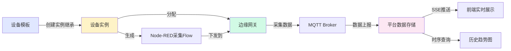
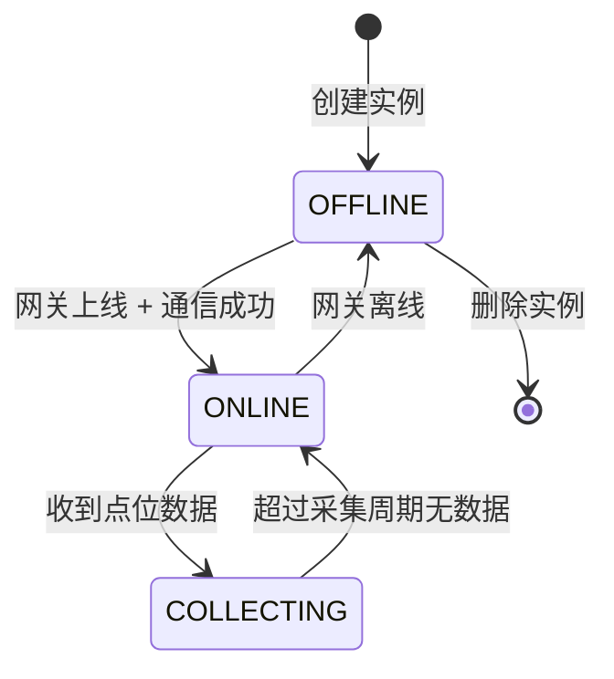

# 设备实例管理 — 技术设计文档

## 1. 设计概要

**功能描述**：管理基于设备模板创建的实际设备实例，支持通信参数配置、网关分配、点位管理（模板级继承+设备级自定义）、配置下发、同步模板版本、实时数据查看和历史数据查询。

**影响范围**：
- 后端：`device-instance` 模块、`device-data` 模块、`sync` 模块（配置下发）
- 前端：`device-instance/` 页面、`device-instance.store.ts`、`useDeviceSSE.ts`
- 数据库：DeviceInstance 表扩展、InstancePoint 新增表、DeviceDataPoint 表优化（TimescaleDB）、SyncRecord 关联

**技术难点**：
- 模板级点位 + 设备级点位的混合管理与版本同步
- 同步模板版本时保留设备级点位、覆盖模板级修改
- 实例三态（在线/离线/采集中）的判定逻辑
- 历史时序数据的高效存储与查询

**外部依赖**：
- 设备模型管理模块（模板、点位定义）
- 边缘网关管理模块（网关分配、下发配置）
- 配置下发与同步模块（Flow 生成、下发执行）
- MQTT Broker（数据上报）
- TimescaleDB（历史时序数据）

---

## 2. 架构概览

设备实例是系统的核心业务实体，向上承接用户的设备管理操作，向下通过网关对接真实设备。

**核心数据流向**：



**实例状态流转**：



---

## 3. 数据库设计

### 新增表

#### `InstancePoint`

**用途**：存储设备实例的点位配置，分离模板级和设备级点位，支持模板版本同步。

| 字段名 | 类型 | 约束 | 说明 |
|--------|------|------|------|
| id | TEXT | PK, DEFAULT cuid() | 主键 |
| instance_id | TEXT | NOT NULL, FK → DeviceInstance.id | 实例ID |
| point_type | TEXT | NOT NULL | 点位类型：MODEL_LEVEL（模板级）/ DEVICE_LEVEL（设备级） |
| point_id | TEXT | NOT NULL | 点位业务ID |
| model_point_id | TEXT | | 对应模板点位ID（模板级点位必填，用于同步追踪） |
| name | TEXT | NOT NULL | 点位名称 |
| description | TEXT | | 描述 |
| data_type | TEXT | NOT NULL | 数据类型 |
| access_mode | TEXT | NOT NULL | 读写权限：READ_ONLY/READ_WRITE |
| unit | TEXT | | 单位 |
| multiplier | DOUBLE PRECISION | DEFAULT 1 | 乘系数 |
| offset_value | DOUBLE PRECISION | DEFAULT 0 | 偏移量 |
| precision | INT | | 精度 |
| frequency | INT | DEFAULT 1000 | 采集频率（ms） |
| timeout | INT | DEFAULT 3000 | 采集超时（ms） |
| protocol_config | JSONB | NOT NULL DEFAULT '{}'::jsonb | 协议特殊字段 |
| is_overridden | BOOLEAN | DEFAULT false | 是否已被修改（模板级点位用） |
| sort_order | INT | DEFAULT 0 | 排序序号 |
| created_at | TIMESTAMPTZ | DEFAULT now() | 创建时间 |
| updated_at | TIMESTAMPTZ | DEFAULT now() | 更新时间 |

**索引**：
- `UNIQUE(instance_id, point_id)` — 实例内点位ID唯一
- `INDEX idx_instance_point_instance_id (instance_id)` — 查询某实例所有点位
- `INDEX idx_instance_point_type (instance_id, point_type)` — 按类型筛选

### 修改现有表

#### `DeviceInstance` 表

**变更内容**：扩展通信参数、状态、模板版本等字段。

```sql
-- 通信参数（协议连接配置）
ALTER TABLE "DeviceInstance" ADD COLUMN IF NOT EXISTS "commConfig" JSONB DEFAULT '{}'::jsonb;
-- 设备ID（业务唯一）
ALTER TABLE "DeviceInstance" ADD COLUMN IF NOT EXISTS "deviceId" TEXT;
-- 模板版本号
ALTER TABLE "DeviceInstance" ADD COLUMN IF NOT EXISTS "modelVersion" INT DEFAULT 1;
-- 最后下发版本
ALTER TABLE "DeviceInstance" ADD COLUMN IF NOT EXISTS "deployedVersion" INT;
-- 采集状态
ALTER TABLE "DeviceInstance" ADD COLUMN IF NOT EXISTS "collectStatus" TEXT DEFAULT 'STOPPED';
-- 最后数据时间
ALTER TABLE "DeviceInstance" ADD COLUMN IF NOT EXISTS "lastDataTime" TIMESTAMPTZ;

-- 索引
CREATE UNIQUE INDEX IF NOT EXISTS idx_device_instance_device_id ON "DeviceInstance" ("deviceId");
CREATE INDEX IF NOT EXISTS idx_device_instance_gateway_id ON "DeviceInstance" ("gatewayId");
CREATE INDEX IF NOT EXISTS idx_device_instance_model_id ON "DeviceInstance" ("modelId");
CREATE INDEX IF NOT EXISTS idx_device_instance_status ON "DeviceInstance" (status);
```

**数据迁移**：
- 原有 `config` 字段中的连接配置迁移到 `commConfig`
- 原有 `config.points` 数据迁移到 `InstancePoint` 表

#### `DeviceDataPoint` 表

**变更内容**：改造为 TimescaleDB hypertable，优化时序查询性能。

```sql
-- 添加质量戳字段（如不存在）
ALTER TABLE "DeviceDataPoint" ADD COLUMN IF NOT EXISTS quality INT DEFAULT 0;

-- 转换为 TimescaleDB hypertable（需要先创建扩展）
-- SELECT create_hypertable('DeviceDataPoint', 'timestamp', chunk_time_interval => INTERVAL '1 hour');
-- 注意：此操作需在迁移脚本中执行，且表需要是空的或已有数据需重新导入
```

**索引**：
- `INDEX idx_device_data_point_instance_point (deviceInstanceId, pointCode, timestamp DESC)` — 查询某实例某点位的历史数据
- TimescaleDB 自动分区管理

---

## 4. API 设计

### `GET /api/device-instances`

**描述**：获取设备实例列表 → AC-012、AC-013

**鉴权**：需要登录

**Query 参数**：
- `name`：名称模糊搜索
- `modelId`：按模板筛选
- `gatewayId`：按网关筛选
- `status`：按状态筛选（ONLINE/OFFLINE/COLLECTING）
- `page`：页码
- `pageSize`：每页数量

**Response（成功）**：
```json
{
  "success": true,
  "data": {
    "list": [
      {
        "id": "cuid_xxx",
        "deviceId": "dev_001",
        "name": "1号锅炉",
        "modelName": "温控设备",
        "gatewayName": "生产车间网关-01",
        "status": "COLLECTING",
        "lastDataTime": "2024-03-15T10:00:00Z",
        "updatedAt": "2024-03-15T10:00:00Z"
      }
    ],
    "total": 100,
    "page": 1,
    "pageSize": 20
  }
}
```

### `POST /api/device-instances`

**描述**：单个创建设备实例 → AC-001

**鉴权**：需要登录

**Request**：
```json
{
  "deviceId": "dev_001",
  "name": "1号锅炉",
  "modelId": "cuid_model_xxx",
  "gatewayId": "cuid_gateway_xxx",
  "commConfig": {
    "ip": "192.168.1.200",
    "port": 502,
    "slaveAddress": 1
  }
}
```

**Response（成功）**：
```json
{
  "success": true,
  "data": {
    "id": "cuid_xxx",
    "deviceId": "dev_001",
    "name": "1号锅炉",
    "modelVersion": 3,
    "pointCount": 6
  }
}
```

**说明**：创建实例时自动继承模板当前版本的所有点位（MODEL_LEVEL）。

### `POST /api/device-instances/batch-import`

**描述**：批量导入设备实例（Excel） → AC-002

**鉴权**：需要登录

**Request**：multipart/form-data，字段名 `file`

**Response（成功）**：
```json
{
  "success": true,
  "data": {
    "successCount": 50,
    "failCount": 2,
    "errors": [
      { "row": 3, "deviceId": "dev_003", "reason": "模板ID不存在" },
      { "row": 7, "deviceId": "dev_007", "reason": "网关ID不存在" }
    ]
  }
}
```

**异常响应**：

| 场景 | 状态码 | 响应 | 对应 AC |
|------|--------|------|---------|
| 设备ID重复 | 400 | 列出重复ID | AC-022 |
| 模板ID不存在 | 400 | 列出不存在的模板ID | AC-023 |
| 网关ID不存在 | 400 | 列出不存在的网关ID | AC-024 |

### `GET /api/device-instances/:id`

**描述**：获取实例详情 → AC-014

**鉴权**：需要登录

**Response（成功）**：
```json
{
  "success": true,
  "data": {
    "id": "cuid_xxx",
    "deviceId": "dev_001",
    "name": "1号锅炉",
    "modelId": "cuid_model_xxx",
    "modelName": "温控设备",
    "modelVersion": 3,
    "deployedVersion": 2,
    "gatewayId": "cuid_gateway_xxx",
    "gatewayName": "生产车间网关-01",
    "gatewayStatus": "ONLINE",
    "status": "COLLECTING",
    "collectStatus": "RUNNING",
    "commConfig": {
      "ip": "192.168.1.200",
      "port": 502,
      "slaveAddress": 1
    },
    "lastDataTime": "2024-03-15T10:00:00Z",
    "pointCount": 8,
    "createdAt": "2024-03-01T08:00:00Z",
    "updatedAt": "2024-03-15T10:00:00Z"
  }
}
```

### `PUT /api/device-instances/:id`

**描述**：更新实例基本信息和通信参数 → AC-003

**鉴权**：需要登录

**Request**：
```json
{
  "name": "新的设备名称",
  "commConfig": {
    "ip": "192.168.1.201",
    "port": 503,
    "slaveAddress": 2
  }
}
```

**Response（成功）**：
```json
{
  "success": true,
  "data": { "updated": true }
}
```

### `DELETE /api/device-instances/:id`

**描述**：删除设备实例 → AC-011

**鉴权**：需要登录

**Response（成功）**：
```json
{
  "success": true,
  "data": { "deleted": true }
}
```

**异常响应**：

| 场景 | 状态码 | 响应 | 对应 AC |
|------|--------|------|---------|
| 网关离线 | 400 | `{ code: 'GATEWAY_OFFLINE', message: '网关离线，无法删除配置' }` | AC-027 |

### `POST /api/device-instances/:id/change-gateway`

**描述**：变更网关 → AC-009

**鉴权**：需要登录

**Request**：
```json
{
  "gatewayId": "cuid_new_gateway_xxx"
}
```

**Response（成功）**：
```json
{
  "success": true,
  "data": { "changed": true, "needRedeploy": true }
}
```

### `POST /api/device-instances/batch-change-gateway`

**描述**：批量变更网关 → AC-010

**鉴权**：需要登录

**Request**：
```json
{
  "instanceIds": ["cuid_1", "cuid_2", "cuid_3"],
  "gatewayId": "cuid_gateway_xxx"
}
```

### `GET /api/device-instances/:id/points`

**描述**：获取实例点位列表（含实时值） → AC-006、AC-007、AC-015

**鉴权**：需要登录

**Response（成功）**：
```json
{
  "success": true,
  "data": {
    "modelLevelPoints": [
      {
        "id": "cuid_point_xxx",
        "pointId": "temp_001",
        "name": "温度值",
        "pointType": "MODEL_LEVEL",
        "isOverridden": false,
        "dataType": "FLOAT32",
        "accessMode": "READ_ONLY",
        "unit": "°C",
        "currentValue": 25.6,
        "quality": 0,
        "lastUpdateTime": "2024-03-15T10:00:00Z"
      }
    ],
    "deviceLevelPoints": [
      {
        "id": "cuid_point_yyy",
        "pointId": "custom_001",
        "name": "自定义点位",
        "pointType": "DEVICE_LEVEL",
        "dataType": "INT16",
        "accessMode": "READ_WRITE",
        "currentValue": 100,
        "quality": 0,
        "lastUpdateTime": "2024-03-15T10:00:00Z"
      }
    ]
  }
}
```

### `PUT /api/device-instances/:id/points/:pointId`

**描述**：修改继承点位（模板级点位覆盖） → AC-006

**鉴权**：需要登录

**Request**：可修改的字段：name、description、unit、multiplier、offsetValue、precision、frequency、timeout、protocolConfig

**Response（成功）**：
```json
{
  "success": true,
  "data": { "updated": true, "isOverridden": true }
}
```

**说明**：修改模板级点位后标记 `isOverridden = true`，同步模板版本时会被覆盖。

### `POST /api/device-instances/:id/points`

**描述**：新增设备级点位 → AC-007

**鉴权**：需要登录

**Request**：同点位字段，pointType 固定为 DEVICE_LEVEL

**Response（成功）**：
```json
{
  "success": true,
  "data": { "id": "cuid_point_xxx", "pointId": "custom_001" }
}
```

### `DELETE /api/device-instances/:id/points/:pointId`

**描述**：删除设备级点位 → AC-007

**鉴权**：需要登录

**Response（成功）**：
```json
{
  "success": true,
  "data": { "deleted": true }
}
```

**说明**：模板级点位不可删除，只能修改覆盖。设备级点位可删除。

### `POST /api/device-instances/:id/sync-model`

**描述**：同步模板最新版本 → AC-008、AC-025、AC-026

**鉴权**：需要登录

**Response（成功）**：
```json
{
  "success": true,
  "data": {
    "oldVersion": 2,
    "newVersion": 3,
    "addedPoints": 1,
    "updatedPoints": 2,
    "removedPoints": 0,
    "deviceLevelPointsKept": 2
  }
}
```

**同步规则**：
- 模板级点位：用模板最新版本全量覆盖（包括用户修改过的，isOverridden 重置为 false）
- 设备级点位：全部保留不变
- 新版本模板中不存在的点位：删除
- 新版本模板中新增的点位：新增

### `POST /api/device-instances/:id/deploy`

**描述**：下发配置到网关 → AC-010

**鉴权**：需要登录

**Response（成功）**：
```json
{
  "success": true,
  "data": {
    "syncRecordId": "cuid_sync_xxx",
    "status": "PENDING"
  }
}
```

**异常响应**：

| 场景 | 状态码 | 响应 | 对应 AC |
|------|--------|------|---------|
| 网关离线 | 400 | `{ code: 'GATEWAY_OFFLINE', message: '网关离线，下发失败' }` | AC-028 |

### `GET /api/device-instances/:id/data/latest`

**描述**：获取实时数据 → AC-015

**鉴权**：需要登录

**Response（成功）**：同点位列表的 currentValue 结构

### `GET /api/device-instances/:id/data/history`

**描述**：查询历史数据 → AC-020、AC-021

**鉴权**：需要登录

**Query 参数**：
- `pointIds`：点位ID列表（逗号分隔，支持多点位对比）
- `startTime`：开始时间
- `endTime`：结束时间
- `interval`：聚合间隔（raw/1m/5m/1h），默认 raw

**Response（成功）**：
```json
{
  "success": true,
  "data": {
    "timestamps": ["2024-03-15T10:00:00Z", "..."],
    "points": [
      {
        "pointId": "temp_001",
        "name": "温度值",
        "unit": "°C",
        "values": [25.6, 26.1, "..."]
      },
      {
        "pointId": "temp_002",
        "name": "湿度值",
        "unit": "%",
        "values": [62.3, 63.1, "..."]
      }
    ]
  }
}
```

### `GET /api/device-instances/:id/sync-history`

**描述**：获取下发历史 → AC-016

**鉴权**：需要登录

**Response（成功）**：
```json
{
  "success": true,
  "data": [
    {
      "id": "cuid_sync_xxx",
      "type": "UPDATE",
      "status": "SUCCESS",
      "gatewayName": "生产车间网关-01",
      "createdAt": "2024-03-15T10:00:00Z",
      "completedAt": "2024-03-15T10:00:05Z"
    }
  ]
}
```

---

## 5. 核心逻辑

### 5.1 实例状态判定 → AC-017、AC-018、AC-019

**触发条件**：收到设备数据上报、网关状态变化

**判定规则**：

| 状态 | 条件 |
|------|------|
| OFFLINE | 网关状态为 OFFLINE |
| ONLINE | 网关状态为 ONLINE，但超过 N 个采集周期无点位数据更新 |
| COLLECTING | 网关状态为 ONLINE，且最近有正常点位数据更新 |

**处理流程**：

1. 收到 MQTT 数据上报时：
   - 更新实例 lastDataTime
   - 如果当前状态不是 COLLECTING，改为 COLLECTING
   - 通过 SSE 推送状态变化

2. 定时任务（每分钟）检查：
   - 遍历 ONLINE/COLLECTING 状态的实例
   - 如果 lastDataTime 距今超过 3 个采集周期，状态降为 ONLINE
   - 网关离线的实例状态为 OFFLINE

### 5.2 同步模板版本 → AC-008、AC-025、AC-026

**触发条件**：用户点击"同步模板最新版本"

**处理流程**：

```
1. 获取模板当前最新版本的所有点位（PointModel）
2. 获取实例当前的所有点位（InstancePoint）
3. 分类处理：
   - 设备级点位（point_type = DEVICE_LEVEL）：全部保留，不做任何修改
   - 模板级点位（point_type = MODEL_LEVEL）：
     a. 新版本有，旧版本也有 → 用新版本覆盖（重置 is_overridden = false）
     b. 新版本有，旧版本没有 → 新增
     c. 新版本没有，旧版本有 → 删除
4. 更新实例的 modelVersion
5. 返回同步统计（新增/修改/删除数量）
```

**伪代码**：
```
function syncModelVersion(instanceId):
    instance = db.getInstance(instanceId)
    modelPoints = db.getModelPoints(instance.modelId, model.currentVersion)
    
    oldInstancePoints = db.getInstancePoints(instanceId)
    oldModelPoints = oldInstancePoints.filter(p => p.pointType == 'MODEL_LEVEL')
    devicePoints = oldInstancePoints.filter(p => p.pointType == 'DEVICE_LEVEL')
    
    // 构建新旧映射
    oldPointMap = { p.modelPointId: p for p in oldModelPoints }
    newPointMap = { p.id: p for p in modelPoints }
    
    added = 0, updated = 0, removed = 0
    
    tx = db.startTransaction()
    try:
        // 处理新增和更新
        for newPoint in modelPoints:
            if newPoint.id in oldPointMap:
                // 更新（覆盖）
                tx.updateInstancePoint(oldPointMap[newPoint.id].id, {
                    ...newPoint,
                    isOverridden: false
                })
                updated += 1
            else:
                // 新增
                tx.createInstancePoint({
                    instanceId,
                    pointType: 'MODEL_LEVEL',
                    modelPointId: newPoint.id,
                    ...newPoint
                })
                added += 1
        
        // 处理删除
        for oldPoint in oldModelPoints:
            if oldPoint.modelPointId not in newPointMap:
                tx.deleteInstancePoint(oldPoint.id)
                removed += 1
        
        // 更新版本号
        tx.updateInstance(instanceId, { modelVersion: model.currentVersion })
        
        tx.commit()
        
        return { added, updated, removed, deviceKept: devicePoints.length }
    catch:
        tx.rollback()
        throw
```

### 5.3 点位实时值获取 → AC-015

**触发条件**：用户打开实例详情页

**处理流程**：

1. 优先从 Redis 读取最新值（key: `device_data:latest:{instanceId}:{pointId}`）
2. Redis 没有则从 DeviceDataPoint 表查最新一条
3. 都没有则返回 null
4. 通过 SSE 订阅实时数据推送，新数据到达时更新前端

**Redis 缓存策略**：
- 每次收到 MQTT 数据上报时写入 Redis
- TTL: 10分钟（超过10分钟无更新的数据视为过期）

### 5.4 批量导入校验 → AC-002、AC-022、AC-023、AC-024

**触发条件**：上传 Excel 批量导入

**处理流程**：

1. 解析 Excel，读取所有行
2. 第一步校验：文件内部
   - 检查设备ID重复（文件内重复）
   - 检查必填字段是否缺失
3. 第二步校验：数据库验证
   - 批量查询模板ID是否存在
   - 批量查询网关ID是否存在
   - 批量查询设备ID是否已存在
4. 如有错误，返回错误详情（行号 + 原因）
5. 全部通过，批量创建（事务保证原子性）

---

## 6. 现有代码改动

| 模块 / 文件 | 改动内容 | 原因 | 对应 AC |
|-------------|---------|------|---------|
| `prisma/schema.prisma` | DeviceInstance 表扩展，新增 InstancePoint 表，DeviceDataPoint 改造 | 点位独立表存储，通信参数结构化 | AC-001、AC-006、AC-007 |
| `device-instance.service.ts` | 重写服务层，实例创建继承点位、同步模板版本、点位管理 | 对齐需求文档 | AC-001 ~ AC-011 |
| `device-instance.controller.ts` | 新增点位 CRUD、同步版本、批量导入、下发配置接口 | 新功能 API | AC-002、AC-007、AC-008 |
| `device-instance.dto.ts` | 重写 DTO，增加通信参数、点位字段校验 | 需求文档字段 | AC-003、AC-007 |
| `device-data.service.ts` | 优化历史数据查询，支持多点位对比、聚合查询 | AC-020、AC-021 |
| `frontend/pages/device-instance/` | 重构列表页、详情页、点位管理、实时数据、历史趋势图 | 对齐功能交互文档 | AC-012、AC-014、AC-020 |
| `frontend/stores/device-instance.store.ts` | 增加点位状态、实时数据、历史数据管理 | 新功能状态 | AC-015、AC-020 |

---

## 7. 技术决策

### 点位存储方案

**背景**：设备实例有模板级点位（继承自模板，可修改覆盖）和设备级点位（自定义），需要支持版本同步。

**选项**：
- A: JSON 字段存储（现有方案） — 简单但查询困难，无法按点位单独操作
- B: 独立 InstancePoint 表，point_type 区分级别 — 结构化、灵活、支持单独 CRUD
- C: 两张表（模板点位表 + 设备点位表） — 清晰但表多，查询需要 union

**结论**：选 B — 单表 + point_type 字段。一张表解决所有点位存储，point_type 区分模板级和设备级，model_point_id 追踪模板来源，is_overridden 标记是否被修改。查询和维护都简单。

### 历史数据存储

**背景**：点位历史数据写入频率高（取决于采集频率），查询多为时间范围，数据量大。

**选项**：
- A: PostgreSQL 普通表 + 索引 — 简单但数据量大后查询慢
- B: TimescaleDB hypertable — 自动分区、时序优化、保留策略
- C: 单独的时序数据库（InfluxDB） — 性能最好但运维复杂

**结论**：选 B — TimescaleDB。与网关性能指标共用同一个时序扩展，自动分块和保留策略，时间范围查询高效，Prisma 可通过原始查询访问。

### 同步版本策略

**背景**：模板有新版本时，实例可以同步升级。需要处理模板级点位覆盖和设备级点位保留。

**选项**：
- A: 全量替换模板级点位，设备级保留 — 简单直接，但用户对模板点位的修改会丢失
- B: 智能合并，保留用户修改 — 复杂，需要判断哪些字段被修改过，合并逻辑容易出错
- C: 同步前提示用户，选择是否保留修改 — 用户体验好但实现复杂

**结论**：选 A — 全量覆盖模板级点位，设备级保留。需求文档明确说"修改会被模板最新版本覆盖"（AC-026），逻辑清晰，用户预期明确。同步前提示用户"模板级点位的自定义修改将被覆盖，设备级点位保留"。

---

## 8. 安全与性能

**输入校验**：
- 所有 API 参数 zod 校验
- 通信参数按协议类型分别校验
- 点位字段校验同设备模型模块
- 批量导入逐行校验

**缓存策略**：
- 点位实时值 Redis 缓存（TTL 10分钟）
- 实例列表分页查询
- 历史数据时序查询走 TimescaleDB

**性能考量**：
- 批量导入使用事务，避免部分成功
- 历史数据查询支持聚合下采样，大数据量时返回聚合数据而非原始数据
- SSE 推送使用增量更新，不刷新整个列表

**数据一致性**：
- 同步模板版本使用事务，保证原子性
- 下发配置使用异步任务，避免阻塞请求
- 删除实例先删网关配置再删数据库记录

---

## 9. AC 覆盖总表

| AC 编号 | 验收标准概述 | 实现位置 |
|---------|-------------|---------|
| AC-001 | 单个创建设备实例 | API POST /api/device-instances + 自动继承点位 |
| AC-002 | 批量导入实例 | API POST /api/device-instances/batch-import + Excel 解析 |
| AC-003 | 配置通信参数 | PUT /api/device-instances/:id + commConfig 字段 |
| AC-004 | 分配网关 | 创建时指定 gatewayId + PUT 更新 |
| AC-005 | 批量分配网关 | POST /api/device-instances/batch-change-gateway |
| AC-006 | 修改继承点位 | PUT /api/device-instances/:id/points/:pointId + isOverridden |
| AC-007 | 新增设备级点位 | POST /api/device-instances/:id/points + pointType=DEVICE_LEVEL |
| AC-008 | 同步模板最新版本 | POST /api/device-instances/:id/sync-model |
| AC-009 | 变更网关 | POST /api/device-instances/:id/change-gateway |
| AC-010 | 下发配置 | POST /api/device-instances/:id/deploy + sync 模块 |
| AC-011 | 删除实例 | DELETE /api/device-instances/:id + 网关侧删除 |
| AC-012 | 查看实例列表 | GET /api/device-instances + 前端列表页 |
| AC-013 | 筛选实例 | GET /api/device-instances?modelId=&gatewayId=&status= |
| AC-014 | 查看实例详情 | GET /api/device-instances/:id + 前端详情页 |
| AC-015 | 实时值 SSE 推送 | device-data.service + SSE device_status_change |
| AC-016 | 下发历史展示 | GET /api/device-instances/:id/sync-history + SyncRecord 关联 |
| AC-017 | 实例在线状态 | 状态判定逻辑 + 网关在线 + 通信正常 |
| AC-018 | 实例离线状态 | 状态判定逻辑 + 网关离线 |
| AC-019 | 实例采集中状态 | 状态判定逻辑 + 最近有数据更新 |
| AC-020 | 查询点位历史数据 | GET /api/device-instances/:id/data/history + TimescaleDB |
| AC-021 | 查询多个点位历史 | 同上，支持 pointIds 参数多点位对比 |
| AC-022 | 批量导入重复ID | 导入校验逻辑 + 文件内重复检查 |
| AC-023 | 批量导入模板不存在 | 导入校验逻辑 + 模板ID批量查询 |
| AC-024 | 批量导入网关不存在 | 导入校验逻辑 + 网关ID批量查询 |
| AC-025 | 同步版本保留设备级点位 | syncModelVersion 服务函数 + pointType 过滤 |
| AC-026 | 同步版本覆盖修改 | syncModelVersion 服务函数 + 全量覆盖模板级 |
| AC-027 | 删除实例网关离线 | deleteDeviceInstance 校验网关状态 |
| AC-028 | 下发网关离线 | deployConfig 校验网关状态 |
| AC-029 | 一个实例一个网关 ← BR-001 | DeviceInstance 表单个 gateway_id 字段 |
| AC-030 | 点位归属判定 ← BR-002 | InstancePoint.point_type 字段 |
| AC-031 | 删除实例清理 ← BR-003 | 删除流程 + 网关侧 flow 删除 |
| AC-032 | 实时值展示 ← BR-004 | Redis 缓存 + SSE 推送 + 前端展示 |
| AC-033 | 历史数据查询 ← BR-005 | TimescaleDB + 历史查询 API + 趋势图 |

---

## 附录：变更记录

| 日期 | 变更内容 | 原因 |
|------|---------|------|
| 2026-06-30 | 初始版本 | 完成设备实例管理技术方案设计 |
