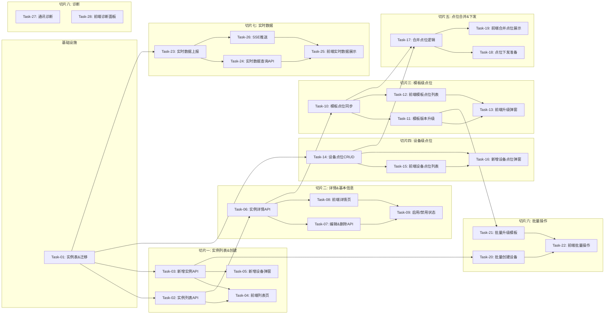

# 设备实例管理 — 开发任务计划

## 1. 任务概览

**总任务数**：28 个
**预计总工时**：约 1680 分钟（约 28 小时）
**开发方法**：TDD — 每个任务按 RED → GREEN → REFACTOR 循环执行

**关键标注**：
- 🔒 阻塞任务：被多个任务依赖，建议优先完成
- ⚠️ 风险任务：技术难度高，可能需要额外时间

### 依赖关系图

### 可并行任务组

| 并行组 | 任务 | 说明 |
|--------|------|------|
| A | Task-10, Task-14 | 模板点位和设备点位逻辑独立，可并行 |
| B | Task-20, Task-21 | 批量创建和批量升级逻辑独立 |
| C | Task-27, Task-24 | 诊断和实时数据查询独立 |

---

## 2. 开发任务

### 基础设施

**阶段完成标准**：DeviceInstance、DevicePoint 表结构就绪，实例与网关、模板的关联关系建立。

---

#### Task-01: 设备实例表结构 & 迁移 🔒

**通俗解释**：建设备实例表和设备级点位表，实例关联网关和模板，设备级点位是实例自己的点位。

**做什么**：
1. DeviceInstance 表：id、gatewayId、modelId、name、description、status（ONLINE/OFFLINE/DISABLED）、templateVersion、connectionConfig（JSON）、enabled
2. DevicePoint 表（设备级点位）：id、instanceId、name、tag、dataType、address、unit、description、config（JSON）、enabled、source
3. source 枚举：TEMPLATE（模板继承）、DEVICE（设备级自定义）— 注意：模板级点位不存这里，运行时合并
4. DeviceInstance 与 Gateway 多对一，与 DeviceModel 多对一
5. DevicePoint 与 DeviceInstance 多对一
6. 索引：gatewayId、modelId、instanceId
7. 生成 migration 脚本

**涉及文件**：
- `backend/prisma/schema.prisma`
- `backend/prisma/migrations/`

**参考**：技术方案 第3章 → AC-001, AC-003

**依赖**：无（依赖 Gateway 和 DeviceModel 表已存在）

**预估工时**：90 分钟

**验证标准**：
- [ ] prisma migrate dev 执行成功
- [ ] DeviceInstance 表存在，有 gatewayId 和 modelId 外键
- [ ] DevicePoint 表存在，有 instanceId 外键
- [ ] DevicePoint 有 source 字段（枚举：TEMPLATE/DEVICE）— 这里 DEVICE 才存数据库，TEMPLATE 运行时合并
- [ ] status 是枚举（ONLINE/OFFLINE/DISABLED）
- [ ] templateVersion 字段记录当前同步的模板版本
- [ ] connectionConfig 是 JSON 类型

---

### 切片一：实例列表 & 创建设备

**阶段完成标准**：用户可以看到设备实例列表，按网关/模板/状态筛选，点击新增设备弹出表单，选择网关和模板创建设备。

---

#### Task-02: 设备实例列表 API

**通俗解释**：前端调列表接口，能按网关、模板、状态筛选，返回分页数据。

**做什么**：
1. getDeviceInstances 服务函数
2. 筛选条件：gatewayId、modelId、status、name（模糊）
3. 分页：page、pageSize
4. 返回列表含：id、name、gatewayName、modelName、status、templateVersion、pointCount、lastDataTime
5. pointCount = 模板点位数 + 设备级点位数
6. 按创建时间倒序

**涉及文件**：
- `backend/src/modules/device-instance/device-instance.service.ts`
- `backend/src/modules/device-instance/device-instance.controller.ts`
- `backend/src/modules/device-instance/device-instance.dto.ts`

**参考**：技术方案 4章 → AC-002

**依赖**：Task-01

**预估工时**：45 分钟

**验证标准**：
- [ ] GET /api/device-instances → 返回 list + total
- [ ] ?gatewayId=xxx → 只返回该网关下的设备
- [ ] ?modelId=xxx → 只返回该模板的设备
- [ ] ?status=ONLINE → 只返回在线的
- [ ] 每条有 pointCount 正确（模板点位+设备点位）
- [ ] 按 createdAt 倒序

---

#### Task-03: 新增设备 API 🔒

**通俗解释**：选网关、选模板、填名称，创建设备实例，自动继承模板的版本和连接配置。

**做什么**：
1. createDeviceInstance 服务函数
2. 必填：gatewayId、modelId、name
3. 可选：description、enabled（默认 true）
4. 校验：网关存在、模板存在
5. 自动设置 templateVersion = 模板当前 version
6. 从模板复制 connectionConfig（协议连接配置）
7. status 初始为 OFFLINE（还没下发配置）
8. 返回新建设备实例

**涉及文件**：
- `backend/src/modules/device-instance/device-instance.service.ts`
- `backend/src/modules/device-instance/device-instance.controller.ts`
- `backend/src/modules/device-instance/device-instance.dto.ts`

**参考**：技术方案 5章 → AC-001, AC-003

**依赖**：Task-01

**预估工时**：60 分钟

**验证标准**：
- [ ] POST 传 gatewayId+modelId+name → 返回 201，设备创建成功
- [ ] templateVersion = 模板当前 version
- [ ] connectionConfig 从模板复制过来
- [ ] status = OFFLINE
- [ ] 网关不存在 → 400
- [ ] 模板不存在 → 400
- [ ] name 为空 → 400

---

#### Task-04: 前端设备实例列表页

**通俗解释**：有个设备实例列表页面，顶部有网关筛选、模板筛选、状态筛选、搜索框，右上角新增设备按钮。

**做什么**：
1. 列表表格：设备名称、所属网关、设备模型、状态、模板版本、点位数量、最后数据时间、操作
2. 顶部筛选：网关下拉、模板下拉、状态下拉、名称搜索
3. 分页
4. 行操作：查看详情、编辑、删除
5. 空状态
6. 状态徽章颜色：在线绿/离线灰/禁用橙

**涉及文件**：
- `frontend/src/pages/device-instance/List.tsx`
- `frontend/src/stores/deviceInstance.store.ts`

**参考**：技术方案 → AC-002

**依赖**：Task-02

**预估工时**：75 分钟

**验证标准**：
- [ ] 页面加载后显示表格
- [ ] 网关下拉选择 → 列表过滤
- [ ] 模板下拉选择 → 列表过滤
- [ ] 状态下拉选择 → 列表过滤
- [ ] 搜索框输入 → 列表过滤
- [ ] 状态徽章颜色正确
- [ ] 行操作有三个按钮
- [ ] 分页正常

---

#### Task-05: 前端新增设备弹窗

**通俗解释**：点新增设备按钮，弹出表单，选网关、选模板、填名称备注，提交后创建设备。

**做什么**：
1. 新增弹窗组件
2. 表单字段：所属网关（下拉选择）、设备模型（下拉选择）、设备名称、备注
3. 网关下拉列表从网关管理API取
4. 模板下拉列表从设备模型API取
5. 必填校验
6. 提交中 loading
7. 成功后关闭弹窗刷新列表

**涉及文件**：
- `frontend/src/pages/device-instance/components/CreateModal.tsx`

**参考**：技术方案 → AC-001

**依赖**：Task-03

**预估工时**：60 分钟

**验证标准**：
- [ ] 点新增设备 → 弹窗出现
- [ ] 网关下拉有选项
- [ ] 模板下拉有选项
- [ ] 不选网关 → 提交报错
- [ ] 不选模板 → 提交报错
- [ ] 填写完整 → 提交成功，列表多了一条
- [ ] 提交中按钮 loading

---

### 切片二：详情 & 基本信息

**阶段完成标准**：点击设备名称进入详情页，显示基本信息，能编辑、启用/禁用设备。

---

#### Task-06: 设备实例详情 API 🔒

**通俗解释**：查单个设备的详情，返回基本信息和统计数据。

**做什么**：
1. getDeviceInstanceById 服务函数
2. 返回基本信息：id、name、gatewayId、gatewayName、modelId、modelName、status、templateVersion、description、connectionConfig
3. 返回统计：总点位数、模板点位数、设备级点位数
4. 返回模板当前最新版本号（用于判断是否需要升级）
5. 设备不存在返回 404

**涉及文件**：
- `backend/src/modules/device-instance/device-instance.service.ts`
- `backend/src/modules/device-instance/device-instance.controller.ts`

**参考**：技术方案 4章 → AC-004

**依赖**：Task-01

**预估工时**：30 分钟

**验证标准**：
- [ ] GET /api/device-instances/:id → 返回完整详情
- [ ] 包含 gatewayName 和 modelName
- [ ] 包含 templateVersion（当前实例的模板版本）
- [ ] 包含 latestTemplateVersion（模板最新版本）
- [ ] 点位数量统计正确
- [ ] 不存在的 id → 404

---

#### Task-07: 编辑 & 删除设备 API

**通俗解释**：能改设备名称和备注，能删除设备。

**做什么**：
1. updateDeviceInstance 服务：可更新 name、description
2. deleteDeviceInstance 服务：删除设备
3. 删除时级联删除设备级点位
4. 删除校验：如果设备正在运行（已下发配置），提示风险但允许删除
5. 不能修改 gatewayId 和 modelId（创建后不可改）

**涉及文件**：
- `backend/src/modules/device-instance/device-instance.service.ts`
- `backend/src/modules/device-instance/device-instance.controller.ts`

**参考**：技术方案 5章 → AC-006

**依赖**：Task-06

**预估工时**：30 分钟

**验证标准**：
- [ ] PUT 改名称 → 名称更新
- [ ] PUT 传 gatewayId → 被忽略，不报错
- [ ] DELETE 删除 → 设备和设备级点位都删除
- [ ] 设备不存在 → 404

---

#### Task-08: 前端设备详情页

**通俗解释**：点设备名称进入详情页，上面显示基本信息卡片，下面有几个 Tab（点位管理、实时数据、通讯诊断）。

**做什么**：
1. 详情页顶部：返回按钮、设备名称、状态徽章
2. 基本信息卡片：设备名称、所属网关、设备模型、模板版本、备注
3. Tab 切换：点位管理、实时数据、通讯诊断
4. 编辑按钮（基本信息卡片右上角）
5. 点位管理 Tab 内容（占位，后面切片填充）
6. 实时数据 Tab（占位）
7. 通讯诊断 Tab（占位）

**涉及文件**：
- `frontend/src/pages/device-instance/Detail.tsx`
- `frontend/src/pages/device-instance/components/BasicInfoCard.tsx`

**参考**：技术方案 → AC-004

**依赖**：Task-06

**预估工时**：60 分钟

**验证标准**：
- [ ] 从列表点名称 → 跳转到详情页
- [ ] 基本信息卡片显示所有字段
- [ ] 有三个 Tab
- [ ] 编辑按钮存在
- [ ] 返回按钮能回去

---

#### Task-09: 启用/禁用设备

**通俗解释**：可以启用或禁用一个设备，禁用后设备停止采集数据。

**做什么**：
1. toggleDeviceEnabled 服务函数
2. 切换 enabled 字段
3. 禁用后 status 变 DISABLED
4. 启用后 status 变 OFFLINE（等待重新下发配置）
5. 禁用后配置下发模块会跳过禁用的设备
6. 前端详情页有启用/禁用开关

**涉及文件**：
- `backend/src/modules/device-instance/device-instance.service.ts`
- `backend/src/modules/device-instance/device-instance.controller.ts`
- `frontend/src/pages/device-instance/Detail.tsx`

**参考**：技术方案 5章 → AC-010

**依赖**：Task-07, Task-08

**预估工时**：45 分钟

**验证标准**：
- [ ] POST /api/device-instances/:id/disable → enabled = false, status = DISABLED
- [ ] POST /api/device-instances/:id/enable → enabled = true, status = OFFLINE
- [ ] 前端详情页有启用/禁用开关
- [ ] 切换时弹出确认提示
- [ ] 禁用后列表状态显示"已禁用"

---

### 切片三：模板级点位（继承）

**阶段完成标准**：详情页点位管理里能看到模板继承来的点位，模板有新版本时提示升级。

---

#### Task-10: 模板点位读取 & 展示 🔒

**通俗解释**：设备实例的模板点位是从模板读过来的，不是存在实例表里，运行时合并。

**做什么**：
1. getTemplatePoints 服务函数
2. 根据 modelId + templateVersion 查模板的点位列表
3. 如果模板版本和实例的 templateVersion 对应
4. 给每个点位加上 source = "TEMPLATE" 标记
5. 返回格式和设备级点位统一，方便前端合并展示

**涉及文件**：
- `backend/src/modules/device-instance/device-instance.service.ts`

**参考**：技术方案 5.1节 → AC-003, AC-007

**依赖**：Task-06

**预估工时**：45 分钟

**验证标准**：
- [ ] 调用 getTemplatePoints(instanceId) → 返回模板点位列表
- [ ] 每个点位有 source = "TEMPLATE"
- [ ] 点位数量和模板当前点位数一致
- [ ] 点位数据和模板点位数据一致

---

#### Task-11: 模板版本升级 API

**通俗解释**：模板出了新版本，点升级，设备的模板版本就升到最新，点位也跟着更新。

**做什么**：
1. upgradeTemplateVersion 服务函数
2. 校验：实例存在、模板有新版本
3. 更新 templateVersion 为最新版本号
4. 标记需要重新下发配置（配置下发模块会检测）
5. 返回升级后的版本号
6. 升级后设备状态变 OFFLINE（等待重新下发）
7. 记录升级历史（可选，简单记录就行）

**涉及文件**：
- `backend/src/modules/device-instance/device-instance.service.ts`
- `backend/src/modules/device-instance/device-instance.controller.ts`

**参考**：技术方案 5.3节 → AC-005

**依赖**：Task-10

**预估工时**：45 分钟

**验证标准**：
- [ ] 模板版本 1，实例 templateVersion=1，模板升到 2 → 升级后实例 templateVersion=2
- [ ] 升级后 status = OFFLINE
- [ ] 已经是最新版本 → 返回 400，提示已经是最新
- [ ] 实例不存在 → 404
- [ ] 升级后模板点位变成新版本的点位

---

#### Task-12: 前端模板点位列表展示

**通俗解释**：详情页点位管理里，模板点位显示在上面一块，标着"模板级点位"，不能直接编辑，只能看。

**做什么**：
1. 点位管理 Tab 里分两块：模板级点位 + 设备级点位
2. 模板级点位列表表格：名称、标识、数据类型、地址、来源（显示"模板继承"）
3. 模板级点位行操作只有"查看"（不能编辑删除）
4. 顶部显示模板版本号
5. 如果有新版本，显示"有新版本可用"提示和升级按钮

**涉及文件**：
- `frontend/src/pages/device-instance/Detail.tsx`
- `frontend/src/pages/device-instance/components/TemplatePointList.tsx`

**参考**：技术方案 → AC-007

**依赖**：Task-10, Task-08

**预估工时**：60 分钟

**验证标准**：
- [ ] 点位管理 Tab 显示模板级点位列表
- [ ] 来源列显示"模板继承"标签
- [ ] 行操作只有查看按钮（不能编辑删除）
- [ ] 显示当前模板版本号
- [ ] 有新版本时显示升级提示条

---

#### Task-13: 前端模板升级弹窗

**通俗解释**：点升级按钮弹出确认框，显示当前版本和最新版本，确认后升级。

**做什么**：
1. 升级确认弹窗
2. 显示：当前版本、最新版本、升级影响说明（点位会更新，需要重新下发配置）
3. 确认按钮调用升级 API
4. 升级中 loading
5. 成功后关闭弹窗，刷新点位列表和版本号

**涉及文件**：
- `frontend/src/pages/device-instance/components/UpgradeTemplateModal.tsx`

**参考**：技术方案 → AC-005

**依赖**：Task-11, Task-12

**预估工时**：45 分钟

**验证标准**：
- [ ] 点升级按钮 → 弹窗出现
- [ ] 显示当前版本和最新版本
- [ ] 点确认 → 调用升级 API
- [ ] 升级成功 → 弹窗关闭，版本号更新
- [ ] 升级中按钮 loading

---

### 切片四：设备级点位（自定义）

**阶段完成标准**：设备级点位可以新增、编辑、删除，和模板点位分开管理。

---

#### Task-14: 设备级点位 CRUD API 🔒

**通俗解释**：设备自己可以加自定义点位，增删改查都有，不影响模板。

**做什么**：
1. getDevicePoints 服务：查设备级点位列表
2. createDevicePoint 服务：新增加设备级点位
3. updateDevicePoint 服务：编辑设备级点位
4. deleteDevicePoint 服务：删除设备级点位
5. source = "DEVICE"
6. tag 在设备内唯一（包括模板点位也要检查重名）
7. 点位数量统计包含设备级点位

**涉及文件**：
- `backend/src/modules/device-instance/device-instance.service.ts`
- `backend/src/modules/device-instance/device-instance.controller.ts`
- `backend/src/modules/device-instance/device-instance.dto.ts`

**参考**：技术方案 5.2节 → AC-008, AC-009

**依赖**：Task-01

**预估工时**：90 分钟

**验证标准**：
- [ ] GET 设备级点位 → 返回列表
- [ ] POST 新增点位 → 创建成功，source = DEVICE
- [ ] PUT 编辑点位 → 更新成功
- [ ] DELETE 删除点位 → 删除成功
- [ ] tag 和模板点位重复 → 返回 409
- [ ] tag 和其他设备级点位重复 → 返回 409
- [ ] 设备不存在 → 404

---

#### Task-15: 前端设备级点位列表

**通俗解释**：详情页点位管理里，设备级点位显示在下面一块，标着"设备级点位"，可以增删改。

**做什么**：
1. 设备级点位列表表格：名称、标识、数据类型、地址、来源（显示"设备自定义"）、操作
2. 顶部：新增点位按钮
3. 行操作：编辑、删除
4. 删除二次确认
5. 空状态显示"暂无设备级点位"
6. 和模板级点位列表上下排列

**涉及文件**：
- `frontend/src/pages/device-instance/Detail.tsx`
- `frontend/src/pages/device-instance/components/DevicePointList.tsx`

**参考**：技术方案 → AC-008

**依赖**：Task-14, Task-08

**预估工时**：60 分钟

**验证标准**：
- [ ] 设备级点位列表显示正确
- [ ] 来源列显示"设备自定义"标签
- [ ] 行操作有编辑和删除
- [ ] 顶部有新增按钮
- [ ] 删除有确认弹窗
- [ ] 空状态正常显示

---

#### Task-16: 前端新增设备点位弹窗

**通俗解释**：点新增设备点位弹出表单，和模板新增点位类似，填完保存。

**做什么**：
1. 新增点位弹窗组件
2. 公共字段：名称、标识、数据类型、单位、描述
3. 协议配置字段：根据设备模板的协议类型动态显示（复用设备模型的点位配置表单组件）
4. 必填校验
5. tag 唯一性校验（和模板点位+设备点位都不能重）
6. 提交成功后关闭弹窗刷新列表

**涉及文件**：
- `frontend/src/pages/device-instance/components/CreateDevicePointModal.tsx`
- （复用设备模型的协议配置表单组件）

**参考**：技术方案 → AC-009

**依赖**：Task-14

**预估工时**：60 分钟

**验证标准**：
- [ ] 点新增点位 → 弹窗出现
- [ ] 协议配置字段根据模板协议动态显示
- [ ] 必填项为空 → 报错
- [ ] 填写正确 → 提交成功，列表多一条
- [ ] tag 和模板点位重复 → 提示错误
- [ ] 提交中 loading

---

### 切片五：点位合并 & 下发准备

**阶段完成标准**：模板点位 + 设备级点位合并成完整点位列表，供配置下发和实时数据使用。

---

#### Task-17: 合并点位统一逻辑 🔒

**通俗解释**：把模板点位和设备级点位合在一起，设备级点位可以覆盖同名的模板点位。

**做什么**：
1. getMergedPoints 服务函数
2. 输入 instanceId
3. 逻辑：先拿模板点位，再拿设备级点位，设备级点位覆盖模板点位（tag相同的话）
4. 返回合并后的完整点位列表
5. 每个点带上 source 标记
6. 按 tag 排序或按 sort 排序
7. 供配置下发、实时数据等模块调用

**涉及文件**：
- `backend/src/modules/device-instance/device-instance.service.ts`

**参考**：技术方案 5.4节 → AC-012

**依赖**：Task-10, Task-14

**预估工时**：45 分钟

**验证标准**：
- [ ] 模板有 A、B 两个点位，设备级有 C → 合并后有 A、B、C 三个
- [ ] 模板有点位 A(tag=aaa)，设备级也有点位 A'(tag=aaa) → 合并后只有 A'（设备级覆盖）
- [ ] 合并后点位数量正确
- [ ] 每个点位有 source 标记
- [ ] 设备不存在 → 404

---

#### Task-18: 点位下发数据准备

**通俗解释**：给配置下发模块准备好生成 Flow 需要的所有数据：连接配置 + 所有点位配置。

**做什么**：
1. getDeviceConfigForDeploy 服务函数
2. 返回：协议类型、connectionConfig、mergedPoints（合并后的点位）
3. 点位数据格式适配 Node-RED 节点配置
4. 按协议类型组织数据
5. 设备禁用的话返回错误
6. 供配置下发模块调用

**涉及文件**：
- `backend/src/modules/device-instance/device-instance.service.ts`

**参考**：技术方案 5.5节 → AC-011

**依赖**：Task-17

**预估工时**：60 分钟

**验证标准**：
- [ ] 调用 getDeviceConfigForDeploy(instanceId) → 返回协议类型、连接配置、点位数组
- [ ] 点位数据包含生成 Flow 需要的所有字段
- [ ] 设备禁用 → 返回错误
- [ ] 设备不存在 → 404
- [ ] 点位数量和合并后一致

---

#### Task-19: 前端合并点位展示（可选视图）

**通俗解释**：点位管理里有个"全部点位"视图，可以看到所有合并后的点位，标出来源。

**做什么**：
1. 点位管理 Tab 增加切换："按来源分" / "全部点位"
2. "全部点位"视图：一个列表，所有点位在一起
3. 来源列显示：模板继承 / 设备自定义
4. 模板继承的点位操作只有查看
5. 设备自定义的点位可以编辑删除
6. 默认"按来源分"视图

**涉及文件**：
- `frontend/src/pages/device-instance/Detail.tsx`
- `frontend/src/pages/device-instance/components/AllPointsList.tsx`

**参考**：技术方案 → AC-012

**依赖**：Task-17

**预估工时**：60 分钟

**验证标准**：
- [ ] 有切换按钮可以切换两种视图
- [ ] "全部点位"视图显示所有点位在一个列表
- [ ] 来源列正确显示
- [ ] 模板点位只能查看
- [ ] 设备点位可以编辑删除
- [ ] 默认显示"按来源分"视图

---

### 切片六：批量操作

**阶段完成标准**：可以批量创建多个设备，批量升级多个设备的模板版本。

---

#### Task-20: 批量创建设备 API

**通俗解释**：选一个网关、选一个模板，一次创建多个设备，名称批量命名。

**做什么**：
1. batchCreateDevices 服务函数
2. 参数：gatewayId、modelId、count、namePrefix、startIndex
3. 批量生成 name：{namePrefix}-{index}
4. 批量写入数据库
5. 返回创建成功的数量和列表
6. 校验：网关存在、模板存在、数量 1-100

**涉及文件**：
- `backend/src/modules/device-instance/device-instance.service.ts`
- `backend/src/modules/device-instance/device-instance.controller.ts`

**参考**：技术方案 5章 → AC-013

**依赖**：Task-03

**预估工时**：45 分钟

**验证标准**：
- [ ] 传入 count=5, namePrefix="设备", startIndex=1 → 创建 5 个，名称是 设备-1 到 设备-5
- [ ] 数量 0 → 返回 400
- [ ] 数量 101 → 返回 400
- [ ] 网关不存在 → 400
- [ ] 返回成功数量和列表

---

#### Task-21: 批量升级模板版本 API

**通俗解释**：选多个设备，一起升级到最新模板版本。

**做什么**：
1. batchUpgradeTemplate 服务函数
2. 参数：instanceIds 数组
3. 遍历每个设备，有新版本就升级
4. 返回升级成功数量、失败数量、失败详情
5. 部分失败不影响其他
6. 用事务保证每个设备独立

**涉及文件**：
- `backend/src/modules/device-instance/device-instance.service.ts`
- `backend/src/modules/device-instance/device-instance.controller.ts`

**参考**：技术方案 5.3节 → AC-005

**依赖**：Task-11

**预估工时**：45 分钟

**验证标准**：
- [ ] 传 3 个设备 ID，都有新版本 → 全部升级成功，successCount=3
- [ ] 传 3 个，1 个已经最新 → success=2, failed=1，失败详情说明原因
- [ ] 传不存在的 ID → 算失败，计入失败数
- [ ] 部分失败不影响其他设备升级

---

#### Task-22: 前端批量操作

**通俗解释**：列表页有批量选择，底部操作栏可以批量升级模板。

**做什么**：
1. 列表增加复选框列（行首）
2. 全选/取消全选
3. 底部操作栏：批量升级模板
4. 批量升级弹窗：显示选中数量、确认升级
5. 升级结果弹窗：成功几个、失败几个、失败列表
6. 升级后列表刷新

**涉及文件**：
- `frontend/src/pages/device-instance/List.tsx`
- `frontend/src/pages/device-instance/components/BatchUpgradeModal.tsx`

**参考**：技术方案 → AC-005, AC-013

**依赖**：Task-20, Task-21

**预估工时**：75 分钟

**验证标准**：
- [ ] 列表每行有复选框
- [ ] 全选/取消全选正常
- [ ] 选中多个后底部出现操作栏
- [ ] 点批量升级 → 确认弹窗
- [ ] 升级后显示结果
- [ ] 列表刷新状态

---

### 切片七：实时数据展示

**阶段完成标准**：设备详情页实时数据 Tab 能看到各点位的当前值和更新时间，数据通过 SSE 实时推送。

---

#### Task-23: 实时数据上报 & 存储 🔒⚠️

**通俗解释**：网关把采集到的点位数据上报上来，平台存到 Redis（最新值）和时序数据库（历史）。

**做什么**：
1. 处理 MQTT 数据上报消息
2. 解析消息中的点位数据（deviceId、points: [{tag, value, timestamp}]）
3. 存 Redis 最新值（TTL 24 小时）
4. 存 TimescaleDB 历史数据（和性能数据表）
5. 触发 SSE 推送（Mock 推送，先留接口）
6. 更新设备的 lastDataTime
7. 设备状态判定：有数据上报就置为 ONLINE

**涉及文件**：
- `backend/src/services/data-collection.service.ts`

**参考**：技术方案 6章 → AC-015

**依赖**：Task-01（依赖 GatewayPerformance 表结构，扩展数据表）

**预估工时**：90 分钟

**验证标准**：
- [ ] 发送数据上报消息 → Redis 中有该点位最新值
- [ ] 时序表中有历史记录
- [ ] 设备 lastDataTime 更新
- [ ] 设备原来是 OFFLINE → 变成 ONLINE
- [ ] 多个点位批量上报 → 全部存储正确
- [ ] 不存在的点位 tag → 忽略，不报错

---

#### Task-24: 实时数据查询 API

**通俗解释**：查某个设备所有点位的当前值和最后更新时间。

**做什么**：
1. getRealtimeData 服务函数
2. 从 Redis 取最新值
3. Redis 没有的从数据库查最近一条
4. 返回每个点位的 tag、name、value、unit、lastUpdate
5. 合并点位信息（名称、单位等）
6. 设备不存在返回 404

**涉及文件**：
- `backend/src/modules/device-instance/device-instance.service.ts`
- `backend/src/modules/device-instance/device-instance.controller.ts`

**参考**：技术方案 4章 → AC-014

**依赖**：Task-23

**预估工时**：45 分钟

**验证标准**：
- [ ] GET /api/device-instances/:id/realtime → 返回所有点位当前值列表
- [ ] 每个点位有 value、lastUpdate
- [ ] Redis 有值从 Redis 取
- [ ] Redis 没有从数据库取最近的
- [ ] 设备不存在 → 404

---

#### Task-25: 前端实时数据展示

**通俗解释**：详情页实时数据 Tab 显示所有点位的当前值，像仪表盘一样。

**做什么**：
1. 实时数据 Tab 内容
2. 点位列表：点位名称、当前值、单位、最后更新时间
3. 数值样式：数值大字号显示
4. 加载状态
5. 空状态："暂无数据"
6. 页面加载时调用查询 API 拉一次

**涉及文件**：
- `frontend/src/pages/device-instance/Detail.tsx`
- `frontend/src/pages/device-instance/components/RealtimeDataTab.tsx`

**参考**：技术方案 → AC-014

**依赖**：Task-24, Task-08

**预估工时**：60 分钟

**验证标准**：
- [ ] 实时数据 Tab 显示点位列表
- [ ] 每个点位显示当前值和单位
- [ ] 显示最后更新时间
- [ ] 加载中有 loading
- [ ] 没有数据显示空状态

---

#### Task-26: SSE 实时数据推送

**通俗解释**：打开实时数据页面，有新数据上来不用刷新，数值自己更新。

**做什么**：
1. SSE 增加 device_data 事件类型
2. 数据上报时触发 SSE 推送到前端
3. 前端 useSse hook 增加 device_data 事件处理
4. 详情页实时数据 Tab 订阅 SSE
5. 收到新数据时更新对应点位的数值和时间
6. 页面卸载时取消订阅

**涉及文件**：
- `backend/src/services/sse.service.ts`
- `backend/src/services/data-collection.service.ts`
- `frontend/src/hooks/useSse.ts`
- `frontend/src/pages/device-instance/components/RealtimeDataTab.tsx`

**参考**：技术方案 → AC-015

**依赖**：Task-23, Task-25

**预估工时**：60 分钟

**验证标准**：
- [ ] 页面打开时建立 SSE 连接
- [ ] 模拟新数据上报 → 页面数值实时更新
- [ ] 离开页面 → SSE 连接断开
- [ ] 多个点位同时更新 → 全部正确更新
- [ ] 更新时间显示正确

---

### 切片八：通讯诊断

**阶段完成标准**：设备详情页通讯诊断 Tab 可以看到采集状态、错误统计、最近错误日志。

---

#### Task-27: 通讯诊断数据 & API

**通俗解释**：设备采集成功了多少次、失败了多少次、最近的错误日志是什么。

**做什么**：
1. 定义诊断数据结构：successCount、failCount、lastError、errorLogs（最近 20 条）
2. 数据上报时统计成功/失败
3. 采集错误时记录错误日志
4. getDiagnostics 服务函数：返回诊断数据
5. 错误日志存在 Redis（或内存，简单实现）
6. 诊断 API 接口

**涉及文件**：
- `backend/src/services/data-collection.service.ts`
- `backend/src/modules/device-instance/device-instance.service.ts`
- `backend/src/modules/device-instance/device-instance.controller.ts`

**参考**：技术方案 6章 → AC-016

**依赖**：Task-23

**预估工时**：60 分钟

**验证标准**：
- [ ] 成功上报一次 → successCount + 1
- [ ] 上报失败 → failCount + 1，错误日志增加一条
- [ ] GET 诊断接口 → 返回 successCount、failCount、lastError、errorLogs
- [ ] 错误日志最多 20 条，最新的在前面
- [ ] 设备不存在 → 404

---

#### Task-28: 前端通讯诊断面板

**通俗解释**：详情页通讯诊断 Tab 显示统计卡片和错误日志列表。

**做什么**：
1. 通讯诊断 Tab 内容
2. 统计卡片：采集成功率、成功次数、失败次数
3. 最近错误日志列表：时间、错误信息
4. 手动刷新按钮
5. 空状态
6. 错误日志样式区分

**涉及文件**：
- `frontend/src/pages/device-instance/Detail.tsx`
- `frontend/src/pages/device-instance/components/DiagnosticsTab.tsx`

**参考**：技术方案 → AC-016

**依赖**：Task-27, Task-08

**预估工时**：60 分钟

**验证标准**：
- [ ] 通讯诊断 Tab 显示统计卡片
- [ ] 显示成功率百分比
- [ ] 错误日志列表显示最近的错误
- [ ] 刷新按钮能刷新数据
- [ ] 没有错误显示"暂无错误日志"

---

## 3. AC 覆盖总表

| AC 编号 | 验收标准概述 | 承接任务 | 验证方式 |
|---------|-------------|---------|---------|
| AC-001 | 创建设备实例 | Task-03, Task-05 | 创建API成功，前端弹窗 |
| AC-002 | 实例列表展示 | Task-02, Task-04 | 列表API返回分页 |
| AC-003 | 模板点位继承 | Task-10, Task-12 | 模板点位正确显示 |
| AC-004 | 实例详情展示 | Task-06, Task-08 | 详情API返回完整信息 |
| AC-005 | 模板版本升级 | Task-11, Task-13, Task-21 | 升级后版本号更新 |
| AC-006 | 编辑/删除实例 | Task-07 | 编辑删除API正常 |
| AC-007 | 模板点位展示 | Task-12 | 前端模板点位列表 |
| AC-008 | 设备级点位CRUD | Task-14, Task-15, Task-16 | 增删改查正常 |
| AC-009 | 设备级点位配置 | Task-14, Task-16 | 各协议配置正确保存 |
| AC-010 | 启用/禁用设备 | Task-09 | 启用禁用状态切换 |
| AC-011 | 点位下发准备 | Task-18 | 配置下发模块能获取数据 |
| AC-012 | 点位合并逻辑 | Task-17, Task-19 | 模板+设备级合并正确 |
| AC-013 | 批量创建设备 | Task-20, Task-22 | 批量创建成功 |
| AC-014 | 实时数据展示 | Task-24, Task-25 | 实时数据页面显示数值 |
| AC-015 | 数据实时推送 | Task-23, Task-26 | SSE推送实时更新 |
| AC-016 | 通讯诊断 | Task-27, Task-28 | 诊断数据和错误日志展示 |

---

## 4. 完成定义

- [ ] 所有 28 个任务的验证标准（测试用例）全部通过
- [ ] AC 覆盖总表中所有 AC 的验证方式已执行并通过
- [ ] 数据库 migration 脚本在测试环境验证通过
- [ ] 前端 2 个页面（列表、详情）+ 多个弹窗组件均可正常操作
- [ ] 模板点位 + 设备级点位 合并逻辑验证通过
- [ ] 模板版本升级功能验证通过
- [ ] 实时数据上报、SSE 推送联调通过
- [ ] 批量创建和批量升级功能验证通过
- [ ] 与配置下发模块的数据接口联调通过
