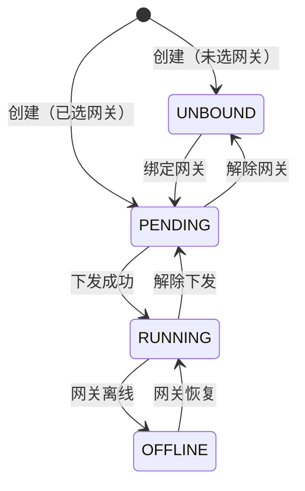

# 设备实例管理技术方案

> 基于《设备实例管理-产品说明书》设计，包含完整 AC 覆盖、API 设计、数据模型和核心逻辑。

---

## 1. AC 覆盖总表

| AC 编号 | 验收标准 | 技术实现 |
|---------|----------|----------|
| AC-001 | 单个创建设备实例 - 选择模型和网关 | POST /api/device-instances |
| AC-002 | 单个创建设备实例 - 暂不绑定网关 | POST /api/device-instances |
| AC-003 | 批量创建设备实例 | POST /api/device-instances/batch |
| AC-004 | 批量创建 - 自动命名 | POST /api/device-instances/batch |
| AC-005 | 下发配置 - 单个实例 | POST /api/sync/dispatch |
| AC-006 | 下发配置 - 批量实例 | POST /api/sync/dispatch/batch |
| AC-007 | 添加自定义点位 | PUT /api/device-instances/:id |
| AC-008 | 查看实例点位 | GET /api/device-instances/:id/points |
| AC-009 | 按模型筛选 | 查询参数 modelId |
| AC-010 | 按状态筛选 | 查询参数 status |
| AC-011 | 同步模型点位 | PUT /api/device-instances/:id/sync-points |
| AC-012 | 更改网关 | PUT /api/device-instances/:id/gateway |
| AC-013 | 解除下发 | POST /api/sync/undeploy |
| AC-014 | 删除实例 - 待同步状态 | DELETE /api/device-instances/:id |
| AC-015 | 模型变更自动同步 | 监听模型变更事件 |
| AC-016 | 表单必填项缺失 | Zod 验证 |
| AC-017 | 设备地址格式错误 | Zod 验证 |
| AC-018 | 自定义点位编码与继承点位冲突 | Zod 验证 |
| AC-019 | 下发配置失败 - 网关离线 | 网关状态检查 |
| AC-020 | 删除已下发的实例 - 两步操作 | 前端逻辑控制 |
| AC-021 | 网关离线 - 实例状态联动 | 心跳服务触发 |
| AC-022 | 网关恢复 - 实例状态自动恢复 | 心跳服务触发 |
| AC-023 | 批量创建 - 部分失败 | 事务 + 部分成功返回 |
| AC-024 | 仅启用状态的模型可选择 | 下拉选过滤 |
| AC-025 | 编辑实例 - 不可修改模型 | 表单只读字段 |
| AC-026 | BR-001 继承点位与模型关联同步 | 事件监听 |
| AC-027 | BR-002 实例不可修改继承点位 | 表单只读 |
| AC-028 | BR-003 状态流转规则 | 状态机逻辑 |
| AC-029 | BR-004 网关与实例状态联动 | 心跳服务 |
| AC-030 | BR-006 停用模型不可创建实例 | 下拉选过滤 |
| AC-031 | BR-008 实例内点位编码唯一 | Zod 验证 |

---

## 2. 数据模型设计

### 2.1 Prisma Schema

```prisma
model DeviceInstance {
  id              String          @id @default(cuid())
  name            String
  modelId         String
  gatewayId       String?
  deviceAddress   String
  status          InstanceStatus   @default(UNBOUND)
  points          Json            @default("[]")
  customPoints    Json            @default("[]")
  lastSyncTime    DateTime?
  description     String?
  createdAt       DateTime        @default(now())
  updatedAt       DateTime        @updatedAt

  model           DeviceModel     @relation(fields: [modelId], references: [id])
  gateway         Gateway?       @relation(fields: [gatewayId], references: [id])
  syncRecords     SyncRecord[]

  @@unique([gatewayId, deviceAddress])
  @@index([status])
  @@index([gatewayId])
  @@index([modelId])
}

enum InstanceStatus {
  UNBOUND
  PENDING
  RUNNING
  OFFLINE
}
```

### 2.2 状态流转图



→ AC-028, AC-029

---

## 3. API 设计

### 3.1 设备实例 API

#### GET /api/device-instances
获取实例列表。

**查询参数**
| 参数 | 类型 | 必填 | 说明 |
|------|------|------|------|
| name | string | 否 | 实例名称模糊匹配 |
| modelId | string | 否 | 所属模型 ID |
| gatewayId | string | 否 | 绑定网关 ID |
| status | string | 否 | UNBOUND/PENDING/RUNNING/OFFLINE |
| page | number | 否 | 页码，默认 1 |
| pageSize | number | 否 | 每页条数，默认 20 |

**响应**
```json
{
  "success": true,
  "data": {
    "list": [
      {
        "id": "clx123",
        "name": "1号PLC",
        "modelId": "model123",
        "modelName": "西门子 S7-1200",
        "gatewayId": "gateway123",
        "gatewayName": "产线1网关",
        "deviceAddress": "192.168.1.100",
        "status": "RUNNING",
        "pointCount": { "inherited": 15, "custom": 3 },
        "lastSyncTime": "2026-06-17T10:30:00Z",
        "createdAt": "2026-06-17T08:00:00Z"
      }
    ],
    "pagination": { "total": 100, "page": 1, "pageSize": 20 }
  }
}
```

→ AC-009, AC-010

#### POST /api/device-instances
创建设备实例。

**请求**
```json
{
  "name": "1号PLC",
  "modelId": "model123",
  "gatewayId": "gateway123",
  "deviceAddress": "192.168.1.100",
  "description": "产线1核心PLC",
  "customPoints": []
}
```

**行为**
1. 复制模型的 points 到实例的 points
2. 初始化 status = gatewayId ? PENDING : UNBOUND

**响应**
```json
{ "success": true, "data": { "id": "clx123", "status": "PENDING" } }
```

→ AC-001, AC-002, AC-016, AC-017, AC-024

#### POST /api/device-instances/batch
批量创建设备实例。

**请求**
```json
{
  "modelId": "model123",
  "gatewayId": "gateway123",
  "namingRule": "PLC-{001}",
  "instances": [
    { "name": "PLC-001", "deviceAddress": "192.168.1.100" },
    { "name": "PLC-002", "deviceAddress": "192.168.1.101" }
  ]
}
```

**响应**
```json
{
  "success": true,
  "data": { "successCount": 2, "failedCount": 0, "failedItems": [] }
}
```

→ AC-003, AC-004, AC-023

#### PUT /api/device-instances/:id
更新设备实例。

**请求**
```json
{
  "name": "1号PLC-更新",
  "deviceAddress": "192.168.1.101",
  "customPoints": [
    { "name": "自定义温度", "code": "custom_temp", "dataType": "float", "access": "read", "address": "40050", "scanInterval": 2000 }
  ]
}
```

→ AC-007, AC-018, AC-025, AC-031

#### PUT /api/device-instances/:id/gateway
更改网关。

**请求**
```json
{ "gatewayId": "gateway456" }
```

**行为**
1. 更新 gatewayId
2. 状态变为 PENDING（需重新下发）

→ AC-012

#### PUT /api/device-instances/:id/sync-points
同步模型点位。

**行为**
1. 获取模型最新点位
2. 保留自定义点位
3. 合并点位（自定义点位优先级高于继承点位）

→ AC-011, AC-015, AC-026

#### DELETE /api/device-instances/:id
删除设备实例。

→ AC-014, AC-020

---

## 4. 核心逻辑设计

### 4.1 从模型创建设点

```typescript
// device-instance.service.ts
async createInstance(dto: CreateDeviceInstanceDto) {
  const model = await prisma.deviceModel.findUnique({
    where: { id: dto.modelId }
  });

  const status = dto.gatewayId ? InstanceStatus.PENDING : InstanceStatus.UNBOUND;

  return prisma.deviceInstance.create({
    data: {
      name: dto.name,
      modelId: dto.modelId,
      gatewayId: dto.gatewayId,
      deviceAddress: dto.deviceAddress,
      status,
      points: model.points,
      customPoints: dto.customPoints || [],
      description: dto.description
    }
  });
}
```

→ AC-001, AC-002

### 4.2 点位合并逻辑

```typescript
function mergePoints(inherited: Point[], custom: CustomPoint[]): Point[] {
  const inheritedMap = new Map(inherited.map(p => [p.code, p]));
  const customMap = new Map(custom.map(p => [p.code, { ...p, source: 'custom' }]));
  const merged = new Map([...inheritedMap, ...customMap]);
  return Array.from(merged.values());
}
```

→ AC-007, AC-008, AC-027

### 4.3 网关状态联动

```typescript
// heartbeat.service.ts
async handleGatewayOffline(gatewayId: string) {
  await prisma.deviceInstance.updateMany({
    where: { gatewayId, status: InstanceStatus.RUNNING },
    data: { status: InstanceStatus.OFFLINE }
  });
}

async handleGatewayOnline(gatewayId: string) {
  await prisma.deviceInstance.updateMany({
    where: { gatewayId, status: InstanceStatus.OFFLINE },
    data: { status: InstanceStatus.RUNNING }
  });
}
```

→ AC-021, AC-022, AC-029

---

## 5. 前端组件设计

| 组件 | 文件路径 | 说明 |
|------|----------|------|
| DeviceInstanceList | `pages/device-instance/DeviceInstanceList.tsx` | 实例列表主页面 |
| DeviceInstanceCreateModal | `pages/device-instance/DeviceInstanceCreateModal.tsx` | 新建实例弹窗 |
| DeviceInstanceEditModal | `pages/device-instance/DeviceInstanceEditModal.tsx` | 编辑实例弹窗 |
| DeviceInstanceBatchModal | `pages/device-instance/DeviceInstanceBatchModal.tsx` | 批量新建弹窗 |
| ChangeGatewayModal | `pages/device-instance/ChangeGatewayModal.tsx` | 更改网关弹窗 |
| ViewPointsModal | `pages/device-instance/ViewPointsModal.tsx` | 查看点位弹窗 |
| DispatchConfirmBubble | `pages/sync/DispatchConfirmBubble.tsx` | 下发配置气泡 |
| UndispatchConfirmBubble | `pages/sync/UndispatchConfirmBubble.tsx` | 解除下发气泡 |

---

*文档版本：v1.0*
*创建日期：2026-06-17*
*基于产品说明书：设备实例管理-产品说明书.md*