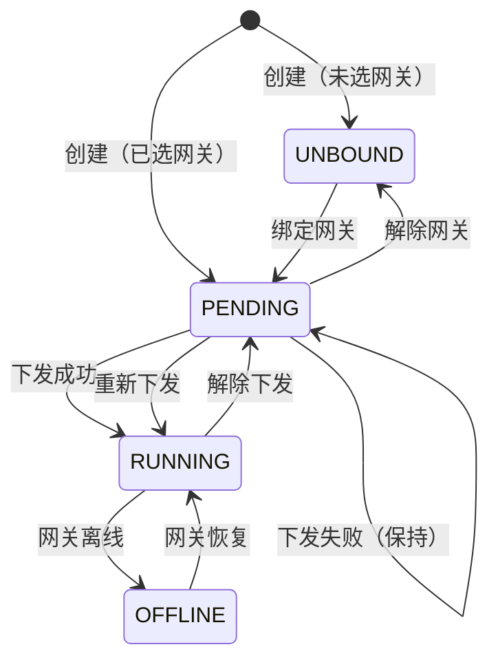

# 设备实例管理技术方案

> 本文档定义设备实例管理功能的技术实现方案。
> 基于《设备实例管理-FRD》和《技术栈.md》。

---

## 1. AC 覆盖总表

| AC 编号 | 验收标准 | 技术实现 | 状态 |
|---------|----------|----------|------|
| AC-001 | 设备实例 CRUD | REST API + Prisma | ✅ |
| AC-002 | 从模型创建（继承点位） | points 复制 + 关联 | ✅ |
| AC-003 | 自定义点位管理 | customPoints 字段 | ✅ |
| AC-004 | 批量创建 | 事务批量插入 | ✅ |
| AC-005 | 状态流转（4态） | status 枚举 + 联动 | ✅ |
| AC-006 | 更改网关 | gatewayId 更新 | ✅ |
| AC-007 | 同步模型点位 | 合并点位数据 | ✅ |

---

## 2. 数据模型设计

### 2.1 Prisma Schema

```prisma
model DeviceInstance {
  id              String          @id @default(cuid())
  name            String
  modelId         String
  gatewayId       String?
  deviceAddress   String
  status          InstanceStatus   @default(UNBOUND)
  points          Json            @default("[]")      // 继承自模型的点位
  customPoints    Json            @default("[]")      // 自定义点位
  lastSyncTime    DateTime?
  description     String?
  createdAt       DateTime        @default(now())
  updatedAt       DateTime        @updatedAt

  model           DeviceModel     @relation(fields: [modelId], references: [id])
  gateway         Gateway?       @relation(fields: [gatewayId], references: [id])
  syncRecords     SyncRecord[]

  @@unique([gatewayId, deviceAddress])
  @@index([status])
  @@index([gatewayId])
}

enum InstanceStatus {
  UNBOUND   // 未绑定
  PENDING   // 待同步
  RUNNING   // 运行中
  OFFLINE   // 离线
}
```

### 2.2 状态流转图



---

## 3. API 设计

### 3.1 设备实例 API

#### GET /api/device-instances
获取实例列表。

**响应**
```json
{
  "success": true,
  "data": [
    {
      "id": "clx123...",
      "name": "1号生产线PLC",
      "modelId": "model123",
      "modelName": "西门子 S7-1200",
      "gatewayId": "gateway123",
      "gatewayName": "产线1网关",
      "deviceAddress": "192.168.1.100",
      "status": "RUNNING",
      "points": [...],      // 继承自模型的点位
      "customPoints": [...], // 自定义点位
      "pointCount": { "inherited": 15, "custom": 3 },
      "lastSyncTime": "2026-06-17T10:30:00Z",
      "createdAt": "2026-06-17T08:00:00Z"
    }
  ]
}
```

#### POST /api/device-instances
创建实例。

**请求**
```json
{
  "name": "1号生产线PLC",
  "modelId": "model123",
  "gatewayId": "gateway123",  // 可选
  "deviceAddress": "192.168.1.100",
  "description": "产线1核心PLC",
  "customPoints": [...]      // 可选
}
```

**行为**：
1. 复制模型的 points 到实例的 points
2. 初始化 status = gatewayId ? PENDING : UNBOUND
3. 保存实例

#### PUT /api/device-instances/:id
更新实例（基本信息 + 自定义点位）。

**请求**
```json
{
  "name": "1号生产线PLC-更新",
  "deviceAddress": "192.168.1.101",
  "customPoints": [
    { "name": "自定义温度", "code": "custom_temp", ... }
  ]
}
```

#### PUT /api/device-instances/:id/gateway
更改网关。

**请求**
```json
{ "gatewayId": "gateway456" }
```

#### PUT /api/device-instances/:id/sync-points
同步模型点位。

**行为**：
1. 获取模型最新点位
2. 保留实例的自定义点位
3. 合并点位（自定义点位优先级高于继承点位）

#### POST /api/device-instances/batch
批量创建。

**请求**
```json
{
  "modelId": "model123",
  "gatewayId": "gateway123",
  "instances": [
    { "name": "PLC-001", "deviceAddress": "192.168.1.100" },
    { "name": "PLC-002", "deviceAddress": "192.168.1.101" }
  ]
}
```

---

## 4. 核心逻辑设计

### 4.1 从模型创建设点

```typescript
// device-instance.service.ts
async createInstance(dto: CreateDeviceInstanceDto) {
  // 1. 获取模型点位
  const model = await prisma.deviceModel.findUnique({
    where: { id: dto.modelId }
  });

  // 2. 确定初始状态
  const status = dto.gatewayId ? InstanceStatus.PENDING : InstanceStatus.UNBOUND;

  // 3. 创建实例（继承模型点位）
  return prisma.deviceInstance.create({
    data: {
      name: dto.name,
      modelId: dto.modelId,
      gatewayId: dto.gatewayId,
      deviceAddress: dto.deviceAddress,
      status,
      points: model.points,           // 继承模型点位
      customPoints: dto.customPoints || [],
      description: dto.description
    }
  });
}
```

→ AC-002: 从模型创建

### 4.2 自定义点位管理

```typescript
// 自定义点位只读继承的点位
interface CustomPoint extends Point {
  source: 'custom'
}

// 合并后的完整点位列表
function mergePoints(inherited: Point[], custom: CustomPoint[]): Point[] {
  const inheritedMap = new Map(inherited.map(p => [p.code, p]));
  const customMap = new Map(custom.map(p => [p.code, { ...p, source: 'custom' }]));

  // 自定义点位覆盖同名继承点位
  const merged = new Map([...inheritedMap, ...customMap]);
  return Array.from(merged.values());
}
```

→ AC-003: 自定义点位

### 4.3 状态联动（网关离线）

```typescript
// heartbeat.service.ts - 网关离线时更新实例状态
async handleGatewayOffline(gatewayId: string) {
  await prisma.deviceInstance.updateMany({
    where: {
      gatewayId,
      status: InstanceStatus.RUNNING
    },
    data: { status: InstanceStatus.OFFLINE }
  });
}

// 网关恢复时更新实例状态
async handleGatewayOnline(gatewayId: string) {
  await prisma.deviceInstance.updateMany({
    where: {
      gatewayId,
      status: InstanceStatus.OFFLINE
    },
    data: { status: InstanceStatus.RUNNING }
  });
}
```

→ AC-005: 状态流转

---

## 5. 前端组件设计

| 组件 | 文件路径 | 说明 |
|------|----------|------|
| DeviceInstanceList | `pages/device-instance/DeviceInstanceList.tsx` | 实例列表主页面 |
| DeviceInstanceCreateModal | `pages/device-instance/DeviceInstanceCreateModal.tsx` | 新建实例弹窗 |
| DeviceInstanceEditModal | `pages/device-instance/DeviceInstanceEditModal.tsx` | 编辑实例弹窗 |
| DeviceInstanceBatchModal | `pages/device-instance/DeviceInstanceBatchModal.tsx` | 批量新建弹窗 |
| ChangeGatewayModal | `pages/device-instance/ChangeGatewayModal.tsx` | 更改网关弹窗 |
| ViewPointsModal | `pages/device-instance/ViewPointsModal.tsx` | 查看点位弹窗 |
| DispatchConfirmBubble | `pages/sync/DispatchConfirmBubble.tsx` | 下发配置气泡 |
| UndispatchConfirmBubble | `pages/sync/UndispatchConfirmBubble.tsx` | 解除下发气泡 |

---

*文档版本：v1.0*
*创建日期：2026-06-17*
*基于 FRD: 设备实例管理-FRD.md*