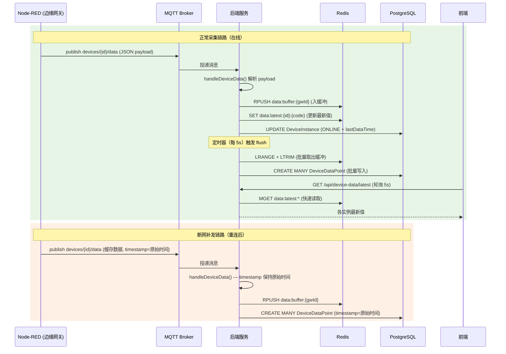
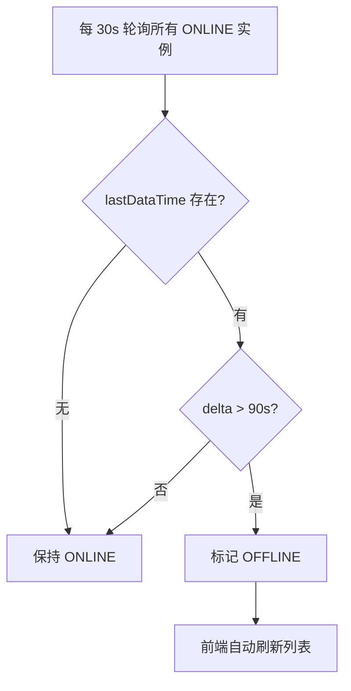

# 设备数据采集技术方案

> 基于设备数据订阅、写入、查询的技术实现设计，与心跳机制、配置下发共用 MQTT 通道。
> 继承项目已有架构：PostgreSQL + Prisma + Redis + EMQX + Express。

---

## 1. AC 覆盖总表

| AC 编号 | 验收标准 | 技术实现 |
|---------|----------|----------|
| AC-D001 | Node-RED 设备采集数据上报 MQTT | mqtt service 订阅 `devices/+/data` |
| AC-D002 | 平台解析并存储设备点位数据 | data-collection.service.ts 解析 payload，批量写入 DB |
| AC-D003 | 收到数据后标记设备实例 ONLINE | data-collection.service.ts 更新 DeviceInstance.status |
| AC-D004 | 查询设备实例最新点位值 | GET /api/device-data/current/:instanceId |
| AC-D005 | 查询设备点位历史数据（分页） | GET /api/device-data/history/:instanceId |
| AC-D006 | 查询所有实例最新值 | GET /api/device-data/latest |
| AC-D007 | 高频数据批量写入（缓冲） | Redis 缓冲 + 定时批量 flush 到 DB |
| AC-D008 | 断网时 Node-RED 本地缓存 | SQLite（Node-RED 侧，已有方案） |
| AC-D009 | 网络恢复后 Node-RED 补发缓存数据 | MQTT 带原始时间戳重发 |
| AC-D010 | 前端实时展示设备最新数据 | 轮询 /api/device-data/latest |
| AC-D011 | 前端展示设备数据趋势图 | GET /api/device-data/history → Recharts |
| AC-D012 | 网关离线后设备实例状态联动 | 收到数据则 ONLINE；90s 无数据则 OFFLINE |

---

## 2. 数据模型设计

### 2.1 Prisma Schema 新增表

```prisma
// 新增：设备点位时序数据表
model DeviceDataPoint {
  id              String    @id @default(cuid())
  deviceInstanceId String
  gatewayId       String
  pointCode       String
  pointName       String
  value           String    // 存储为字符串，兼容所有类型
  dataType        String    // int/float/bool/string
  timestamp       DateTime  // 原始采集时间（来自 MQTT payload）
  receivedAt      DateTime  @default(now()) // 服务端接收时间
  quality         Int       @default(0)     // 数据质量：0=Good, 1=Bad, 2=Uncertain

  instance        DeviceInstance @relation(fields: [deviceInstanceId], references: [id])
  gateway         Gateway       @relation(fields: [gatewayId], references: [id])

  // 索引策略：高频查询 = (instanceId, pointCode) + timestamp 降序
  @@index([deviceInstanceId, pointCode, timestamp(sort: Desc)])
  @@index([gatewayId, timestamp(sort: Desc)])
  @@index([timestamp(sort: Desc)])
}
```

**设计说明**：
- `timestamp` = 原始采集时间（来自 Node-RED 的 `Date.now()`），保证补发数据时间正确
- `receivedAt` = 服务端收到消息的时间，用于判断网络延迟
- `value` 存 String 是因为 S7/Modbus 原始数据可能需要解析后才能转数值
- 复合索引 `(instanceId, pointCode, timestamp DESC)` 覆盖"某实例某点位最新值"和"历史趋势"两类查询
- **暂不使用 TimescaleDB / InfluxDB**，PostgreSQL + 合理索引在万级点位规模内足够

### 2.2 现有模型关联修改

```prisma
// DeviceInstance 增加关联
model DeviceInstance {
  // ... 现有字段 ...
  dataPoints DeviceDataPoint[]

  // 新增字段：最近数据上报时间（用于判断实例 OFFLINE）
  lastDataTime DateTime?
}

// Gateway 增加关联
model Gateway {
  // ... 现有字段 ...
  dataPoints DeviceDataPoint[]
}
```

### 2.3 Redis 数据缓冲

| Key 格式 | 类型 | TTL | 说明 |
|---------|------|-----|------|
| `data:buffer:{gatewayId}` | List | 无 | 待写入 DB 的点位数据（JSON 字符串） |
| `data:latest:{instanceId}:{pointCode}` | String | 300s | 最新点位值（JSON `{value, timestamp}`） |
| `data:offline:{instanceId}` | String | 120s | 实例数据超时检测（每次收到数据时刷新） |

---

## 3. MQTT 消息格式约定

### 3.1 设备数据上报（Node-RED → 平台）

**Topic**: `devices/{deviceInstanceId}/data`

**Payload**:
```json
{
  "gatewayId": "gw_xxx",
  "deviceInstanceId": "di_yyy",
  "timestamp": 1718732001234,
  "points": [
    { "code": "temp", "name": "温度", "value": "25.6", "dataType": "float", "quality": 0 },
    { "code": "pressure", "name": "压力", "value": "101.3", "dataType": "float", "quality": 0 },
    { "code": "status", "name": "运行状态", "value": "1", "dataType": "int", "quality": 0 }
  ]
}
```

**说明**：
- `timestamp` = 原始采集时间（Node-RED 端 `Date.now()`），用于断网补发场景
- `quality`: 0=Good, 1=Bad（通信故障）, 2=Uncertain（数据可疑）
- 数据类型与 DeviceModel.points 中的 dataType 一致

### 3.2 断网补发格式

Node-RED 重连后，缓存的数据同样以 `devices/{deviceInstanceId}/data` 上报，只是 `timestamp` 保持原始采集时间（早于当前时间）。

---

## 4. 核心服务设计

### 4.1 MQTT 订阅扩展（mqtt.service.ts）

```typescript
// mqtt.service.ts - initializeMqttSubscriptions() 中新增

// ========= 订阅设备数据上报 =========
mqttClient.subscribe('devices/+/data', (err) => {
  if (err) console.error('Failed to subscribe devices/+/data', err)
  else console.log('Subscribed to devices/+/data')
})

// 在已有的 message handler 中新增分支
mqttClient.on('message', async (receivedTopic, message) => {
  // 现有心跳处理...
  if (topicMatches(receivedTopic, 'gateway/+/heartbeat')) { ... }

  // ========= 新增：设备数据处理 =========
  if (topicMatches(receivedTopic, 'devices/+/data')) {
    const match = receivedTopic.match(/^devices\/([^/]+)\/data$/)
    if (match) {
      const deviceInstanceId = match[1]
      try {
        await handleDeviceData(deviceInstanceId, message.toString())
      } catch (err) {
        console.error(`Failed to handle device data for ${deviceInstanceId}`, err)
      }
    }
  }
})
```

→ AC-D001

### 4.2 数据采集服务（data-collection.service.ts）

**职责**：
1. 解析 MQTT payload
2. 批量写入 Redis 缓冲（高频场景）
3. 定时 flush 缓冲数据到 DB
4. 更新 Redis latest cache
5. 更新 DeviceInstance.lastDataTime + status

```typescript
// services/data-collection.service.ts

import { prisma } from '../config/db'
import { redisClient } from '../config/redis'
import { DeviceStatus } from '@prisma/client'

const BUFFER_KEY_PREFIX = 'data:buffer:'
const LATEST_KEY_PREFIX = 'data:latest:'
const OFFLINE_KEY_PREFIX = 'data:offline:'
const BUFFER_FLUSH_INTERVAL = 5000 // 每 5s 批量写入一次
const OFFLINE_THRESHOLD_MS = 90 * 1000 // 90s 无数据判实例离线

// ============================================================
// 1. MQTT 消息处理入口
// ============================================================
export const handleDeviceData = async (
  deviceInstanceId: string,
  rawMessage: string
): Promise<void> => {
  const payload = JSON.parse(rawMessage)

  // 1) 更新实例数据时间 + 标记 ONLINE
  await updateInstanceOnline(deviceInstanceId)

  // 2) 写入 Redis 缓冲（异步，不阻塞 MQTT 消息处理）
  await bufferDataPoint(deviceInstanceId, payload)

  // 3) 立即更新 Redis latest cache（用于快速查询）
  await updateLatestCache(deviceInstanceId, payload)

  // 4) 更新数据超时检测 key
  await refreshOfflineKey(deviceInstanceId)
}

// ============================================================
// 2. 数据缓冲写入（高频优化）
// ============================================================
const bufferDataPoint = async (
  deviceInstanceId: string,
  payload: DeviceDataPayload
): Promise<void> => {
  const { gatewayId, timestamp, points } = payload
  const gateway = await getGatewayIdForInstance(deviceInstanceId) // 优先用 payload.gatewayId
  const resolvedGatewayId = gatewayId || gateway?.gatewayId

  for (const point of points) {
    const dataPoint: DataPointRecord = {
      deviceInstanceId,
      gatewayId: resolvedGatewayId,
      pointCode: point.code,
      pointName: point.name,
      value: point.value,
      dataType: point.dataType,
      timestamp: new Date(timestamp),
      quality: point.quality ?? 0
    }
    await redisClient.rPush(
      `${BUFFER_KEY_PREFIX}${resolvedGatewayId}`,
      JSON.stringify(dataPoint)
    )
  }
}

// ============================================================
// 3. 定时批量 flush（每 5s 执行一次）
// ============================================================
export const startBufferFlush = (): NodeJS.Timeout => {
  return setInterval(async () => {
    const gatewayKeys = await redisClient.keys(`${BUFFER_KEY_PREFIX}*`)
    for (const key of gatewayKeys) {
      const gatewayId = key.replace(BUFFER_KEY_PREFIX, '')
      await flushGatewayBuffer(gatewayId)
    }
  }, BUFFER_FLUSH_INTERVAL)
}

const flushGatewayBuffer = async (gatewayId: string): Promise<void> => {
  const key = `${BUFFER_KEY_PREFIX}${gatewayId}`

  // 批量取出缓冲数据（最多 500 条/次，防止内存溢出）
  const rawPoints: string[] = []
  while (rawPoints.length < 500) {
    const item = await redisClient.lPop(key)
    if (!item) break
    rawPoints.push(item)
  }

  if (rawPoints.length === 0) return

  const points = rawPoints.map(r => JSON.parse(r))

  // 批量写入 DB（Prisma createMany 或原生 SQL）
  try {
    await prisma.deviceDataPoint.createMany({
      data: points.map(p => ({
        deviceInstanceId: p.deviceInstanceId,
        gatewayId: p.gatewayId,
        pointCode: p.pointCode,
        pointName: p.pointName,
        value: p.value,
        dataType: p.dataType,
        timestamp: new Date(p.timestamp),
        quality: p.quality ?? 0
      }))
    })
  } catch (err) {
    // 写入失败则回推缓冲（理论上不会发生）
    console.error(`Failed to flush buffer for gateway ${gatewayId}`, err)
    for (const raw of rawPoints.reverse()) {
      await redisClient.lPush(key, raw)
    }
  }
}

// ============================================================
// 4. Redis latest cache（支撑快速查询）
// ============================================================
const updateLatestCache = async (
  deviceInstanceId: string,
  payload: DeviceDataPayload
): Promise<void> => {
  const { timestamp, points } = payload

  for (const point of points) {
    const key = `${LATEST_KEY_PREFIX}${deviceInstanceId}:${point.code}`
    await redisClient.set(
      key,
      JSON.stringify({
        value: point.value,
        dataType: point.dataType,
        quality: point.quality ?? 0,
        timestamp
      }),
      { EX: 300 } // 5 分钟过期
    )
  }
}

// ============================================================
// 5. 实例在线状态更新
// ============================================================
const updateInstanceOnline = async (deviceInstanceId: string): Promise<void> => {
  await prisma.deviceInstance.update({
    where: { id: deviceInstanceId },
    data: {
      status: DeviceStatus.ONLINE,
      lastDataTime: new Date()
    }
  }).catch(() => {
    // 实例不存在时静默忽略（MQTT 消息无 Schema 校验）
  })
}

// ============================================================
// 6. 数据超时检测（检查所有实例是否超时）
// ============================================================
export const startOfflineChecker = (): NodeJS.Timeout => {
  return setInterval(async () => {
    const instances = await prisma.deviceInstance.findMany({
      where: { status: DeviceStatus.ONLINE },
      select: { id: true, lastDataTime: true }
    })

    const now = Date.now()
    for (const instance of instances) {
      if (!instance.lastDataTime) continue
      const delta = now - instance.lastDataTime.getTime()
      if (delta > OFFLINE_THRESHOLD_MS) {
        await prisma.deviceInstance.update({
          where: { id: instance.id },
          data: { status: DeviceStatus.OFFLINE }
        })
      }
    }
  }, 30 * 1000) // 每 30s 检查一次
}

// ============================================================
// 7. 辅助：获取实例所属网关
// ============================================================
const getGatewayIdForInstance = async (deviceInstanceId: string): Promise<{ gatewayId: string } | null> => {
  return prisma.deviceInstance.findUnique({
    where: { id: deviceInstanceId },
    select: { gatewayId: true }
  })
}
```

→ AC-D002, AC-D003, AC-D007

---

## 5. API 设计

### 5.1 数据查询 API

#### GET /api/device-data/current/:instanceId
获取设备实例所有点位的最新值。

**响应**
```json
{
  "success": true,
  "data": {
    "deviceInstanceId": "di_xxx",
    "deviceName": "1号PLC",
    "gatewayName": "产线1网关",
    "status": "ONLINE",
    "lastDataTime": "2026-06-18T10:30:00Z",
    "points": [
      { "code": "temp", "name": "温度", "value": "25.6", "dataType": "float", "quality": 0, "timestamp": "2026-06-18T10:30:00Z" },
      { "code": "pressure", "name": "压力", "value": "101.3", "dataType": "float", "quality": 0, "timestamp": "2026-06-18T10:30:00Z" }
    ]
  }
}
```

**数据来源**：优先 Redis latest cache → 降级查 DB

→ AC-D004

#### GET /api/device-data/history/:instanceId
获取设备点位历史数据（分页）。

**查询参数**
| 参数 | 类型 | 必填 | 说明 |
|------|------|------|------|
| pointCode | string | 否 | 点位编码，不填则返回所有点位 |
| start | string | 否 | 开始时间 ISO 8601，默认 24h 前 |
| end | string | 否 | 结束时间 ISO 8601，默认 now |
| page | number | 否 | 页码，默认 1 |
| pageSize | number | 否 | 每页条数，默认 100，上限 1000 |

**响应**
```json
{
  "success": true,
  "data": {
    "deviceInstanceId": "di_xxx",
    "pointCode": "temp",
    "interval": "raw",
    "records": [
      { "value": "25.6", "timestamp": "2026-06-18T10:30:00Z", "quality": 0 },
      { "value": "25.7", "timestamp": "2026-06-18T10:30:01Z", "quality": 0 }
    ],
    "pagination": { "total": 86400, "page": 1, "pageSize": 100 }
  }
}
```

→ AC-D005, AC-D011

#### GET /api/device-data/latest
批量获取所有在线实例的最新值（前端轮询用）。

**查询参数**
| 参数 | 类型 | 必填 | 说明 |
|------|------|------|------|
| gatewayId | string | 否 | 按网关筛选 |
| modelId | string | 否 | 按模型筛选 |
| page | number | 否 | 页码 |
| pageSize | number | 否 | 每页条数，默认 50 |

**响应**
```json
{
  "success": true,
  "data": {
    "instances": [
      {
        "deviceInstanceId": "di_xxx",
        "name": "1号PLC",
        "gatewayName": "产线1网关",
        "status": "ONLINE",
        "lastDataTime": "2026-06-18T10:30:00Z",
        "points": [
          { "code": "temp", "value": "25.6", "timestamp": "..." }
        ]
      }
    ],
    "pagination": { "total": 20, "page": 1, "pageSize": 50 }
  }
}
```

→ AC-D006, AC-D010

---

## 6. 核心数据流

### 6.1 完整数据流图



### 6.2 实例离线判定



→ AC-D012

---

## 7. 前端设计

### 7.1 新增页面/组件

| 组件 | 文件路径 | 说明 |
|------|----------|------|
| DeviceDataPanel | `pages/device-instance/DeviceDataPanel.tsx` | 设备数据监控面板（侧滑抽屉） |
| PointValueTable | `pages/device-instance/PointValueTable.tsx` | 点位值表格（实时刷新） |
| DataTrendChart | `pages/device-instance/DataTrendChart.tsx` | 数据趋势图（Recharts） |
| DataHistoryTable | `pages/device-instance/DataHistoryTable.tsx` | 历史数据表格 |

### 7.2 数据展示逻辑

**DeviceInstanceList**：增加"查看数据"按钮，点击打开 DeviceDataPanel 抽屉。

```typescript
// DeviceDataPanel.tsx 核心逻辑
const fetchLatest = useCallback(async () => {
  const res = await deviceDataApi.getCurrent(instanceId)
  setPoints(res.data.points)
  setLastUpdate(new Date())
}, [instanceId])

// 轮询：5s 刷新一次最新值
useEffect(() => {
  fetchLatest()
  const interval = setInterval(fetchLatest, 5000)
  return () => clearInterval(interval)
}, [fetchLatest])

// 趋势图：查询最近 1 小时数据
const fetchHistory = useCallback(async () => {
  const res = await deviceDataApi.getHistory(instanceId, {
    start: new Date(Date.now() - 3600 * 1000).toISOString(),
    pageSize: 1000
  })
  setChartData(res.data.records)
}, [instanceId])
```

→ AC-D010, AC-D011

---

## 8. 模块文件清单

### 8.1 后端新增/改动

| 文件 | 操作 | 说明 |
|------|------|------|
| `backend/src/services/data-collection.service.ts` | 新增 | 设备数据采集核心服务 |
| `backend/src/services/mqtt.service.ts` | 改动 | 增加 `devices/+/data` 订阅 |
| `backend/src/modules/device-data/device-data.controller.ts` | 新增 | 数据查询 Controller |
| `backend/src/modules/device-data/device-data.service.ts` | 新增 | 数据查询 Service（含 Redis 降级） |
| `backend/src/modules/device-data/device-data.router.ts` | 新增 | 数据查询路由 |
| `backend/src/app.ts` | 改动 | 注册 device-data 路由 + 启动 data-collection 服务 |
| `backend/prisma/schema.prisma` | 改动 | 新增 DeviceDataPoint 模型 + DeviceInstance.lastDataTime |

### 8.2 前端新增/改动

| 文件 | 操作 | 说明 |
|------|------|------|
| `frontend/src/api/device-data.api.ts` | 新增 | 数据查询 API |
| `frontend/src/pages/device-instance/DeviceDataPanel.tsx` | 新增 | 数据监控抽屉 |
| `frontend/src/pages/device-instance/PointValueTable.tsx` | 新增 | 实时值表格 |
| `frontend/src/pages/device-instance/DataTrendChart.tsx` | 新增 | 趋势图 |
| `frontend/src/pages/device-instance/DeviceInstanceList.tsx` | 改动 | 增加"查看数据"按钮 |
| `frontend/src/types/index.ts` | 改动 | 增加 DeviceDataPoint 类型 |

---

## 9. 性能与容量估算

| 场景 | 计算方式 | 结论 |
|------|---------|------|
| 单网关单实例数据量 | 10 点位 × 1s 间隔 × 60s = 600 条/min | 约 86.4 万条/天/实例 |
| 100 实例并发 | 600 条/min × 100 = 6 万条/min | 需要批量写入 |
| DB 存储（1个月） | 600 × 60 × 24 × 30 = 2592 万条/实例 | 考虑数据老化 |
| 历史数据老化 | 30天后归档到冷存储 或 降采样保留 | 超出 MVP 范围，预留字段 |

**缓解措施**：
- Redis 缓冲 + 批量写入（`createMany`）降低 DB 压力
- Redis latest cache 拦截 90%+ 的"最新值"查询，不打 DB
- 历史数据查询加 `pageSize` 上限（1000条），避免全表扫描
- 后续可加数据老化策略（如 `receivedAt > 30d` 自动删除或降采样）

→ AC-D007

---

*文档版本：v1.0*
*创建日期：2026-06-18*
