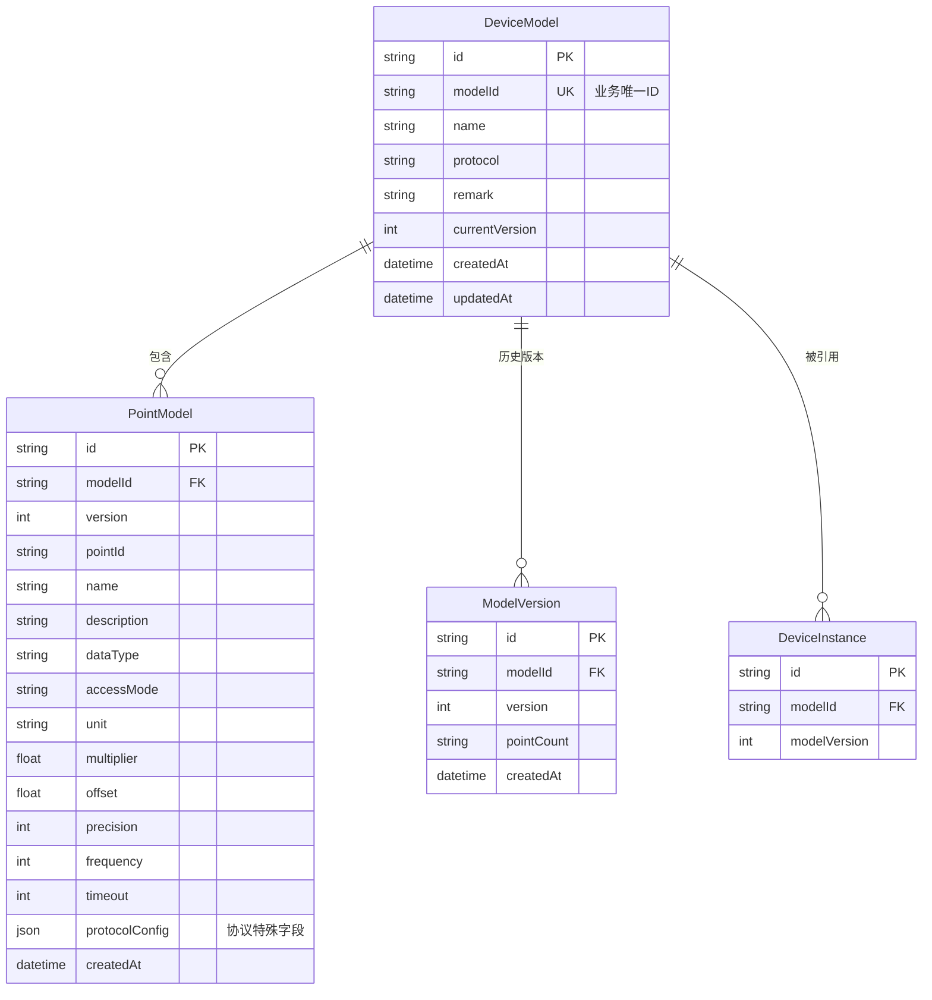

# 设备模型管理 — 技术设计文档

## 1. 设计概要

**功能描述**：管理工业设备的采集方案模板，支持多种协议（Modbus TCP/RTU、S7、OPC UA、MQTT、TCP）的点位定义，版本管理，批量导入导出，模板复制。编辑基本信息不升级版本，编辑点位信息才升级版本。

**影响范围**：
- 后端：`device-model` 模块、`device-instance` 模块（关联查询）
- 前端：`device-model/` 页面、`device-model.store.ts`
- 数据库：DeviceModel 表改造、PointModel 新增表、ModelVersion 表调整

**技术难点**：
- 多种协议点位特殊字段的灵活存储与校验
- 版本号递增规则（修改点位才升级，修改基本信息不升级）
- Excel 批量导入点位的格式校验与去重

**外部依赖**：
- Excel 解析：`xlsx` 库（SheetJS）
- 与设备实例模块关联（模板被引用时不可删除）

---

## 2. 架构概览

设备模型是设备配置的核心模板层，向上支撑设备实例（从模板创建实例，继承点位），向下对接配置下发（将点位配置转化为 Node-RED Flow）。

**核心数据流向**：
1. 用户创建设备模板（基本信息）
2. 在模板详情页添加/编辑点位（公共字段 + 协议特殊字段）
3. 点位修改时自动生成新版本（版本号 v1→v2→v3...）
4. 设备实例从模板创建，关联特定版本的点位
5. 配置下发时，从模板版本获取点位配置，生成 Node-RED 采集节点



---

## 3. 数据库设计

### 新增表

#### `PointModel`

**用途**：存储设备模板的点位定义，按模板 + 版本存储，支持多协议特殊字段。

| 字段名 | 类型 | 约束 | 说明 |
|--------|------|------|------|
| id | TEXT | PK, DEFAULT cuid() | 主键 |
| model_id | TEXT | NOT NULL, FK → DeviceModel.id | 所属模板ID |
| version | INT | NOT NULL, DEFAULT 1 | 所属版本号 |
| point_id | TEXT | NOT NULL | 点位业务ID（模板内唯一） |
| name | TEXT | NOT NULL | 点位名称 |
| description | TEXT | | 描述 |
| data_type | TEXT | NOT NULL | 数据类型：BOOL/INT16/UINT16/INT32/UINT32/FLOAT32/FLOAT64 |
| access_mode | TEXT | NOT NULL | 读写权限：READ_ONLY/READ_WRITE |
| unit | TEXT | | 单位 |
| multiplier | DOUBLE PRECISION | DEFAULT 1 | 乘系数 |
| offset_value | DOUBLE PRECISION | DEFAULT 0 | 偏移量 |
| precision | INT | | 精度（仅浮点类型，0-10） |
| frequency | INT | DEFAULT 1000 | 采集频率（ms） |
| timeout | INT | DEFAULT 3000 | 采集超时（ms） |
| protocol_config | JSONB | NOT NULL DEFAULT '{}'::jsonb | 协议特殊字段（根据协议类型不同） |
| sort_order | INT | DEFAULT 0 | 排序序号 |
| created_at | TIMESTAMPTZ | DEFAULT now() | 创建时间 |
| updated_at | TIMESTAMPTZ | DEFAULT now() | 更新时间 |

**索引**：
- `UNIQUE(model_id, version, point_id)` — 同版本内点位ID唯一
- `INDEX idx_point_model_id_version (model_id, version)` — 查询某模板某版本的所有点位

#### 协议特殊字段说明（protocol_config）

不同协议存储不同的字段结构，JSONB 格式：

**Modbus TCP/RTU**：
```json
{
  "slaveAddress": 1,
  "functionCode": "03",
  "registerAddress": 100
}
```

**S7**：
```json
{
  "dbBlock": 1,
  "byteOffset": 0,
  "bitOffset": 0
}
```

**OPC UA**：
```json
{
  "namespaceIndex": 2,
  "nodeId": "ns=2;s=Temperature"
}
```

**MQTT**：
```json
{
  "jsonPath": "$.data.temperature"
}
```

**TCP**：
```json
{
  "parseRule": "temperature=(\\d+\\.?\\d*)"
}
```

### 修改现有表

#### `DeviceModel` 表

**变更内容**：重构模型表，去掉 vendor/model/status 字段，增加 modelId 业务唯一标识，调整版本号为整数。

```sql
-- 新增业务ID
ALTER TABLE "DeviceModel" ADD COLUMN IF NOT EXISTS "modelId" TEXT;
-- 新增备注
ALTER TABLE "DeviceModel" ADD COLUMN IF NOT EXISTS "remark" TEXT;
-- 版本号改为整数
ALTER TABLE "DeviceModel" ADD COLUMN IF NOT EXISTS "versionNumber" INT DEFAULT 1;

-- 废弃字段（保留数据，不再使用）
-- vendor, model, status, points(Json), version(字符串)

-- 索引
CREATE UNIQUE INDEX IF NOT EXISTS idx_device_model_model_id ON "DeviceModel" ("modelId");
CREATE INDEX IF NOT EXISTS idx_device_model_protocol ON "DeviceModel" (protocol);
```

**数据迁移**：
- 原有 `name` 字段保留
- 原有 `version` 字符串（如 v1.0）迁移为整数版本号
- 原有 `points` Json 字段数据迁移到 PointModel 表

#### `ModelVersion` 表

**变更内容**：简化版本表，只存版本元信息，点位数据存 PointModel 表。

```sql
-- 新增点位数
ALTER TABLE "ModelVersion" ADD COLUMN IF NOT EXISTS "pointCount" INT DEFAULT 0;
-- 版本号改为整数
ALTER TABLE "ModelVersion" ADD COLUMN IF NOT EXISTS "versionNum" INT;
-- 移除 points 字段（数据迁移到 PointModel）
-- ALTER TABLE "ModelVersion" DROP COLUMN IF EXISTS points;
```

---

## 4. API 设计

> 遵循 RESTful 风格，统一响应格式

### `GET /api/device-models`

**描述**：获取设备模板列表 → AC-008

**鉴权**：需要登录

**Query 参数**：
- `name`：模板名称模糊搜索
- `protocol`：协议类型筛选
- `page`：页码（默认 1）
- `pageSize`：每页数量（默认 20）

**Response（成功）**：
```json
{
  "success": true,
  "data": {
    "list": [
      {
        "id": "cuid_xxx",
        "modelId": "temp_modbus_001",
        "name": "温控设备",
        "protocol": "MODBUS_TCP",
        "pointCount": 6,
        "currentVersion": 3,
        "updatedAt": "2024-03-15T10:00:00Z"
      }
    ],
    "total": 50,
    "page": 1,
    "pageSize": 20
  }
}
```

### `POST /api/device-models`

**描述**：创建设备模板（基本信息）→ AC-001

**鉴权**：需要登录

**Request**：
```json
{
  "modelId": "temp_modbus_001",
  "name": "温控设备",
  "protocol": "MODBUS_TCP",
  "remark": "车间温控设备模板"
}
```

**Response（成功）**：
```json
{
  "success": true,
  "data": {
    "id": "cuid_xxx",
    "modelId": "temp_modbus_001",
    "name": "温控设备",
    "protocol": "MODBUS_TCP",
    "currentVersion": 1,
    "createdAt": "2024-03-15T10:00:00Z"
  }
}
```

**异常响应**：

| 场景 | 状态码 | 响应 | 对应 AC |
|------|--------|------|---------|
| modelId 已存在 | 409 | `{ code: 'MODEL_ID_EXISTS', message: '模型ID已存在' }` | - |
| 协议类型不支持 | 400 | `{ code: 'INVALID_PROTOCOL', message: '不支持的协议类型' }` | AC-005 |

### `GET /api/device-models/:id`

**描述**：获取模板详情（基本信息 + 当前版本点位列表）→ AC-002

**鉴权**：需要登录

**Response（成功）**：
```json
{
  "success": true,
  "data": {
    "id": "cuid_xxx",
    "modelId": "temp_modbus_001",
    "name": "温控设备",
    "protocol": "MODBUS_TCP",
    "remark": "车间温控设备模板",
    "currentVersion": 3,
    "createdAt": "2024-03-15T10:00:00Z",
    "updatedAt": "2024-03-16T14:30:00Z",
    "points": [
      {
        "id": "cuid_point_xxx",
        "pointId": "temp_001",
        "name": "温度值",
        "description": "当前温度",
        "dataType": "FLOAT32",
        "accessMode": "READ_ONLY",
        "unit": "°C",
        "multiplier": 0.1,
        "offsetValue": 0,
        "precision": 1,
        "frequency": 1000,
        "timeout": 3000,
        "protocolConfig": {
          "slaveAddress": 1,
          "functionCode": "03",
          "registerAddress": 100
        }
      }
    ]
  }
}
```

### `PUT /api/device-models/:id`

**描述**：更新模板基本信息（不升级版本）→ AC-018

**鉴权**：需要登录

**Request**：
```json
{
  "name": "新的模板名称",
  "remark": "新的备注"
}
```

**Response（成功）**：
```json
{
  "success": true,
  "data": { "id": "cuid_xxx", "currentVersion": 3 }
}
```

**注意**：协议类型不可修改。修改基本信息**不**升级版本号。

### `DELETE /api/device-models/:id`

**描述**：删除设备模板 → AC-021

**鉴权**：需要登录

**Response（成功）**：
```json
{
  "success": true,
  "data": { "deleted": true }
}
```

**异常响应**：

| 场景 | 状态码 | 响应 | 对应 AC |
|------|--------|------|---------|
| 已有实例关联 | 400 | `{ code: 'HAS_INSTANCES', message: '该模板已有实例关联，无法删除' }` | AC-021 |

### `POST /api/device-models/:id/duplicate`

**描述**：复制模板 → AC-004、AC-017

**鉴权**：需要登录

**Request**：
```json
{
  "newModelId": "temp_modbus_001_copy",
  "newName": "温控设备 副本"
}
```

**Response（成功）**：
```json
{
  "success": true,
  "data": {
    "id": "cuid_new_xxx",
    "modelId": "temp_modbus_001_copy",
    "name": "温控设备 副本",
    "currentVersion": 1
  }
}
```

### `GET /api/device-models/:id/versions`

**描述**：获取模板历史版本列表 → AC-016

**鉴权**：需要登录

**Response（成功）**：
```json
{
  "success": true,
  "data": [
    { "version": 3, "pointCount": 6, "createdAt": "2024-03-16T14:30:00Z" },
    { "version": 2, "pointCount": 5, "createdAt": "2024-03-15T10:00:00Z" },
    { "version": 1, "pointCount": 4, "createdAt": "2024-03-14T08:00:00Z" }
  ]
}
```

### `GET /api/device-models/:id/versions/:version`

**描述**：获取指定版本的点位详情 → AC-016

**鉴权**：需要登录

**Response（成功）**：
```json
{
  "success": true,
  "data": {
    "version": 2,
    "createdAt": "2024-03-15T10:00:00Z",
    "points": [
      { "pointId": "temp_001", "name": "温度值", "...": "..." }
    ]
  }
}
```

### `POST /api/device-models/:id/points`

**描述**：新增点位 → AC-002、AC-003

**鉴权**：需要登录

**Request**：
```json
{
  "pointId": "temp_002",
  "name": "湿度值",
  "description": "当前湿度",
  "dataType": "FLOAT32",
  "accessMode": "READ_ONLY",
  "unit": "%",
  "multiplier": 0.1,
  "offsetValue": 0,
  "precision": 1,
  "frequency": 1000,
  "timeout": 3000,
  "protocolConfig": {
    "slaveAddress": 1,
    "functionCode": "03",
    "registerAddress": 102
  }
}
```

**Response（成功）**：
```json
{
  "success": true,
  "data": {
    "id": "cuid_point_xxx",
    "newVersion": 4
  }
}
```

**注意**：新增点位会自动升级版本号（当前版本 + 1）。

### `PUT /api/device-models/:id/points/:pointId`

**描述**：编辑点位 → AC-003

**鉴权**：需要登录

**Request**：同新增点位的字段

**Response（成功）**：
```json
{
  "success": true,
  "data": { "newVersion": 5 }
}
```

**注意**：编辑点位会自动升级版本号。

### `DELETE /api/device-models/:id/points/:pointId`

**描述**：删除点位 → AC-003

**鉴权**：需要登录

**Response（成功）**：
```json
{
  "success": true,
  "data": { "newVersion": 6 }
}
```

**注意**：删除点位会自动升级版本号。

### `POST /api/device-models/:id/points/import`

**描述**：导入点位（Excel） → AC-007、AC-022

**鉴权**：需要登录

**Request**：multipart/form-data，字段名 `file`

**Response（成功）**：
```json
{
  "success": true,
  "data": {
    "importedCount": 10,
    "newVersion": 7
  }
}
```

**异常响应**：

| 场景 | 状态码 | 响应 | 对应 AC |
|------|--------|------|---------|
| 点位 ID 重复 | 400 | `{ code: 'DUPLICATE_POINT_ID', message: '存在重复点位ID：temp_001, temp_002' }` | AC-022 |
| 格式错误 | 400 | `{ code: 'INVALID_FORMAT', message: 'Excel格式错误，请使用模板' }` | - |

### `GET /api/device-models/:id/points/export`

**描述**：导出点位（Excel） → AC-006

**鉴权**：需要登录

**Response**：二进制流，Content-Type: application/vnd.openxmlformats-officedocument.spreadsheetml.sheet

---

## 5. 核心逻辑

### 5.1 版本号递增规则 → AC-003、AC-018、AC-020

**触发条件**：
- 新增、编辑、删除点位 → 升级版本
- 批量导入点位 → 升级版本
- 修改基本信息（名称、备注）→ 不升级版本

**处理流程**：

1. 修改点位操作时：
   - 获取当前最新版本号 `currentVersion`
   - 新版本号 = `currentVersion + 1`
   - 将当前所有点位复制一份，版本号设为新版本号
   - 在新版本点位上执行新增/编辑/删除操作
   - 更新 DeviceModel 的 `currentVersion`
   - 新增一条 ModelVersion 记录

2. 修改基本信息时：
   - 直接更新 DeviceModel 表的 name/remark 字段
   - 不改变版本号
   - 不操作 PointModel 表

**伪代码**：
```
function updatePoint(modelId, pointId, pointData):
    model = db.getDeviceModel(modelId)
    oldVersion = model.currentVersion
    newVersion = oldVersion + 1
    
    // 1. 复制旧版本所有点位到新版本
    oldPoints = db.getPoints(modelId, oldVersion)
    for point in oldPoints:
        db.createPoint({ ...point, version: newVersion, id: newCuid() })
    
    // 2. 在新版本上执行修改
    if action == 'update':
        db.updatePoint(modelId, newVersion, pointId, pointData)
    elif action == 'delete':
        db.deletePoint(modelId, newVersion, pointId)
    elif action == 'create':
        db.createPoint({ ...pointData, modelId, version: newVersion })
    
    // 3. 更新模型当前版本
    db.updateDeviceModel(modelId, { currentVersion: newVersion })
    
    // 4. 新增版本记录
    db.createModelVersion({
        modelId,
        version: newVersion,
        pointCount: db.countPoints(modelId, newVersion)
    })
    
    return newVersion

function updateBasicInfo(modelId, data):
    db.updateDeviceModel(modelId, data)
    // 不改变版本号
```

### 5.2 协议特殊字段校验 → AC-005、AC-009、AC-010、AC-011、AC-012、AC-013

**触发条件**：新增或编辑点位时

**处理流程**：

1. 根据模板的 protocol 字段确定协议类型
2. 按协议类型校验 `protocolConfig` 中的必填字段
3. 特殊字段动态校验：
   - S7 协议：dataType 为 BOOL 时 bitOffset 必填
   - Modbus 协议：accessMode 影响 functionCode 可选值范围
   - 浮点类型：precision 必须在 0-10 范围内

**校验规则表**：

| 协议 | 必填字段 | 条件必填字段 |
|------|---------|-------------|
| Modbus TCP/RTU | slaveAddress, functionCode, registerAddress | - |
| S7 | dbBlock, byteOffset | bitOffset（dataType=BOOL 时） |
| OPC UA | namespaceIndex, nodeId | - |
| MQTT | jsonPath | - |
| TCP | parseRule | - |

### 5.3 点位导入去重 → AC-022

**触发条件**：批量导入 Excel 点位时

**处理流程**：

1. 解析 Excel 文件
2. 校验每行格式（必填字段、数据类型、范围）
3. 检查导入数据内部的 pointId 重复
4. 检查与当前版本已有点位的 pointId 重复
5. 如有重复，返回错误，列出重复的 pointId
6. 全部校验通过后，批量插入新版本点位
7. 版本号 +1

### 5.4 模板复制 → AC-004、AC-017

**触发条件**：用户点击复制模板

**处理流程**：

1. 获取原模板基本信息和当前版本所有点位
2. 校验新 modelId 唯一性
3. 创建新模板（version = 1）
4. 批量复制点位到新模板（version = 1）
5. 返回新模板信息

---

## 6. 现有代码改动

| 模块 / 文件 | 改动内容 | 原因 | 对应 AC |
|-------------|---------|------|---------|
| `prisma/schema.prisma` | DeviceModel 表重构，新增 PointModel 表，ModelVersion 表调整 | 点位从 Json 改为独立表，支持版本管理和协议特殊字段 | AC-002、AC-003、AC-005 |
| `device-model.service.ts` | 重写服务层，实现版本递增逻辑、点位 CRUD、导入导出、模板复制 | 对齐需求文档的完整功能 | AC-001 ~ AC-035 |
| `device-model.controller.ts` | 新增点位 CRUD 接口、版本接口、导入导出接口 | 新功能 API | AC-002、AC-006、AC-007、AC-016 |
| `device-model.dto.ts` | 重写 DTO，增加点位校验、协议特殊字段校验 | 需求文档中的字段定义 | AC-005、AC-014、AC-015 |
| `device-model.repository.ts` | 增加 PointModel 数据访问层 | 新表 | AC-002 |
| `frontend/pages/device-model/` | 重构列表页、详情页、点位管理弹窗、导入导出 | 对齐功能交互文档 | AC-001、AC-002、AC-006 |
| `frontend/stores/device-model.store.ts` | 增加点位状态管理、版本管理 | 新功能状态 | AC-003、AC-016 |
| `device-instance` 模块 | 调整关联查询，从 PointModel 表获取点位 | 表结构变更 | AC-002 |

---

## 7. 技术决策

### 点位存储方案

**背景**：设备模板的点位有公共字段（11 个）和协议特殊字段（各协议不同），需要支持版本管理和高效查询。

**选项**：
- A: Json 字段存储（现有方案）— 简单灵活，但查询困难、无法索引、校验复杂
- B: 独立表 + JSONB 存特殊字段 — 公共字段结构化、特殊字段灵活，支持索引和高效查询
- C: 每种协议一张表 — 最规范但表多、扩展性差、新增协议需改表

**结论**：选 B — 独立 PointModel 表 + JSONB 存协议特殊字段。公共字段（点位ID、名称、数据类型等）结构化存储便于查询和统计，协议特殊字段用 JSONB 灵活存储，未来新增协议无需改表，只需增加校验逻辑。

### 版本管理方案

**背景**：修改点位需要产生新版本，修改基本信息不产生版本。版本需要可追溯，可查看历史。

**选项**：
- A: 全量复制点位（每个版本一份完整点位数据）— 简单直接，查看历史方便，但数据有冗余
- B: 增量变更记录（只存差异）— 节省空间，但查看历史需拼接，实现复杂
- C: 只存最新版本，历史用日志记录 — 不支持历史版本完整查看

**结论**：选 A — 全量复制。点位数据量不大（一个模板最多几十上百个点位），冗余可接受。实现简单，查看历史版本直接按版本号查询即可，性能好。

### 版本号格式

**背景**：版本号标识模板的迭代，需要清晰反映修改次数。

**选项**：
- A: 整数递增（v1, v2, v3...）— 简单清晰，每次点位修改 +1
- B: 语义化版本（v1.0, v1.1, v2.0...）— 区分大小版本，但需定义什么是大版本什么是小版本
- C: 时间戳版本 — 精确但不直观

**结论**：选 A — 整数递增。需求明确"修改点位才升级版本"，没有大小版本的区分，整数递增最简单直观，用户容易理解。

---

## 8. 安全与性能

**输入校验**：
- 所有 API 参数使用 zod 校验
- 点位 ID 格式校验（字母、数字、下划线）
- 采集频率、超时等数值范围校验
- 协议特殊字段按协议类型分别校验

**性能考量**：
- PointModel 表按 (model_id, version) 联合索引，查询某版本所有点位高效
- 模板列表分页查询，避免一次性加载大量数据
- 导出 Excel 使用流式写入，避免大文件内存溢出

**数据一致性**：
- 版本升级使用数据库事务，确保新版本创建和点位复制的原子性
- 导入点位使用事务，失败回滚，不产生脏版本

---

## 9. AC 覆盖总表

| AC 编号 | 验收标准概述 | 实现位置 |
|---------|-------------|---------|
| AC-001 | 创建设备模板 | API POST /api/device-models + DeviceModel 表 |
| AC-002 | 添加点位 | API POST /api/device-models/:id/points + PointModel 表 |
| AC-003 | 修改点位产生新版本 | device-model.service.ts 版本递增逻辑 |
| AC-004 | 复制模板 | API POST /api/device-models/:id/duplicate |
| AC-005 | 选择协议显示对应特殊字段 | 前端动态表单 + 后端协议校验 |
| AC-006 | 导出点位 Excel | API GET /api/device-models/:id/points/export + xlsx 库 |
| AC-007 | 导入点位 | API POST /api/device-models/:id/points/import |
| AC-008 | 查看模板列表 | API GET /api/device-models + 前端列表页 |
| AC-009 | Modbus 点位特殊字段 | PointModel.protocolConfig + Modbus 校验规则 |
| AC-010 | S7 点位特殊字段 | PointModel.protocolConfig + S7 校验规则 |
| AC-011 | OPC UA 点位特殊字段 | PointModel.protocolConfig + OPC UA 校验规则 |
| AC-012 | MQTT 点位特殊字段 | PointModel.protocolConfig + MQTT 校验规则 |
| AC-013 | TCP 点位特殊字段 | PointModel.protocolConfig + TCP 校验规则 |
| AC-014 | 浮点类型显示精度字段 | 前端动态显隐 + 后端 precision 字段校验 |
| AC-015 | 非浮点类型隐藏精度字段 | 前端动态显隐 |
| AC-016 | 查看历史版本 | API GET /api/device-models/:id/versions |
| AC-017 | 模板复制保持点位一致 | duplicateModel 服务函数 |
| AC-018 | 编辑基本信息不升级版本 | PUT /api/device-models/:id 只更新 name/remark |
| AC-019 | Modbus功能码根据读写权限切换 | 前端动态选项 + 后端校验 |
| AC-020 | S7位偏移仅BOOL可见 | 前端动态显隐 + 后端条件校验 |
| AC-021 | 删除已有实例的模板 | deleteDeviceModel 校验 + deviceInstance 关联查询 |
| AC-022 | 导入点位重复检测 | importPoints 服务函数 + 事务 |
| AC-023 | 按协议类型筛选 | GET /api/device-models?protocol=xxx |
| AC-024 | 修改协议类型清空特殊字段 | 前端提示 + 后端禁止修改协议 |
| AC-025 | 协议必填字段校验 | 后端 DTO 按协议校验 protocolConfig |
| AC-026 | 版本号递增规则 ← BR-001 | 版本递增核心逻辑 |
| AC-027 | 基本信息字段 ← BR-002 | DeviceModel 表字段 |
| AC-028 | 点位公共字段 ← BR-002 | PointModel 表公共字段 |
| AC-029 | 值转换公式 ← BR-003 | PointModel.multiplier + offsetValue |
| AC-030 | 精度字段 ← BR-003 | PointModel.precision + 动态显隐 |
| AC-031 | Modbus点位字段 ← BR-004 | protocolConfig.slaveAddress/functionCode/registerAddress |
| AC-032 | S7点位字段 ← BR-005 | protocolConfig.dbBlock/byteOffset/bitOffset |
| AC-033 | OPC UA点位字段 ← BR-006 | protocolConfig.namespaceIndex/nodeId |
| AC-034 | MQTT点位字段 ← BR-007 | protocolConfig.jsonPath |
| AC-035 | TCP点位字段 ← BR-008 | protocolConfig.parseRule |

---

## 附录：变更记录

| 日期 | 变更内容 | 原因 |
|------|---------|------|
| 2026-06-30 | 初始版本 | 完成设备模型管理技术方案设计 |
