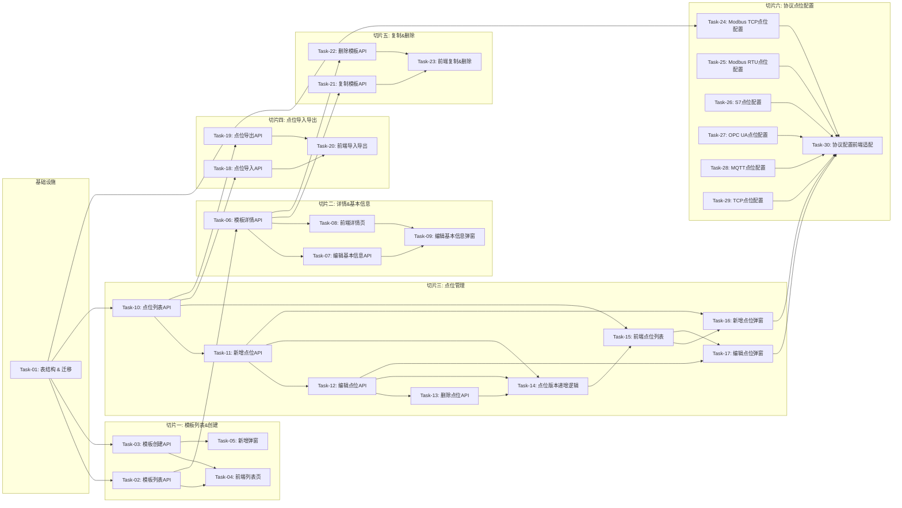

# 设备模型管理 — 开发任务计划

## 1. 任务概览

**总任务数**：30 个
**预计总工时**：约 1800 分钟（约 30 小时）
**开发方法**：TDD — 每个任务按 RED → GREEN → REFACTOR 循环执行

**关键标注**：
- 🔒 阻塞任务：被多个任务依赖，建议优先完成
- ⚠️ 风险任务：技术难度高，可能需要额外时间

### 依赖关系图

### 可并行任务组

| 并行组 | 任务 | 说明 |
|--------|------|------|
| A | Task-24 ~ Task-29 | 6 种协议的点位配置解析逻辑相互独立，可并行开发 |
| B | Task-18, Task-19 | 导入和导出逻辑独立，可并行 |
| C | Task-05, Task-09 | 两个弹窗组件独立开发 |

---

## 2. 开发任务

### 基础设施

**阶段完成标准**：DeviceModel 和 PointModel 表结构就绪，迁移脚本可执行，协议配置的 JSON Schema 定义完成。

---

#### Task-01: 设备模型表结构 & 迁移 🔒

**通俗解释**：把设备模型和点位表建好，模板和点位是一对多关系，点位配置用 JSON 存，支持不同协议的不同字段。

**做什么**：
1. 重构 DeviceModel 表：去掉 groupId，增加 version（整数，默认 1），status（枚举）
2. 新增 PointModel 表：id、modelId、name、tag、dataType、address、unit、description、config（JSON）、sort
3. DeviceModel 与 PointModel 一对多关系
4. dataType 枚举：INT16/UINT16/INT32/UINT32/FLOAT32/FLOAT64/BOOL/STRING
5. config 字段存协议特定配置（slaveId、registerType、startAddress 等）
6. 生成 migration 脚本

**涉及文件**：
- `backend/prisma/schema.prisma`
- `backend/prisma/migrations/`

**参考**：技术方案 第3章 → AC-001, AC-006

**依赖**：无

**预估工时**：90 分钟

**验证标准**：
- [x] prisma migrate dev 执行成功
- [x] DeviceModel 表有 version 字段（Int，默认 1）
- [x] PointModel 表存在，modelId 外键关联 DeviceModel
- [x] PointModel 的 config 字段是 JSON 类型
- [x] dataType 是枚举类型，包含 INT16/UINT16/INT32/UINT32/FLOAT32/FLOAT64/BOOL/STRING
- [x] 可以插入一条 DeviceModel 和若干 PointModel 记录

---

### 切片一：模板列表 & 创建

**阶段完成标准**：用户可以看到设备模型列表，按名称搜索筛选，点击新增弹出表单填写基本信息，创建成功后列表出现新模板。

---

#### Task-02: 模板列表 API（筛选分页）

**通俗解释**：前端调列表接口，能按名称搜、按协议筛，返回分页数据。

**做什么**：
1. getDeviceModels 服务函数
2. 筛选条件：name（模糊）、protocol（精确）
3. 分页：page、pageSize
4. 返回列表含：id、modelDI、name、protocol、version、createdAt、pointCount
5. pointCount 是关联点位数量
6. 按更新时间倒序

**涉及文件**：
- `backend/src/modules/device-model/device-model.service.ts`
- `backend/src/modules/device-model/device-model.controller.ts`
- `backend/src/modules/device-model/device-model.dto.ts`

**参考**：技术方案 4章 → AC-001

**依赖**：Task-01

**预估工时**：45 分钟

**验证标准**：
- [x] GET /api/device-models → 返回 list + total
- [x] ?name=温度 → 只返回名称含"温度"的模板
- [x] ?protocol=MODBUS_TCP → 只返回 Modbus TCP 的模板
- [x] ?page=2&pageSize=10 → 返回第 2 页
- [x] 每条记录包含 pointCount（点位数量）
- [x] 默认按 updatedAt 倒序

---

#### Task-03: 创建设备模板 API 🔒

**通俗解释**：用户填写基本信息（名称、型号、协议、备注），提交后创建一个新版本号为 1 的模板。

**做什么**：
1. createDeviceModel 服务函数
2. 必填字段：name、modelDI、protocol
3. 可选字段：description
4. version 自动设为 1
5. 校验 modelDI 唯一
6. 返回新创建的模板详情

**涉及文件**：
- `backend/src/modules/device-model/device-model.service.ts`
- `backend/src/modules/device-model/device-model.controller.ts`
- `backend/src/modules/device-model/device-model.dto.ts`

**参考**：技术方案 5章 → AC-002

**依赖**：Task-01

**预估工时**：45 分钟

**验证标准**：
- [x] POST 传入正确参数 → 返回 201，data 含 id 和 version=1
- [x] 数据库中新增一条记录，version = 1
- [x] 不传 name → 返回 400
- [x] 不传 modelDI → 返回 400
- [x] modelDI 重复 → 返回 409
- [x] protocol 不是枚举值 → 返回 400

---

#### Task-04: 前端模板列表页

**通俗解释**：有个设备模型列表页面，顶部有搜索和筛选，右上角有新增按钮，中间是表格。

**做什么**：
1. 列表表格：模型DI、模型名称、协议、版本号、点位数量、创建时间、操作
2. 顶部搜索框（按名称/型号搜索）
3. 协议筛选下拉（全部/Modbus TCP/Modbus RTU/S7/OPC UA/MQTT/TCP）
4. 分页组件
5. 空状态展示
6. 行操作：查看详情、复制、删除

**涉及文件**：
- `frontend/src/pages/device-model/List.tsx`
- `frontend/src/stores/deviceModel.store.ts`

**参考**：技术方案 → AC-001

**依赖**：Task-02

**预估工时**：60 分钟

**验证标准**：
- [x] 页面加载后显示表格，有 mock 数据
- [x] 搜索框输入关键字 → 列表过滤
- [x] 协议下拉选择 Modbus TCP → 只显示该协议的
- [x] 底部有分页
- [x] 空状态显示"暂无数据"
- [x] 行操作有三个按钮

---

#### Task-05: 前端新增模板弹窗

**通俗解释**：点新增按钮弹出一个表单，填基本信息就能创建设备模板。

**做什么**：
1. 新增弹窗组件
2. 表单字段：模型DI、模型名称、协议类型（下拉）、备注
3. 必填校验
4. modelDI 格式校验（字母数字下划线）
5. 提交中 loading
6. 提交成功后关闭弹窗并刷新列表

**涉及文件**：
- `frontend/src/pages/device-model/components/CreateModal.tsx`

**参考**：技术方案 → AC-002

**依赖**：Task-03

**预估工时**：60 分钟

**验证标准**：
- [x] 点新增按钮 → 弹窗出现
- [x] 表单为空时点确定 → 各字段下方显示红色错误提示
- [x] 选了协议、填了名称和型号 → 提交成功，弹窗关闭
- [x] modelDI 填中文 → 提示格式错误
- [x] 提交中按钮显示 loading，不可重复点击
- [x] 成功后列表自动刷新

---

### 切片二：详情页 & 基本信息编辑

**阶段完成标准**：点击模板名称进入详情页，上方显示基本信息（带编辑按钮），下方显示点位列表（空的，下个切片填）。

---

#### Task-06: 模板详情 API 🔒

**通俗解释**：查单个模板的详情，返回基本信息和点位列表。

**做什么**：
1. getDeviceModelById 服务函数
2. 返回基本信息：id、modelDI、name、protocol、version、description、createdAt、updatedAt
3. 关联返回 points 数组（包含点位所有字段）
4. 点位按 sort 字段排序
5. 模板不存在返回 404

**涉及文件**：
- `backend/src/modules/device-model/device-model.service.ts`
- `backend/src/modules/device-model/device-model.controller.ts`

**参考**：技术方案 4章 → AC-007

**依赖**：Task-01

**预估工时**：30 分钟

**验证标准**：
- [x] GET /api/device-models/:id → 返回完整详情 + points 数组
- [x] points 按 sort 升序排列
- [x] 不存在的 id → 返回 404
- [x] 返回 version 字段

---

#### Task-07: 编辑基本信息 API（不升级版本）

**通俗解释**：修改模板的名称、备注这些基本信息，版本号不变。

**做什么**：
1. updateDeviceModelBasic 服务函数
2. 可编辑字段：name、modelDI、description
3. modelDI 唯一性校验（排除自身）
4. version 保持不变
5. 不能修改 protocol（协议不可变）
6. 返回更新后的模板

**涉及文件**：
- `backend/src/modules/device-model/device-model.service.ts`
- `backend/src/modules/device-model/device-model.controller.ts`
- `backend/src/modules/device-model/device-model.dto.ts`

**参考**：技术方案 5.3节 → AC-003, AC-014

**依赖**：Task-06

**预估工时**：45 分钟

**验证标准**：
- [x] PUT /api/device-models/:id/basic 传入 name 新值 → 名称更新，version 不变
- [x] 传 description → 备注更新
- [x] 试图修改 protocol → 忽略，不报错
- [x] modelDI 和其他模板重复 → 返回 409
- [x] 不存在的 id → 返回 404

---

#### Task-08: 前端模板详情页

**通俗解释**：点模板名称进入详情页，上面一块显示基本信息（带编辑按钮），下面一块显示点位列表（先空着，下个切片加）。

**做什么**：
1. 详情页布局：顶部返回 + 标题 + 状态，中间内容区
2. 基本信息卡片：模型DI、模型名称、协议类型、版本号、备注、创建时间
3. 编辑按钮（在基本信息卡片右上角）
4. 点位列表区域（占位，下个切片填充）
5. 从列表页跳转，返回按钮能回去

**涉及文件**：
- `frontend/src/pages/device-model/Detail.tsx`
- `frontend/src/pages/device-model/components/BasicInfoSection.tsx`

**参考**：技术方案 → AC-007

**依赖**：Task-06

**预估工时**：60 分钟

**验证标准**：
- [x] 从列表点名称 → 跳转到详情页，URL 带 ID
- [x] 基本信息卡片显示所有字段
- [x] 版本号显示正确
- [x] 右上角有编辑按钮
- [x] 点位列表区域存在（显示空状态）
- [x] 返回按钮 → 回到列表页

---

#### Task-09: 前端编辑基本信息弹窗

**通俗解释**：点基本信息旁边的编辑按钮，弹出一个和新增类似的表单，改完保存基本信息就更新了，版本号不变。

**做什么**：
1. 编辑弹窗组件
2. 表单字段：模型DI、模型名称、备注（协议不可编辑，灰掉显示）
3. 回填当前值
4. 提交中 loading
5. 保存成功后关闭弹窗，基本信息卡片刷新
6. 版本号不变化（验证点：保存后看版本号还是原来的）

**涉及文件**：
- `frontend/src/pages/device-model/components/EditBasicModal.tsx`

**参考**：技术方案 → AC-003, AC-014

**依赖**：Task-07, Task-08

**预估工时**：45 分钟

**验证标准**：
- [x] 点编辑按钮 → 弹窗出现，表单回填当前值
- [x] 协议字段是禁用状态，不能改
- [x] 改名称 → 保存后卡片名称变了，版本号没变
- [x] 改备注 → 保存后备注更新
- [x] modelDI 改重复了 → 提示错误
- [x] 提交中按钮 loading

---

### 切片三：点位管理（核心切片）

**阶段完成标准**：详情页下方有点位列表，可以新增、编辑、删除点位。每次点位增删改后模板版本号 +1。

---

#### Task-10: 点位列表 API 🔒

**通俗解释**：查某个模板的所有点位，支持分页和按名称搜索。

**做什么**：
1. getModelPoints 服务函数
2. 参数：modelId、name（模糊搜索）、page、pageSize
3. 返回点位列表 + 总数
4. 点位包含：id、name、tag、dataType、address、unit、description、config
5. 按 sort 排序
6. 模板不存在返回 404

**涉及文件**：
- `backend/src/modules/device-model/device-model.service.ts`
- `backend/src/modules/device-model/device-model.controller.ts`

**参考**：技术方案 4章 → AC-008

**依赖**：Task-06

**预估工时**：45 分钟

**验证标准**：
- [x] GET /api/device-models/:id/points → 返回 list + total
- [x] 有 mock 数据时，返回的点位字段完整
- [x] ?name=温度 → 只返回名称含"温度"的点位
- [x] 按 sort 升序排列
- [x] 模板不存在 → 404

---

#### Task-11: 新增点位 API（版本 +1）

**通俗解释**：给模板加一个点位，加完后模板的版本号自动加 1。

**做什么**：
1. createPoint 服务函数
2. 输入：modelId + 点位数据（name, tag, dataType, address, unit, description, config）
3. 必填校验：name、tag、dataType
4. tag 在同模板内唯一
5. 自动计算 sort（放到最后）
6. 创建点位后，模板 version + 1
7. 返创建的点位

**涉及文件**：
- `backend/src/modules/device-model/device-model.service.ts`
- `backend/src/modules/device-model/device-model.controller.ts`
- `backend/src/modules/device-model/device-model.dto.ts`

**参考**：技术方案 5章 → AC-004, AC-005, AC-015

**依赖**：Task-10

**预估工时**：60 分钟

**验证标准**：
- [x] POST 新建点位 → 返回 201，点位创建成功
- [x] 创建后模板 version 比原来大 1
- [x] 同模板 tag 重复 → 返回 409
- [x] 不传 name → 返回 400
- [x] 模板不存在 → 404

---

#### Task-12: 编辑点位 API（版本 +1）

**通俗解释**：修改点位的配置，改完后模板版本号 +1。

**做什么**：
1. updatePoint 服务函数
2. 可修改：name、tag、dataType、address、unit、description、config
3. tag 唯一性校验（排除自身）
4. 更新后模板 version + 1
5. 点位不存在返回 404
6. 返回更新后的点位

**涉及文件**：
- `backend/src/modules/device-model/device-model.service.ts`
- `backend/src/modules/device-model/device-model.controller.ts`

**参考**：技术方案 5章 → AC-006, AC-015

**依赖**：Task-11

**预估工时**：45 分钟

**验证标准**：
- [x] PUT 修改点位名称 → 名称更新，模板 version + 1
- [x] 修改 config → 配置更新，version + 1
- [x] tag 改成和其他点位重复 → 409
- [x] 点位不存在 → 404
- [x] 只改一个字段，其他字段保持不变

---

#### Task-13: 删除点位 API（版本 +1）

**通俗解释**：删掉一个点位，删完模板版本号 +1。

**做什么**：
1. deletePoint 服务函数
2. 删除 PointModel 记录
3. 删除后模板 version + 1
4. 重新排序 sort（删除后的点位 sort 补位）
5. 返回删除成功
6. 点位不存在返回 404

**涉及文件**：
- `backend/src/modules/device-model/device-model.service.ts`
- `backend/src/modules/device-model/device-model.controller.ts`

**参考**：技术方案 5章 → AC-006

**依赖**：Task-12

**预估工时**：30 分钟

**验证标准**：
- [x] DELETE 删除点位 → 数据库查不到该点位
- [x] 删除后模板 version + 1
- [x] 点位不存在 → 404
- [x] 删除后，后面的点位 sort 值补上（保持连续）

---

#### Task-14: 版本递增逻辑统一封装 ⚠️

**通俗解释**：把"点位变化后版本 +1"这个逻辑统一封装，避免到处写重复代码，也防止并发问题。

**做什么**：
1. 封装 incrementModelVersion 函数
2. 使用事务：操作点位 + 版本递增在一个事务里
3. 防并发：乐观锁（version 字段作为版本号，更新时检查）
4. 新增、编辑、删除点位都调用这个函数
5. 并发冲突时返回 409 冲突错误

**涉及文件**：
- `backend/src/modules/device-model/device-model.service.ts`

**参考**：技术方案 5.3节 → AC-015

**依赖**：Task-13

**预估工时**：60 分钟

**验证标准**：
- [x] 新增点位调用 → version +1
- [x] 编辑点位调用 → version +1
- [x] 删除点位调用 → version +1
- [x] 并发更新（模拟两个请求同时改） → 一个成功一个返回 409
- [x] 点位操作失败 → 版本也不递增（事务回滚）

---

#### Task-15: 前端点位列表

**通俗解释**：详情页下方有个点位列表表格，表头是点位名称、点位标识、数据类型、地址、单位、操作。

**做什么**：
1. 详情页点位列表区域
2. 表格列：点位名称、点位标识、数据类型、地址、单位、操作
3. 顶部：搜索框（按名称/标识搜）+ 新增点位按钮
4. 分页
5. 行操作：编辑、删除
6. 删除二次确认
7. 空状态

**涉及文件**：
- `frontend/src/pages/device-model/Detail.tsx`
- `frontend/src/pages/device-model/components/PointList.tsx`

**参考**：技术方案 → AC-008

**依赖**：Task-10, Task-08

**预估工时**：60 分钟

**验证标准**：
- [x] 详情页下方显示点位列表表格
- [x] 有数据时表格正确渲染
- [x] 搜索框输入 → 列表过滤
- [x] 空状态显示"暂无点位，点击新增"
- [x] 行操作有编辑和删除
- [x] 删除弹窗二次确认

---

#### Task-16: 前端新增点位弹窗 ⚠️

**通俗解释**：点新增点位弹出一个表单，选协议不同，下面显示的字段也不一样。

**做什么**：
1. 新增点位弹窗组件
2. 公共字段：点位名称、点位标识、数据类型、单位、描述
3. 协议特定字段区域：根据模板协议类型动态渲染
4. 表单校验（必填字段）
5. 提交中 loading
6. 提交成功后关闭弹窗，点位列表刷新，模板版本号 +1
7. 地址字段格式校验（根据协议不同）

**涉及文件**：
- `frontend/src/pages/device-model/components/CreatePointModal.tsx`
- `frontend/src/pages/device-model/components/point-config/` （各协议配置表单）

**参考**：技术方案 → AC-004, AC-009, AC-011

**依赖**：Task-11, Task-24 ~ Task-30（协议配置）

**预估工时**：120 分钟

**验证标准**：
- [x] 点新增点位 → 弹窗出现
- [x] Modbus TCP 协议的模板 → 显示站号、寄存器类型、起始地址等字段
- [x] S7 协议的模板 → 显示 DB 号、偏移量等字段
- [x] 必填项为空 → 提交时报错
- [x] 填写正确 → 提交成功，列表多了一条，版本号 +1
- [x] 点位标识重复 → 提示错误

---

#### Task-17: 前端编辑点位弹窗

**通俗解释**：点列表行的编辑，弹出表单回填当前值，改完保存版本号 +1。

**做什么**：
1. 编辑点位弹窗组件（复用新增弹窗的布局）
2. 回填当前点位所有字段
3. 协议特定配置回填
4. 提交中 loading
5. 保存成功后关闭弹窗，列表刷新，版本号 +1
6. 点位标识唯一性校验（排除自身）

**涉及文件**：
- `frontend/src/pages/device-model/components/EditPointModal.tsx`

**参考**：技术方案 → AC-006

**依赖**：Task-12, Task-16

**预估工时**：60 分钟

**验证标准**：
- [x] 点编辑 → 弹窗出现，所有字段回填正确
- [x] 改点位名称 → 保存后列表更新，版本号 +1
- [x] 改地址配置 → 保存后配置更新
- [x] 点位标识改成重复的 → 提示错误
- [x] 取消按钮 → 不保存，关闭弹窗

---

### 切片四：点位导入导出

**阶段完成标准**：点位列表有导入和导出按钮，导出 Excel/CSV，导入批量创建点位。

---

#### Task-18: 点位批量导入 API

**通俗解释**：上传一个 Excel 文件，里面有很多点位，批量导入到模板里，导入完版本号 +1。

**做什么**：
1. importPoints 服务函数
2. 支持 .xlsx 和 .csv 格式
3. 解析文件内容，校验每一行
4. 校验项：必填字段、tag 唯一、数据类型合法
5. 全部校验通过才批量插入
6. 有错误就返回第几行什么错误，不导入任何一条
7. 导入成功后版本 +1
8. 返回导入成功数量

**涉及文件**：
- `backend/src/modules/device-model/device-model.service.ts`
- `backend/src/modules/device-model/device-model.controller.ts`

**参考**：技术方案 5章 → AC-008

**依赖**：Task-14

**预估工时**：90 分钟

**验证标准**：
- [x] 上传正确的 Excel → 返回成功数量，点位批量创建，版本 +1
- [x] 上传有一行错误的 Excel → 返回错误详情（行号+原因），不导入任何数据
- [x] 上传空文件 → 返回错误
- [x] 上传不支持的格式 → 返回错误
- [x] 有重复 tag 的 → 校验失败

---

#### Task-19: 点位导出 API

**通俗解释**：点导出按钮，下载一个包含所有点位的 Excel 文件。

**做什么**：
1. exportPoints 服务函数
2. 查询模板所有点位
3. 生成 Excel 文件（xlsx）
4. 列：点位名称、点位标识、数据类型、地址、单位、描述 + 协议配置字段
5. 设置 Content-Type 和 Content-Disposition
6. 返回文件流

**涉及文件**：
- `backend/src/modules/device-model/device-model.service.ts`
- `backend/src/modules/device-model/device-model.controller.ts`

**参考**：技术方案 4章 → AC-008

**依赖**：Task-10

**预估工时**：60 分钟

**验证标准**：
- [x] GET /api/device-models/:id/points/export → 返回文件流
- [x] Content-Type 是 application/vnd.openxmlformats-officedocument.spreadsheetml.sheet
- [x] 下载的 Excel 能正常打开
- [x] Excel 列名正确
- [x] 数据行数和数据库中一致
- [x] 协议配置字段正确展开显示

---

#### Task-20: 前端导入导出交互

**通俗解释**：点位列表右上角有导入和导出按钮，导入有弹窗预览，导出直接下载文件。

**做什么**：
1. 导出按钮：点击调用导出接口，触发浏览器下载
2. 导入按钮：点击弹出导入弹窗
3. 导入弹窗：文件选择 + 拖拽上传
4. 文件格式校验（前端）
5. 上传中 loading
6. 上传成功提示 + 关闭后刷新列表
7. 上传失败显示错误详情列表

**涉及文件**：
- `frontend/src/pages/device-model/components/PointList.tsx`
- `frontend/src/pages/device-model/components/ImportPointsModal.tsx`

**参考**：技术方案 → AC-008

**依赖**：Task-18, Task-19

**预估工时**：75 分钟

**验证标准**：
- [x] 点导出按钮 → 浏览器下载 Excel 文件
- [x] 点导入按钮 → 弹窗出现
- [x] 拖拽 Excel 文件到弹窗 → 上传中状态
- [x] 上传成功 → 提示成功 N 条，关闭后列表刷新
- [x] 上传 txt 文件 → 前端提示格式不支持
- [x] 上传有错误的 Excel → 弹窗显示错误列表

---

### 切片五：模板复制 & 删除

**阶段完成标准**：列表行操作可以复制模板（新版本 1）、删除模板（带二次确认）。

---

#### Task-21: 复制模板 API

**通俗解释**：点复制，生成一个新模板，点位数据也复制过去，新版本号是 1。

**做什么**：
1. copyDeviceModel 服务函数
2. 复制基本信息（name 后加"_副本"，modelDI 生成新的或加后缀）
3. 复制所有点位数据
4. 新模板 version = 1
5. 返回复制后的模板 ID
6. 原模板不受影响

**涉及文件**：
- `backend/src/modules/device-model/device-model.service.ts`
- `backend/src/modules/device-model/device-model.controller.ts`

**参考**：技术方案 5章 → AC-010

**依赖**：Task-06

**预估工时**：45 分钟

**验证标准**：
- [x] POST 复制 → 新模板创建成功，version = 1
- [x] 新模板点位数量和原模板一样
- [x] 新模板 name 是原名称 + "_副本"
- [x] 原模板数据完全没变
- [x] 原模板不存在 → 404

---

#### Task-22: 删除模板 API

**通俗解释**：删掉一个模板，连带它的所有点位一起删。

**做什么**：
1. deleteDeviceModel 服务函数
2. 级联删除所有关联点位
3. 返回删除成功
4. 模板不存在返回 404
5. 如果有设备实例使用了这个模板 → 不允许删除，返回 400

**涉及文件**：
- `backend/src/modules/device-model/device-model.service.ts`
- `backend/src/modules/device-model/device-model.controller.ts`

**参考**：技术方案 5章 → AC-012

**依赖**：Task-06

**预估工时**：30 分钟

**验证标准**：
- [x] DELETE 删除 → 模板和点位都从数据库消失
- [x] 模板不存在 → 404
- [x] 有实例关联时 → 返回 400，提示有设备实例使用
- [x] 没有关联时删除成功

---

#### Task-23: 前端复制 & 删除交互

**通俗解释**：列表行操作点复制就复制一个，点删除弹确认框确认后删掉。

**做什么**：
1. 复制按钮：点击后 loading，成功后提示"复制成功"，列表刷新
2. 删除按钮：点击弹出确认框，显示模板名称
3. 删除确认后调用 API，成功后列表刷新
4. 有关联实例不能删的错误提示

**涉及文件**：
- `frontend/src/pages/device-model/List.tsx`

**参考**：技术方案 → AC-010, AC-012

**依赖**：Task-21, Task-22

**预估工时**：30 分钟

**验证标准**：
- [x] 点复制 → 成功提示，列表多了一条"_副本"
- [x] 点删除 → 确认弹窗
- [x] 确认删除 → 列表少了一条
- [x] 有实例关联时删除 → 弹出错误提示
- [x] 取消删除 → 什么都不发生

---

### 切片六：协议点位配置（各协议差异）

**阶段完成标准**：6 种协议的点位配置字段定义清楚，新增/编辑点位时显示对应字段，数据正确保存到 config JSON。

---

#### Task-24: Modbus TCP 点位配置 🔒

**通俗解释**：Modbus TCP 协议的点位，需要配置站号、寄存器类型、起始地址这些特有字段。

**做什么**：
1. 定义 Modbus TCP 点位 config 的 TypeScript 类型
2. 字段：slaveId（站号）、registerType（寄存器类型：Coil/Holding/Input/Discrete）、startAddress（起始地址）、quantity（数量，默认1）、byteOrder（字节序：Big-Endian/Little-Endian）
3. 校验逻辑：站号 1-247、地址范围、寄存器类型和数据类型匹配
4. 地址转换逻辑（十进制地址 → Modbus 地址）
5. 写单元测试覆盖校验逻辑

**涉及文件**：
- `backend/src/modules/device-model/protocols/modbus-tcp.ts`
- `backend/src/types/protocol.ts`

**参考**：技术方案 6章 → AC-009

**依赖**：Task-01

**预估工时**：60 分钟

**验证标准**：
- [x] 正确的 Modbus TCP 配置 → 校验通过
- [x] slaveId = 0 → 校验失败，提示 1-247
- [x] slaveId = 248 → 校验失败
- [x] registerType = Holding, dataType = FLOAT32 → 通过
- [x] registerType = Coil, dataType = FLOAT32 → 校验失败，线圈不支持浮点
- [x] startAddress = 40001 → 校验通过

---

#### Task-25: Modbus RTU 点位配置

**通俗解释**：Modbus RTU 和 TCP 差不多，就是多了串口参数（波特率、数据位、停止位、校验位）。

**做什么**：
1. 定义 Modbus RTU config 类型
2. 复用 TCP 的寄存器配置
3. 增加串口参数：baudRate（9600/19200/38400/57600/115200）、dataBits（7/8）、stopBits（1/2）、parity（None/Even/Odd）
4. 串口参数校验
5. 单元测试

**涉及文件**：
- `backend/src/modules/device-model/protocols/modbus-rtu.ts`
- `backend/src/types/protocol.ts`

**参考**：技术方案 6章 → AC-009

**依赖**：Task-24

**预估工时**：45 分钟

**验证标准**：
- [x] 正确的 RTU 配置 → 校验通过
- [x] baudRate = 1234 → 校验失败，不在枚举值
- [x] dataBits = 7, parity = None → 校验失败，7位数据位需要校验
- [x] stopBits = 1, baudRate = 9600 → 通过
- [x] 寄存器配置部分和 TCP 一样

---

#### Task-26: S7 点位配置

**通俗解释**：西门子 S7 协议的点位，配置 DB 号、偏移量、位号这些。

**做什么**：
1. 定义 S7 config 类型
2. 字段：area（区域：DB/M/I/Q/CT/TM）、dbNumber（DB号）、byteOffset（字节偏移）、bitOffset（位偏移，0-7，BOOL类型用）
3. 校验逻辑：area 和数据类型匹配、DB 号范围、偏移量范围
4. BOOL 类型必须指定位偏移
5. 单元测试

**涉及文件**：
- `backend/src/modules/device-model/protocols/s7.ts`
- `backend/src/types/protocol.ts`

**参考**：技术方案 6章 → AC-009

**依赖**：Task-01

**预估工时**：60 分钟

**验证标准**：
- [x] area = DB, dbNumber = 1, byteOffset = 0, dataType = INT16 → 通过
- [x] dataType = BOOL, 没有 bitOffset → 校验失败
- [x] dataType = BOOL, bitOffset = 3 → 通过
- [x] area = I, dataType = INT16 → 通过（I区不需要DB号）
- [x] dbNumber = 65536 → 校验失败，超出范围

---

#### Task-27: OPC UA 点位配置

**通俗解释**：OPC UA 协议的点位，用 NodeId 来标识节点。

**做什么**：
1. 定义 OPC UA config 类型
2. 字段：nodeId（节点ID，如 ns=2;s=Temperature）、namespaceIndex（命名空间索引）、browseName（浏览名，可选）
3. NodeId 格式校验（ns=;s= / ns=;i= / ns=;g= 等格式）
4. 提取 namespaceIndex
5. 单元测试

**涉及文件**：
- `backend/src/modules/device-model/protocols/opcua.ts`
- `backend/src/types/protocol.ts`

**参考**：技术方案 6章 → AC-009

**依赖**：Task-01

**预估工时**：45 分钟

**验证标准**：
- [x] nodeId = "ns=2;s=Temperature" → 校验通过，namespaceIndex = 2
- [x] nodeId = "ns=3;i=1001" → 通过
- [x] nodeId = "invalid" → 校验失败，格式不正确
- [x] nodeId = "ns=0;s=Server" → 通过
- [x] browseName 可选，填不填都可以

---

#### Task-28: MQTT 点位配置

**通俗解释**：MQTT 协议的点位，配置主题和 JSON 路径，用于从消息中提取数据。

**做什么**：
1. 定义 MQTT config 类型
2. 字段：topic（订阅主题）、jsonPath（JSON路径，如 $.data.temperature）、qos（0/1/2，默认0）
3. 主题格式校验（支持通配符 +/#）
4. jsonPath 格式基本校验
5. 单元测试

**涉及文件**：
- `backend/src/modules/device-model/protocols/mqtt.ts`
- `backend/src/types/protocol.ts`

**参考**：技术方案 6章 → AC-009

**依赖**：Task-01

**预估工时**：45 分钟

**验证标准**：
- [x] topic = "device/+/data", jsonPath = "$.temp" → 通过
- [x] topic = "sensor/#" → 通过
- [x] 空 topic → 校验失败
- [x] jsonPath = "$.data[0].value" → 通过
- [x] qos = 3 → 校验失败，只能 0/1/2

---

#### Task-29: TCP 点位配置

**通俗解释**：自定义 TCP 协议的点位，配置报文格式和解析规则。

**做什么**：
1. 定义 TCP config 类型
2. 字段：requestHex（请求报文，十六进制）、responseOffset（响应偏移字节数）、byteOrder（字节序）
3. 请求报文十六进制格式校验
4. 偏移量非负校验
5. 单元测试

**涉及文件**：
- `backend/src/modules/device-model/protocols/tcp.ts`
- `backend/src/types/protocol.ts`

**参考**：技术方案 6章 → AC-009

**依赖**：Task-01

**预估工时**：45 分钟

**验证标准**：
- [x] requestHex = "010300000002C40B" → 通过
- [x] requestHex = "ZZZZ" → 校验失败，不是合法十六进制
- [x] responseOffset = 3, byteOrder = Big-Endian → 通过
- [x] responseOffset = -1 → 校验失败
- [x] 空 requestHex → 校验失败

---

#### Task-30: 前端协议配置表单适配 ⚠️

**通俗解释**：新增/编辑点位弹窗里，根据模板协议类型动态显示不同的配置表单，字段校验也不一样。

**做什么**：
1. 创建 6 个协议配置表单组件（ModbusTcpConfigForm、S7ConfigForm 等）
2. 统一的 props 接口：value、onChange、readonly
3. 每个组件包含对应协议的所有配置字段
4. 每个组件有自己的校验规则
5. 在新增/编辑点位弹窗中根据协议类型动态加载
6. 表单值统一汇入 point.config 对象

**涉及文件**：
- `frontend/src/pages/device-model/components/point-config/ModbusTcpConfigForm.tsx`
- `frontend/src/pages/device-model/components/point-config/ModbusRtuConfigForm.tsx`
- `frontend/src/pages/device-model/components/point-config/S7ConfigForm.tsx`
- `frontend/src/pages/device-model/components/point-config/OpcUaConfigForm.tsx`
- `frontend/src/pages/device-model/components/point-config/MqttConfigForm.tsx`
- `frontend/src/pages/device-model/components/point-config/TcpConfigForm.tsx`
- `frontend/src/pages/device-model/components/point-config/index.tsx` （动态加载器）

**参考**：技术方案 → AC-009, AC-011

**依赖**：Task-24, Task-25, Task-26, Task-27, Task-28, Task-29

**预估工时**：120 分钟

**验证标准**：
- [x] Modbus TCP 模板新增点位 → 显示站号、寄存器类型、起始地址等字段
- [x] S7 模板新增点位 → 显示区域、DB号、字节偏移、位偏移
- [x] OPC UA 模板新增点位 → 显示 NodeId、命名空间
- [x] MQTT 模板新增点位 → 显示主题、JSON路径、QoS
- [x] 每个表单的必填校验正常工作
- [x] 编辑时能正确回填协议配置数据
- [x] 切换不同协议的模板 → 配置表单跟着变

---

## 3. AC 覆盖总表

| AC 编号 | 验收标准概述 | 承接任务 | 验证方式 |
|---------|-------------|---------|---------|
| AC-001 | 模板列表展示 | Task-02, Task-04 | 列表API返回分页，前端渲染 |
| AC-002 | 创建设备模板 | Task-03, Task-05 | 新增API创建成功，前端弹窗 |
| AC-003 | 编辑基本信息不升级版本 | Task-07, Task-09 | 编辑后version不变 |
| AC-004 | 新增点位升级版本 | Task-11, Task-14, Task-16 | 新增点位后version+1 |
| AC-005 | 新增点位配置项 | Task-11, Task-16, Task-24~30 | 各协议配置字段正确保存 |
| AC-006 | 编辑/删除点位升级版本 | Task-12, Task-13, Task-17 | 编辑删除后version+1 |
| AC-007 | 模板详情展示 | Task-06, Task-08 | 详情API返回完整信息 |
| AC-008 | 点位列表/导入/导出 | Task-10, Task-18, Task-19, Task-20 | 列表、导入、导出功能正常 |
| AC-009 | 各协议配置字段差异 | Task-24 ~ Task-30 | 6种协议配置校验通过 |
| AC-010 | 复制模板 | Task-21, Task-23 | 复制后新模板点位完整，version=1 |
| AC-011 | 点位地址格式校验 | Task-24 ~ Task-30 | 各协议地址格式校验正确 |
| AC-012 | 删除模板 | Task-22, Task-23 | 删除后数据清除，有关联则拒绝 |
| AC-013 | 点位标识唯一 | Task-11, Task-12, Task-18 | 重复tag返回409 |
| AC-014 | 基本信息编辑不改版本 | Task-07, Task-09 | 编辑name/description后version不变 |
| AC-015 | 点位操作版本递增原子性 | Task-14 | 并发更新一个成功一个失败 |

---

## 4. 完成定义

- [x] 所有 30 个任务的验证标准（测试用例）全部通过
- [x] AC 覆盖总表中所有 AC 的验证方式已执行并通过
- [x] 数据库 migration 脚本在测试环境验证通过
- [x] 前端 2 个页面（列表、详情）+ 7 个弹窗组件均可正常操作
- [x] 6 种协议的点位配置（Modbus TCP/RTU、S7、OPC UA、MQTT、TCP）全部支持
- [x] 点位增删改后版本号正确递增，编辑基本信息不递增
- [x] 点位导入导出功能正常，Excel 格式正确
- [x] 模板复制功能验证通过
