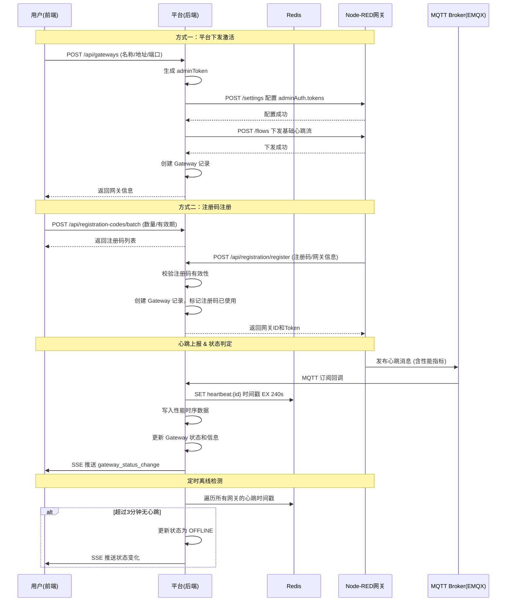
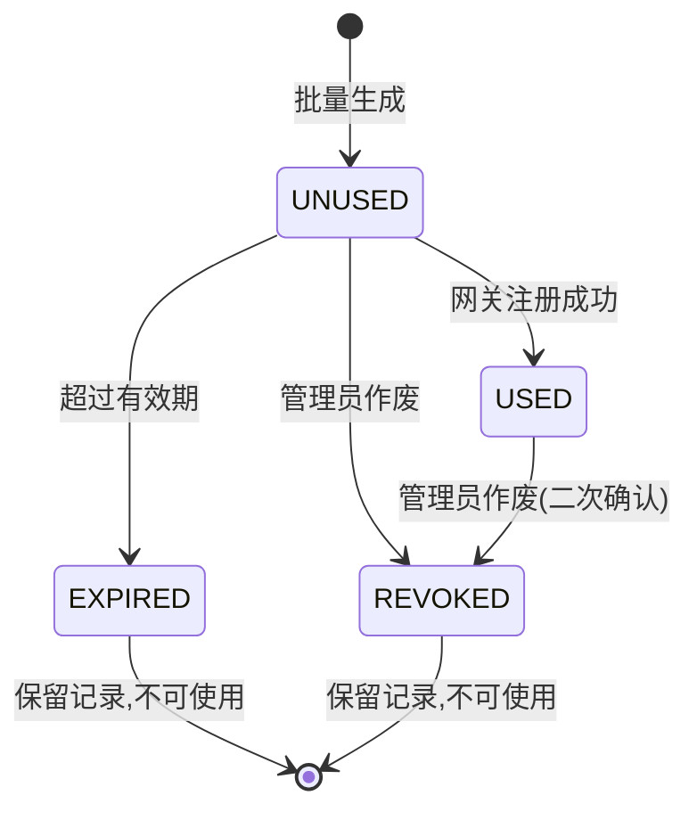

# 边缘网关管理与注册码管理 — 技术设计文档

## 1. 设计概要

**功能描述**：统一管理分布式 Node-RED 边缘网关的注册接入、状态监控、性能指标和断网缓存配置，支持两种注册方式（平台下发激活、手动注册码注册），以及注册码的批量生成、使用追踪和作废管理。

**影响范围**：
- 后端：`gateway` 模块、`registration` 模块、`heartbeat.service.ts`、`token.service.ts`
- 前端：`gateway/` 页面、`gateway.store.ts`、`useGatewaySSE.ts`
- 数据库：Gateway 表、RegistrationCode 表、GatewayPerformance 表（新增）、PlatformConfig 表（新增）

**技术难点**：
- Node-RED 自定义认证令牌与平台 Token 体系的双向整合
- 心跳超时判定的准确性与 SSE 实时推送的一致性
- 性能指标时序数据的高效存储与查询（7 天历史）

**外部依赖**：
- Node-RED Admin API（`/settings`、`/flows`）
- Redis（心跳缓存、Token 过期标记）
- EMQX MQTT Broker（网关数据上报）
- TimescaleDB（性能时序数据）

---

## 2. 架构概览

边缘网关管理是系统的基础模块，向上支撑设备实例管理和配置下发，向下对接 Node-RED 网关执行环境。

**核心流程**：
1. 网关通过「平台下发激活」或「注册码注册」两种方式接入平台
2. 接入后每 30 秒上报心跳（含性能指标），平台通过 Redis 缓存最新心跳时间戳
3. 定时任务（每 10 秒）扫描 Redis 判断网关在线/离线状态，状态变化通过 SSE 推送到前端
4. 注册码管理独立于网关管理，但注册流程依赖注册码校验



---

## 3. 数据库设计

### 新增表

#### `gateway_performance`

**用途**：存储网关性能指标历史数据（CPU、内存、磁盘），使用 TimescaleDB  hypert able 支持高效时间范围查询。

| 字段名 | 类型 | 约束 | 说明 |
|--------|------|------|------|
| gateway_id | TEXT | NOT NULL, FK → gateway.id | 网关ID |
| timestamp | TIMESTAMPTZ | NOT NULL | 采集时间 |
| cpu_usage | DOUBLE PRECISION | NOT NULL | CPU使用率（%） |
| memory_usage | DOUBLE PRECISION | NOT NULL | 内存使用率（%） |
| disk_usage | DOUBLE PRECISION | NOT NULL | 磁盘使用率（%） |
| disk_free_bytes | BIGINT | NOT NULL | 磁盘剩余空间（字节） |

**索引**：
- 主键：`(gateway_id, timestamp)`
- TimescaleDB hypertable 按 `timestamp` 分区（chunk_time_interval = 1 小时）
- 保留策略：7 天自动 drop_chunks

```sql
SELECT create_hypertable('gateway_performance', 'timestamp', chunk_time_interval => INTERVAL '1 hour');
SELECT add_retention_policy('gateway_performance', INTERVAL '7 days');
CREATE INDEX idx_gateway_performance_gateway_id ON gateway_performance (gateway_id, timestamp DESC);
```

#### `platform_config`

**用途**：存储平台级默认配置（断网缓存开关、保存期限、补发速率），单例模式。

| 字段名 | 类型 | 约束 | 说明 |
|--------|------|------|------|
| id | TEXT | PK, DEFAULT cuid() | 主键 |
| cache_enabled | BOOLEAN | DEFAULT false | 平台级缓存开关 |
| cache_retention_days | INT | DEFAULT 15 | 缓存保存期限（天） |
| cache_replay_rate | INT | DEFAULT 100 | 缓存补发速率（条/秒） |
| updated_at | TIMESTAMPTZ | DEFAULT now() | 更新时间 |

**索引**：单例表，仅一条记录，无额外索引

### 修改现有表

#### `Gateway` 表

**变更内容**：扩展缓存配置字段、补充性能相关字段，调整状态枚举值。

```sql
ALTER TABLE "Gateway" ADD COLUMN IF NOT EXISTS cache_retention_days INT DEFAULT 15;
ALTER TABLE "Gateway" ADD COLUMN IF NOT EXISTS cache_replay_rate INT DEFAULT 100;
ALTER TABLE "Gateway" ALTER COLUMN cache_enabled SET DEFAULT false;

-- 状态枚举调整（移除 ERROR、TOKEN_EXPIRED，保持需求文档的两种状态）
-- 注意：Prisma 不支持直接删除枚举值，使用新枚举替换
ALTER TYPE "GatewayStatus" ADD VALUE IF NOT EXISTS 'ONLINE';
ALTER TYPE "GatewayStatus" ADD VALUE IF NOT EXISTS 'OFFLINE';
```

**数据迁移**：
- 现有 `cache_enabled = true` 的网关保持不变
- 新增字段使用默认值填充

#### `RegistrationCode` 表

**变更内容**：重构注册码表，增加状态字段、使用追踪字段、作废字段，支持完整状态流转。

```sql
-- 增加状态枚举
CREATE TYPE "RegistrationCodeStatus" AS ENUM ('UNUSED', 'USED', 'EXPIRED', 'REVOKED');

-- 重构表结构
ALTER TABLE "RegistrationCode" ADD COLUMN IF NOT EXISTS status "RegistrationCodeStatus" DEFAULT 'UNUSED';
ALTER TABLE "RegistrationCode" ADD COLUMN IF NOT EXISTS gateway_id TEXT;
ALTER TABLE "RegistrationCode" ADD COLUMN IF NOT EXISTS used_at TIMESTAMPTZ;
ALTER TABLE "RegistrationCode" ADD COLUMN IF NOT EXISTS register_ip TEXT;
ALTER TABLE "RegistrationCode" ADD COLUMN IF NOT EXISTS revoked_at TIMESTAMPTZ;
ALTER TABLE "RegistrationCode" ADD COLUMN IF NOT EXISTS revoked_reason TEXT;
ALTER TABLE "RegistrationCode" ADD COLUMN IF NOT EXISTS batch_id TEXT;

-- 索引
CREATE INDEX IF NOT EXISTS idx_registration_code_status ON "RegistrationCode" (status);
CREATE INDEX IF NOT EXISTS idx_registration_code_expires_at ON "RegistrationCode" (expires_at);
CREATE INDEX IF NOT EXISTS idx_registration_code_gateway_id ON "RegistrationCode" (gateway_id);

-- 数据迁移：将 used 字段迁移到 status
-- UPDATE "RegistrationCode" SET status = 'USED' WHERE used = true;
```

**数据迁移**：
- 原有 `used = true` 的记录迁移为 `status = 'USED'`
- 原有 `used = false` 的记录迁移为 `status = 'UNUSED'`（需同时判断是否过期，过期的标记为 `EXPIRED`）

---

## 4. API 设计

> 遵循 RESTful 风格，统一响应格式 `{ success: boolean, data: any, error?: { code: string, message: string } }`

### `POST /api/gateways`

**描述**：平台下发激活网关 → AC-003

**鉴权**：需要登录

**Request**：
```json
{
  "name": "生产车间网关-01",
  "address": "192.168.1.100",
  "port": 1880
}
```

**Response（成功）**：
```json
{
  "success": true,
  "data": {
    "id": "cuid_xxx",
    "name": "生产车间网关-01",
    "address": "192.168.1.100",
    "port": 1880,
    "status": "ONLINE",
    "adminToken": "generated_token_xxx",
    "createdAt": "2024-03-15T10:00:00Z"
  }
}
```

**异常响应**：

| 场景 | 状态码 | 响应 | 对应 AC |
|------|--------|------|---------|
| 地址不可达 | 400 | `{ code: 'GATEWAY_UNREACHABLE', message: '无法连接到 Node-RED' }` | AC-003c |
| API 调用失败 | 400 | `{ code: 'ACTIVATION_FAILED', message: '激活失败：{具体原因}' }` | AC-003c |
| 网关已存在 | 409 | `{ code: 'GATEWAY_EXISTS', message: '该地址的网关已存在' }` | - |

### `GET /api/gateways`

**描述**：获取网关列表（支持筛选）→ AC-010

**鉴权**：需要登录

**Query 参数**：
- `name`：网关名称模糊搜索
- `ip`：IP 地址模糊搜索
- `status`：状态筛选（ONLINE/OFFLINE）
- `page`：页码（默认 1）
- `pageSize`：每页数量（默认 20）

**Response（成功）**：
```json
{
  "success": true,
  "data": {
    "list": [
      {
        "id": "cuid_xxx",
        "name": "生产车间网关-01",
        "address": "192.168.1.100",
        "status": "ONLINE",
        "nodeRedVersion": "3.1.2",
        "ip": "192.168.1.100",
        "flowCount": 5,
        "lastHeartbeat": "2024-03-15T10:00:00Z"
      }
    ],
    "total": 100,
    "page": 1,
    "pageSize": 20
  }
}
```

### `GET /api/gateways/:id`

**描述**：获取网关详情 → AC-022

**鉴权**：需要登录

**Response（成功）**：
```json
{
  "success": true,
  "data": {
    "id": "cuid_xxx",
    "name": "生产车间网关-01",
    "address": "192.168.1.100",
    "port": 1880,
    "status": "ONLINE",
    "nodeRedVersion": "3.1.2",
    "ip": "192.168.1.100",
    "flowCount": 5,
    "lastHeartbeat": "2024-03-15T10:00:00Z",
    "cacheEnabled": false,
    "cacheRetentionDays": 15,
    "cacheReplayRate": 100,
    "createdAt": "2024-03-15T10:00:00Z",
    "deviceCount": 10
  }
}
```

### `PUT /api/gateways/:id`

**描述**：编辑网关（名称、缓存配置）→ AC-007、AC-007a

**鉴权**：需要登录

**Request**：
```json
{
  "name": "新的网关名称",
  "cacheEnabled": true,
  "cacheRetentionDays": 30,
  "cacheReplayRate": 200
}
```

**Response（成功）**：
```json
{
  "success": true,
  "data": { "id": "cuid_xxx", "updated": true }
}
```

**异常响应**：

| 场景 | 状态码 | 响应 | 对应 AC |
|------|--------|------|---------|
| 网关不存在 | 404 | `{ code: 'NOT_FOUND', message: '网关不存在' }` | - |
| 补发速率超范围 | 400 | `{ code: 'INVALID_RATE', message: '补发速率范围 1-500' }` | AC-016 |

### `DELETE /api/gateways/:id`

**描述**：删除网关 → AC-013

**鉴权**：需要登录

**Response（成功）**：
```json
{
  "success": true,
  "data": { "deleted": true }
}
```

**异常响应**：

| 场景 | 状态码 | 响应 | 对应 AC |
|------|--------|------|---------|
| 网关不存在 | 404 | `{ code: 'NOT_FOUND', message: '网关不存在' }` | - |

### `POST /api/gateways/:id/test-connection`

**描述**：测试网关连接 → AC-004、AC-012

**鉴权**：需要登录

**Response（成功）**：
```json
{
  "success": true,
  "data": {
    "results": [
      { "name": "Node-RED 可达性", "passed": true, "message": "连接成功" },
      { "name": "MQTT 连接", "passed": true, "message": "连接正常" },
      { "name": "插件状态", "passed": false, "message": "插件未安装" }
    ],
    "allPassed": false
  }
}
```

### `GET /api/gateways/:id/performance`

**描述**：获取网关性能历史数据 → AC-022

**鉴权**：需要登录

**Query 参数**：
- `metric`：指标类型（cpu/memory/disk/all），默认 all
- `range`：时间范围（5m/30m/1h/6h/24h/7d），默认 5m

**Response（成功）**：
```json
{
  "success": true,
  "data": {
    "timestamps": ["2024-03-15T10:00:00Z", "..."],
    "cpuUsage": [45.2, 48.1, "..."],
    "memoryUsage": [62.3, 63.1, "..."],
    "diskUsage": [35.7, 35.8, "..."]
  }
}
```

### `POST /api/registration-codes/batch`

**描述**：批量生成注册码 → AC-026、AC-027

**鉴权**：需要登录

**Request**：
```json
{
  "count": 10,
  "validityDays": 30
}
```

**Response（成功）**：
```json
{
  "success": true,
  "data": {
    "batchId": "batch_xxx",
    "codes": [
      { "id": "cuid_1", "code": "abcd1234efgh5678", "status": "UNUSED", "expiresAt": "2024-04-14T10:00:00Z" }
    ],
    "total": 10
  }
}
```

**异常响应**：

| 场景 | 状态码 | 响应 | 对应 AC |
|------|--------|------|---------|
| 数量超过 50 | 400 | `{ code: 'EXCEED_LIMIT', message: '单次最多生成 50 个注册码' }` | AC-027 |
| 数量小于 1 | 400 | `{ code: 'INVALID_COUNT', message: '数量范围 1-50' }` | AC-027 |

### `GET /api/registration-codes`

**描述**：获取注册码列表 → AC-028

**鉴权**：需要登录

**Query 参数**：
- `status`：状态筛选（UNUSED/USED/EXPIRED/REVOKED）
- `page`：页码
- `pageSize`：每页数量

**Response（成功）**：
```json
{
  "success": true,
  "data": {
    "list": [
      {
        "id": "cuid_xxx",
        "code": "abcd1234efgh5678",
        "status": "USED",
        "gatewayName": "生产车间网关-01",
        "createdAt": "2024-03-15T10:00:00Z",
        "expiresAt": "2024-04-14T10:00:00Z",
        "usedAt": "2024-03-16T08:00:00Z"
      }
    ],
    "total": 100
  }
}
```

### `POST /api/registration-codes/:id/revoke`

**描述**：作废注册码 → AC-034、AC-035

**鉴权**：需要登录

**Request**：
```json
{
  "reason": "泄露作废"
}
```

**Response（成功）**：
```json
{
  "success": true,
  "data": { "revoked": true }
}
```

**异常响应**：

| 场景 | 状态码 | 响应 | 对应 AC |
|------|--------|------|---------|
| 注册码不存在 | 404 | `{ code: 'NOT_FOUND', message: '注册码不存在' }` | AC-037 |
| 已作废的注册码 | 400 | `{ code: 'ALREADY_REVOKED', message: '注册码已作废' }` | - |

### `POST /api/registration/register`

**描述**：网关使用注册码注册 → AC-001、AC-025

**鉴权**：不需要登录（公开接口，但需要有效注册码）

**Request**：
```json
{
  "code": "abcd1234efgh5678",
  "gatewayName": "车间网关-01",
  "nodeRedVersion": "3.1.2",
  "ip": "192.168.1.100",
  "flowCount": 2
}
```

**Response（成功）**：
```json
{
  "success": true,
  "data": {
    "gatewayId": "cuid_xxx",
    "adminToken": "generated_token_xxx",
    "mqttConfig": {
      "host": "emqx.example.com",
      "port": 1883,
      "topicPrefix": "gateway/cuid_xxx"
    }
  }
}
```

**异常响应**：

| 场景 | 状态码 | 响应 | 对应 AC |
|------|--------|------|---------|
| 注册码不存在 | 400 | `{ code: 'CODE_NOT_FOUND', message: '注册码不存在' }` | AC-037 |
| 注册码已使用 | 400 | `{ code: 'CODE_USED', message: '注册码已被使用' }` | AC-033 |
| 注册码已过期 | 400 | `{ code: 'CODE_EXPIRED', message: '注册码已过期' }` | AC-031 |
| 注册码已作废 | 400 | `{ code: 'CODE_REVOKED', message: '注册码已作废' }` | AC-032 |

### `POST /api/auth/token-verify`

**描述**：Node-RED 验证 Token 接口 → AC-042、AC-043、AC-044

**鉴权**：Basic Auth（平台内部调用凭证）

**Request**：
```json
{
  "token": "gateway_token_xxx"
}
```

**Response（有效）**：
```json
{
  "valid": true,
  "user": {
    "username": "gateway_xxx",
    "permissions": ["read"]
  }
}
```

**Response（无效）**：
```json
{
  "valid": false
}
```

### `GET /api/platform-config`

**描述**：获取平台级配置 → AC-018

**鉴权**：需要登录

**Response（成功）**：
```json
{
  "success": true,
  "data": {
    "cacheEnabled": false,
    "cacheRetentionDays": 15,
    "cacheReplayRate": 100
  }
}
```

### `PUT /api/platform-config`

**描述**：更新平台级配置 → AC-016

**鉴权**：需要登录

**Request**：
```json
{
  "cacheEnabled": true,
  "cacheRetentionDays": 30,
  "cacheReplayRate": 100
}
```

**Response（成功）**：
```json
{
  "success": true,
  "data": { "updated": true }
}
```

---

## 5. 核心逻辑

### 5.1 心跳状态判定 → AC-019、AC-024

**触发条件**：
1. 收到网关心跳消息（MQTT 订阅回调）
2. 定时任务每 10 秒扫描一次

**处理流程**：

1. **收到心跳时**：
   - 在 Redis 中设置 `heartbeat:{gatewayId} = 当前时间戳`，过期时间 240 秒
   - 如果网关当前状态为 OFFLINE，更新为 ONLINE
   - 通过 SSE 推送状态变化事件
   - 写入性能时序数据

2. **定时扫描时**：
   - 遍历所有网关
   - 从 Redis 获取最新心跳时间戳
   - 计算距当前时间的差值
   - 超过 3 分钟（180 秒）且当前状态为 ONLINE → 改为 OFFLINE
   - 未超过 3 分钟且当前状态为 OFFLINE → 改为 ONLINE
   - 状态变化时通过 SSE 推送

**伪代码**：
```
HEARTBEAT_TIMEOUT_MS = 3 * 60 * 1000  // 3 分钟
SCAN_INTERVAL_MS = 10 * 1000           // 10 秒扫描一次

function handleHeartbeat(gatewayId, payload):
    redis.set(`heartbeat:${gatewayId}`, Date.now(), EX=240)
    
    oldStatus = db.getGatewayStatus(gatewayId)
    newData = { lastHeartbeat: now(), ...payload }
    
    if oldStatus == OFFLINE:
        newData.status = ONLINE
    
    updated = db.updateGateway(gatewayId, newData)
    
    if oldStatus != updated.status:
        sse.broadcast('gateway_status_change', updated)
    
    insertPerformanceData(gatewayId, payload.performance)

function checkGatewayStatus():
    gateways = db.getAllGateways()
    for gateway in gateways:
        timestamp = redis.get(`heartbeat:${gateway.id}`)
        if not timestamp:
            isAlive = false
        else:
            isAlive = (Date.now() - parseInt(timestamp)) < HEARTBEAT_TIMEOUT_MS
        
        if isAlive and gateway.status == OFFLINE:
            updateAndBroadcast(gateway.id, ONLINE)
        elif not isAlive and gateway.status == ONLINE:
            updateAndBroadcast(gateway.id, OFFLINE)
```

### 5.2 注册码状态流转 → AC-038

**状态图**：


**状态流转规则**：

| 当前状态 | 可转换到 | 触发条件 |
|---------|---------|---------|
| UNUSED | USED | 网关使用该码注册成功 |
| UNUSED | EXPIRED | 系统检测到超过有效期 |
| UNUSED | REVOKED | 管理员手动作废 |
| USED | REVOKED | 管理员手动作废（需二次确认） |
| EXPIRED | - | 终态，不可转换 |
| REVOKED | - | 终态，不可转换 |

**过期检测**：
- 定时任务每小时执行一次，扫描 `status = UNUSED` 且 `expiresAt < now()` 的记录
- 更新状态为 `EXPIRED`

### 5.3 平台下发激活流程 → AC-003、AC-003a、AC-003b、AC-003c

**触发条件**：用户在平台填写 Node-RED 地址和端口，点击激活

**处理流程**：

1. 生成随机 adminToken（32 位十六进制）
2. 调用 Node-RED `/settings` API 验证是否可达
3. 通过 Node-RED Admin API 推送配置：
   - 设置 `adminAuth.type = 'credentials'`
   - 设置 `adminAuth.users[0].username = 'gateway_{id}'`
   - 设置 `adminAuth.users[0].permissions = ['read']`
   - 配置 token 验证函数，调用平台 `/api/auth/token-verify` 接口
4. 推送基础心跳流到 Node-RED `/flows`
5. 创建 Gateway 数据库记录
6. 返回网关信息和 adminToken

### 5.4 缓存配置优先级判定 → AC-018

**触发条件**：任何需要判断缓存是否启用的场景

**处理流程**：

1. 优先读取网关级配置 `gateway.cacheEnabled`
2. 如果网关级有明确配置（非 null），使用网关级
3. 否则使用平台级配置 `platformConfig.cacheEnabled`
4. 保存期限和补发速率同理，网关级优先

**伪代码**：
```
function getEffectiveCacheConfig(gatewayId):
    gateway = db.getGateway(gatewayId)
    platform = db.getPlatformConfig()
    
    return {
        enabled: gateway.cacheEnabled ?? platform.cacheEnabled,
        retentionDays: gateway.cacheRetentionDays ?? platform.cacheRetentionDays,
        replayRate: gateway.cacheReplayRate ?? platform.cacheReplayRate
    }
```

---

## 6. 现有代码改动

| 模块 / 文件 | 改动内容 | 原因 | 对应 AC |
|-------------|---------|------|---------|
| `prisma/schema.prisma` | 扩展 Gateway 表字段，扩展 RegistrationCode 表，新增 GatewayPerformance、PlatformConfig 表 | 支持缓存配置、注册码状态流转、性能时序数据 | AC-007a、AC-026、AC-021 |
| `gateway.service.ts` | 重构 createGateway 为 activateGateway（平台下发激活），增加测试连接三项测试，增加性能查询 | 对齐需求文档的激活流程和测试项 | AC-003、AC-004 |
| `gateway.controller.ts` | 增加缓存配置更新接口、性能查询接口、平台配置接口 | 新功能 API | AC-007a、AC-022、AC-016 |
| `registration.service.ts` | 重构为批量生成、状态管理、作废逻辑，与网关注册解耦 | 需求文档的注册码完整功能 | AC-026、AC-034、AC-035 |
| `heartbeat.service.ts` | 增加性能数据写入时序库，状态判定与需求对齐（仅 ONLINE/OFFLINE） | 新增性能监控功能 | AC-021、AC-019 |
| `token.service.ts` | 新增 Token 验证接口，供 Node-RED 调用 | 自定义认证令牌整合 | AC-042、AC-043、AC-044 |
| `frontend/pages/gateway/` | 重构网关列表、详情页，增加性能趋势图组件、缓存配置卡片 | 对齐功能交互文档 | AC-010、AC-022、AC-007a |
| `frontend/pages/gateway/RegistrationCodeModal.tsx` | 扩展为完整注册码管理页面 | 需求文档的注册码功能 | AC-026、AC-028 |
| `frontend/stores/gateway.store.ts` | 增加性能数据、注册码状态管理 | 新增功能状态 | AC-021、AC-026 |

---

## 7. 技术决策

### 性能数据存储选型

**背景**：网关性能指标（CPU/内存/磁盘）每 30 秒上报一次，需要支持 7 天历史查询和趋势图展示，写入频率高、查询多为时间范围。

**选项**：
- A: PostgreSQL 普通表 + 索引 — 简单直接，但数据量大后查询慢，7 天约 2 万条/网关
- B: TimescaleDB（PostgreSQL 扩展）— 自动分区、保留策略、时间序列优化，与现有技术栈兼容
- C: InfluxDB — 专业时序库，但需要单独部署和运维，与 Prisma 兼容性差

**结论**：选 B — TimescaleDB。项目已用 PostgreSQL，TimescaleDB 作为扩展无需引入新数据库，自动分块和保留策略满足性能需求，Prisma 可通过原始查询访问。

### 注册码状态设计

**背景**：注册码有未使用、已使用、已过期、已作废四种状态，需要支持状态流转查询和使用追踪。

**选项**：
- A: 多个布尔字段（used、expired、revoked）— 简单但状态组合多，逻辑分散
- B: 单一 status 枚举字段 — 状态集中，状态机清晰，查询方便

**结论**：选 B — 单一 status 枚举字段。四种状态互斥，用枚举更清晰，状态流转规则集中管理，查询和统计更方便。

### 平台级配置存储

**背景**：平台级缓存配置（开关、保存期限、补发速率）需要持久化存储，支持动态修改。

**选项**：
- A: 环境变量/配置文件 — 简单但修改需要重启，不支持动态调整
- B: 单独 PlatformConfig 表单例表 — 支持动态修改，立即生效，有变更记录
- C: 放在 Gateway 表中 gatewayId = null 的记录 — 复用表但语义模糊

**结论**：选 B — 单独 PlatformConfig 表。语义清晰，支持动态配置立即生效（AC-016），后续可扩展其他平台级配置项。

---

## 8. 安全与性能

**输入校验**：
- 所有 API 参数使用 zod 校验
- 注册码格式校验（32位十六进制）
- 补发速率范围校验（1-500）
- IP 地址格式校验

**缓存策略**：
- Redis 缓存心跳时间戳（TTL 240秒），避免频繁查库
- 平台级配置在服务端内存缓存，更新时失效

**性能考量**：
- 性能时序数据使用 TimescaleDB hypertable，时间范围查询高效
- 心跳数据写入使用批量插入（每秒一批），减少数据库压力
- 离线检测定时任务每 10 秒一次，平衡实时性和性能

**敏感数据处理**：
- adminToken 使用 bcrypt 哈希存储（数据库中不存明文）
- Token 验证接口使用 Basic Auth 保护，仅 Node-RED 内部调用
- 注册码生成使用 crypto 安全随机数

---

## 9. AC 覆盖总表

| AC 编号 | 验收标准概述 | 实现位置 |
|---------|-------------|---------|
| AC-001 | 主动注册新网关 | API POST /api/registration/register + registration.service |
| AC-002 | 主动注册已有网关 | 心跳处理 heartbeat.service.ts |
| AC-003 | 平台下发激活网关 | API POST /api/gateways + gateway.service.activateGateway |
| AC-003a | Token 验证生效 | API POST /api/auth/token-verify + token.service |
| AC-003b | 作废Token验证拒绝 | token.service + registration.service.revoke |
| AC-003c | 激活失败提示 | gateway.service.activateGateway 异常处理 |
| AC-004 | 测试连接三项 | API POST /api/gateways/:id/test-connection |
| AC-005 | 心跳超时判定离线 | heartbeat.service.checkGatewayStatus |
| AC-006 | 离线网关恢复心跳 | heartbeat.service.handleHeartbeat |
| AC-007 | 编辑网关名称 | API PUT /api/gateways/:id |
| AC-007a | 编辑网关缓存配置 | API PUT /api/gateways/:id + Gateway 表扩展字段 |
| AC-008 | 断网缓存触发 | 网关侧 Node-RED 插件（不在本模块实现） |
| AC-009 | 断网缓存补发 | 网关侧 Node-RED 插件（不在本模块实现） |
| AC-010 | 网关列表展示 | API GET /api/gateways + 前端 GatewayList |
| AC-012 | 测试连接部分失败 | test-connection 接口分项返回结果 |
| AC-013 | 删除网关 | API DELETE /api/gateways/:id |
| AC-014 | 缓存数据过期清理 | 网关侧 SQLite（不在本模块实现） |
| AC-015 | 缓存达到存储上限 | 网关侧 SQLite（不在本模块实现） |
| AC-016 | 缓存配置立即生效 | API PUT /api/gateways/:id + PUT /api/platform-config |
| AC-018 | 缓存开关优先级 | getEffectiveCacheConfig 工具函数 |
| AC-019 | 网关状态判定 | heartbeat.service.checkGatewayStatus |
| AC-020 | 缓存补发顺序 | 网关侧（不在本模块实现） |
| AC-021 | 性能指标上报 | heartbeat.service.handleHeartbeat + gateway_performance 表 |
| AC-022 | 性能趋势查看 | API GET /api/gateways/:id/performance + 前端趋势图 |
| AC-023 | 性能数据过期清理 | TimescaleDB retention_policy 自动清理 |
| AC-024 | 心跳频率 30 秒 | 网关侧心跳流配置 + 后端 3 分钟超时判定 |
| AC-025 | 使用注册码注册 | API POST /api/registration/register |
| AC-026 | 批量生成注册码 | API POST /api/registration-codes/batch |
| AC-027 | 批量生成上限校验 | registration.dto.ts + registration.service |
| AC-028 | 注册码列表展示 | API GET /api/registration-codes + 前端注册码页面 |
| AC-029 | 查看已使用注册码网关信息 | API GET /api/registration-codes/:id |
| AC-030 | 注册码过期自动标记 | 定时任务 + RegistrationCode.status |
| AC-031 | 已过期码注册失败 | registration.service.registerGateway 校验 |
| AC-032 | 已作废码注册失败 | registration.service.registerGateway 校验 |
| AC-033 | 已使用码注册失败 | registration.service.registerGateway 校验 |
| AC-034 | 作废未使用注册码 | API POST /api/registration-codes/:id/revoke |
| AC-035 | 作废已使用注册码 | API POST /api/registration-codes/:id/revoke + 二次确认 |
| AC-036 | 作废取消不变更 | 前端二次确认弹窗 |
| AC-037 | 不存在码注册失败 | registration.service.registerGateway 校验 |
| AC-038 | 注册码状态流转 | RegistrationCodeStatus 枚举 + 状态机 |
| AC-039 | 批量生成数量限制 | registration.dto.ts zod 校验 |
| AC-040 | 注册码作废效果 | token.service + registration.service.revoke |
| AC-041 | 注册码过期规则 | 定时任务 + expiresAt 字段 |
| AC-042 | Node-RED Token 实时验证 | API POST /api/auth/token-verify |
| AC-043 | Token 验证通过 | token.service.verifyToken + read 权限 |
| AC-044 | Token 验证拒绝 | token.service.verifyToken 返回 false |

---

## 附录：变更记录

| 日期 | 变更内容 | 原因 |
|------|---------|------|
| 2026-06-30 | 初始版本 | 完成边缘网关管理与注册码管理技术方案设计 |
