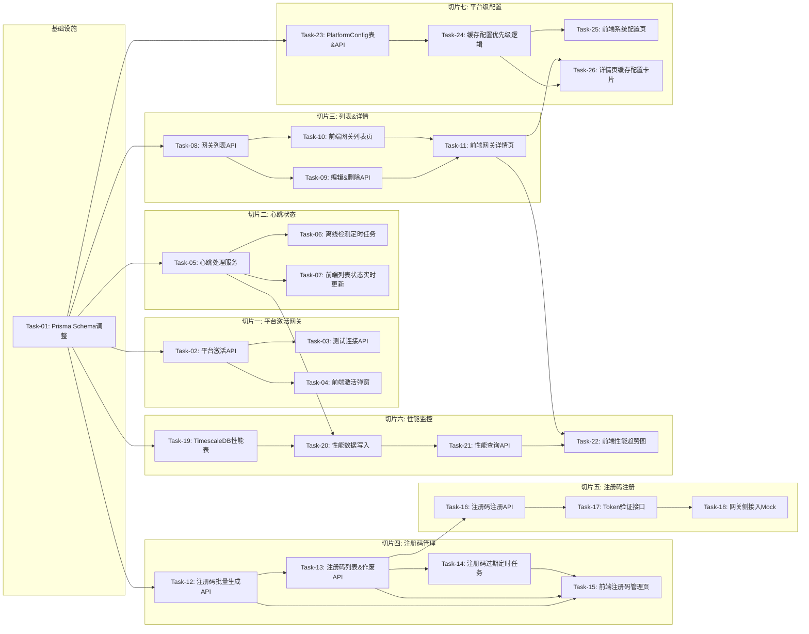

# 边缘网关管理 + 注册码管理 — 开发任务计划

## 1. 任务概览

**总任务数**：32 个
**预计总工时**：约 1920 分钟（约 32 小时）
**开发方法**：TDD — 每个任务按 RED → GREEN → REFACTOR 循环执行

**关键标注**：
- 🔒 阻塞任务：被多个任务依赖，建议优先完成
- ⚠️ 风险任务：技术难度高，可能需要额外时间

### 依赖关系图

### 可并行任务组

| 并行组 | 任务 | 说明 |
|--------|------|------|
| A | Task-04, Task-07 | 前端两个页面组件独立开发 |
| B | Task-15, Task-18 | 注册码前端页面和网关侧Mock并行 |
| C | Task-22, Task-25 | 性能趋势图和系统配置页并行 |

---

## 2. 开发任务

### 基础设施

**阶段完成标准**：数据库 Schema 调整完成，迁移脚本可执行，所有后续切片的表结构就绪。

---

#### Task-01: Prisma Schema 调整 & 数据库迁移 🔒

**通俗解释**：把数据库表结构改成新设计的样子，加上缓存配置字段、注册码状态字段、性能数据表等，为后面所有功能打好基础。

**做什么**：
1. 扩展 Gateway 表：cacheRetentionDays、cacheReplayRate、cacheEnabled 默认值
2. 重构 RegistrationCode 表：增加 status 枚举、gatewayId、usedAt、revokedAt、batchId 等
3. 新增 GatewayPerformance 表（TimescaleDB hypertable）
4. 新增 PlatformConfig 表
5. 生成 Prisma migration 脚本
6. 写数据迁移脚本（注册码 used 字段迁移到 status）

**涉及文件**：
- `backend/prisma/schema.prisma`
- `backend/prisma/migrations/`

**参考**：技术方案 第3章 → AC-002, AC-026, AC-021, AC-016

**依赖**：无

**预估工时**：120 分钟

**验证标准**：
- [ ] `prisma migrate dev` 执行成功，无报错
- [ ] 数据库中 Gateway 表有 cache_enabled、cache_retention_days、cache_replay_rate 字段
- [ ] RegistrationCode 表有 status 字段（枚举类型）
- [ ] GatewayPerformance 表可插入数据，TimescaleDB 扩展正常
- [ ] PlatformConfig 表存在，且可以插入一条记录
- [ ] 旧注册码数据迁移成功：used=true 的变成 status=USED

---

### 切片一：平台激活网关

**阶段完成标准**：用户可以在前端填写 Node-RED 地址和端口，点击激活，系统自动生成 Token 并下发心跳流，网关开始上报心跳。

---

#### Task-02: 平台激活网关 API 🔒

**通俗解释**：用户在平台填网关地址点激活后，系统能自动连上 Node-RED、配置 Token、下发心跳流，把网关加到数据库里。

**做什么**：
1. 重构 gateway.service.ts 的 createGateway → activateGateway
2. 生成随机 adminToken（32位）
3. 调用 Node-RED /settings 验证可达性
4. 通过 Node-RED API 配置 adminAuth（Mock 版，先假设成功）
5. 下发心跳流（generateGatewayBaseFlow 已有，复用调整）
6. 创建 Gateway 数据库记录
7. 异常处理：地址不可达、Token 配置失败、流下发失败

**涉及文件**：
- `backend/src/modules/gateway/gateway.service.ts`
- `backend/src/modules/gateway/gateway.controller.ts`
- `backend/src/modules/gateway/gateway.dto.ts`

**参考**：技术方案 5.3节 → AC-003, AC-003a, AC-003b, AC-003c

**依赖**：Task-01

**预估工时**：90 分钟

**验证标准**：
- [ ] POST /api/gateways 传入 `{name: "测试网关", address: "127.0.0.1", port: 1880}` → 返回 200，data 含 id 和 adminToken
- [ ] 数据库中新建了一条 Gateway 记录，status=ONLINE
- [ ] 传入不存在的地址 → 返回 400，error.code = GATEWAY_UNREACHABLE
- [ ] 传入已存在的网关地址 → 返回 409，error.code = GATEWAY_EXISTS
- [ ] adminToken 是 32 位十六进制字符串

---

#### Task-03: 网关测试连接 API

**通俗解释**：点测试按钮后，能看到三项测试结果，哪项过了哪项没过一目了然。

**做什么**：
1. 实现 testConnection 服务函数
2. 三项测试：Node-RED 可达性、MQTT 连接、插件状态
3. 每项独立测试，一项失败不影响其他
4. 返回每项的名称、是否通过、消息
5. allPassed 字段标识是否全部通过

**涉及文件**：
- `backend/src/modules/gateway/gateway.service.ts`
- `backend/src/modules/gateway/gateway.controller.ts`

**参考**：技术方案 4章 → AC-004, AC-012

**依赖**：Task-02

**预估工时**：60 分钟

**验证标准**：
- [ ] POST /api/gateways/:id/test-connection → 返回 200，data.results 是数组，长度 3
- [ ] 每项结果有 name、passed、message 字段
- [ ] 有 allPassed 字段，全部通过为 true
- [ ] 网关不存在时返回 404
- [ ] 有一项失败时 allPassed = false，但其他项仍正常返回

---

#### Task-04: 前端激活网关弹窗 & 测试结果

**通俗解释**：前端有个新增网关的弹窗，填完信息点激活能连上网关，测试按钮能看到三项测试结果。

**做什么**：
1. 网关列表页右上角新增按钮
2. 激活弹窗表单：名称、地址、端口
3. 激活中 loading 状态
4. 激活成功后列表刷新
5. 测试结果弹窗：列表式展示三项结果，通过打勾失败打叉
6. 错误提示 Toast

**涉及文件**：
- `frontend/src/pages/gateway/List.tsx`
- `frontend/src/pages/gateway/components/ActivateModal.tsx`
- `frontend/src/pages/gateway/components/TestResultModal.tsx`
- `frontend/src/stores/gateway.store.ts`

**参考**：技术方案 4章 → AC-003, AC-004, AC-012

**依赖**：Task-02, Task-03

**预估工时**：90 分钟

**验证标准**：
- [ ] 点击新增按钮弹出激活弹窗，有名称、地址、端口三个输入框
- [ ] 填写正确信息点激活 → 弹窗关闭，列表出现新网关
- [ ] 填写错误地址 → 显示红色错误提示，不关闭弹窗
- [ ] 列表行操作"测试连接" → 弹出结果弹窗，显示三项
- [ ] 测试通过项显示绿色✓，失败项显示红色✗和原因
- [ ] 底部显示"全部通过"或"X 项未通过"

---

### 切片二：心跳 & 在线状态

**阶段完成标准**：网关每 30 秒上报心跳，平台能正确判定在线/离线，列表页状态实时变化。

---

#### Task-05: 心跳处理服务重构 🔒

**通俗解释**：网关发来心跳消息后，平台能更新网关的最后心跳时间，状态从离线变在线，还能收到性能数据。

**做什么**：
1. 重构 handleHeartbeat 函数
2. 解析心跳消息中的性能数据（cpu/memory/disk）
3. 更新 Gateway 表的 lastHeartbeat、status、ip、nodeRedVersion 等
4. 状态从 OFFLINE → ONLINE 时触发 SSE 推送（先 Mock 个空函数）
5. Redis 缓存心跳时间戳（TTL 240s）
6. 首次上线特殊处理

**涉及文件**：
- `backend/src/services/heartbeat.service.ts`

**参考**：技术方案 5.1节 → AC-005, AC-006, AC-019

**依赖**：Task-01

**预估工时**：60 分钟

**验证标准**：
- [ ] 调用 handleHeartbeat('gw-001', '{"cpuUsage":45.2,"memoryUsage":62.3}') → Gateway 的 lastHeartbeat 被更新
- [ ] 网关原来是 OFFLINE，调用后变成 ONLINE
- [ ] Redis 中有 heartbeat:gw-001 键，值是时间戳
- [ ] Redis 键的 TTL 约 240 秒
- [ ] 网关已 ONLINE 时再次调用，状态不变

---

#### Task-06: 离线检测定时任务

**通俗解释**：系统每隔 10 秒自动检查所有网关，超过 3 分钟没心跳的就标记成离线。

**做什么**：
1. 实现 checkGatewayStatus 定时任务（每 10 秒执行）
2. 遍历所有网关，从 Redis 取心跳时间戳
3. 超过 3 分钟（180 秒）无心跳 → 状态改 OFFLINE
4. 状态变化时触发 SSE 推送（Mock）
5. 用 setInterval 启动，服务启动时自动开始

**涉及文件**：
- `backend/src/services/heartbeat.service.ts`
- `backend/src/index.ts` （启动定时任务）

**参考**：技术方案 5.1节 → AC-005, AC-006

**依赖**：Task-05

**预估工时**：45 分钟

**验证标准**：
- [ ] 网关 ONLINE，Redis 心跳时间戳是 5 分钟前 → 检测后状态变为 OFFLINE
- [ ] 网关 OFFLINE，Redis 有新的心跳时间戳 → 检测后变为 ONLINE
- [ ] 网关 ONLINE，Redis 心跳时间戳是 1 分钟前 → 状态不变
- [ ] 状态变化时调用 sseService.broadcast（Mock 验证调用次数）
- [ ] 定时任务每 10 秒执行一次（可用 mock timer 测试）

---

#### Task-07: 前端列表状态实时更新（SSE 接入）

**通俗解释**：打开网关列表页，网关掉线了不用刷新页面，状态徽章自己会从绿变灰。

**做什么**：
1. 实现 useSse hook（基础版，先只处理 gateway_status 事件）
2. 网关列表页面加载时建立 SSE 连接
3. 收到 gateway_status 事件时更新对应网关的状态
4. 状态徽章颜色变化（online绿/offline灰）
5. 页面卸载时断开连接

**涉及文件**：
- `frontend/src/hooks/useSse.ts`
- `frontend/src/pages/gateway/List.tsx`
- `frontend/src/stores/gateway.store.ts`

**参考**：技术方案 → AC-002, AC-003

**依赖**：Task-05, Task-10（列表页）

**预估工时**：60 分钟

**验证标准**：
- [ ] 页面加载后建立 SSE 连接（Network 面板能看到）
- [ ] 模拟收到 gateway_status 事件（{gatewayId: "xxx", status: "OFFLINE"}）→ 列表中对应行状态变离线
- [ ] 切换到其他页面 → SSE 连接断开
- [ ] 状态徽章颜色：ONLINE=绿色，OFFLINE=灰色
- [ ] 列表中显示最后心跳时间

---

### 切片三：网关列表 & 详情

**阶段完成标准**：用户可以查看网关列表（筛选、分页），点击进入详情页，编辑名称和缓存配置，删除网关。

---

#### Task-08: 网关列表 API（筛选分页）

**通俗解释**：前端调列表接口，能按名称搜、按状态筛，返回分页数据。

**做什么**：
1. 实现 getAllGateways 服务函数
2. 支持筛选：name（模糊）、ip（模糊）、status
3. 支持分页：page、pageSize
4. 返回总条数 total
5. 按更新时间倒序排列

**涉及文件**：
- `backend/src/modules/gateway/gateway.service.ts`
- `backend/src/modules/gateway/gateway.controller.ts`
- `backend/src/modules/gateway/gateway.dto.ts`

**参考**：技术方案 4章 → AC-010

**依赖**：Task-01

**预估工时**：45 分钟

**验证标准**：
- [ ] GET /api/gateways → 返回 200，data.list 是数组，data.total 是数字
- [ ] ?name=测试 → 只返回名称含"测试"的网关
- [ ] ?status=ONLINE → 只返回在线的网关
- [ ] ?page=2&pageSize=10 → 返回第 2 页，每页 10 条
- [ ] 默认按 updatedAt 倒序排列

---

#### Task-09: 网关编辑 & 删除 API

**通俗解释**：能改网关名字和缓存配置，也能删掉网关。

**做什么**：
1. updateGateway 服务：可更新 name、cacheEnabled、cacheRetentionDays、cacheReplayRate
2. deleteGateway 服务：删除网关记录
3. 参数校验：补发速率 1-500，保存期限 1-365
4. 删除时校验：如果有设备实例关联，不允许删除

**涉及文件**：
- `backend/src/modules/gateway/gateway.service.ts`
- `backend/src/modules/gateway/gateway.controller.ts`
- `backend/src/modules/gateway/gateway.dto.ts`

**参考**：技术方案 4章 → AC-007, AC-007a, AC-013

**依赖**：Task-01

**预估工时**：45 分钟

**验证标准**：
- [ ] PUT /api/gateways/:id 传入 {name: "新名称"} → 返回 200，数据库 name 更新
- [ ] 删除不存在的网关 → 返回 404
- [ ] 补发速率传 600 → 返回 400，提示范围 1-500
- [ ] 删除有实例关联的网关 → 返回 400，提示有实例关联
- [ ] 删除成功后数据库查不到该记录

---

#### Task-10: 前端网关列表页

**通俗解释**：有个网关列表页面，能搜能筛能分页，每行能看到名称、IP、状态、版本这些信息。

**做什么**：
1. 列表表格：名称、IP地址、状态、Node-RED版本、流数量、最后心跳
2. 顶部筛选：名称搜索框、状态下拉
3. 分页组件
4. 行操作：查看详情、测试连接、删除
5. 删除二次确认弹窗
6. 空状态展示

**涉及文件**：
- `frontend/src/pages/gateway/List.tsx`
- `frontend/src/stores/gateway.store.ts`

**参考**：技术方案 → AC-010, AC-013

**依赖**：Task-08

**预估工时**：90 分钟

**验证标准**：
- [ ] 页面加载后显示网关列表表格
- [ ] 搜索框输入关键字 → 列表实时过滤
- [ ] 状态下拉选择 OFFLINE → 只显示离线网关
- [ ] 底部有分页，点下一页能切换
- [ ] 点删除 → 弹窗确认，确认后列表刷新
- [ ] 没有数据时显示空状态提示

---

#### Task-11: 前端网关详情页

**通俗解释**：点网关名称进入详情页，能看到基本信息卡片，还有性能监控和缓存配置这些内容区域。

**做什么**：
1. 详情页顶部：返回按钮、网关名称、状态徽章
2. 基本信息卡片：ID、地址、端口、版本、创建时间
3. 性能监控卡片（占位，后面切片填充）
4. 缓存配置卡片（占位，后面切片填充）
5. 编辑基本信息弹窗
6. 从列表页跳转，浏览器返回按钮能回去

**涉及文件**：
- `frontend/src/pages/gateway/Detail.tsx`
- `frontend/src/pages/gateway/components/BasicInfoCard.tsx`

**参考**：技术方案 → AC-022

**依赖**：Task-10

**预估工时**：60 分钟

**验证标准**：
- [ ] 从列表页点击网关名称 → 跳转到详情页，URL 带 ID
- [ ] 详情页显示网关名称、状态徽章
- [ ] 基本信息卡片显示：ID、地址、端口、Node-RED 版本、创建时间
- [ ] 点编辑按钮 → 弹窗可改名称，保存后卡片更新
- [ ] 左上角返回按钮 → 回到列表页

---

### 切片四：注册码管理

**阶段完成标准**：管理员可以批量生成注册码，查看列表，作废注册码，注册码过期自动标记。

---

#### Task-12: 注册码批量生成 API 🔒

**通俗解释**：管理员点批量生成，填数量和有效期，系统生成一堆注册码，能下载能复制。

**做什么**：
1. 实现 batchGenerate 服务函数
2. 用 crypto 生成 32 位随机十六进制注册码
3. 数量校验：1-50 个
4. 有效期校验：支持自定义天数
5. 批量写入数据库
6. 返回生成的注册码列表（含 code、expiresAt）

**涉及文件**：
- `backend/src/modules/registration/registration.service.ts`
- `backend/src/modules/registration/registration.controller.ts`
- `backend/src/modules/registration/registration.dto.ts`

**参考**：技术方案 5.2节 → AC-026, AC-027, AC-029

**依赖**：Task-01

**预估工时**：60 分钟

**验证标准**：
- [ ] POST /api/registration-codes/batch 传入 {count: 5, validityDays: 30} → 返回 200，data.codes 长度 5
- [ ] 每个 code 是 32 位十六进制字符串
- [ ] 数据库中新增 5 条 RegistrationCode 记录，status = UNUSED
- [ ] count = 0 → 返回 400
- [ ] count = 51 → 返回 400，提示最多 50 个
- [ ] expiresAt = 创建时间 + validityDays 天

---

#### Task-13: 注册码列表 & 作废 API

**通俗解释**：能查看所有注册码的列表，看到哪个用了哪个过期了，还能手动作废没用过的。

**做什么**：
1. getRegistrationCodeList 服务：筛选、分页
2. 筛选条件：status（UNUSED/USED/EXPIRED/REVOKED）
3. 支持按创建时间倒序
4. revokeRegistrationCode 服务：作废注册码
5. 作废时记录原因和时间
6. 已使用的注册码也能作废（二次确认，前端做）

**涉及文件**：
- `backend/src/modules/registration/registration.service.ts`
- `backend/src/modules/registration/registration.controller.ts`
- `backend/src/modules/registration/registration.dto.ts`

**参考**：技术方案 5.2节 → AC-028, AC-034, AC-035, AC-037

**依赖**：Task-12

**预估工时**：60 分钟

**验证标准**：
- [ ] GET /api/registration-codes → 返回列表和分页信息
- [ ] ?status=UNUSED → 只返回未使用的注册码
- [ ] POST /api/registration-codes/:id/revoke → 状态变为 REVOKED
- [ ] 已作废的再次作废 → 返回 400，提示已作废
- [ ] 列表中包含使用信息（已使用的显示网关名称和使用时间）

---

#### Task-14: 注册码过期自动标记

**通俗解释**：系统每小时自动检查一遍，超过有效期的注册码自动标记成已过期。

**做什么**：
1. 实现 expireRegistrationCodes 定时任务
2. 每小时执行一次
3. 查找 status = UNUSED 且 expiresAt < now() 的记录
4. 批量更新状态为 EXPIRED
5. 记录过期数量日志

**涉及文件**：
- `backend/src/modules/registration/registration.service.ts`
- `backend/src/index.ts` （启动定时任务）

**参考**：技术方案 5.2节 → AC-030, AC-041

**依赖**：Task-13

**预估工时**：30 分钟

**验证标准**：
- [ ] 有一条 UNUSED 状态且已过期的注册码 → 执行后变为 EXPIRED
- [ ] 已 USED 的注册码即使过期也不变
- [ ] 已 REVOKED 的不变
- [ ] 未过期的 UNUSED 不变

---

#### Task-15: 前端注册码管理页

**通俗解释**：有个注册码管理页面，能批量生成，列表里能看到状态，还能作废。

**做什么**：
1. 顶部批量生成按钮
2. 批量生成弹窗：数量输入、有效期选择（含自定义天数）
3. 生成结果弹窗：显示注册码列表，支持复制
4. 列表页：注册码、状态、创建时间、过期时间、使用信息
5. 状态筛选标签：全部/未使用/已使用/已过期/已作废
6. 行操作：作废按钮 + 二次确认
7. 分页

**涉及文件**：
- `frontend/src/pages/registration-code/List.tsx`
- `frontend/src/pages/registration-code/components/BatchGenerateModal.tsx`
- `frontend/src/stores/registrationCode.store.ts`

**参考**：技术方案 → AC-026, AC-028, AC-034

**依赖**：Task-12, Task-13

**预估工时**：90 分钟

**验证标准**：
- [ ] 点击批量生成 → 弹窗，输入数量 10，选 30 天 → 生成成功
- [ ] 生成结果弹窗显示 10 个注册码，每个有复制按钮
- [ ] 列表显示注册码，状态徽章颜色不同
- [ ] 点未使用注册码的作废按钮 → 确认后状态变为已作废
- [ ] 状态标签点击能筛选
- [ ] 自定义天数选项显示输入框

---

### 切片五：注册码注册

**阶段完成标准**：网关可以用注册码接入平台，Token 验证接口工作正常。

---

#### Task-16: 注册码注册网关 API

**通俗解释**：网关拿着注册码来注册，验证通过后平台创建网关记录，返回 Token 和 MQTT 配置。

**做什么**：
1. 实现 registerGateway 服务
2. 校验注册码：不存在/已使用/已过期/已作废 → 对应错误
3. 校验通过后创建 Gateway 记录
4. 标记注册码为已使用，记录使用时间、网关ID、注册IP
5. 返回 gatewayId、adminToken、MQTT 配置
6. 生成 adminToken（与平台激活方式一致）

**涉及文件**：
- `backend/src/modules/registration/registration.service.ts`
- `backend/src/modules/registration/registration.controller.ts`

**参考**：技术方案 4章 → AC-001, AC-025, AC-031, AC-032, AC-033, AC-037

**依赖**：Task-13

**预估工时**：60 分钟

**验证标准**：
- [ ] POST /api/registration/register 传入有效注册码 → 返回 200，含 gatewayId 和 adminToken
- [ ] 注册码状态变为 USED，usedAt 和 gatewayId 被填充
- [ ] 传入不存在的 code → 返回 400，code = CODE_NOT_FOUND
- [ ] 传入已使用的 code → 返回 400，code = CODE_USED
- [ ] 传入已过期的 code → 返回 400，code = CODE_EXPIRED
- [ ] 传入已作废的 code → 返回 400，code = CODE_REVOKED

---

#### Task-17: Node-RED Token 验证接口

**通俗解释**：Node-RED 收到请求后调用平台验证 Token，平台说有效就放行，无效就拒绝。

**做什么**：
1. 实现 verifyToken 接口
2. 校验 Basic Auth（平台内部凭证）
3. 查 Gateway 表验证 adminToken
4. 有效返回 { valid: true, user: { username, permissions } }
5. 无效返回 { valid: false }
6. Token 作废后验证失效

**涉及文件**：
- `backend/src/services/token.service.ts`
- `backend/src/modules/registration/registration.controller.ts` （或单独 auth 路由）

**参考**：技术方案 4章 → AC-042, AC-043, AC-044

**依赖**：Task-16

**预估工时**：45 分钟

**验证标准**：
- [ ] POST /api/auth/token-verify 传入有效 token → 返回 { valid: true, user: {...} }
- [ ] user.permissions 包含 "read"
- [ ] 传入无效 token → 返回 { valid: false }
- [ ] 网关被删除后 token 验证无效
- [ ] 没有 Basic Auth → 返回 401

---

#### Task-18: 网关侧注册接入 Mock & 联调

**通俗解释**：模拟网关注册的完整流程，从拿注册码到成功接入，验证整个链路跑通。

**做什么**：
1. 写一个 Node.js 脚本模拟网关注册流程
2. 调用注册接口拿 Token
3. 模拟心跳发送（MQTT 发布）
4. 验证心跳能被平台接收
5. 验证 Token 验证接口返回正确
6. 记录联调步骤和问题

**涉及文件**：
- `backend/scripts/test-gateway-registration.js` （测试脚本）
- 联调文档（放在 specs 下或 README）

**参考**：技术方案 → AC-001, AC-042

**依赖**：Task-16, Task-17, Task-05

**预估工时**：60 分钟

**验证标准**：
- [ ] 运行脚本 → 成功用注册码创建网关
- [ ] 模拟心跳发送 → 平台 Gateway 表 lastHeartbeat 更新
- [ ] Token 验证接口返回 valid: true
- [ ] 网关状态显示为 ONLINE
- [ ] 注册码状态变为 USED

---

### 切片六：性能监控

**阶段完成标准**：网关详情页能看到 CPU、内存、磁盘的实时值和趋势图，支持 7 天历史查询。

---

#### Task-19: TimescaleDB 性能表 & 迁移 🔒

**通俗解释**：给性能数据建专用的时序表，查询历史数据又快又省空间。

**做什么**：
1. Prisma Schema 定义 GatewayPerformance 模型
2. 手写 SQL migration：创建 hypertable、设置保留策略
3. 创建索引：(gateway_id, timestamp DESC)
4. 保留策略：7 天自动清理
5. chunk_time_interval = 1 小时
6. 写测试验证写入和时间范围查询

**涉及文件**：
- `backend/prisma/schema.prisma`
- `backend/prisma/migrations/`
- `backend/src/modules/gateway/gateway.service.ts` （新增写入函数）

**参考**：技术方案 3章 → AC-021

**依赖**：Task-01

**预估工时**：60 分钟

**验证标准**：
- [ ] 数据库中 gateway_performance 表是 hypertable
- [ ] 可插入性能数据，包含 cpu_usage、memory_usage、disk_usage
- [ ] 按时间范围查询返回正确结果
- [ ] 超过 7 天的数据会被自动清理（可用模拟时间测试）
- [ ] 按 gateway_id 查询性能正常

---

#### Task-20: 心跳中写入性能数据

**通俗解释**：网关心跳带上性能数据，平台收到后存到时序表里。

**做什么**：
1. 修改 handleHeartbeat，解析 payload 中的 cpuUsage、memoryUsage、diskUsage、diskFreeBytes
2. 写入 GatewayPerformance 表
3. 没有性能数据就跳过不写
4. 写入失败不影响心跳主流程（try-catch）
5. 批量写入优化（如果同一秒内有多个，攒一批写）

**涉及文件**：
- `backend/src/services/heartbeat.service.ts`

**参考**：技术方案 5.1节 → AC-021

**依赖**：Task-19, Task-05

**预估工时**：45 分钟

**验证标准**：
- [ ] 心跳消息包含 cpuUsage 等性能字段 → gateway_performance 表新增一条记录
- [ ] 心跳消息不含性能字段 → 不写入性能表（只更新心跳状态）
- [ ] 性能数据写入失败 → 心跳状态仍正常更新，不报错
- [ ] 记录的 timestamp 是心跳时间
- [ ] gateway_id 正确关联

---

#### Task-21: 性能历史查询 API

**通俗解释**：前端调接口能拿到某个网关一段时间内的性能数据，用来画趋势图。

**做什么**：
1. 实现 getPerformance 服务函数
2. 支持指标选择：cpu/memory/disk/all
3. 支持时间范围：5m/30m/1h/6h/24h/7d
4. 返回时间戳数组和对应指标的数值数组
5. 大数据量下返回聚合数据（按时间粒度下采样）
6. 用 TimescaleDB 的 time_bucket 做聚合

**涉及文件**：
- `backend/src/modules/gateway/gateway.service.ts`
- `backend/src/modules/gateway/gateway.controller.ts`

**参考**：技术方案 4章 → AC-022

**依赖**：Task-20

**预估工时**：60 分钟

**验证标准**：
- [ ] GET /api/gateways/:id/performance → 返回 timestamps 数组和 cpuUsage 等数组
- [ ] ?range=5m → 返回最近 5 分钟的数据
- [ ] ?range=24h → 返回最近 24 小时数据
- [ ] ?metric=cpu → 只返回 CPU 数据
- [ ] 时间戳和数值数组长度一致，一一对应
- [ ] 网关不存在返回 404

---

#### Task-22: 前端性能趋势图 & 实时值

**通俗解释**：网关详情页有个性能监控卡片，显示 CPU、内存、磁盘的当前值和折线图，能选时间范围。

**做什么**：
1. 详情页性能监控卡片
2. 三个指标的当前值（数字 + 百分比条）
3. 折线趋势图（用 recharts 或类似库）
4. 时间范围切换：5分钟/30分钟/1小时/6小时/24小时/7天
5. SSE 实时更新性能值（先 Mock，后面切片接 SSE）
6. 加载状态和空状态

**涉及文件**：
- `frontend/src/pages/gateway/Detail.tsx`
- `frontend/src/pages/gateway/components/PerformanceCard.tsx`
- `frontend/src/pages/gateway/components/PerformanceChart.tsx`

**参考**：技术方案 → AC-022

**依赖**：Task-21, Task-11

**预估工时**：90 分钟

**验证标准**：
- [ ] 详情页性能卡片显示 CPU、内存、磁盘三个指标的当前值
- [ ] 折线图显示历史趋势，X 轴是时间，Y 轴是百分比
- [ ] 点"24小时"按钮 → 图表显示 24 小时数据
- [ ] 点"7天"按钮 → 图表显示 7 天数据
- [ ] 数据加载中有 loading 效果
- [ ] 没有数据时显示空状态

---

### 切片七：平台级配置 & 缓存配置

**阶段完成标准**：系统配置页可以设置平台级缓存参数，网关详情页可以单独覆盖，优先级正确。

---

#### Task-23: PlatformConfig 表 & API 🔒

**通俗解释**：有一张平台配置表，存缓存开关、保存期限、补发速率这些全局默认值，能读取和修改。

**做什么**：
1. PlatformConfig 表（单例模式，只有一条记录）
2. getPlatformConfig 服务：不存在就创建默认值
3. updatePlatformConfig 服务：更新配置
4. 参数校验：补发速率 1-500
5. 配置变更后通过 MQTT 推送到所有在线网关（先 Mock）

**涉及文件**：
- `backend/src/modules/system-config/system-config.service.ts`
- `backend/src/modules/system-config/system-config.controller.ts`
- `backend/src/modules/system-config/system-config.module.ts` （新模块）

**参考**：技术方案 4章 → AC-016

**依赖**：Task-01

**预估工时**：45 分钟

**验证标准**：
- [ ] GET /api/platform-config → 返回缓存开关、保存期限、补发速率
- [ ] 第一次调用自动创建默认记录（开关=false，期限=15，速率=100）
- [ ] PUT /api/platform-config 更新后 → 再次 GET 返回新值
- [ ] 补发速率传 0 → 返回 400
- [ ] 补发速率传 501 → 返回 400

---

#### Task-24: 缓存配置优先级逻辑

**通俗解释**：网关自己设了就用网关的，没设就用平台的，能正确算出哪个生效。

**做什么**：
1. 实现 getEffectiveCacheConfig 工具函数
2. 输入 gatewayId，返回每项的 gatewayValue、platformValue、effectiveValue、source
3. 规则：gatewayValue 不为 null 就用网关的，否则用平台的
4. 三个配置项独立计算（开关、保存期限、补发速率）
5. 网关不存在返回 404

**涉及文件**：
- `backend/src/modules/gateway/gateway.service.ts`

**参考**：技术方案 5.4节 → AC-018, AC-027, AC-034

**依赖**：Task-23, Task-09

**预估工时**：45 分钟

**验证标准**：
- [ ] 网关 cacheEnabled = null，平台 = false → effectiveValue = false, source = platform
- [ ] 网关 cacheEnabled = true，平台 = false → effectiveValue = true, source = gateway
- [ ] 网关补发速率 = null，平台 = 100 → effectiveValue = 100, source = platform
- [ ] 网关补发速率 = 200，平台 = 100 → effectiveValue = 200, source = gateway
- [ ] 三个配置项独立计算，互不影响

---

#### Task-25: 前端系统配置页（断网缓存）

**通俗解释**：系统设置里有个断网缓存页面，能设置全局默认开关、保存天数、补发速率，保存立即生效。

**做什么**：
1. 系统配置 → 断网缓存页面
2. 缓存开关（Switch 组件）
3. 缓存保存期限（数字输入，单位天）
4. 缓存补发速率（数字输入，单位条/秒，范围提示 1-500）
5. 保存按钮 + 保存成功提示
6. 页面加载时读取当前配置填充表单
7. 左侧菜单：断网缓存、安全配置（占位）、数据存储（占位）、通知配置（占位）

**涉及文件**：
- `frontend/src/pages/system-config/CacheConfig.tsx`
- `frontend/src/stores/systemConfig.store.ts`

**参考**：技术方案 → AC-001, AC-016

**依赖**：Task-23

**预估工时**：60 分钟

**验证标准**：
- [ ] 页面加载后显示当前平台配置值
- [ ] 打开缓存开关 → 保存 → 刷新页面后开关还是开的
- [ ] 把补发速率改成 200 → 保存 → 新值生效
- [ ] 补发速率输入 600 → 输入框下方提示范围错误
- [ ] 保存成功有 Toast 提示
- [ ] 左侧菜单其他项点击显示"正在开发中"

---

#### Task-26: 前端网关详情页缓存配置卡片

**通俗解释**：网关详情页有个缓存配置卡片，能看到当前生效值和来源，还能单独设置网关级的覆盖值。

**做什么**：
1. 详情页缓存配置卡片
2. 三个配置项：开关、保存期限、补发速率
3. 每项显示：生效值 + 来源标签（平台默认/网关自定义）
4. 编辑模式：可以切换"使用平台默认"还是"网关自定义"
5. 自定义时显示输入框可修改
6. 保存后立即生效

**涉及文件**：
- `frontend/src/pages/gateway/Detail.tsx`
- `frontend/src/pages/gateway/components/CacheConfigCard.tsx`

**参考**：技术方案 → AC-002, AC-003, AC-012

**依赖**：Task-24, Task-11

**预估工时**：75 分钟

**验证标准**：
- [ ] 卡片显示三个配置项的当前生效值
- [ ] 每个配置项旁边有"平台默认"或"网关自定义"标签
- [ ] 点编辑 → 可切换为"网关自定义"，输入框可编辑
- [ ] 保存后 → 生效值变化，来源变为"网关自定义"
- [ ] 切回"使用平台默认" → 值变回平台的，来源变"平台默认"
- [ ] 补发速率范围校验生效

---

## 3. AC 覆盖总表

| AC 编号 | 验收标准概述 | 承接任务 | 验证方式 |
|---------|-------------|---------|---------|
| AC-001 | 主动注册新网关 | Task-16, Task-18 | 调用注册API，验证网关创建成功 |
| AC-002 | 主动注册已有网关 | Task-05, Task-18 | 发送心跳，验证状态变为ONLINE |
| AC-003 | 平台下发激活网关 | Task-02, Task-04 | 前端激活弹窗，调用API返回成功 |
| AC-003a | Token验证生效 | Task-17 | Token验证接口返回valid=true |
| AC-003b | 作废Token验证拒绝 | Task-13, Task-17 | 作废后验证返回valid=false |
| AC-003c | 激活失败提示 | Task-02, Task-04 | 错误地址返回400，前端显示错误 |
| AC-004 | 测试连接三项 | Task-03, Task-04 | 测试接口返回三项结果 |
| AC-005 | 心跳超时判定离线 | Task-06 | 超过3分钟无心跳，状态变OFFLINE |
| AC-006 | 离线网关恢复心跳 | Task-05 | 心跳到来，状态变ONLINE |
| AC-007 | 编辑网关名称 | Task-09 | PUT接口更新名称成功 |
| AC-007a | 编辑网关缓存配置 | Task-09, Task-26 | 更新缓存配置字段成功 |
| AC-008 | 断网缓存触发 | （网关侧，不在平台开发范围） | — |
| AC-009 | 断网缓存补发 | （网关侧，不在平台开发范围） | — |
| AC-010 | 网关列表展示 | Task-08, Task-10 | 列表API返回分页数据，前端渲染 |
| AC-012 | 测试连接部分失败 | Task-03 | 一项失败时allPassed=false，其他项正常 |
| AC-013 | 删除网关 | Task-09, Task-10 | DELETE接口删除成功，列表刷新 |
| AC-014 | 缓存数据过期清理 | （网关侧，不在平台开发范围） | — |
| AC-015 | 缓存达到存储上限 | （网关侧，不在平台开发范围） | — |
| AC-016 | 缓存配置立即生效 | Task-23, Task-25 | 更新平台配置后立即生效 |
| AC-017 | （此AC对应网关侧补发，平台侧无直接对应） | — | — |
| AC-018 | 缓存开关优先级 | Task-24, Task-26 | 网关级覆盖平台级，effectiveValue正确 |
| AC-019 | 网关状态判定 | Task-05, Task-06 | 心跳和定时任务正确切换状态 |
| AC-020 | 缓存补发顺序 | （网关侧） | — |
| AC-021 | 性能指标上报 | Task-20 | 心跳带性能数据，写入时序表 |
| AC-022 | 性能趋势查看 | Task-21, Task-22 | 查询API返回历史数据，前端绘图表 |
| AC-023 | 性能数据过期清理 | Task-19 | TimescaleDB保留策略自动清理 |
| AC-024 | 心跳频率30秒 | （网关侧心跳流配置） | — |
| AC-025 | 使用注册码注册 | Task-16, Task-18 | 注册码注册成功，网关创建 |
| AC-026 | 批量生成注册码 | Task-12, Task-15 | 批量生成API返回指定数量 |
| AC-027 | 批量生成上限校验 | Task-12 | 数量超过50返回400 |
| AC-028 | 注册码列表展示 | Task-13, Task-15 | 列表API返回分页数据 |
| AC-029 | 查看已使用注册码网关 | Task-13 | 列表包含已使用的网关名称 |
| AC-030 | 注册码过期自动标记 | Task-14 | 定时任务将过期码标为EXPIRED |
| AC-031 | 已过期码注册失败 | Task-16 | 过期码注册返回CODE_EXPIRED |
| AC-032 | 已作废码注册失败 | Task-16 | 作废码注册返回CODE_REVOKED |
| AC-033 | 已使用码注册失败 | Task-16 | 已用码注册返回CODE_USED |
| AC-034 | 作废未使用注册码 | Task-13, Task-15 | 未用码作废成功，状态变REVOKED |
| AC-035 | 作废已使用注册码 | Task-13 | 已用码也能作废 |
| AC-036 | 作废取消不变更 | Task-15 | 前端取消按钮不调用API |
| AC-037 | 不存在码注册失败 | Task-16 | 不存在码返回CODE_NOT_FOUND |
| AC-038 | 注册码状态流转 | Task-12, Task-13, Task-14, Task-16 | 四种状态正确流转 |
| AC-039 | 批量生成数量限制 | Task-12 | 1-50范围校验 |
| AC-040 | 注册码作废效果 | Task-13, Task-17 | 作废后Token验证失败 |
| AC-041 | 注册码过期规则 | Task-14 | 定时任务每小时检查 |
| AC-042 | Node-RED Token实时验证 | Task-17 | Token验证接口返回正确 |
| AC-043 | Token验证通过 | Task-17 | 有效Token返回valid=true |
| AC-044 | Token验证拒绝 | Task-17 | 无效Token返回valid=false |

---

## 4. 完成定义

- [ ] 所有 32 个任务的验证标准（测试用例）全部通过
- [ ] AC 覆盖总表中所有平台侧 AC 的验证方式已执行并通过
- [ ] 数据库 migration 脚本在测试环境验证通过，数据迁移正确
- [ ] 前端 5 个页面（网关列表、网关详情、注册码列表、系统配置、性能图表）均可正常访问和操作
- [ ] 网关注册完整链路（注册码 → 创建网关 → 心跳上报 → 状态更新）联调通过
- [ ] 缓存配置优先级逻辑（平台级 + 网关级）手动验证通过
- [ ] 性能数据写入和查询（7天历史）功能验证通过
