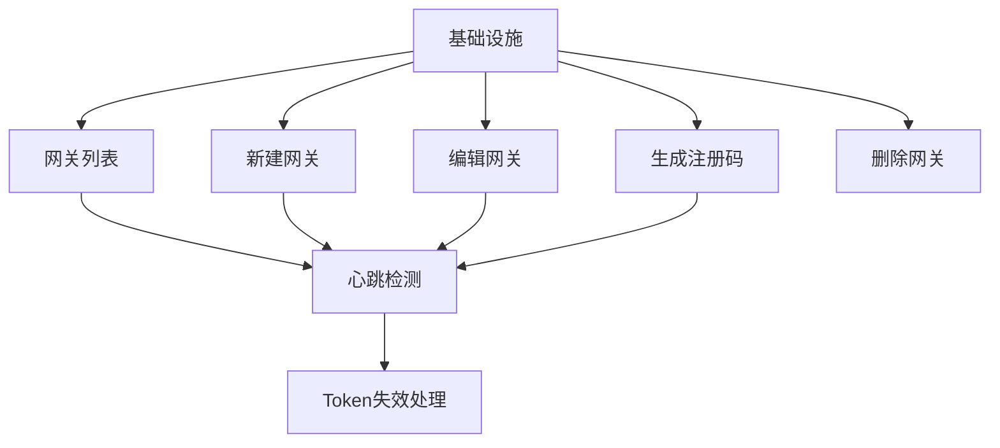
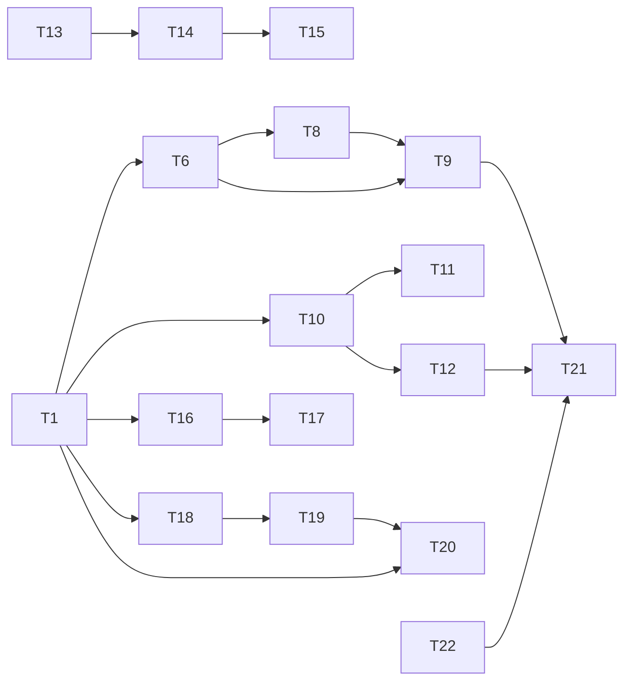

# 功能任务规划：边缘网关管理

> 基于《边缘网关管理-FRD》和《边缘网关管理_技术方案.md》，将边缘网关管理功能拆解为可执行的 TDD 开发任务清单。

---

## 1. 前置条件检查

| 检查项 | 状态 | 说明 |
|--------|------|------|
| 需求文档 | ✅ 就绪 | `docs/frd/边缘网关管理-FRD.md` |
| 技术方案 | ✅ 就绪 | `specs/features/边缘网关管理_技术方案.md` |
| 技术栈 | ✅ 就绪 | `specs/技术栈.md` |
| 项目结构 | ✅ 就绪 | `specs/项目结构.md` |
| 项目认知 | ✅ 已建立 | 已阅读项目上下文协议 |

---

## 2. 切片划分

### 2.1 切片依赖关系图

### 2.2 切片定义

| 切片 | 用户行为 | 包含任务 | 依赖 |
|------|----------|----------|------|
| **切片 1**: 网关列表 | 查看网关列表，自动刷新，搜索筛选 | T1-T5 | 无 |
| **切片 2**: 新建网关 | 填写表单，测试连接，保存网关 | T6-T9 | 切片 1 |
| **切片 3**: 编辑网关 | 修改信息，测试连接，保存修改 | T10-T12 | 切片 1 |
| **切片 4**: 生成注册码 | 填写名称，生成注册码，复制使用 | T13-T15 | 无 |
| **切片 5**: 删除网关 | 确认删除，解绑设备 | T16-T17 | 切片 1, 3 |
| **切片 6**: 心跳检测 | 后端心跳处理，前端状态更新 | T18-T20 | 切片 1 |
| **切片 7**: Token 失效处理 | 401 拦截，前端提示 | T21-T22 | 切片 2, 3 |

---

## 3. 任务清单

### 切片 1: 网关列表

**完成标准**: 用户打开网关列表页面，自动刷新显示网关数据，状态点正确显示（绿色=在线，灰色=离线）。

| 任务编号 | 任务描述 | 通俗解释 | 验证标准 | AC 编号 |
|----------|----------|----------|----------|----------|
| T1 | 创建 GatewayList 页面组件 | 用户打开网关管理页面时，显示网关列表 | 页面加载 → 显示网关列表表格，包含名称、状态、地址、端口、最后心跳等列 | AC-005 |
| T2 | 实现状态徽章组件 StatusBadge | 在线网关显示绿色状态点，离线网关显示灰色状态点 | status=ONLINE → 绿色点+文字"在线" status=OFFLINE → 灰色点+文字"离线" | AC-005 |
| T3 | 实现自动刷新功能（5s间隔） | 列表数据每5秒自动刷新一次 | 等待5秒 → 列表自动更新数据 点击"暂停自动刷新" → 列表停止更新 点击"恢复自动刷新" → 列表继续更新 | AC-005 |
| T4 | 实现搜索筛选功能 | 用户可以按名称搜索，按状态筛选 | 输入"网关A" → 列表只显示名称包含"网关A"的记录 选择状态"在线" → 只显示在线网关 | AC-005 |
| T5 | 实现行内操作按钮 | 显示测试连接、编辑、查看设备、删除按钮 | 每行末尾显示操作按钮列 | AC-001 |

### 切片 2: 新建网关

**完成标准**: 用户可以打开新建网关弹窗，填写表单，测试连接成功后保存，网关出现在列表中。

| 任务编号 | 任务描述 | 通俗解释 | 验证标准 | AC 编号 |
|----------|----------|----------|----------|----------|
| T6 | 创建 GatewayCreateModal 组件 | 用户点击"新建网关"按钮时，弹出表单窗口 | 点击按钮 → 弹窗打开，显示表单字段 | AC-001 |
| T7 | 实现表单验证（Zod + React Hook Form） | 用户填写表单时，实时验证必填项和格式 | 不填名称 → 红字"请输入网关名称" 端口填 65536 → 红字"端口号需在 1-65535 之间" 地址填"abc" → 红字"请输入合法的 IP 或域名" | AC-001 |
| T8 | 实现测试连接功能 | 用户可以测试网关连接是否正常 | 点击"测试连接" → 调用 POST /gateways/test-connection 连接成功 → 绿色提示"连接成功" 连接失败 → 红色提示失败原因 | AC-002 |
| T9 | 实现保存功能 | 用户保存后，网关出现在列表中 | 点击"确认" → 调用 POST /gateways 保存成功 → 弹窗关闭，列表新增一行，状态显示"在线"或"离线" | AC-001 |

### 切片 3: 编辑网关

**完成标准**: 用户可以编辑网关信息，修改 Token 后提示需要验证。

| 任务编号 | 任务描述 | 通俗解释 | 验证标准 | AC 编号 |
|----------|----------|----------|----------|----------|
| T10 | 创建 GatewayEditModal 组件 | 用户点击"编辑"按钮时，弹出表单窗口并回显数据 | 点击编辑按钮 → 弹窗打开，表单显示当前网关数据 | AC-001 |
| T11 | 显示 Token 修改提示 | 修改 Token 后提示需要验证 | 弹窗顶部显示黄色提示条"修改 Token 后需要等待下次心跳或手动测试连接验证" | AC-001 |
| T12 | 实现保存功能 | 用户保存后，列表更新显示新信息 | 点击"确认" → 调用 PUT /gateways/:id 保存成功 → 弹窗关闭，列表该行更新 | AC-001 |

### 切片 4: 生成注册码

**完成标准**: 用户可以生成一次性注册码，复制后用于 Node-RED 网关注册。

| 任务编号 | 任务描述 | 通俗解释 | 验证标准 | AC 编号 |
|----------|----------|----------|----------|----------|
| T13 | 创建 RegistrationCodeModal 组件 | 用户点击"生成注册码"按钮时，弹出注册码生成窗口 | 点击按钮 → 弹窗打开，显示网关名称输入和过期时间选择 | AC-003 |
| T14 | 实现注册码生成 | 用户填写网关名称后，生成一次性注册码 | 填写名称，点击"生成" → 调用 POST /registration/generate 返回注册码（8位字母数字）和过期时间（10分钟后） | AC-003 |
| T15 | 实现复制和过期状态 | 用户可以复制注册码，过期后显示"已过期" | 点击"复制" → 注册码复制到剪贴板，显示"已复制" 超过过期时间 → 显示"已过期"，禁用复制按钮 | AC-007 |

### 切片 5: 删除网关

**完成标准**: 用户删除网关后，其下设备转为未绑定状态。

| 任务编号 | 任务描述 | 通俗解释 | 验证标准 | AC 编号 |
|----------|----------|----------|----------|----------|
| T16 | 创建 DeleteConfirmBubble 组件 | 用户点击"删除"按钮时，弹出确认气泡 | 点击删除按钮 → 气泡弹出，显示"确定删除网关「XXX」吗？"和"该网关下 N 个设备将转为未绑定状态" | AC-006 |
| T17 | 实现删除逻辑（设备解绑） | 删除网关后，设备状态变为"未绑定" | 点击"确定" → 调用 DELETE /gateways/:id 网关从列表消失，关联设备状态变为"未绑定" | AC-006 |

### 切片 6: 心跳检测

**完成标准**: 网关每30秒发送心跳，连续3次未收到则判定离线。

| 任务编号 | 任务描述 | 通俗解释 | 验证标准 | AC 编号 |
|----------|----------|----------|----------|----------|
| T18 | 实现 MQTT 心跳订阅 | 后端订阅网关心跳主题，收到心跳更新 Redis | 网关发送心跳 → Redis 更新 gateway:heartbeat:{id} 连续 3 次（90s）未收到 → 状态变为 OFFLINE | AC-004 |
| T19 | 实现心跳超时检测任务 | 后台定时任务检查网关心跳状态 | 每 30 秒执行检查 90s 未收到心跳 → 状态改为 OFFLINE 收到心跳 → 状态改为 ONLINE | AC-004 |
| T20 | 前端状态同步 | 列表页面显示网关真实状态 | 列表每 5s 刷新 状态变更时即时更新显示 | AC-004, AC-005 |

### 切片 7: Token 失效处理

**完成标准**: Token 失效时返回 401，前端明显提示用户重新填写。

| 任务编号 | 任务描述 | 通俗解释 | 验证标准 | AC 编号 |
|----------|----------|----------|----------|----------|
| T21 | 实现 401 拦截器 | Axios 拦截 401 响应 | 请求返回 401 → 显示 Toast 提示"Token 已失效，请重新编辑网关信息" | AC-008 |
| T22 | 网关端 Token 失效提示 | 测试连接失败时提示 Token 问题 | 调用 /gateways/test-connection 返回 401 → 红色提示"Token 无效" | AC-008 |

---

## 4. 任务依赖关系

---

## 5. 可并行执行的任务

| 并行组 | 任务 | 说明 |
|--------|------|------|
| Group A | T1-T5（网关列表）, T13-T15（生成注册码） | 列表页面和注册码弹窗无依赖冲突 |
| Group B | T6-T9（新建网关）, T10-T12（编辑网关） | 两个独立的弹窗，无依赖冲突 |
| Group C | T18-T20（心跳检测）, T21-T22（Token失效处理） | 后端服务和前端拦截器，可并行开发 |

---

## 6. 关键任务标注

| 任务编号 | 标注 | 说明 |
|----------|------|------|
| T1 | 🔒 | 网关列表是其他功能的基础 |
| T8 | ⚠️ | 需要实际 Node-RED 网关才能测试连接成功 |
| T18 | 🔒 | 心跳检测是状态同步的核心 |
| T21 | ⚠️ | Token 失效处理影响所有涉及 Token 的操作 |

---

## 7. 任务统计

| 切片 | 任务数 | 预估工时（小时） | 总计工时（小时） |
|------|--------|------------------|------------------|
| 切片 1: 网关列表 | 5 | 4 | 4 |
| 切片 2: 新建网关 | 4 | 3 | 7 |
| 切片 3: 编辑网关 | 3 | 2 | 9 |
| 切片 4: 生成注册码 | 3 | 2 | 11 |
| 切片 5: 删除网关 | 2 | 1 | 12 |
| 切片 6: 心跳检测 | 3 | 4 | 16 |
| 切片 7: Token失效处理 | 2 | 1 | 17 |
| **总计** | **22** | **17** | **17** |

---

## 8. 验证计划

| 验证项 | 关联任务 | 验证方法 |
|--------|----------|----------|
| 网关列表显示 | T1-T5 | 打开页面 → 查看列表表格 → 验证列数据 |
| 自动刷新 | T3 | 等待 5s → 观察列表是否更新 |
| 新建网关 | T6-T9 | 填写表单 → 测试连接 → 保存 → 查看列表 |
| 编辑网关 | T10-T12 | 点击编辑 → 修改数据 → 保存 → 查看更新 |
| 生成注册码 | T13-T15 | 填写名称 → 生成 → 复制 → 验证过期提示 |
| 删除网关 | T16-T17 | 点击删除 → 确认 → 验证网关消失和设备状态 |
| 心跳检测 | T18-T20 | 启动网关 → 观察状态变为在线 → 停止网关 → 观察离线 |
| Token 失效 | T21-T22 | 修改 Token → 调用接口 → 观察 401 提示 |

---

## 9. Mock 闭环检查

| Mock 点 | 对应任务 | 接口对接任务 |
|---------|----------|--------------|
| 前端调用 API 时使用 Mock 数据 | T1-T5 | 完成后对接真实后端 API |
| 测试连接使用模拟响应 | T8 | 完成后对接真实 Node-RED API |
| 心跳消息模拟 | T18-T20 | 完成后使用真实 MQTT 消息 |

---

*文档版本：v1.0*
*创建日期：2026-06-17*
*基于技术方案: 边缘网关管理_技术方案.md*