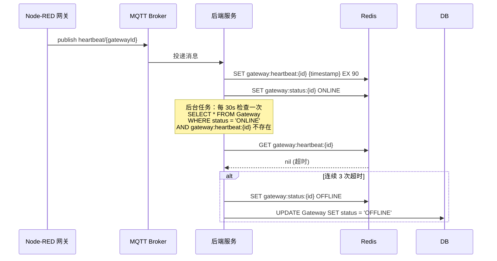
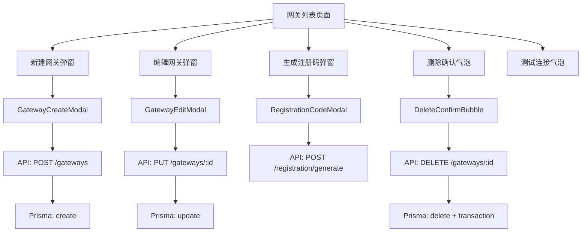

# 边缘网关管理技术方案

> 本文档定义边缘网关管理功能的技术实现方案，包含 API 设计、数据模型、核心逻辑。
> 基于《边缘网关管理-FRD》和《技术栈.md》。

---

## 1. AC 覆盖总表

| AC 编号 | 验收标准 | 技术实现 | 状态 |
|---------|----------|----------|------|
| AC-001 | 新建/编辑网关表单验证 | Zod 验证规则 + React Hook Form | ✅ |
| AC-002 | 测试连接功能 | POST /gateways/test-connection | ✅ |
| AC-003 | 网关注册 | POST /registration/generate | ✅ |
| AC-004 | 心跳检测（30s间隔） | Redis 缓存 + MQTT 订阅 | ✅ |
| AC-005 | 列表自动刷新（5s） | 前端定时器 + React Query | ✅ |
| AC-006 | 删除网关及设备解绑 | DELETE /gateways/:id + 事务 | ✅ |
| AC-007 | 注册码过期（10分钟） | Redis TTL + 一次性标记 | ✅ |
| AC-008 | Token 失效 401 处理 | Axios 拦截器 + 前端提示 | ✅ |

---

## 2. 数据模型设计

### 2.1 Prisma Schema

```prisma
model Gateway {
  id              String       @id @default(cuid())
  name            String
  address         String
  port            Int          @default(1880)
  adminToken      String
  status          GatewayStatus @default(OFFLINE)
  nodeRedVersion String?
  lastHeartbeat   DateTime?
  description     String?
  createdAt       DateTime     @default(now())
  updatedAt       DateTime     @updatedAt

  deviceInstances DeviceInstance[]
  registrationCodes RegistrationCode[]

  @@index([status])
  @@index([address, port])
}

model RegistrationCode {
  id          String   @id @default(cuid())
  gatewayName String
  code        String   @unique
  gatewayId   String?
  expiresAt   DateTime
  used        Boolean  @default(false)
  createdAt   DateTime @default(now())

  gateway     Gateway? @relation(fields: [gatewayId], references: [id])

  @@index([code])
  @@index([expiresAt])
}

enum GatewayStatus {
  ONLINE
  OFFLINE
  ERROR
}
```

### 2.2 Redis 数据结构

| Key 格式 | 类型 | TTL | 说明 |
|-----------|------|-----|------|
| `gateway:heartbeat:{gatewayId}` | String | 90s | 心跳时间戳，连续 3 次超时判定离线 |
| `gateway:status:{gatewayId}` | String | - | 网关状态缓存 |
| `regcode:{code}` | Hash | 600s | 注册码信息，过期自动删除 |

---

## 3. API 设计

### 3.1 网关管理 API

#### GET /api/gateways
获取网关列表。

**响应**
```json
{
  "success": true,
  "data": [
    {
      "id": "clx123...",
      "name": "网关A",
      "address": "192.168.1.100",
      "port": 1880,
      "status": "ONLINE",
      "nodeRedVersion": "v3.1.0",
      "lastHeartbeat": "2026-06-17T10:30:00Z",
      "description": "产线1网关",
      "deviceCount": { "total": 10, "running": 8 }
    }
  ]
}
```

→ AC-005: 列表自动刷新

#### POST /api/gateways
创建网关。

**请求**
```json
{
  "name": "网关A",
  "address": "192.168.1.100",
  "port": 1880,
  "adminToken": "token123",
  "description": "产线1网关"
}
```

**响应**
```json
{
  "success": true,
  "data": {
    "id": "clx123...",
    "name": "网关A",
    "address": "192.168.1.100",
    "port": 1880,
    "status": "ONLINE",
    "createdAt": "2026-06-17T10:30:00Z"
  }
}
```

→ AC-001: 新建网关

#### PUT /api/gateways/:id
更新网关信息。

**请求**
```json
{
  "name": "网关A-新版",
  "address": "192.168.1.101",
  "port": 1881,
  "adminToken": "newtoken456",
  "description": "更新后的描述"
}
```

→ AC-001: 编辑网关

#### DELETE /api/gateways/:id
删除网关。

**行为**
1. 开启事务
2. 删除网关记录
3. 将该网关下的设备实例 `gatewayId` 设为 `null`，状态改为 `UNBOUND`
4. 提交事务

→ AC-006: 删除网关及设备解绑

#### POST /api/gateways/test-connection
测试网关连接。

**请求**
```json
{
  "address": "192.168.1.100",
  "port": 1880,
  "adminToken": "token123"
}
```

**响应**
```json
{
  "success": true,
  "data": {
    "connected": true,
    "nodeRedVersion": "v3.1.0"
  }
}
```

或失败响应：
```json
{
  "success": false,
  "message": "Token 无效"
}
```

→ AC-002: 测试连接功能

### 3.2 注册码 API

#### POST /api/registration/generate
生成注册码。

**请求**
```json
{
  "gatewayName": "新网关",
  "expiresIn": 600
}
```

**响应**
```json
{
  "success": true,
  "data": {
    "code": "ABC123XYZ",
    "gatewayName": "新网关",
    "expiresAt": "2026-06-17T10:40:00Z"
  }
}
```

→ AC-003: 网关注册

#### POST /api/registration/verify
验证并使用注册码（Node-RED 插件调用）。

**请求**
```json
{
  "code": "ABC123XYZ",
  "gatewayId": "clx123..."
}
```

→ AC-003: 注册码使用

---

## 4. 核心逻辑设计

### 4.1 心跳检测流程



**心跳消息格式**
```json
{
  "type": "heartbeat",
  "gatewayId": "clx123...",
  "timestamp": 1718614200000,
  "nodeRedVersion": "v3.1.0",
  "deviceStatus": [
    { "nodeId": "node1", "status": "running" },
    { "nodeId": "node2", "status": "stopped" }
  ]
}
```

→ AC-004: 心跳检测

### 4.2 心跳超时判定逻辑

```typescript
// heartbeat.service.ts
const HEARTBEAT_INTERVAL = 30000; // 30秒
const HEARTBEAT_TIMEOUT = 90000;   // 90秒（3次超时）
const MAX_MISSED_HEARTBEATS = 3;

// 后台定时任务，每 30 秒执行
async checkGatewayStatus() {
  const gateways = await prisma.gateway.findMany({
    where: { status: 'ONLINE' }
  });

  for (const gateway of gateways) {
    const lastHeartbeat = await redis.get(`gateway:heartbeat:${gateway.id}`);
    if (!lastHeartbeat) {
      // 记录未收到心跳次数
      const missedCount = await redis.incr(`gateway:missed:${gateway.id}`);
      if (missedCount >= MAX_MISSED_HEARTBEATS) {
        await this.setGatewayOffline(gateway.id);
      }
    } else {
      // 心跳正常，重置计数
      await redis.del(`gateway:missed:${gateway.id}`);
    }
  }
}
```

→ AC-004: 心跳检测

### 4.3 Token 失效处理

```typescript
// axios.ts 拦截器
api.interceptors.response.use(
  (response) => response,
  (error) => {
    if (error.response?.status === 401) {
      // 显示 Token 失效提示
      toast.error('Token 已失效，请重新编辑网关信息');
    }
    return Promise.reject(error);
  }
);
```

→ AC-008: Token 失效处理

---

## 5. 前端组件设计

### 5.1 组件结构

| 组件 | 文件路径 | 说明 |
|------|----------|------|
| GatewayList | `pages/gateway/GatewayList.tsx` | 网关列表主页面 |
| GatewayCreateModal | `pages/gateway/GatewayCreateModal.tsx` | 新建网关弹窗 |
| GatewayEditModal | `pages/gateway/GatewayEditModal.tsx` | 编辑网关弹窗 |
| RegistrationCodeModal | `pages/gateway/RegistrationCodeModal.tsx` | 生成注册码弹窗 |
| DeleteConfirmBubble | `pages/gateway/DeleteConfirmBubble.tsx` | 删除确认气泡 |
| StatusBadge | `components/StatusBadge.tsx` | 状态徽章组件 |

### 5.2 状态管理

```typescript
// stores/gateway.store.ts
interface GatewayState {
  gateways: Gateway[]
  loading: boolean
  selectedGateway: Gateway | null

  // Actions
  fetchGateways: () => Promise<void>
  createGateway: (data: CreateGatewayDto) => Promise<void>
  updateGateway: (id: string, data: UpdateGatewayDto) => Promise<void>
  deleteGateway: (id: string) => Promise<void>
  testConnection: (data: TestConnectionDto) => Promise<TestResult>
}
```

### 5.3 自动刷新逻辑

```typescript
// GatewayList.tsx
const GATEWAY_REFRESH_INTERVAL = 5000; // 5秒

useEffect(() => {
  fetchGateways();

  const interval = setInterval(() => {
    if (!isPaused) {
      fetchGateways();
    }
  }, GATEWAY_REFRESH_INTERVAL);

  return () => clearInterval(interval);
}, [isPaused]);
```

→ AC-005: 列表自动刷新

---

## 6. 错误处理设计

### 6.1 后端错误码

| 错误码 | HTTP 状态 | 说明 |
|--------|-----------|------|
| GATEWAY_NOT_FOUND | 404 | 网关不存在 |
| GATEWAY_CONNECTION_FAILED | 400 | 连接测试失败 |
| REGCODE_EXPIRED | 400 | 注册码已过期 |
| REGCODE_USED | 400 | 注册码已被使用 |
| REGCODE_INVALID | 400 | 注册码无效 |
| TOKEN_INVALID | 401 | Token 无效（网关端） |

### 6.2 前端错误提示

| 场景 | 提示方式 |
|------|----------|
| 创建/更新失败 | 弹窗内红色提示文案 |
| 测试连接失败 | 弹窗内红色提示 |
| Token 失效 | Toast 提示 + 弹窗提示 |
| 网络错误 | Toast 提示"网络错误，请重试" |

---

## 7. 性能优化

### 7.1 数据库优化

- `Gateway.status` 字段建立索引，支持按状态快速查询
- `Gateway.address, port` 联合索引，支持地址快速查找
- `RegistrationCode.code` 唯一索引，确保注册码唯一性

### 7.2 Redis 缓存

- 心跳状态缓存，避免频繁数据库查询
- 注册码 TTL 自动过期，减少无效数据

### 7.3 前端优化

- React Query 自动缓存，5s 刷新不闪烁
- 列表虚拟滚动（大数据量时）
- 骨架屏加载状态

---

## 8. 安全设计

### 8.1 Token 存储

- Admin Token 加密存储（使用项目 JWT_SECRET）
- 前端 Token 输入脱敏显示

### 8.2 注册码安全

- 注册码格式：8 位大写字母 + 数字
- 一次性使用，使用后标记 `used = true`
- TTL 过期自动删除

---

## 9. 依赖关系



---

*文档版本：v1.0*
*创建日期：2026-06-17*
*基于 FRD: 边缘网关管理-FRD.md*
*技术栈: 技术栈.md*