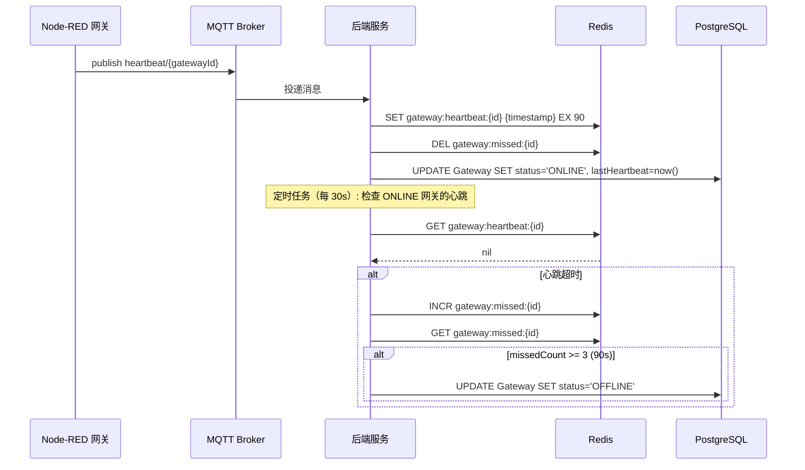

# 边缘网关管理技术方案

> 基于《边缘网关管理-产品说明书》设计，包含完整 AC 覆盖、API 设计、数据模型和核心逻辑。

---

## 1. AC 覆盖总表

| AC 编号 | 验收标准 | 技术实现 |
|---------|----------|----------|
| AC-001 | 平台主动添加网关 - 测试连接成功 | POST /api/gateways/test-connection |
| AC-002 | 平台主动添加网关 - 创建成功 | POST /api/gateways |
| AC-003 | 平台生成注册码 | POST /api/registration/generate |
| AC-004 | 网关主动注册成功 | POST /api/registration/verify |
| AC-005 | 列表展示完整字段 | GET /api/gateways |
| AC-006 | 按名称搜索 | 查询参数 name |
| AC-007 | 按状态筛选 | 查询参数 status |
| AC-008 | 列表自动刷新 | 前端定时器 5s |
| AC-009 | 测试连接 | POST /api/gateways/test-connection |
| AC-010 | 编辑网关 | PUT /api/gateways/:id |
| AC-011 | 删除网关 | DELETE /api/gateways/:id |
| AC-012 | 查看已下发设备 | 跳转设备实例列表 + 查询参数 gatewayId |
| AC-013 | 在线状态显示 | status 字段 + 状态徽章组件 |
| AC-014 | 状态自动恢复 | 心跳检测服务 |
| AC-015 | 测试连接失败 - Token 无效 | 401 响应 + 红色提示 |
| AC-016 | 测试连接失败 - 网络不通 | 503 响应 + 红色提示 |
| AC-017 | 表单必填项缺失 | Zod 验证 + 红框提示 |
| AC-018 | 端口格式错误 | Zod 验证（1-65535） |
| AC-019 | 心跳超时判定离线 | Redis 缓存 + 3 次超时判定 |
| AC-020 | 删除有设备的网关 | 事务 + 设备状态更新为 UNBOUND |
| AC-021 | Token 失效明显提示 | 401 拦截 + 红色标记 |
| AC-022 | 注册码过期 | Redis TTL 600s |
| AC-023 | 网络抖动临时离线 | 90s 超时判定 |
| AC-024 | BR-001 网关名称允许重名 | 唯一约束只在内部 ID |
| AC-025 | BR-002/BR-003 心跳超时时长 | 30s 间隔，90s 判定 |
| AC-026 | BR-005 Token 失效提示明显 | 与普通离线状态区分 |
| AC-027 | BR-006 删除网关不影响设备 | 事务处理 |
| AC-028 | BR-007 注册码有效期 | TTL 600s |

---

## 2. 数据模型设计

### 2.1 Prisma Schema

```prisma
model Gateway {
  id              String       @id @default(cuid())
  name            String
  address         String
  port            Int          @default(1880)
  adminToken      String
  status          GatewayStatus @default(OFFLINE)
  nodeRedVersion  String?
  lastHeartbeat   DateTime?
  description     String?
  createdAt       DateTime     @default(now())
  updatedAt       DateTime     @updatedAt

  deviceInstances DeviceInstance[]
  registrationCodes RegistrationCode[]

  @@index([status])
  @@index([address, port])
}

model RegistrationCode {
  id          String   @id @default(cuid())
  gatewayName String
  code        String   @unique
  gatewayId   String?
  expiresAt   DateTime
  used        Boolean  @default(false)
  createdAt   DateTime @default(now())

  gateway     Gateway? @relation(fields: [gatewayId], references: [id])

  @@index([code])
  @@index([expiresAt])
}

enum GatewayStatus {
  ONLINE
  OFFLINE
  TOKEN_EXPIRED
}
```

### 2.2 Redis 数据结构

| Key 格式 | 类型 | TTL | 说明 |
|-----------|------|-----|------|
| `gateway:heartbeat:{gatewayId}` | String | 90s | 心跳时间戳 |
| `gateway:missed:{gatewayId}` | String | 90s | 未收到心跳计数 |
| `regcode:{code}` | Hash | 600s | 注册码信息 |

---

## 3. API 设计

### 3.1 网关管理 API

#### GET /api/gateways
获取网关列表。

**查询参数**
| 参数 | 类型 | 必填 | 说明 |
|------|------|------|------|
| name | string | 否 | 网关名称模糊匹配 |
| status | string | 否 | ONLINE/OFFLINE/TOKEN_EXPIRED |
| page | number | 否 | 页码，默认 1 |
| pageSize | number | 否 | 每页条数，默认 20 |

**响应**
```json
{
  "success": true,
  "data": {
    "list": [
      {
        "id": "clx123",
        "name": "厂区A网关",
        "address": "192.168.1.100",
        "port": 1880,
        "status": "ONLINE",
        "nodeRedVersion": "v3.1.0",
        "lastHeartbeat": "2026-06-17T10:30:00Z",
        "description": "产线1网关",
        "deviceCount": { "total": 10, "running": 8 },
        "createdAt": "2026-06-17T08:00:00Z"
      }
    ],
    "pagination": { "total": 50, "page": 1, "pageSize": 20 }
  }
}
```

→ AC-005, AC-006, AC-007

#### POST /api/gateways
创建网关。

**请求**
```json
{
  "name": "厂区A网关",
  "address": "192.168.1.100",
  "port": 1880,
  "adminToken": "admin123",
  "description": "产线1网关"
}
```

**响应**
```json
{
  "success": true,
  "data": { "id": "clx123", "name": "厂区A网关", "status": "OFFLINE" }
}
```

→ AC-002, AC-017, AC-018

#### PUT /api/gateways/:id
更新网关。

**请求**
```json
{
  "name": "厂区A网关-更新",
  "address": "192.168.1.101",
  "port": 1881,
  "adminToken": "newtoken456",
  "description": "更新描述"
}
```

→ AC-010

#### DELETE /api/gateways/:id
删除网关。

**行为**
1. 开启事务
2. 删除网关记录
3. 更新关联设备实例：gatewayId = null, status = UNBOUND
4. 提交事务

**响应**
```json
{ "success": true }
```

→ AC-011, AC-020, AC-027

#### POST /api/gateways/test-connection
测试网关连接。

**请求**
```json
{
  "address": "192.168.1.100",
  "port": 1880,
  "adminToken": "admin123"
}
```

**响应（成功）**
```json
{ "success": true, "data": { "connected": true, "nodeRedVersion": "v3.1.0" } }
```

**响应（失败）**
```json
{ "success": false, "message": "Token 无效或已过期" }
```

→ AC-001, AC-009, AC-015, AC-016

### 3.2 注册码 API

#### POST /api/registration/generate
生成注册码。

**请求**
```json
{ "gatewayName": "新网关", "expiresIn": 600 }
```

**响应**
```json
{
  "success": true,
  "data": { "code": "ABC123XYZ", "gatewayName": "新网关", "expiresAt": "2026-06-17T10:40:00Z" }
}
```

→ AC-003, AC-028

#### POST /api/registration/verify
验证注册码（Node-RED 插件调用）。

**请求**
```json
{ "code": "ABC123XYZ" }
```

**响应**
```json
{
  "success": true,
  "data": { "gatewayId": "clx123", "gatewayName": "新网关" }
}
```

→ AC-004

---

## 4. 核心逻辑设计

### 4.1 心跳检测流程



→ AC-019, AC-023, AC-025

### 4.2 Token 失效处理

```typescript
// backend/src/services/heartbeat.service.ts
async handleHeartbeat(gatewayId: string, payload: HeartbeatPayload) {
  try {
    await this.checkTokenValid(gatewayId);
    await this.updateGatewayOnline(gatewayId, payload);
  } catch (error) {
    if (error.status === 401) {
      await prisma.gateway.update({
        where: { id: gatewayId },
        data: { status: GatewayStatus.TOKEN_EXPIRED }
      });
    }
  }
}
```

→ AC-021, AC-026

---

## 5. 前端组件设计

| 组件 | 文件路径 | 说明 |
|------|----------|------|
| GatewayList | `pages/gateway/GatewayList.tsx` | 网关列表主页面 |
| GatewayCreateModal | `pages/gateway/GatewayCreateModal.tsx` | 新建网关弹窗 |
| GatewayEditModal | `pages/gateway/GatewayEditModal.tsx` | 编辑网关弹窗 |
| RegistrationCodeModal | `pages/gateway/RegistrationCodeModal.tsx` | 生成注册码弹窗 |
| DeleteConfirmBubble | `pages/gateway/DeleteConfirmBubble.tsx` | 删除确认气泡 |
| StatusBadge | `components/StatusBadge.tsx` | 状态徽章组件 |

---

*文档版本：v1.0*
*创建日期：2026-06-17*
*基于产品说明书：边缘网关管理-产品说明书.md*