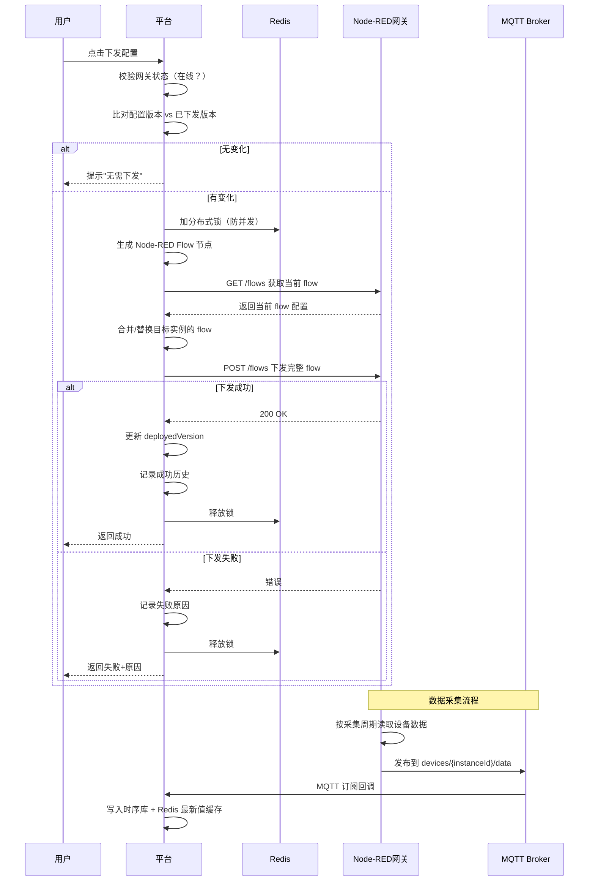
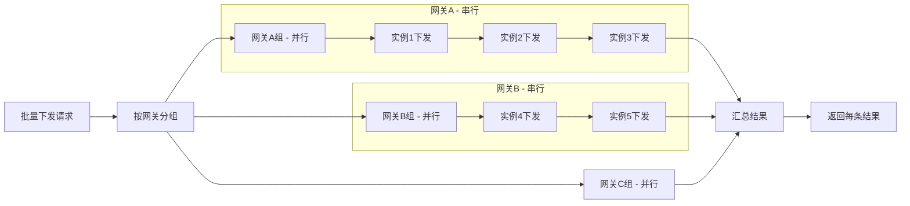

# 配置下发与同步 — 技术设计文档

## 1. 设计概要

**功能描述**：将设备实例的采集配置自动生成 Node-RED Flow 并部署到边缘网关，支持心跳流自动下发、采集流手动下发（单个/批量）、版本号比对、删除清理，以及完整的下发历史记录和失败原因追踪。

**影响范围**：
- 后端：`sync` 模块、`gateway` 模块（激活流程）、`device-instance` 模块（删除/变更网关）
- 前端：`sync-record/` 页面、`device-instance/` 详情页下发按钮
- 数据库：SyncRecord 表扩展、下发状态机

**技术难点**：
- Flow 生成：根据不同协议类型生成对应的 Node-RED 采集节点
- 批量下发：按网关分组并行，同网关内串行，部分失败不影响其他
- 版本管理：配置版本号与已下发版本号比对，有变化才下发

**外部依赖**：
- Node-RED Admin API（`/flows` GET/POST）
- 设备模型模块（点位定义）
- 设备实例模块（实例配置）
- 边缘网关模块（网关地址、认证）
- MQTT Broker（数据上报通道）

---

## 2. 架构概览

配置下发是平台与网关之间的桥梁，将平台侧的配置模型转化为网关侧可执行的 Node-RED Flow。

**核心流程**：



**批量下发流程**：



---

## 3. 数据库设计

### 修改现有表

#### `SyncRecord` 表

**变更内容**：扩展字段，增加配置版本号、操作人、失败原因详情等。

```sql
-- 配置版本号
ALTER TABLE "SyncRecord" ADD COLUMN IF NOT EXISTS "configVersion" INT;
-- 已下发版本号（成功后更新）
ALTER TABLE "SyncRecord" ADD COLUMN IF NOT EXISTS "deployedVersion" INT;
-- 操作人ID
ALTER TABLE "SyncRecord" ADD COLUMN IF NOT EXISTS "operatorId" TEXT;
-- 操作人名称（冗余，便于展示）
ALTER TABLE "SyncRecord" ADD COLUMN IF NOT EXISTS "operatorName" TEXT;
-- 失败码（便于分类统计）
ALTER TABLE "SyncRecord" ADD COLUMN IF NOT EXISTS "errorCode" TEXT;
-- Flow 名称（冗余）
ALTER TABLE "SyncRecord" ADD COLUMN IF NOT EXISTS "flowName" TEXT;

-- 索引
CREATE INDEX IF NOT EXISTS idx_sync_record_gateway ON "SyncRecord" ("gatewayId", "createdAt" DESC);
CREATE INDEX IF NOT EXISTS idx_sync_record_instance ON "SyncRecord" ("deviceInstanceId", "createdAt" DESC);
CREATE INDEX IF NOT EXISTS idx_sync_record_status ON "SyncRecord" (status, "createdAt" DESC);
```

#### `DeviceInstance` 表

**变更内容**：补充版本号字段（已在设备实例方案中定义，这里确认同步关系）。

- `configVersion`：当前配置版本号（每次点位修改、通信参数修改 +1）
- `deployedVersion`：已下发版本号（下发成功后更新）
- 比对规则：`configVersion > deployedVersion` 才需要下发

---

## 4. API 设计

### `POST /api/sync/deploy`

**描述**：下发单个实例配置 → AC-003、AC-005、AC-006

**鉴权**：需要登录

**Request**：
```json
{
  "deviceInstanceId": "cuid_xxx",
  "force": false
}
```

| 参数 | 类型 | 说明 |
|------|------|------|
| deviceInstanceId | string | 设备实例ID |
| force | boolean | 是否强制下发（跳过版本比对），默认 false |

**Response（成功）**：
```json
{
  "success": true,
  "data": {
    "syncRecordId": "cuid_sync_xxx",
    "status": "SUCCESS",
    "configVersion": 5,
    "deployedVersion": 5
  }
}
```

**Response（跳过 - 无变化）**：
```json
{
  "success": true,
  "data": {
    "skipped": true,
    "reason": "配置无变化，无需下发",
    "currentVersion": 3,
    "deployedVersion": 3
  }
}
```

**异常响应**：

| 场景 | 状态码 | 响应 | 对应 AC |
|------|--------|------|---------|
| 网关离线 | 400 | `{ code: 'GATEWAY_OFFLINE', message: '网关离线，下发失败' }` | AC-014 |
| Token 过期 | 401 | `{ code: 'TOKEN_EXPIRED', message: '网关 Token 已失效' }` | - |
| 下发进行中 | 409 | `{ code: 'DEPLOY_IN_PROGRESS', message: '下发进行中，请稍后再试' }` | - |

### `POST /api/sync/batch-deploy`

**描述**：批量下发实例配置 → AC-007、AC-008、AC-018

**鉴权**：需要登录

**Request**：
```json
{
  "deviceInstanceIds": ["cuid_1", "cuid_2", "cuid_3"],
  "force": false
}
```

**Response（成功）**：
```json
{
  "success": true,
  "data": {
    "total": 3,
    "success": 2,
    "failed": 1,
    "skipped": 0,
    "results": [
      {
        "deviceInstanceId": "cuid_1",
        "deviceName": "1号锅炉",
        "status": "SUCCESS",
        "syncRecordId": "cuid_sync_1"
      },
      {
        "deviceInstanceId": "cuid_2",
        "deviceName": "2号锅炉",
        "status": "SUCCESS",
        "syncRecordId": "cuid_sync_2"
      },
      {
        "deviceInstanceId": "cuid_3",
        "deviceName": "3号锅炉",
        "status": "FAILED",
        "errorCode": "GATEWAY_OFFLINE",
        "errorMessage": "网关离线，下发失败"
      }
    ]
  }
}
```

**说明**：
- 按网关分组，不同网关并行下发
- 同网关内串行下发，一个失败不影响后续
- 每条记录独立返回结果

### `GET /api/sync/records`

**描述**：获取下发历史列表 → AC-011

**鉴权**：需要登录

**Query 参数**：
- `gatewayId`：按网关筛选
- `deviceInstanceId`：按实例筛选
- `status`：按状态筛选
- `type`：按类型筛选（DEPLOY/UNDEPLOY/DEPLOY_BASE）
- `page`：页码
- `pageSize`：每页数量

**Response（成功）**：
```json
{
  "success": true,
  "data": {
    "list": [
      {
        "id": "cuid_sync_xxx",
        "type": "DEPLOY",
        "status": "SUCCESS",
        "deviceName": "1号锅炉",
        "deviceId": "dev_001",
        "gatewayName": "生产车间网关-01",
        "configVersion": 5,
        "deployedVersion": 5,
        "flowName": "1号锅炉-dev_001",
        "operatorName": "admin",
        "createdAt": "2024-03-15T10:00:00Z",
        "completedAt": "2024-03-15T10:00:05Z",
        "message": null,
        "errorCode": null
      }
    ],
    "total": 100,
    "page": 1,
    "pageSize": 20
  }
}
```

### `GET /api/sync/records/:id`

**描述**：获取下发记录详情 → AC-011

**鉴权**：需要登录

**Response（成功）**：含完整 flow payload（用于排查问题）

### `POST /api/sync/records/:id/retry`

**描述**：重发失败的下发 → AC-015

**鉴权**：需要登录

**Response（成功）**：同单个下发接口

### `GET /api/sync/device-instances/:id/deploy-status`

**描述**：获取实例下发状态 → AC-009

**鉴权**：需要登录

**Response（成功）**：
```json
{
  "success": true,
  "data": {
    "configVersion": 5,
    "deployedVersion": 4,
    "hasChanges": true,
    "lastDeploy": {
      "status": "SUCCESS",
      "at": "2024-03-15T10:00:00Z"
    }
  }
}
```

---

## 5. 核心逻辑

### 5.1 Flow 生成逻辑 → AC-003、AC-004、AC-021、AC-022

**触发条件**：下发配置时

**处理流程**：

1. 获取实例详情（含点位、通信参数、模板信息）
2. 根据协议类型生成对应采集节点：
   - Modbus TCP/RTU → modbus-read 节点
   - S7 → S7 in 节点
   - OPC UA → OpcUa-Client 节点
   - MQTT → mqtt in 节点
   - TCP → tcp in + function 解析节点
3. 生成数据处理节点（值转换、格式化）
4. 生成 MQTT 上报节点（发布到 `devices/{instanceId}/data`）
5. 生成基础流（心跳流 + 配置监听流）— 首次下发或缺失时追加
6. Flow 命名：`{设备名称}-{设备ID}`

**Modbus Flow 节点结构**：
```
[Inject 定时触发] → [Modbus Read] → [Function 值转换] → [MQTT Out 上报]
```

**S7 Flow 节点结构**：
```
[Inject 定时触发] → [S7 Read] → [Function 值转换] → [MQTT Out 上报]
```

### 5.2 版本比对逻辑 → AC-005、AC-006、AC-020

**触发条件**：用户点击下发配置时

**比对规则**：

| 场景 | configVersion vs deployedVersion | 操作 |
|------|----------------------------------|------|
| 新创建，未下发过 | > 0 vs null | 下发 |
| 配置有变化 | > deployedVersion | 下发 |
| 配置无变化 | = deployedVersion | 跳过，提示 |
| 强制下发 | 任何 | 下发 |

**版本号递增时机**：
- 修改通信参数 → configVersion + 1
- 修改点位（新增/编辑/删除）→ configVersion + 1
- 同步模板版本 → configVersion + 1
- 变更网关 → configVersion + 1
- 修改名称等基本信息 → 不递增

### 5.3 批量下发调度 → AC-007、AC-008、AC-018、AC-023

**触发条件**：批量下发请求

**处理流程**：

```
1. 获取所有实例及其所属网关
2. 按 gatewayId 分组
3. 对每个网关组，创建一个 Promise 并行执行
4. 每个网关组内：
   - 按实例顺序串行执行
   - 单个失败 catch 住，记录结果，继续下一个
   - 单个成功也记录结果
5. 所有组完成后，汇总结果
6. 返回每条的独立结果
```

**并发控制**：
- 不同网关：完全并行（无资源竞争）
- 同网关：串行（Node-RED /flows API 是全局操作，并发下发会冲突）
- 分布式锁：同网关同一时间只允许一个下发操作（Redis 锁）

**伪代码**：
```
async function batchDeploy(instanceIds, force):
    instances = db.getInstances(instanceIds)
    groups = groupBy(instances, 'gatewayId')
    
    results = []
    promises = groups.map(group => {
        return processGatewayGroup(group.gatewayId, group.instances, force)
    })
    
    groupResults = await Promise.all(promises)
    return flatten(groupResults)

async function processGatewayGroup(gatewayId, instances, force):
    results = []
    for instance in instances:
        try:
            result = await deployConfig(instance.id, force)
            results.push({ instanceId: instance.id, status: 'SUCCESS', ... })
        catch (err):
            results.push({ instanceId: instance.id, status: 'FAILED', error: err.message })
    return results
```

### 5.4 删除实例 Flow 清理 → AC-010、AC-016、AC-019、AC-031

**触发条件**：删除设备实例时

**处理流程**：

```
1. 获取实例绑定的网关
2. 判断网关状态：
   a. 网关在线：
      - GET /flows 获取当前 flow
      - 过滤掉该实例相关的所有节点（ID 前缀匹配）
      - POST /flows 写回剩余 flow
      - 记录 UNDEPLOY 成功
      - 删除实例记录
   b. 网关离线（AC-019）：
      - 记录 UNDEPLOY 失败，原因"网关离线，未删除对应 flow"
      - 仍删除平台侧实例记录
      - 返回提示
   c. flow 不存在（AC-016）：
      - GET /flows 后发现没有该实例的节点
      - 记录 UNDEPLOY 成功，消息"网关配置不存在，跳过删除 flow"
      - 删除实例记录
```

### 5.5 分布式锁机制 → AC-007、AC-008

**背景**：批量下发和手动下发可能同时触发，同网关内并发下发会导致 Node-RED flow 冲突。

**锁策略**：
- 锁粒度：按网关加锁（`sync:lock:{gatewayId}`）
- 锁超时：60 秒（自动释放，防止死锁）
- 加锁位置：下发前加锁，下发完成（成功/失败）释放

**使用 Redis SET NX**：
```
SET sync:lock:{gatewayId} 1 NX EX 60
```

---

## 6. 现有代码改动

| 模块 / 文件 | 改动内容 | 原因 | 对应 AC |
|-------------|---------|------|---------|
| `sync.service.ts` | 重构 Flow 生成逻辑，支持多协议；增加版本比对；增加批量下发调度；增加分布式锁 | 对齐需求文档 | AC-003 ~ AC-018 |
| `sync.controller.ts` | 增加批量下发、重试、下发状态查询接口 | 新功能 API | AC-007、AC-015 |
| `sync.dto.ts` | 增加批量下发、单下发参数校验 | 参数校验 | AC-007 |
| `sync.repository.ts` | 扩展 SyncRecord 查询方法 | 新查询需求 | AC-011 |
| `prisma/schema.prisma` | SyncRecord 表扩展字段（configVersion、operator、errorCode 等） | 需求扩展字段 | AC-011 |
| `gateway.service.ts` | 激活流程接入下发服务，心跳流下发失败标记未激活 | AC-001、AC-013 |
| `device-instance.service.ts` | 删除实例接入下发服务做 flow 清理 | AC-010、AC-016 |
| `frontend/pages/sync-record/` | 新增下发历史列表页、详情页 | AC-011 |
| `frontend/pages/device-instance/` | 增加下发按钮、下发状态展示 | AC-005、AC-006 |

---

## 7. 技术决策

### Flow 下发方式

**背景**：Node-RED 提供 `/flows` 接口可以全量下发 flow，也可以用 `/flow/{id}` 操作单个 flow tab。

**选项**：
- A: 全量下发 GET + POST（现有方案）— 简单，每次全量替换，并发需要加锁
- B: 单个 flow tab 操作 — 精细，互不影响，但需要管理 flow tab ID
- C: MQTT 指令下发，网关侧执行 — 解耦，可靠性高，但实现复杂

**结论**：选 A — 全量下发。现有方案已跑通，改动最小。加分布式锁解决并发问题。后续如果并发需求强烈，再考虑升级到 B 或 C。

### 批量下发并发模型

**背景**：批量下发时，多个实例分布在不同网关上，需要决定并发策略。

**选项**：
- A: 按网关分组并行，同网关串行 — 合理利用并发，避免单网关冲突
- B: 全部并行 — 速度快，但同网关并发会冲突
- C: 全部串行 — 简单但慢

**结论**：选 A — 按网关分组并行。不同网关的 Node-RED 是独立进程，互不影响，可以并行。同一网关内串行，避免 flow 并发写入冲突。既保证速度，又保证正确性。

### 版本号管理

**背景**：需要判断配置是否有变化，决定是否下发。

**选项**：
- A: 整数版本号（configVersion / deployedVersion）— 简单，自增，比对容易
- B: 内容哈希（MD5/SHA）— 精确，但计算成本高，不同内容不同哈希
- C: 时间戳比对 — 简单，但可能有精度问题

**结论**：选 A — 整数版本号。简单直观，用户能理解版本号含义。每次配置变更 +1，比对只要比大小。失败回退也清晰（回退到上一个版本号）。

---

## 8. 安全与性能

**输入校验**：
- 实例ID存在性校验
- 网关状态校验
- 下发参数校验

**并发控制**：
- Redis 分布式锁防止同网关并发下发
- 锁超时 60 秒自动释放

**性能考量**：
- 批量下发按网关分组并行，最大化利用网络 IO
- 同网关串行防止 Node-RED 压力过大
- 下发历史分页查询

**可靠性**：
- 下发失败记录详细错误信息，便于排查
- 支持手动重试
- 网关离线时仍删除平台记录，避免数据不一致

---

## 9. AC 覆盖总表

| AC 编号 | 验收标准概述 | 实现位置 |
|---------|-------------|---------|
| AC-001 | 心跳 flow 自动下发 | gateway.service.ts 激活流程 + deployGatewayBaseFlow |
| AC-002 | 心跳 flow 下发成功激活 | 下发成功后更新网关状态为 ONLINE |
| AC-003 | 生成并部署采集 flow | deployConfig + generateDeviceFlowNodes |
| AC-004 | Flow 命名规则 | flowName = `${deviceName}-${deviceId}` |
| AC-005 | 有变化才下发 | 版本比对：configVersion > deployedVersion |
| AC-006 | 无变化提示跳过 | 版本比对相等时返回 skipped |
| AC-007 | 不同网关并行下发 | batchDeploy 按网关分组 Promise.all |
| AC-008 | 同网关串行下发 | 同网关组内 for 循环串行执行 |
| AC-009 | 下发成功记录历史 | createSyncRecord SUCCESS |
| AC-010 | 删除实例清理 flow | undeployConfig + deleteDeviceInstance |
| AC-011 | 下发历史展示 | GET /api/sync/records + 前端列表页 |
| AC-012 | 采集数据上报 | MQTT 节点发布 → 平台订阅写入时序库 |
| AC-013 | 心跳 flow 下发失败 | 失败后置网关状态为 INITIALIZING + 记录原因 |
| AC-014 | 下发时网关离线 | deployConfig 前置校验网关状态 |
| AC-015 | 下发失败后可重试 | POST /api/sync/records/:id/retry |
| AC-016 | 删除时 flow 不存在 | GET /flows 未匹配到 → 记录成功+消息 |
| AC-017 | 全量覆盖被修改的 flow | 每次下发 GET + POST 全量替换 |
| AC-018 | 批量下发部分失败 | 单条 try/catch，失败不影响其他 |
| AC-019 | 删除实例网关离线 | 仍删平台记录，记录 flow 未删除 |
| AC-020 | 版本号递增 ← BR-001 | 配置变更 +1，下发成功更新 deployedVersion |
| AC-021 | 一个实例一个 flow ← BR-002 | 每个实例独立节点组，ID 前缀隔离 |
| AC-022 | Flow 命名规则 ← BR-002 | flowName 字段 + 节点命名 |
| AC-023 | 批量下发分组规则 ← BR-003 | groupBy gatewayId + 并行+串行混合 |
| AC-024 | Flow 部署目标 ← BR-004 | 部署到实例绑定的网关 Node-RED |
| AC-025 | Node-RED 认证 ← BR-004 | 使用网关 adminToken 调用 API |
| AC-026 | 数据上报 ← BR-005 | MQTT out 节点 → EMQX → 平台订阅处理 |

---

## 附录：变更记录

| 日期 | 变更内容 | 原因 |
|------|---------|------|
| 2026-06-30 | 初始版本 | 完成配置下发与同步技术方案设计 |
