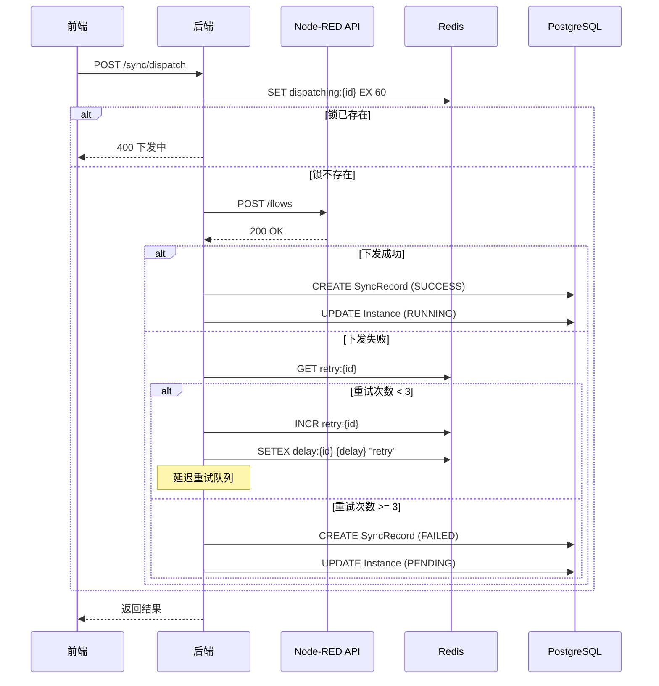
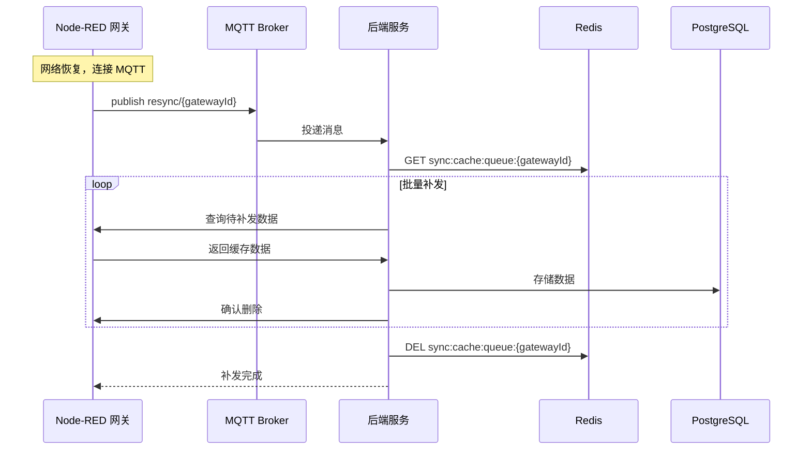

# 配置下发与同步技术方案

> 本文档定义配置下发与同步功能的技术实现方案。
> 基于《配置下发与同步-FRD》和《技术栈.md》。

---

## 1. AC 覆盖总表

| AC 编号 | 验收标准 | 技术实现 | 状态 |
|---------|----------|----------|------|
| AC-001 | 下发配置到 Node-RED | HTTP API 调用 | ✅ |
| AC-002 | 下发状态跟踪 | 实时状态更新 | ✅ |
| AC-003 | 下发失败重试（3次） | 指数退避重试 | ✅ |
| AC-004 | 下发日志记录 | SyncRecord 表 | ✅ |
| AC-005 | 断网数据缓存 | SQLite 本地存储 | ✅ |
| AC-006 | 网络恢复补发 | 缓存队列处理 | ✅ |
| AC-007 | 本地微调回传 | MQTT 订阅回传 | ✅ |

---

## 2. 数据模型设计

### 2.1 Prisma Schema

```prisma
model SyncRecord {
  id              String       @id @default(cuid())
  instanceId      String
  gatewayId       String
  operationType   SyncOperation
  status          SyncStatus
  requestPayload  Json
  responsePayload Json?
  retryCount      Int          @default(0)
  errorMessage    String?
  createdAt       DateTime     @default(now())
  updatedAt       DateTime     @updatedAt

  instance        DeviceInstance @relation(fields: [instanceId], references: [id])

  @@index([instanceId])
  @@index([gatewayId])
  @@index([status])
  @@index([createdAt])
}

enum SyncOperation {
  DEPLOY      // 下发
  REDEPLOY    // 重新下发
  UNDEPLOY    // 解除下发
}

enum SyncStatus {
  PENDING
  SUCCESS
  FAILED
}
```

### 2.2 Redis 数据结构

| Key 格式 | 类型 | TTL | 说明 |
|---------|------|-----|------|
| `sync:dispatching:{instanceId}` | String | 60s | 下发锁，防止重复下发 |
| `sync:cache:queue:{gatewayId}` | List | - | 离线缓存数据队列 |
| `sync:resync:{gatewayId}` | String | - | 补发进度计数 |

---

## 3. API 设计

### 3.1 配置下发 API

#### POST /api/sync/dispatch
下发配置到网关。

**请求**
```json
{
  "instanceId": "clx123...",
  "gatewayId": "clx456..."
}
```

**行为**
1. 检查下发锁，防止重复
2. 获取实例和网关信息
3. 构建 Node-RED Flow 配置
4. 调用 Node-RED API 下发
5. 记录 SyncRecord
6. 更新实例状态

**响应**
```json
{
  "success": true,
  "data": {
    "recordId": "sync123",
    "status": "SUCCESS"
  }
}
```

#### POST /api/sync/undeploy
解除下发。

**请求**
```json
{
  "instanceId": "clx123...",
  "gatewayId": "clx456..."
}
```

#### GET /api/sync/records
获取同步记录列表。

**查询参数**
- `gatewayId`: 网关 ID（可选）
- `instanceId`: 实例 ID（可选）
- `status`: 状态（可选）
- `startDate`: 开始日期（可选）
- `endDate`: 结束日期（可选）
- `page`: 页码（默认 1）
- `pageSize`: 每页条数（默认 20）

**响应**
```json
{
  "success": true,
  "data": {
    "records": [...],
    "pagination": {
      "total": 100,
      "page": 1,
      "pageSize": 20,
      "totalPages": 5
    }
  }
}
```

#### GET /api/sync/records/:id
获取同步记录详情。

**响应**
```json
{
  "success": true,
  "data": {
    "id": "sync123",
    "instanceName": "1号PLC",
    "gatewayName": "产线1网关",
    "operationType": "DEPLOY",
    "status": "SUCCESS",
    "requestPayload": { ... },
    "responsePayload": { ... },
    "retryRecords": [
      { "time": "...", "result": "FAILED", "error": "Connection timeout" },
      { "time": "...", "result": "SUCCESS" }
    ],
    "createdAt": "2026-06-17T10:30:00Z"
  }
}
```

---

## 4. 核心逻辑设计

### 4.1 配置下发流程



### 4.2 Node-RED 配置生成

```typescript
// dispatch.service.ts
interface NodeREDConfig {
  id: string
  type: string
  name: string
  // ... 其他配置
}

function generateNodeREDFlow(instance: DeviceInstance): NodeREDConfig[] {
  const model = instance.model;
  const points = mergePoints(instance.points, instance.customPoints);

  return [
    // 1. Device Manager 配置节点
    {
      id: `dm-${instance.id}`,
      type: 'device-manager',
      name: instance.name,
      deviceId: instance.id,
      protocol: model.protocol,
      address: instance.deviceAddress
    },
    // 2. Device Instance 节点
    {
      id: `di-${instance.id}`,
      type: 'device-instance',
      name: instance.name,
      deviceManagerId: `dm-${instance.id}`
    },
    // 3. Protocol 采集节点（根据协议生成）
    ...points.map(point => ({
      id: `point-${point.code}`,
      type: `protocol-${model.protocol.toLowerCase()}`,
      name: point.name,
      address: point.address,
      deviceInstanceId: `di-${instance.id}`,
      scanInterval: point.scanInterval || 1000
    })),
    // 4. MQTT Output 节点
    {
      id: `mqtt-${instance.id}`,
      type: 'mqtt-output',
      name: `${instance.name}-数据上报`,
      topic: `devices/${instance.id}/data`
    }
  ];
}
```

### 4.3 重试机制

```typescript
// dispatch.service.ts
const RETRY_CONFIG = [
  { delay: 10000, maxRetries: 1 },   // 10秒后重试
  { delay: 30000, maxRetries: 2 },   // 30秒后重试
  { delay: 60000, maxRetries: 3 }    // 60秒后重试
];

async function dispatchWithRetry(instanceId: string, gatewayId: string, attempt = 1) {
  try {
    await callNodeREDAPI(instanceId, gatewayId);
    await this.updateInstanceStatus(instanceId, InstanceStatus.RUNNING);
    await this.createSyncRecord(instanceId, gatewayId, SyncStatus.SUCCESS);
  } catch (error) {
    if (attempt < 3) {
      const delay = RETRY_CONFIG[attempt - 1].delay;
      await this.scheduleRetry(instanceId, gatewayId, attempt + 1, delay);
    } else {
      await this.createSyncRecord(instanceId, gatewayId, SyncStatus.FAILED, error.message);
    }
  }
}
```

→ AC-003: 下发失败重试

### 4.4 断网数据缓存（Node-RED 端）

```typescript
// data-cache.service.ts (Node-RED 插件)
class DataCacheService {
  private db: SQLite.Database;

  async cacheData(data: SensorData) {
    await this.db.run(`
      INSERT INTO data_cache (deviceId, pointCode, value, timestamp, quality)
      VALUES (?, ?, ?, ?, ?)
    `, [data.deviceId, data.pointCode, data.value, data.timestamp, data.quality]);
  }

  async getCacheQueue(limit = 100): Promise<SensorData[]> {
    return this.db.all(`
      SELECT * FROM data_cache
      ORDER BY timestamp ASC
      LIMIT ?
    `, [limit]);
  }

  async clearCache(ids: string[]) {
    await this.db.run(`
      DELETE FROM data_cache WHERE id IN (${ids.map(() => '?').join(',')})
    `, ids);
  }

  async getCacheCount(): Promise<number> {
    const result = await this.db.get('SELECT COUNT(*) as count FROM data_cache');
    return result.count;
  }
}
```

→ AC-005: 断网数据缓存

### 4.5 网络恢复补发



### 4.6 本地微调回传

```typescript
// backend/src/services/config-sync.service.ts
async handleLocalConfigSync(message: MQTTMessage) {
  if (message.type !== 'local-config-sync') return;

  const { instanceId, localPoints } = message.payload;

  // 1. 获取实例当前点位
  const instance = await prisma.deviceInstance.findUnique({
    where: { id: instanceId }
  });

  // 2. 标记本地微调点位
  const updatedPoints = instance.points.map(point => {
    const localPoint = localPoints.find(lp => lp.code === point.code);
    if (localPoint && JSON.stringify(localPoint) !== JSON.stringify(point)) {
      return { ...point, localModified: true, localValue: localPoint };
    }
    return point;
  });

  // 3. 更新实例
  await prisma.deviceInstance.update({
    where: { id: instanceId },
    data: { points: updatedPoints }
  });

  // 4. 记录同步记录
  await this.createSyncRecord(instanceId, instance.gatewayId, SyncOperation.LOCAL_SYNC);
}
```

→ AC-007: 本地微调回传

---

## 5. 前端组件设计

| 组件 | 文件路径 | 说明 |
|------|----------|------|
| SyncRecords | `pages/sync/SyncRecords.tsx` | 同步记录列表页面 |
| DispatchLogDetailModal | `pages/sync/DispatchLogDetailModal.tsx` | 下发详情弹窗 |
| SyncStatusPanel | `pages/sync/SyncStatusPanel.tsx` | 网关同步状态面板 |
| CacheProgressModal | `pages/sync/CacheProgressModal.tsx` | 缓存补发进度弹窗 |

---

## 6. 性能优化

### 6.1 下发锁

- 使用 Redis SETNX 实现分布式锁
- 锁 TTL 60 秒，防止死锁
- 下发前检查锁状态

### 6.2 批量补发

- 每次从 SQLite 读取最多 100 条
- 批量发送到后端
- 确认后删除已补发数据

### 6.3 MQTT 消息压缩

- 大批量数据使用消息压缩
- 超过 1KB 的消息进行 gzip 压缩

---

*文档版本：v1.0*
*创建日期：2026-06-17*
*基于 FRD: 配置下发与同步-FRD.md*