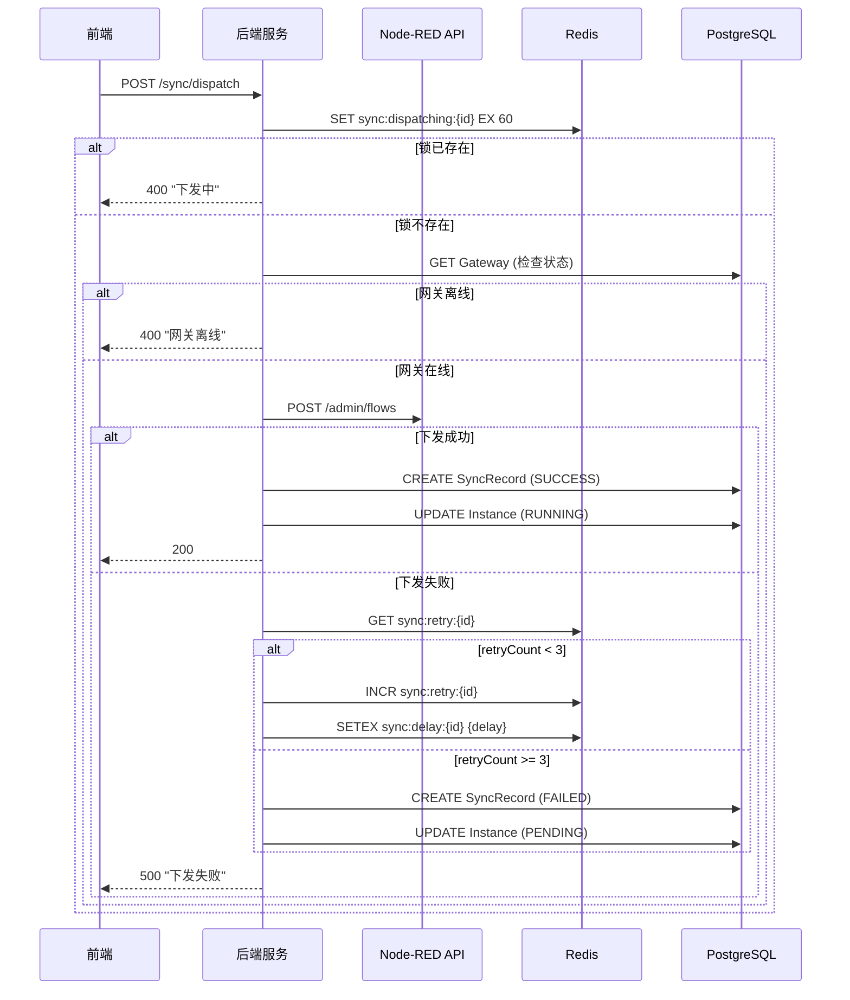
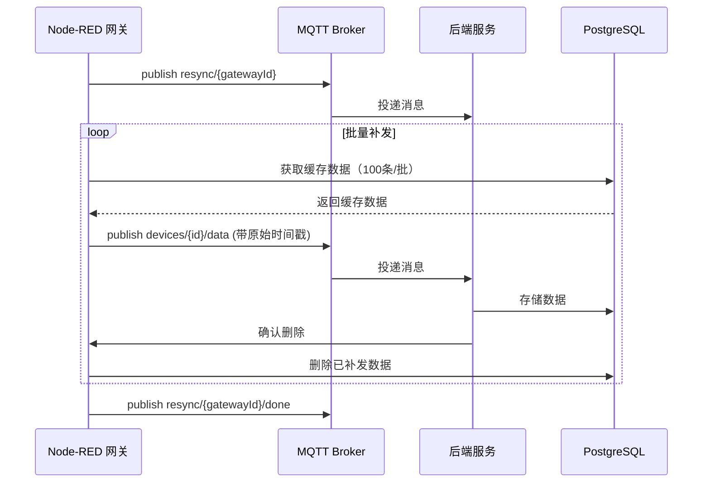

# 配置下发与同步技术方案

> 基于《配置下发与同步-产品说明书》设计，包含完整 AC 覆盖、API 设计、数据模型和核心逻辑。

---

## 1. AC 覆盖总表

| AC 编号 | 验收标准 | 技术实现 |
|---------|----------|----------|
| AC-001 | 配置下发成功 - 单个实例 | POST /api/sync/dispatch |
| AC-002 | 配置下发成功 - Node-RED 自动生成节点 | HTTP API 调用 + Node-RED 插件 |
| AC-003 | 查看下发日志 | GET /api/sync/records |
| AC-004 | 断网期间本地缓存 | SQLite 本地存储 |
| AC-005 | 网络恢复自动补发 | MQTT 订阅 + 缓存队列 |
| AC-006 | 本地微调设备节点 | Node-RED 插件 + MQTT 回传 |
| AC-007 | 本地微调回传验证 | MQTT 消息处理 |
| AC-008 | Node-RED 手动绑定设备实例 | HTTP API 查询 |
| AC-009 | 缓存数据补发后自动删除 | SQLite 删除操作 |
| AC-010 | 数据上报到平台 | MQTT 订阅 |
| AC-011 | 设备实例修改后自动重新下发 | 事件监听 |
| AC-012 | 补发进度展示 | 前端进度条 |
| AC-013 | 下发失败 - 网关离线 | 网关状态检查 |
| AC-014 | 下发失败 - Admin Token 无效 | 401 响应处理 |
| AC-015 | 下发失败自动重试 | 指数退避重试 |
| AC-016 | 断网期间持续采集 | Node-RED 独立运行 |
| AC-017 | 断网时间过长 - 缓存溢出 | SQLite 最大行数限制 |
| AC-018 | 补发失败 - 部分数据丢失 | 重试 + 失败标记 |
| AC-019 | 本地微调与平台下发冲突 | 平台配置覆盖本地 |
| AC-020 | Node-RED 手动绑定不存在的实例 | API 验证 |
| AC-021 | MQTT 连接失败 - 自动重连 | MQTT 客户端配置 |
| AC-022 | 网络抖动导致临时离线 | 90s 超时判定 |
| AC-023 | BR-001 HTTP API 下发 | POST /admin/flows |
| AC-024 | BR-003 自动重试策略 | 10s → 30s → 60s |
| AC-025 | BR-004 断网本地缓存 | SQLite |
| AC-026 | BR-005 补发带时间戳 | 原始时间戳字段 |
| AC-027 | BR-006 补发后删除缓存 | SQLite DELETE |
| AC-028 | BR-007 设备修改自动重新下发 | 事件监听 |
| AC-029 | BR-008 本地微调回传 | MQTT 消息 |
| AC-030 | BR-009 Node-RED 手动绑定 | HTTP API |

---

## 2. 数据模型设计

### 2.1 Prisma Schema

```prisma
model SyncRecord {
  id              String       @id @default(cuid())
  instanceId      String
  gatewayId       String
  operationType   SyncOperation
  status          SyncStatus
  requestPayload  Json
  responsePayload Json?
  retryCount      Int          @default(0)
  errorMessage    String?
  createdAt       DateTime     @default(now())
  updatedAt       DateTime     @updatedAt

  instance        DeviceInstance @relation(fields: [instanceId], references: [id])

  @@index([instanceId])
  @@index([gatewayId])
  @@index([status])
  @@index([createdAt])
}

enum SyncOperation {
  DEPLOY
  REDEPLOY
  UNDEPLOY
}

enum SyncStatus {
  PENDING
  SUCCESS
  FAILED
}
```

### 2.2 SQLite 缓存表（Node-RED 侧）

```sql
CREATE TABLE data_cache (
  id INTEGER PRIMARY KEY AUTOINCREMENT,
  deviceId TEXT NOT NULL,
  pointCode TEXT NOT NULL,
  value TEXT NOT NULL,
  timestamp INTEGER NOT NULL,
  quality INTEGER NOT NULL DEFAULT 0,
  created_at INTEGER NOT NULL
);

CREATE INDEX idx_data_cache_deviceId ON data_cache(deviceId);
CREATE INDEX idx_data_cache_timestamp ON data_cache(timestamp);
```

### 2.3 Redis 数据结构

| Key 格式 | 类型 | TTL | 说明 |
|---------|------|-----|------|
| `sync:dispatching:{instanceId}` | String | 60s | 下发锁 |
| `sync:cache:queue:{gatewayId}` | List | - | 离线缓存队列 |

---

## 3. API 设计

### 3.1 配置下发 API

#### POST /api/sync/dispatch
下发配置到网关。

**请求**
```json
{ "instanceId": "clx123", "gatewayId": "clx456" }
```

**行为**
1. 检查下发锁（防止重复）
2. 检查网关状态（离线则返回错误）
3. 构建 Node-RED Flow 配置
4. 调用 Node-RED `/admin/flows` API
5. 更新实例状态为 RUNNING
6. 记录 SyncRecord

**响应**
```json
{ "success": true, "data": { "recordId": "sync123", "status": "SUCCESS" } }
```

→ AC-001, AC-013, AC-014, AC-015, AC-023, AC-024

#### POST /api/sync/dispatch/batch
批量下发配置。

**请求**
```json
{ "instanceIds": ["clx123", "clx456"], "gatewayId": "clx789" }
```

→ AC-006

#### POST /api/sync/undeploy
解除下发。

**请求**
```json
{ "instanceId": "clx123", "gatewayId": "clx456" }
```

**行为**
1. 调用 Node-RED API 删除节点
2. 更新实例状态为 PENDING

→ AC-013

#### GET /api/sync/records
获取同步记录列表。

**查询参数**
| 参数 | 类型 | 必填 | 说明 |
|------|------|------|------|
| gatewayId | string | 否 | 网关 ID |
| instanceId | string | 否 | 实例 ID |
| status | string | 否 | SUCCESS/FAILED/PENDING |
| startDate | string | 否 | 开始日期 |
| endDate | string | 否 | 结束日期 |
| page | number | 否 | 页码 |
| pageSize | number | 否 | 每页条数 |

**响应**
```json
{
  "success": true,
  "data": {
    "records": [
      {
        "id": "sync123",
        "instanceName": "1号PLC",
        "gatewayName": "产线1网关",
        "operationType": "DEPLOY",
        "status": "SUCCESS",
        "retryCount": 0,
        "createdAt": "2026-06-17T10:30:00Z"
      }
    ],
    "pagination": { "total": 50, "page": 1, "pageSize": 20 }
  }
}
```

→ AC-003

#### GET /api/sync/records/:id
获取同步记录详情。

**响应**
```json
{
  "success": true,
  "data": {
    "id": "sync123",
    "instanceName": "1号PLC",
    "gatewayName": "产线1网关",
    "operationType": "DEPLOY",
    "status": "SUCCESS",
    "requestPayload": { ... },
    "responsePayload": { ... },
    "retryRecords": [
      { "time": "...", "result": "SUCCESS" }
    ],
    "createdAt": "2026-06-17T10:30:00Z"
  }
}
```

### 3.2 Node-RED 插件 API

#### GET /api/sync/device-instances/:gatewayId
获取网关已下发的设备实例列表（Node-RED 手动绑定时调用）。

**响应**
```json
{
  "success": true,
  "data": [
    {
      "id": "clx123",
      "name": "1号PLC",
      "modelName": "西门子 S7-1200",
      "deviceAddress": "192.168.1.100",
      "pointCount": 15,
      "points": [...]
    }
  ]
}
```

→ AC-008, AC-020, AC-030

---

## 4. 核心逻辑设计

### 4.1 配置下发流程



→ AC-001, AC-013, AC-014, AC-015, AC-024

### 4.2 Node-RED Flow 生成

```typescript
// dispatch.service.ts
function generateNodeREDFlow(instance: DeviceInstance): NodeREDFlowConfig {
  const model = instance.model;
  const points = mergePoints(instance.points, instance.customPoints);

  return {
    id: `flow-${instance.id}`,
    label: instance.name,
    nodes: [
      {
        id: `dm-${instance.id}`,
        type: 'device-manager',
        name: instance.name,
        deviceId: instance.id,
        protocol: model.protocol,
        address: instance.deviceAddress
      },
      ...points.map(point => ({
        id: `point-${point.code}`,
        type: `protocol-${model.protocol.toLowerCase()}`,
        name: point.name,
        address: point.address,
        deviceManager: `dm-${instance.id}`,
        scanInterval: point.scanInterval
      })),
      {
        id: `mqtt-${instance.id}`,
        type: 'mqtt-output',
        name: `${instance.name}-上报`,
        topic: `devices/${instance.id}/data`
      }
    ],
    connections: []
  };
}
```

→ AC-002

### 4.3 重试机制

```typescript
// dispatch.service.ts
const RETRY_CONFIG = [
  { delay: 10000 },   // 10秒后重试
  { delay: 30000 },   // 30秒后重试
  { delay: 60000 }    // 60秒后重试
];

async dispatchWithRetry(instanceId: string, gatewayId: string, attempt = 1) {
  try {
    await this.callNodeREDAPI(instanceId, gatewayId);
    await this.updateInstanceStatus(instanceId, InstanceStatus.RUNNING);
    await this.createSyncRecord(instanceId, gatewayId, SyncStatus.SUCCESS);
  } catch (error) {
    if (attempt < 3) {
      const delay = RETRY_CONFIG[attempt - 1].delay;
      await this.scheduleRetry(instanceId, gatewayId, attempt + 1, delay);
    } else {
      await this.createSyncRecord(instanceId, gatewayId, SyncStatus.FAILED, error.message);
    }
  }
}
```

→ AC-015, AC-024

### 4.4 断网数据缓存（Node-RED 侧）

```typescript
// data-cache.service.ts (Node-RED 插件)
class DataCacheService {
  private db: SQLite.Database;
  private MAX_CACHE_SIZE = 10000;

  async cacheData(data: SensorData) {
    await this.checkCacheSize();
    await this.db.run(`
      INSERT INTO data_cache (deviceId, pointCode, value, timestamp, quality, created_at)
      VALUES (?, ?, ?, ?, ?, ?)
    `, [data.deviceId, data.pointCode, data.value, data.timestamp, data.quality, Date.now()]);
  }

  private async checkCacheSize() {
    const result = await this.db.get('SELECT COUNT(*) as count FROM data_cache');
    if (result.count >= this.MAX_CACHE_SIZE) {
      await this.db.run('DELETE FROM data_cache ORDER BY timestamp ASC LIMIT 1000');
    }
  }

  async getCacheQueue(limit = 100): Promise<SensorData[]> {
    return this.db.all(`
      SELECT * FROM data_cache ORDER BY timestamp ASC LIMIT ?
    `, [limit]);
  }

  async clearCache(ids: number[]) {
    await this.db.run(`
      DELETE FROM data_cache WHERE id IN (${ids.map(() => '?').join(',')})
    `, ids);
  }
}
```

→ AC-004, AC-009, AC-016, AC-017, AC-025, AC-027

### 4.5 网络恢复补发



→ AC-005, AC-009, AC-012, AC-026

### 4.6 本地微调回传

```typescript
// backend/src/services/config-sync.service.ts
async handleLocalConfigSync(message: MQTTMessage) {
  const { instanceId, localPoints } = message.payload;

  const instance = await prisma.deviceInstance.findUnique({
    where: { id: instanceId }
  });

  const updatedPoints = instance.points.map(point => {
    const localPoint = localPoints.find(lp => lp.code === point.code);
    if (localPoint) {
      return { ...point, localModified: true, ...localPoint };
    }
    return point;
  });

  await prisma.deviceInstance.update({
    where: { id: instanceId },
    data: { points: updatedPoints }
  });
}
```

→ AC-006, AC-007, AC-019, AC-029

---

## 5. 前端组件设计

| 组件 | 文件路径 | 说明 |
|------|----------|------|
| SyncRecords | `pages/sync/SyncRecords.tsx` | 同步记录列表页面 |
| DispatchLogDetailModal | `pages/sync/DispatchLogDetailModal.tsx` | 下发详情弹窗 |
| SyncStatusPanel | `pages/sync/SyncStatusPanel.tsx` | 网关同步状态面板 |
| CacheProgressModal | `pages/sync/CacheProgressModal.tsx` | 缓存补发进度弹窗 |

---

## 6. 性能优化

### 6.1 下发锁

- Redis SETNX 分布式锁
- TTL 60 秒防止死锁

### 6.2 批量补发

- 每次读取最多 100 条
- 批量写入数据库
- 确认后删除已补发数据

### 6.3 MQTT 消息压缩

- 大批量数据使用 gzip 压缩

---

*文档版本：v1.0*
*创建日期：2026-06-17*
*基于产品说明书：配置下发与同步-产品说明书.md*